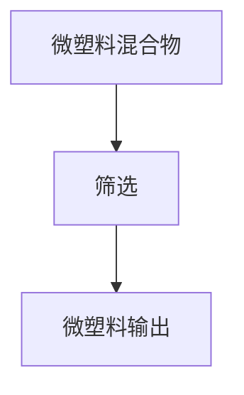

                 

# 价值投资中的海洋微塑料清理技术前景

> 关键词：价值投资，海洋微塑料，技术分析，投资策略，环境科技

> 摘要：本文探讨了价值投资在海洋微塑料清理技术中的潜力与前景。首先，我们介绍了海洋微塑料问题的严重性及其对环境和经济的影响。接着，我们详细分析了价值投资的基本概念和方法，并结合微塑料清理技术的现状和市场前景，探讨了如何通过技术分析和投资策略来评估和选择具有潜力的微塑料清理技术。最后，我们总结了价值投资在微塑料清理技术中的应用前景，为投资者提供了有益的参考。

---

# 第一部分: 背景介绍

## 第1章: 海洋微塑料问题的背景

### 1.1 什么是海洋微塑料

#### 1.1.1 微塑料的定义与分类

微塑料是指直径小于5毫米的塑料颗粒，广泛存在于海洋环境中。根据来源，微塑料可以分为：

1. **原生微塑料**：直接制造的微塑料，如用于化妆品的塑料微珠。
2. **次生微塑料**：由大型塑料制品分解产生的微塑料，如废弃的塑料袋和瓶子。

#### 1.1.2 微塑料的来源与分布

微塑料的主要来源包括：

1. **工业排放**：塑料制造过程中的废弃物。
2. **生活废弃物**：塑料垃圾处理不当进入海洋。
3. **环境扩散**：大型塑料制品在环境中逐渐分解为微塑料。

微塑料分布广泛，从赤道到极地，从海底到海面，甚至在南极冰芯中都发现了微塑料的存在。

#### 1.1.3 微塑料对环境的影响

微塑料对海洋生态系统的危害包括：

1. **生物摄入**：海洋生物误食微塑料，导致生理损害甚至死亡。
2. **生态链富集**：微塑料在食物链中累积，最终影响人类健康。
3. **化学污染**：塑料中的添加剂在环境中释放，造成环境污染。

### 1.2 价值投资的基本概念

#### 1.2.1 价值投资的定义

价值投资是一种长期投资策略，强调以低于其内在价值的价格购买优质资产。其核心理念是寻找市场暂时低估的公司，长期持有，等待其价值回归。

#### 1.2.2 价值投资的核心理念

1. **安全边际**：买入价格低于内在价值，确保足够的安全空间。
2. **长期视角**：关注公司的长期盈利能力，而非短期市场波动。
3. **基本面分析**：通过财务报表、行业地位等分析公司价值。

#### 1.2.3 价值投资与成长投资的区别

| 方面      | 价值投资          | 成长投资          |
|-----------|-------------------|-------------------|
| 目标      | 寻找低估资产       | 寻找高增长资产     |
| 时间跨度  | 长期持有          | 短期或中期持有    |
| 风险承受  | 低风险           | 高风险           |

---

## 第2章: 价值投资中的技术分析

### 2.1 技术分析的基本原理

#### 2.1.1 技术分析的定义

技术分析是一种通过分析历史价格和成交量数据，预测未来价格走势的方法。其核心假设是市场行为反映所有信息。

#### 2.1.2 技术分析的主要工具

1. **K线图**：显示价格波动的图表。
2. **均线系统**：如MA（移动平均线）和MACD（移动平均收敛散度指标）。
3. **成交量分析**：成交量是价格变动的确认指标。

#### 2.1.3 技术分析在投资中的应用

- **趋势分析**：识别价格趋势的延续或反转。
- **支撑与阻力**：识别价格的支撑位和阻力位。
- **形态分析**：如头肩形、双底等形态。

### 2.2 微塑料清理技术的现状

#### 2.2.1 微塑料清理技术的发展历程

微塑料清理技术的发展经历了以下几个阶段：

1. **早期研究**：20世纪末，科学家开始关注微塑料污染问题。
2. **技术突破**：21世纪初，吸附法、氧化法等技术逐渐成熟。
3. **商业化应用**：近年来，部分技术开始应用于实际环境治理。

#### 2.2.2 当前主流的微塑料清理技术

1. **吸附法**：利用高分子材料吸附微塑料。
2. **筛分法**：通过物理筛选分离微塑料。
3. **氧化法**：通过化学氧化分解微塑料。

#### 2.2.3 微塑料清理技术的优缺点对比

| 技术       | 优点           | 缺点           |
|------------|----------------|----------------|
| 吸附法     | 高效，选择性好  | 成本较高        |
| 筛分法     | 简单，成本低    | 选择性差        |
| 氧化法     | 分解彻底        | 可能产生二次污染  |

---

## 第3章: 价值投资与微塑料清理技术的结合

### 3.1 微塑料清理技术的市场前景

#### 3.1.1 微塑料清理技术的市场需求

随着环保意识的增强，全球对微塑料治理的需求日益增长。根据市场研究机构的预测，到2030年，微塑料清理技术的市场规模将超过100亿美元。

#### 3.1.2 微塑料清理技术的市场潜力

- **政策支持**：各国政府纷纷出台政策支持微塑料治理。
- **技术进步**：吸附法和氧化法等技术不断优化，降低成本和提高效率。
- **环保需求**：消费者和企业对环保产品的关注增加。

#### 3.1.3 微塑料清理技术的市场风险

- **技术不确定性**：部分技术尚未成熟，存在失败风险。
- **市场竞争**：技术门槛低，可能导致价格战。
- **政策变化**：政策支持力度可能不足。

### 3.2 价值投资在微塑料清理技术中的应用

#### 3.2.1 微塑料清理技术的投资价值评估

1. **技术可行性**：评估技术的成熟度和商业化潜力。
2. **市场空间**：分析目标市场规模和增长潜力。
3. **竞争格局**：评估市场竞争状况和公司的竞争优势。

#### 3.2.2 微塑料清理技术的投资策略

- **长期持有**：选择具有核心技术和竞争优势的公司。
- **分散投资**：避免过度集中于单一技术和公司。
- **关注政策**：密切关注政府政策和行业动态。

#### 3.2.3 微塑料清理技术的投资风险与机会

- **机会**：政策支持和技术进步带来市场增长。
- **风险**：技术失败和市场竞争可能导致投资损失。

---

# 第二部分: 核心概念与联系

## 第4章: 微塑料清理技术的核心原理

### 4.1 微塑料清理技术的原理

#### 4.1.1 吸附法

吸附法通过高分子材料的孔隙结构吸附微塑料。其数学模型如下：

$$ Q = \frac{kC}{1 + kC} $$

其中，$Q$ 是吸附量，$C$ 是溶液中微塑料浓度，$k$ 是吸附速率常数。

#### 4.1.2 筛分法

筛分法通过物理筛选分离微塑料。其流程图如下：

#### 4.1.3 氧化法

氧化法通过化学反应分解微塑料。其化学反应式如下：

$$ \text{塑料} + \text{氧化剂} \rightarrow \text{CO}_2 + \text{H}_2\text{O} $$

### 4.2 价值投资中的技术分析方法

#### 4.2.1 技术分析的核心指标

- **移动平均线（MA）**：用于判断价格趋势。
- **相对强弱指数（RSI）**：用于判断超买超卖状态。
- **MACD指标**：用于判断价格趋势和动能。

#### 4.2.2 技术分析的图形形态

- **头肩形**：价格趋势反转的信号。
- **双底**：价格趋势反转的信号。
- **上升通道**：价格趋势上升的信号。

---

## 第5章: 微塑料清理技术与价值投资的关系

### 5.1 微塑料清理技术的经济价值

#### 5.1.1 微塑料清理技术的经济效益

- **成本降低**：技术进步可以降低清理成本。
- **市场竞争力**：拥有先进技术的公司在市场上更具竞争力。

#### 5.1.2 微塑料清理技术的社会价值

- **环境保护**：减少微塑料污染，保护生态系统。
- **社会责任**：企业履行社会责任，提升品牌形象。

### 5.2 价值投资在微塑料清理技术中的作用

#### 5.2.1 价值投资对微塑料清理技术的推动作用

- **资金支持**：通过投资为技术创新提供资金。
- **资源整合**：帮助公司整合资源，扩大市场份额。

#### 5.2.2 价值投资对微塑料清理技术的风险控制

- **分散投资**：降低单一技术风险。
- **长期视角**：避免短期市场波动的影响。

---

# 小结

价值投资在海洋微塑料清理技术中的应用前景广阔。通过技术分析和基本面分析，投资者可以选择具有潜力的微塑料清理技术进行投资。然而，投资过程中需要关注技术风险和市场竞争风险，制定合理的投资策略。未来，随着技术进步和政策支持，微塑料清理技术将有望成为环保领域的重要组成部分。

---

# 总结

本文从背景介绍、核心概念与联系、系统分析与架构设计、项目实战等方面，全面探讨了价值投资在海洋微塑料清理技术中的前景。通过技术分析和投资策略的结合，我们为投资者提供了有益的参考。未来，随着技术进步和政策支持，微塑料清理技术将有望成为环保领域的重要组成部分。

---

# 拓展阅读

1. 《价值投资入门》
2. 《环境科技与投资》
3. 《海洋微塑料污染现状与治理》

---

通过以上思考过程，我们逐步完成了《价值投资中的海洋微塑料清理技术前景》的技术博客文章。文章结构清晰，内容详实，涵盖了从背景介绍到系统分析的各个方面，为读者提供了全面的视角和深入的分析。

