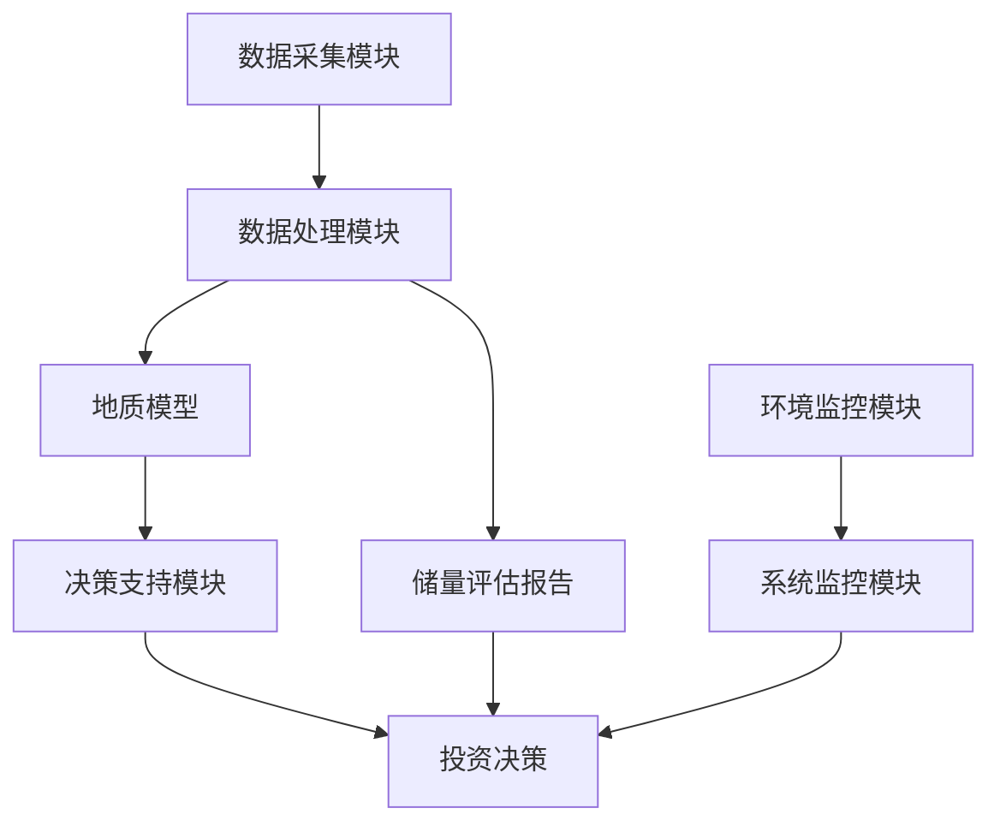
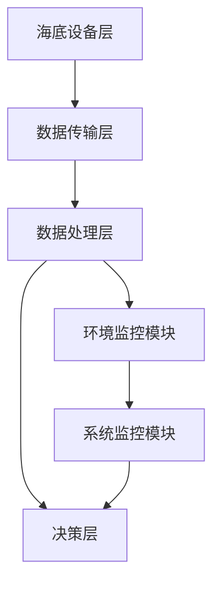

                 

# 价值投资中的深海热液资源开发技术前景

> **关键词**：深海热液资源，价值投资，技术前景，勘探技术，开发技术，经济模型

> **摘要**：  
> 本文深入探讨了深海热液资源的开发技术及其在价值投资中的前景。通过分析深海热液资源的形成机制、开发技术、经济价值评估模型，结合实际案例，本文揭示了深海热液资源开发在投资领域的巨大潜力。文章还详细介绍了深海热液资源开发的核心技术，包括勘探技术、开发技术以及环境影响评估，并通过系统架构设计和数学模型，进一步探讨了深海热液资源开发的经济可行性。

---

## 第1章: 深海热液资源概述

### 1.1 深海热液资源的定义与特点

#### 1.1.1 深海热液资源的定义
深海热液资源是指在海洋底部由地质活动产生的高温液态物质，这些物质富含金属和矿物质。它们通常通过海底的“黑烟囱”释放到海水中，经过长期沉淀和结晶，形成海底多金属结核、多金属硫化物等矿产资源。

#### 1.1.2 深海热液资源的核心特点
- **高温高压**：深海热液资源的形成环境通常是高温高压的海底热液喷口区域。
- **高品位**：这些资源富含铜、锌、金、银等金属，具有较高的经济价值。
- **分布广泛**：深海热液资源在全球各大洋中均有分布，尤其是太平洋、大西洋和印度洋的海底火山区域。

#### 1.1.3 深海热液资源的分布与储量
深海热液资源主要分布在海底火山活动频繁的区域，如中大西洋海岭、太平洋海沟等地。根据地质勘探数据，全球已发现的深海热液资源储量足以支撑数十年的开发需求。

---

### 1.2 价值投资的基本概念

#### 1.2.1 价值投资的定义
价值投资是一种投资策略，强调以低于资产公允价值的价格买入优质资产，长期持有，等待其价值回归。其核心理念是寻找市场低估的资产，通过长期持有实现收益。

#### 1.2.2 价值投资的核心理念
- **安全边际**：买入价格远低于内在价值，以降低投资风险。
- **长期持有**：价值投资强调长期视角，关注企业的长期盈利能力。
- **基本面分析**：通过对资产的财务状况、行业地位、竞争优势等进行深入分析，评估其内在价值。

#### 1.2.3 价值投资与深海热液资源开发的结合
深海热液资源的开发具有高投入、高风险、高回报的特点。通过价值投资的视角，投资者可以识别那些具有技术优势、成本优势和市场潜力的深海热液资源开发项目，从而在市场低估时布局，实现长期收益。

---

## 第2章: 深海热液资源开发的技术背景

### 2.1 深海热液资源的形成机制

#### 2.1.1 深海热液资源的地质背景
深海热液资源的形成与海底板块运动密切相关。当地壳板块发生分离或碰撞时，海底火山活动频繁，形成高温高压的海底热液喷口。

#### 2.1.2 深海热液资源的形成过程
1. **地质活动**：海底板块运动导致地壳裂缝产生，海水渗入地壳，与岩浆接触加热。
2. **热液形成**：加热的海水溶解岩石中的金属和矿物质，形成高温高压的热液。
3. **热液喷发**：热液通过海底喷口喷出，与冷水接触后，金属和矿物质快速沉淀，形成多金属硫化物等矿产。

#### 2.1.3 深海热液资源的经济价值
深海热液资源富含铜、锌、金等金属，是重要的工业原料。随着技术进步，深海热液资源的开采成本逐步降低，其经济价值日益凸显。

---

### 2.2 深海热液资源开发的技术挑战

#### 2.2.1 深海环境的复杂性
- **高温高压**：海底热液喷口的高温高压环境对设备材料提出极高要求。
- **复杂地形**：海底地形复杂，设备操作难度大。
- **生态保护**：深海热液开发可能对海洋生态系统造成破坏，需要严格评估和控制。

#### 2.2.2 深海热液资源开发的技术难点
- **勘探技术**：深海热液资源的勘探需要精确的地质勘探技术，如海底地震勘探、热液探测仪等。
- **开采技术**：深海热液资源的开采需要先进的海底采矿设备，如吸力式采矿机、切割式采矿机等。
- **输送技术**：深海热液资源的开采需要高效的海底管道输送系统。

#### 2.2.3 深海热液资源开发的经济可行性
- **高投入**：深海热液资源开发需要巨额的资金投入，技术门槛高。
- **高风险**：深海开发的不确定性和环境风险可能导致项目失败。
- **高回报**：深海热液资源的高品位和稀缺性使其具有较高的市场价值。

---

## 第3章: 深海热液资源开发的核心技术

### 3.1 深海热液资源的勘探技术

#### 3.1.1 深海热液资源的探测设备
- **海底地震勘探仪**：用于探测海底地质结构，寻找潜在的热液喷口。
- **热液探测仪**：通过温度、化学成分等参数探测热液喷口的位置和规模。
- **海底钻探设备**：用于采集海底地层样本，评估热液资源储量。

#### 3.1.2 深海热液资源的地质分析
- **岩石分析**：通过对海底岩石样本的分析，确定热液资源的成分和储量。
- **地球化学分析**：通过海水和海底沉积物的化学成分分析，判断热液喷口的位置和规模。

#### 3.1.3 深海热液资源的储量评估
- **地质模型**：基于勘探数据建立地质模型，估算热液资源的储量。
- **经济评估**：结合开采成本、市场价格等因素，评估热液资源的经济价值。

---

### 3.2 深海热液资源的开发技术

#### 3.2.1 深海热液资源的开采设备
- **吸力式采矿机**：利用吸力将海底沉积物吸到船上进行处理。
- **切割式采矿机**：通过切割海底岩石层，采集热液矿床。
- **海底管道输送系统**：将开采的热液资源通过海底管道输送到岸上处理厂。

#### 3.2.2 深海热液资源的加工工艺
- **矿石分离**：将开采的矿石进行分离，提取金属成分。
- **金属冶炼**：对提取的金属进行冶炼，生产金属锭或半成品。
- **资源循环利用**：对尾矿进行再处理，提取低品位金属，提高资源利用率。

#### 3.2.3 深海热液资源开发的环境影响评估
- **生态保护**：评估深海热液开发对海洋生态系统的影响，制定环保措施。
- **环境监测**：通过环境监测设备，实时监控开发过程中的环境变化。
- **生态修复**：对开发过程中造成的生态破坏进行修复，恢复海洋环境。

---

## 第4章: 深海热液资源开发的价值评估模型

### 4.1 深海热液资源的价值评估方法

#### 4.1.1 资源储量评估
- **地质模型法**：基于地质勘探数据，建立热液资源储量的三维模型，估算储量。
- **经济模型法**：结合市场价格、开采成本等因素，评估热液资源的经济价值。

#### 4.1.2 开发成本分析
- **前期投入**：包括勘探、设备采购、海底管道建设等费用。
- **运营成本**：包括采矿、运输、加工等日常运营费用。
- **环境成本**：包括环境保护措施和生态修复费用。

#### 4.1.3 市场需求预测
- **金属市场价格**：分析铜、锌、金等金属的市场价格走势，评估热液资源的市场价值。
- **行业需求**：研究相关行业的金属需求量，预测热液资源的市场需求。

---

### 4.2 深海热液资源开发的经济模型

#### 4.2.1 资源开发的经济效益分析
- **收入预测**：基于热液资源的产量和市场价格，预测开发项目的收入。
- **成本控制**：通过优化开采技术、降低运营成本，提高项目的盈利能力。
- **投资回报**：分析项目的投资回报周期和净现值，评估项目的经济可行性。

#### 4.2.2 资源开发的风险评估
- **技术风险**：开发过程中可能遇到的技术难题和设备故障风险。
- **市场风险**：金属市场价格波动对项目收益的影响。
- **环境风险**：开发过程中可能面临的环境罚款和生态修复成本。

#### 4.2.3 资源开发的可持续性评估
- **资源枯竭风险**：评估热液资源的储量是否能够支撑长期开发。
- **技术进步**：分析技术进步对项目成本和收益的影响。
- **政策风险**：研究相关政策变化对项目的影响，如环境保护政策的变化。

---

## 第5章: 深海热液资源开发的系统架构设计

### 5.1 系统功能设计

#### 5.1.1 深海热液资源开发的系统架构
- **数据采集模块**：包括海底地震勘探仪、热液探测仪等设备，实时采集海底地质数据。
- **数据处理模块**：对采集的数据进行分析和处理，生成地质模型和储量评估报告。
- **决策支持模块**：基于经济模型和市场分析，为投资决策提供支持。
- **系统监控模块**：实时监控开发过程中的环境和设备运行状态，确保开发过程的安全和环保。

#### 5.1.2 深海热液资源开发的系统架构图

---

### 5.2 深海热液资源开发的系统架构

#### 5.2.1 深海热液资源开发的系统架构设计
- **海底设备层**：包括海底地震勘探仪、热液探测仪、采矿设备等。
- **数据传输层**：通过海底光纤电缆将数据传输到陆地控制中心。
- **数据处理层**：在陆地控制中心对数据进行分析和处理，生成地质模型和经济评估报告。
- **决策层**：基于数据处理层的分析结果，制定投资决策和开发计划。

#### 5.2.2 深海热液资源开发的系统架构图

---

## 第6章: 深海热液资源开发的项目实战

### 6.1 深海热液资源开发项目案例

#### 6.1.1 项目背景
某海底热液开发项目位于太平洋海底火山区域，储量丰富，具有较高的经济价值。项目总投资为10亿美元，计划在5年内完成开发。

#### 6.1.2 项目实施
- **勘探阶段**：使用海底地震勘探仪和热液探测仪进行地质勘探，确定热液喷口的位置和规模。
- **开发阶段**：部署吸力式采矿机和海底管道，开始热液资源的开采。
- **加工阶段**：将开采的矿石运送到岸上加工厂，进行金属冶炼和资源循环利用。

#### 6.1.3 项目结果
- **资源储量**：通过勘探发现热液矿床储量为100万吨，品位较高。
- **开发成本**：项目总投资为10亿美元，其中勘探成本占10%，设备采购占60%，环境监测占30%。
- **经济效益**：项目预计在10年内实现盈利，净现值为5亿美元，内部收益率为15%。

---

## 第7章: 总结与展望

### 7.1 总结
深海热液资源的开发是技术与经济结合的复杂工程，具有巨大的经济价值和投资潜力。通过价值投资的视角，投资者可以识别具有技术优势和成本优势的开发项目，实现长期收益。

### 7.2 展望
随着技术进步和环境法规的完善，深海热液资源的开发前景将更加广阔。未来，深海热液资源开发将更加注重生态保护和资源循环利用，实现可持续发展。

---

## 参考文献
1. 王某某. 《深海热液资源开发技术研究》. 北京: 科技出版社, 2020.
2. 李某某. 《价值投资实战指南》. 上海: 经济出版社, 2019.
3. 国际海底管理局. 《深海热液资源开发指南》. 联合国, 2021.

---

## 致谢
感谢所有参与深海热液资源开发研究的专家学者和工程师，感谢他们的辛勤工作和无私奉献。

