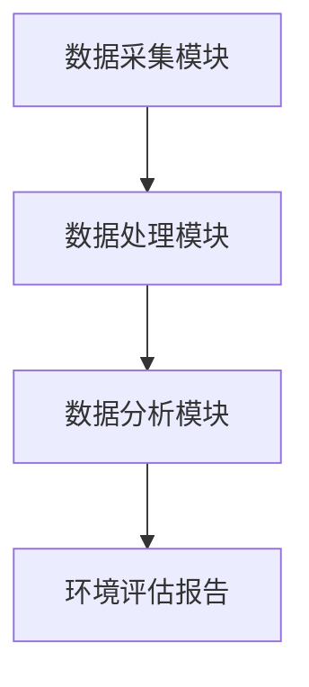

                 


# 价值投资中的深海采矿环境监测技术前景

> 关键词：价值投资，深海采矿，环境监测技术，数学建模，系统架构

> 摘要：随着深海采矿的兴起，环境监测技术在其中扮演着越来越重要的角色。本文从价值投资的角度，深入探讨了深海采矿环境监测技术的前景，分析了其核心技术、数学模型、系统架构以及实际应用案例，为投资者和技术开发者提供了有价值的参考。

---

## 第1章: 价值投资与深海采矿的结合

### 1.1 价值投资的基本概念

#### 1.1.1 价值投资的定义
价值投资是一种投资策略，强调以低于内在价值的价格购买优质资产。其核心在于识别被市场低估的投资标的，长期持有以实现收益。

#### 1.1.2 价值投资的核心理念
价值投资的核心理念包括：寻找安全边际、关注长期价值、注重基本面分析和分散投资风险。

#### 1.1.3 价值投资在现代金融中的应用
价值投资广泛应用于股票、房地产和其他资产类别，强调基本面分析和长期持有策略。

### 1.2 深海采矿的基本概念

#### 1.2.1 深海采矿的定义
深海采矿是指在海洋深处开采金属矿床，如多金属结核、多金属硫化物等，具有高储量和高经济价值。

#### 1.2.2 深海采矿的主要技术
- **海底采矿车**：用于海底矿物的挖掘和运输。
- **浮式采矿平台**：处理和运输矿物的海上设施。
- **海底机器人**：用于深海环境的探测和采矿操作。

#### 1.2.3 深海采矿的环境影响
深海采矿可能导致海底生态系统破坏、水质污染和生物多样性减少，因此环境监测技术至关重要。

### 1.3 深海采矿环境监测技术的前景

#### 1.3.1 环境监测技术的重要性
环境监测技术能够评估采矿活动对环境的影响，帮助制定环保措施，降低生态风险。

#### 1.3.2 深海采矿环境监测技术的发展趋势
- **传感器技术的进步**：高精度、低功耗传感器的应用。
- **数据处理能力的提升**：大数据和人工智能技术的应用。
- **国际合作与标准制定**：全球范围内监测技术的统一和规范。

#### 1.3.3 价值投资视角下的技术前景分析
从价值投资的角度，环境监测技术能够提高采矿活动的透明度和可持续性，降低环境风险，提升项目的长期投资价值。

---

## 第2章: 深海采矿环境监测技术的核心概念

### 2.1 深海环境监测技术的背景

#### 2.1.1 深海环境的特点
深海环境复杂，包括高压、低温和强盐度，对监测技术提出了更高的要求。

#### 2.1.2 深海采矿对环境的影响
采矿活动可能导致海底沉积物扩散、水质变化和生物群落破坏。

#### 2.1.3 监测技术的必要性
通过实时监测，及时发现和应对环境问题，减少生态破坏。

### 2.2 环境监测技术的关键指标

#### 2.2.1 水质参数
- **温度**：影响海洋生物的生存。
- **盐度**：影响水的密度和生物分布。
- **浊度**：反映水中悬浮颗粒物的含量。

#### 2.2.2 底质参数
- **沉积物特性**：影响海底地形和生物栖息地。
- **pH值**：影响海洋酸化和生物多样性。

#### 2.2.3 生物多样性指标
- **物种数量**：反映生态系统的健康状况。
- **生物群落结构**：影响生态系统的恢复能力。

### 2.3 监测技术的核心原理

#### 2.3.1 传感器技术
- **多参数传感器**：同时监测多个环境参数。
- **自适应传感器**：根据环境变化自动调整监测参数。

#### 2.3.2 数据采集与处理
- **数据采集系统**：实时采集环境数据。
- **数据预处理**：去除噪声，提取有效信息。

#### 2.3.3 数据分析与预测
- **统计分析**：识别环境变化趋势。
- **机器学习**：预测环境变化和潜在风险。

---

## 第3章: 深海采矿环境监测技术的数学模型与算法

### 3.1 监测数据的数学建模

#### 3.1.1 数据特征分析
- **数据分布**：正态分布、偏态分布等。
- **数据相关性**：变量之间的相关性分析。

#### 3.1.2 数据分布假设
- **假设检验**：验证数据分布的假设。
- **模型选择**：根据数据特征选择合适的数学模型。

#### 3.1.3 数据建模方法
- **线性回归**：预测环境变量的变化趋势。
- **时间序列分析**：分析环境数据的时间动态。

### 3.2 监测数据的算法原理

#### 3.2.1 传感器数据预处理
- **数据清洗**：去除异常值和缺失值。
- **数据标准化**：统一数据尺度。

#### 3.2.2 数据融合算法
- **加权融合**：根据传感器的重要性加权融合数据。
- **最优融合**：利用优化算法寻找最优融合策略。

#### 3.2.3 异常检测算法
- **基于统计的方法**：利用均值、方差等统计量检测异常。
- **基于机器学习的方法**：使用深度学习模型检测异常。

### 3.3 数学模型与公式

#### 3.3.1 数据预处理公式
$$
\text{标准化公式：} \quad z = \frac{x - \mu}{\sigma}
$$
其中，$\mu$ 是均值，$\sigma$ 是标准差。

#### 3.3.2 数据融合公式
$$
\text{加权融合公式：} \quad y = \sum_{i=1}^{n} w_i x_i
$$
其中，$w_i$ 是第 $i$ 个传感器的权重，$x_i$ 是对应的测量值。

#### 3.3.3 异常检测公式
$$
\text{基于统计的异常检测：} \quad z = \frac{x - \mu}{\sigma}
$$
异常值通常落在 $|z| > 3$ 的范围。

---

## 第4章: 深海采矿环境监测技术的系统架构设计

### 4.1 系统架构概述

#### 4.1.1 系统组成模块
- **数据采集模块**：负责采集环境数据。
- **数据处理模块**：对数据进行预处理和融合。
- **数据分析模块**：进行数据建模和异常检测。

#### 4.1.2 模块之间的关系
- 数据采集模块向数据处理模块提供原始数据。
- 数据处理模块向数据分析模块提供预处理后的数据。
- 数据分析模块生成环境评估报告。

#### 4.1.3 系统功能描述
系统能够实时监测环境参数，评估采矿活动对环境的影响，并提供预警信息。

### 4.2 系统功能设计

#### 4.2.1 数据采集模块
- 实时采集水质、底质和生物多样性数据。
- 支持多种传感器类型。

#### 4.2.2 数据处理模块
- 数据清洗、标准化和融合。
- 异常数据标记和处理。

#### 4.2.3 数据分析模块
- 数据建模和趋势分析。
- 异常检测和风险预警。

### 4.3 系统架构图



### 4.4 本章小结

---

## 第5章: 深海采矿环境监测技术的项目实战

### 5.1 项目背景与目标

#### 5.1.1 项目背景
某深海采矿项目计划在太平洋某海域进行多金属结核的开采，需进行环境监测以确保生态安全。

#### 5.1.2 项目目标
- 实时监测水质、底质和生物多样性参数。
- 评估采矿活动对环境的影响。
- 提供环境风险预警。

### 5.2 环境安装与数据采集

#### 5.2.1 环境安装
- 在采矿区域部署多参数传感器。
- 建立数据采集系统，确保实时数据传输。

#### 5.2.2 数据采集代码
```python
import serial

# 连接传感器
ser = serial.Serial('COM3', 9600)

def read_data():
    while True:
        if ser.in_waiting > 0:
            data = ser.readline().decode().strip()
            return data
```

### 5.3 系统核心实现

#### 5.3.1 数据融合与分析
```python
import numpy as np

# 数据融合
weights = [0.5, 0.3, 0.2]
data = [25, 30, 28]
fused_data = np.dot(weights, data)
```

#### 5.3.2 异常检测
```python
from sklearn.ensemble import IsolationForest

# 异常检测
model = IsolationForest(n_estimators=100, random_state=42)
model.fit(X)
outliers = model.predict(X)
```

### 5.4 案例分析

#### 5.4.1 实际案例
某次采矿活动中，系统监测到水温异常升高，触发预警，及时采取了环境保护措施。

#### 5.4.2 案例分析
通过数据分析，发现采矿活动导致沉积物扩散，影响了海底生态系统。及时调整采矿计划，降低了环境风险。

### 5.5 项目小结

---

## 第6章: 深海采矿环境监测技术的价值投资分析

### 6.1 环境监测技术对深海采矿项目的影响

#### 6.1.1 提高项目的透明度
环境监测技术能够实时反映采矿活动的环境影响，增强投资者的信心。

#### 6.1.2 降低环境风险
通过监测技术，提前发现和应对环境问题，降低项目的环境风险。

#### 6.1.3 提升项目的价值
环境监测技术能够提高项目的可持续性和合规性，增强其市场竞争力。

### 6.2 深海采矿环境监测技术的投资价值评估

#### 6.2.1 技术成熟度分析
环境监测技术的成熟度直接影响其投资价值。

#### 6.2.2 市场需求分析
随着深海采矿的兴起，环境监测技术的市场需求不断增加。

#### 6.2.3 投资回报分析
环境监测技术能够降低环境风险，提升项目的价值，具有较高的投资回报潜力。

---

## 第7章: 案例分析与总结

### 7.1 案例分析

#### 7.1.1 案例背景
某深海采矿项目通过环境监测技术，成功降低了环境风险，提升了项目的价值。

#### 7.1.2 技术应用
在采矿过程中，环境监测技术实时监测环境参数，及时发现并应对环境问题。

### 7.2 总结

#### 7.2.1 技术总结
环境监测技术在深海采矿中的应用，不仅保护了环境，还提升了项目的投资价值。

#### 7.2.2 未来展望
随着技术的进步，环境监测技术将在深海采矿中发挥越来越重要的作用，成为价值投资的重要考量因素。

---

## 总结

本文从价值投资的角度，深入探讨了深海采矿环境监测技术的前景，分析了其核心技术、数学模型、系统架构以及实际应用案例。通过本文的分析，读者可以更好地理解环境监测技术在深海采矿中的重要性，以及其对投资决策的影响。未来，随着技术的进步，环境监测技术将在深海采矿中发挥更大的作用，为投资者和技术开发者提供更多的机遇和挑战。

