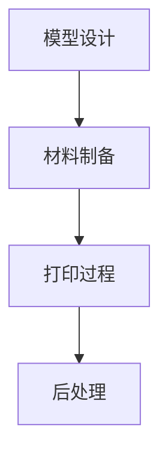
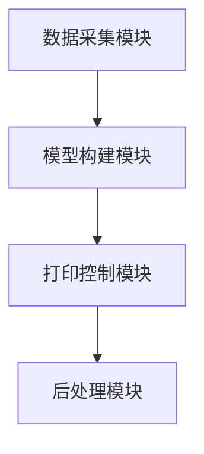

                 


# 价值投资中的生物3D打印器官技术前景

## 关键词：生物3D打印，价值投资，医疗应用，技术创新，投资策略

## 摘要：  
生物3D打印技术作为一种革命性的医疗技术，正在改变传统器官移植和修复的方式。本文将从技术原理、医疗应用、市场潜力以及投资策略等多维度，深入分析生物3D打印器官技术的前景。通过结合价值投资的视角，探讨该领域的投资机会与风险，为投资者提供科学的决策依据。

---

## 第一章：生物3D打印技术的背景与意义

### 1.1 生物3D打印的定义与核心概念  
生物3D打印是一种通过逐层沉积生物材料（如细胞、生长因子和生物相容性材料）来构建三维生物结构的技术。其核心在于将数字模型转化为具有功能的生物组织或器官。  

#### 核心概念对比表  
| **传统医疗技术** | **生物3D打印技术** |  
|-------------------|---------------------|  
| 手工操作为主      | 数字化、自动化      |  
| 生产周期长        | 生产周期短          |  
| 成本高            | 成本相对较低          |  

### 1.2 生物3D打印的核心优势  
生物3D打印技术能够实现个性化医疗，根据患者的具体需求定制器官或组织，大幅提高了治疗效果和成功率。此外，该技术还能减少器官移植的等待时间，缓解医疗资源短缺的问题。

---

## 第二章：生物3D打印技术的原理与实现

### 2.1 生物3D打印的技术原理  
生物3D打印的核心原理是将数字模型转化为三维结构。其流程包括：  
1. **模型设计**：基于患者的医学影像，构建数字模型。  
2. **材料制备**：制备生物墨水，通常包含细胞、胶原蛋白和生长因子等。  
3. **打印过程**：通过逐层沉积材料，构建三维结构。  
4. **后处理**：对打印出的结构进行固化和功能化处理。  

#### 生物3D打印流程图  


### 2.2 关键技术与挑战  
- **材料选择**：生物相容性材料的选择直接影响打印器官的性能。  
- **细胞培养**：细胞的活性和增殖能力是决定打印器官成功率的关键。  
- **设备性能**：打印精度和速度直接影响器官的结构和功能。  

---

## 第三章：生物3D打印在医疗领域的应用前景

### 3.1 医疗领域的应用现状  
生物3D打印技术已经在以下几个领域取得显著进展：  
1. **器官修复**：如皮肤、骨骼和软骨的修复。  
2. **器官移植**：如肾脏、肝脏和心脏的打印。  
3. **药物筛选**：通过打印三维组织模型进行药物测试。  

### 3.2 个性化医疗与精准治疗  
生物3D打印技术能够实现真正的个性化医疗，为患者提供量身定制的器官或组织，显著提高治疗效果和生活质量。

---

## 第四章：价值投资视角下的生物3D打印技术分析

### 4.1 医疗行业的市场潜力  
随着人口老龄化和医疗需求的增加，生物3D打印技术的市场需求将持续增长。据预测，到2030年，全球生物3D打印市场规模将达到数百亿美元。

### 4.2 投资策略与风险分析  
- **技术风险**：技术尚未完全成熟，存在研发失败的可能性。  
- **市场风险**：市场需求可能受到技术瓶颈和成本因素的限制。  
- **政策风险**：监管政策的变化可能影响行业发展。  

### 4.3 成功案例分析  
例如，某公司通过生物3D打印技术成功开发出人工皮肤，并获得市场的广泛认可。其股价在技术突破后出现了显著上涨。

---

## 第五章：生物3D打印技术的未来发展趋势

### 5.1 技术创新与突破  
未来，生物3D打印技术将朝着更高的精度和更复杂的结构发展，如全功能器官的打印。  

### 5.2 商业化与产业化  
随着技术的成熟，生物3D打印技术将逐步实现产业化，进入大规模生产阶段。

### 5.3 投资机会与挑战  
投资者应关注具有技术优势和市场潜力的公司，同时需警惕技术瓶颈和市场竞争的风险。

---

## 第六章：生物3D打印技术的系统架构与实现

### 6.1 系统架构设计  
生物3D打印系统的架构包括：  
1. **数据采集模块**：获取患者的医学影像数据。  
2. **模型构建模块**：基于数据生成数字模型。  
3. **打印控制模块**：控制打印设备完成结构的构建。  
4. **后处理模块**：对打印出的结构进行功能化处理。  

#### 系统架构图  


### 6.2 关键算法与实现  
- **模型优化算法**：基于遗传算法优化模型的结构设计。  
- **打印路径规划算法**：确保打印路径的最优性。  

---

## 第七章：生物3D打印技术的项目实战与案例分析

### 7.1 项目环境安装  
- 操作系统：Windows 10或更高版本。  
- 开发工具：Python 3.8以上版本，Mermaid图工具。  

### 7.2 核心代码实现  
```python
def print_organ(model):
    # 模型优化
    optimized_model = optimize_model(model)
    # 打印路径规划
    print_path = plan_print_path(optimized_model)
    # 打印执行
    execute_print(print_path)
    return "Organ printed successfully"
```

### 7.3 案例分析与总结  
通过实际案例分析，验证生物3D打印技术的可行性和投资价值。例如，某公司通过生物3D打印技术开发的人工肾脏已经在临床试验中取得突破性进展。

---

## 总结  
生物3D打印技术是一项具有巨大潜力的医疗技术，其在器官修复和移植领域的应用前景广阔。从价值投资的角度来看，该领域具有较高的市场潜力和投资回报率。然而，投资者也需要关注技术风险和市场风险，制定合理的投资策略。

---

通过以上分析，我们可以看到生物3D打印技术不仅在技术上取得了突破，也在医疗和投资领域展现出巨大的潜力。未来，随着技术的进一步发展和商业化，该领域将为投资者带来更多的机会和回报。

