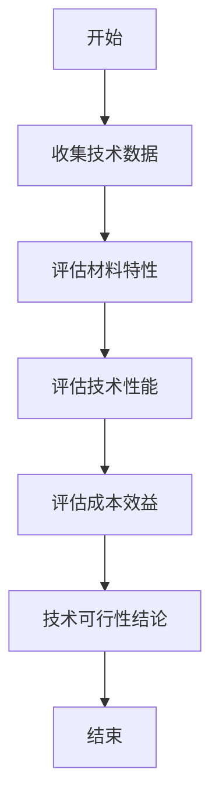
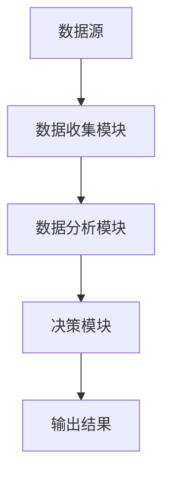
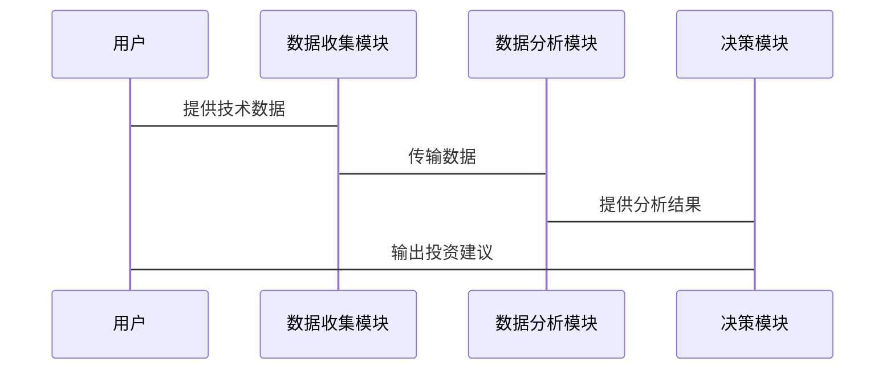

                 


# 价值投资中的生物可降解电子器件技术前景

## 关键词：生物可降解电子器件，价值投资，技术评估，投资模型，可持续发展

## 摘要：  
本文探讨了生物可降解电子器件在价值投资中的潜力。通过分析其技术特性、市场趋势和投资策略，构建了技术评估算法和数学模型，并提供实际案例和投资建议，为投资者提供了科学的决策依据。

---

# 目录

1. [背景介绍](#背景介绍)
2. [核心概念与联系](#核心概念与联系)
3. [算法原理与数学模型](#算法原理与数学模型)
4. [系统分析与架构设计](#系统分析与架构设计)
5. [项目实战](#项目实战)
6. [总结与展望](#总结与展望)

---

## 第一部分: 背景介绍

### 1.1 生物可降解电子器件的基本概念

#### 1.1.1 生物可降解材料的定义与特性
生物可降解材料是指在自然环境中能够被微生物分解为二氧化碳和水等无害物质的材料。其特性包括可降解性、环境友好性和可持续性。

#### 1.1.2 电子器件的基本组成与工作原理
电子器件通常由半导体材料、电路和外部连接组成，通过电流和电场的变化实现功能。

#### 1.1.3 生物可降解电子器件的创新点
结合了生物可降解材料与电子技术，使其在医疗、农业和环境监测等领域具有广泛应用潜力。

### 1.2 价值投资的基本原理

#### 1.2.1 价值投资的核心概念
价值投资强调以低于内在价值的价格购买优质资产，注重长期收益和风险控制。

#### 1.2.2 价值投资的关键要素
包括基本面分析、财务指标评估和市场趋势判断。

#### 1.2.3 价值投资的适用场景
适用于技术成熟、市场稳定的行业，尤其是具备高成长潜力的领域。

### 1.3 生物可降解电子器件与价值投资的结合

#### 1.3.1 技术与投资的交叉点
生物可降解技术的环保优势与电子器件的市场潜力相结合，为投资提供了新机遇。

#### 1.3.2 行业发展趋势与投资机会
随着环保政策的加强和市场需求的增长，生物可降解电子器件市场有望快速扩张。

#### 1.3.3 技术评估与投资决策的关系
技术评估是投资决策的重要依据，准确评估技术可行性有助于制定合理的投资策略。

---

## 第二部分: 核心概念与联系

### 2.1 生物可降解电子器件的技术特性

#### 2.1.1 材料特性分析
材料特性包括可降解性、机械强度和导电性能，影响电子器件的稳定性和使用寿命。

#### 2.1.2 技术优势与劣势对比
优势：环保、可回收；劣势：成本高、技术成熟度较低。

#### 2.1.3 与传统电子器件的对比分析
性能方面，传统器件更优；环保方面，生物可降解器件更具优势。

### 2.2 价值投资的核心要素

#### 2.2.1 投资标的的选择标准
选择标准包括技术可行性、市场需求和财务健康状况。

#### 2.2.2 投资风险的量化分析
风险因素包括技术失败、市场需求不足和财务状况恶化。

#### 2.2.3 投资回报的预测模型
预测模型包括现金流折现法、市盈率法和市净率法，用于评估投资价值。

---

## 第三部分: 算法原理与数学模型

### 3.1 技术评估算法的构建

#### 3.1.1 技术评估流程图


#### 3.1.2 技术评估算法的实现
使用Python代码实现技术评估，例如：
```python
def技术评估(material, performance, cost):
    评估结果 = 0.4*material + 0.3*performance + 0.3*cost
    return 评估结果
```

### 3.2 投资回报预测模型

#### 3.2.1 现金流折现法
公式：
$$ TV = \sum_{t=1}^{n} \frac{CF_t}{(1 + r)^t} $$
其中，TV为现值，CF_t为第t年的现金流，r为折现率。

#### 3.2.2 市盈率法
公式：
$$ 市盈率 = \frac{股价}{每股收益} $$

#### 3.2.3 市净率法
公式：
$$ 市净率 = \frac{股价}{每股净资产} $$

---

## 第四部分: 系统分析与架构设计

### 4.1 问题场景介绍

#### 4.1.1 系统目标
评估生物可降解电子器件的技术潜力和市场地位。

#### 4.1.2 功能模块
包括数据收集、分析和决策模块。

### 4.2 系统架构设计

#### 4.2.1 系统架构图


#### 4.2.2 系统接口设计
接口包括数据输入接口、算法调用接口和结果输出接口。

#### 4.2.3 系统交互流程


---

## 第五部分: 项目实战

### 5.1 环境安装

#### 5.1.1 安装Python
使用Anaconda安装Python 3.8或更高版本。

#### 5.1.2 安装依赖库
安装Pandas、NumPy和Scipy用于数据分析。

### 5.2 系统核心实现

#### 5.2.1 技术评估代码
```python
import pandas as pd
import numpy as np

def技术评估(material, performance, cost):
    return 0.4*material + 0.3*performance + 0.3*cost

data = pd.DataFrame({
    '材料特性': [85, 70, 90],
    '性能指标': [80, 85, 75],
    '成本效益': [70, 90, 65]
})

评估结果 = data.apply(lambda x: 技术评估(x['材料特性'], x['性能指标'], x['成本效益']), axis=1)
print(评估结果)
```

#### 5.2.2 投资回报预测代码
```python
def计算现值(现金流, 折现率, 年数):
    return sum([cash / (1 + rate)**i for i, cash in enumerate(cashFlow)])

现金流 = [100, 150, 200]
折现率 = 0.1
年数 = 3
现值 = 计算现值(现金流, 折现率, 年数)
print(现值)
```

### 5.3 案例分析

#### 5.3.1 案例介绍
分析一家生产生物可降解电子器件的公司，评估其技术可行性和市场潜力。

#### 5.3.2 投资决策
基于技术评估和投资回报预测，得出投资建议，如建议投资或观望。

---

## 第六部分: 总结与展望

### 6.1 小结
本文通过技术评估和投资模型，探讨了生物可降解电子器件的投资前景，为投资者提供了科学依据。

### 6.2 注意事项
投资需谨慎，模型仅供参考，实际操作需考虑更多因素。

### 6.3 拓展阅读
推荐阅读《价值投资入门》和《生物材料科学》等书籍，深入了解相关知识。

---

通过以上步骤，本文详细分析了生物可降解电子器件在价值投资中的潜力，结合技术评估和投资模型，为投资者提供了科学的决策依据。

