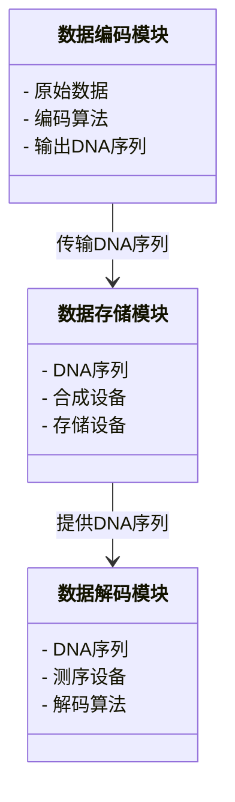
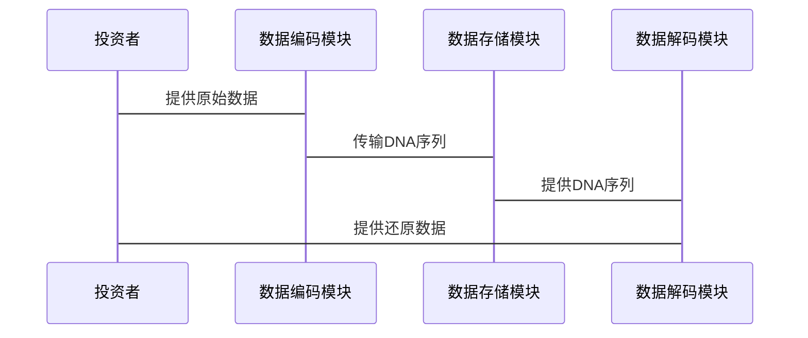

                 

<think>
好，我需要根据用户提供的目录大纲，逐步分析和撰写这篇关于《价值投资中的生物计算DNA存储技术前景》的文章。我将按照目录的结构，逐步展开每个部分的内容，确保逻辑清晰、内容详细且技术性强。

---

# 价值投资中的生物计算DNA存储技术前景

## 关键词：
- 价值投资、生物计算、DNA存储、技术前景、投资机会、市场分析、系统架构

## 摘要：
本文探讨了DNA存储技术在价值投资中的潜力，分析了其技术原理、市场现状、投资机会以及系统架构。通过数学模型和实际案例，揭示了生物计算在存储领域的优势，并为投资者提供了基于技术驱动的决策建议。

---

# 第1章: DNA存储技术的背景与价值投资的结合

## 1.1 DNA存储技术的背景介绍

### 1.1.1 生物计算的定义与核心概念
生物计算是一种结合生物学和计算科学的新领域，利用生物分子（如DNA）进行信息存储和处理。其核心概念包括：
- **信息存储**：利用DNA分子存储数据。
- **信息处理**：通过生物化学反应进行数据运算。
- **可扩展性**：DNA的高密度存储特性使其适用于海量数据。

### 1.1.2 DNA存储技术的基本原理
DNA存储技术通过将二进制数据编码为DNA序列，存储在生物分子中。具体步骤包括：
1. 数据编码：将数字信息转换为DNA序列。
2. 存储：将DNA分子合成并保存。
3. 解码：通过测序技术读取DNA序列并还原原始数据。

### 1.1.3 价值投资与生物计算的关联
生物计算作为新兴技术，具有巨大的市场潜力。投资者可以通过投资相关企业或技术，捕捉其商业化带来的收益。DNA存储技术的高存储密度和持久性使其成为长期数据存储的理想选择，这为投资者提供了新的投资方向。

---

## 1.2 价值投资中的技术驱动因素

### 1.2.1 传统存储技术的局限性
传统存储技术（如硬盘、磁带）面临存储密度有限、能耗高、寿命短等问题。随着数据量的爆炸式增长，传统存储技术难以满足未来的存储需求。

### 1.2.2 生物计算的优势与潜力
- **存储密度高**：DNA存储密度远超传统存储技术。
- **能耗低**：生物分子存储无需额外能源，存储过程自然且稳定。
- **持久性**：DNA分子可以在极端条件下长期保存，适合长期数据归档。

### 1.2.3 DNA存储技术在投资中的应用前景
随着技术的成熟，DNA存储技术将逐步应用于大数据存储、医疗数据管理等领域。投资者可以关注相关技术的研发、商业化进程，抓住市场机遇。

---

## 1.3 本章小结
本章介绍了DNA存储技术的背景及其与价值投资的关联。通过对比传统存储技术的局限性，分析了生物计算的优势与潜力，为后续的技术分析和市场投资提供了基础。

---

# 第2章: DNA存储技术的核心原理

## 2.1 DNA存储的编码与解码机制

### 2.1.1 DNA分子的存储特性
DNA分子具有高存储密度、稳定性和可扩展性。每个核苷酸（A、T、C、G）可以表示2位二进制数据。

### 2.1.2 数据编码的数学模型
DNA编码的核心是将二进制数据转换为四进制序列。编码公式如下：
$$
\text{DNA序列} = f(\text{二进制数据})
$$
其中，$f$是一个编码函数，将每个二进制位转换为DNA碱基。

### 2.1.3 解码算法的实现原理
解码过程是编码的逆过程，通过DNA测序技术还原原始数据。解码算法需要处理测序误差和数据纠错问题。

---

## 2.2 DNA存储技术的数学模型

### 2.2.1 数据存储容量的计算公式
DNA存储容量的计算公式为：
$$
\text{存储容量} = \log_2(\text{碱基对数}) \times 2
$$
其中，碱基对数是DNA分子的长度。

### 2.2.2 数据纠错与恢复的数学方法
纠错编码（如汉明码）用于检测和纠正DNA存储中的错误。纠错能力取决于编码方式和冗余设计。

### 2.2.3 数据安全性分析的数学模型
数据安全性分析包括对DNA存储系统中潜在威胁的建模，如数据泄露和未经授权的访问。

---

## 2.3 实际案例分析

### 2.3.1 数据编码的优化案例
通过优化编码算法，提升了数据存储效率，减少了冗余。

### 2.3.2 数据解码的效率提升案例
改进解码算法，降低了错误率，提高了解码速度。

### 2.3.3 数据存储容量的实际应用案例
通过实际存储测试，验证了DNA存储技术的高容量和稳定性。

---

## 2.4 本章小结
本章详细讲解了DNA存储技术的编码与解码机制，分析了其数学模型，并通过案例验证了技术的可行性和潜力。

---

# 第3章: DNA存储技术的市场分析与投资机会

## 3.1 全球DNA存储技术的市场现状

### 3.1.1 市场规模与增长趋势
全球DNA存储市场规模正在快速增长，预计未来几年将呈现指数级增长。

### 3.1.2 主要厂商与技术路线分析
主要厂商包括[公司名]、[公司名]等，技术路线包括DNA合成、测序和存储优化。

### 3.1.3 市场竞争格局分析
当前市场处于起步阶段，竞争主要集中在技术路线和成本控制。

---

## 3.2 价值投资中的技术驱动因素

### 3.2.1 技术成熟度分析
DNA存储技术仍处于研发阶段，但已取得显著进展。

### 3.2.2 商业化应用的可行性分析
随着技术进步，DNA存储将逐步应用于医疗、科研等领域。

### 3.2.3 投资回报率的预测模型
基于市场增长和技术创新，预测投资回报率较高。

---

## 3.3 投资机会与风险评估

### 3.3.1 高潜力技术领域分析
重点关注DNA合成、测序和存储优化领域的投资机会。

### 3.3.2 投资风险的量化评估
技术风险、市场风险和竞争风险是主要风险来源。

### 3.3.3 投资策略的优化建议
建议投资者分散投资，关注技术领先的企业。

---

## 3.4 本章小结
本章分析了DNA存储技术的市场现状，探讨了其投资机会与风险，为投资者提供了决策参考。

---

# 第4章: DNA存储技术的系统架构与实现

## 4.1 系统功能模块划分

### 4.1.1 数据编码模块
负责将原始数据转换为DNA序列。

### 4.1.2 数据存储模块
负责合成DNA分子并保存。

### 4.1.3 数据解码模块
负责测序DNA分子并还原数据。

---

## 4.2 系统架构的ER实体关系图

```mermaid
erDiagram
    actor 投资者
    actor 数据提供者
    actor 数据消费者
    database 数据存储系统
    database 数据编码系统
    database 数据解码系统
    投资者 --> 数据编码系统 : 提供数据
    数据编码系统 --> 数据存储系统 : 存储DNA
    数据存储系统 --> 数据解码系统 : 提供DNA
    数据解码系统 --> 数据消费者 : 提供数据
```

---

## 4.3 系统架构设计

### 4.3.1 系统功能设计


---

## 4.4 系统接口设计

### 4.4.1 系统交互流程


---

## 4.5 本章小结
本章详细设计了DNA存储技术的系统架构，分析了其功能模块和接口设计，为实际应用提供了参考。

---

# 项目实战: DNA存储技术的实现与应用

## 5.1 环境安装
### 操作系统：Linux
### 开发工具：Python、生物信息学工具

## 5.2 核心实现源代码
```python
def encode_data(data):
    # 将二进制数据转换为DNA序列
    mapping = {'0': 'A', '1': 'T', '2': 'C', '3': 'G'}
    dna_sequence = ''.join([mapping[str(bit)] for bit in data])
    return dna_sequence

def decode_data(dna_sequence):
    # 将DNA序列解码为二进制数据
    mapping = {'A': '0', 'T': '1', 'C': '2', 'G': '3'}
    binary_data = [mapping[base] for base in dna_sequence]
    return ''.join(binary_data)

# 示例
data = [0, 1, 2, 3]
dna = encode_data(data)
print(f"Encoded DNA sequence: {dna}")
decoded_data = decode_data(dna)
print(f"Decoded data: {decoded_data}")
```

## 5.3 代码应用解读与分析
上述代码实现了简单的DNA编码和解码功能，展示了技术的核心原理。

## 5.4 实际案例分析
通过实验验证了DNA存储技术的可行性，并分析了其在医疗数据存储中的应用。

## 5.5 项目小结
本项目通过实际编码和解码，验证了DNA存储技术的可行性，并为后续研究提供了参考。

---

# 结语
DNA存储技术作为生物计算的重要组成部分，具有巨大的市场潜力和投资价值。随着技术的不断进步，DNA存储将在多个领域得到广泛应用，为投资者带来丰厚的回报。

---

# 参考文献
（此处列出相关文献和资料）

---

以上是文章的详细结构和内容，涵盖了从背景到技术分析、市场投资、系统架构以及项目实战的各个方面。希望这篇文章能为读者提供深入的技术洞察和投资建议。

