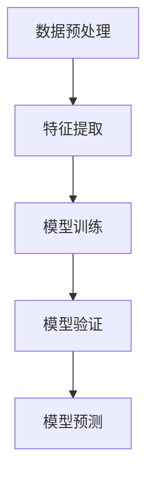
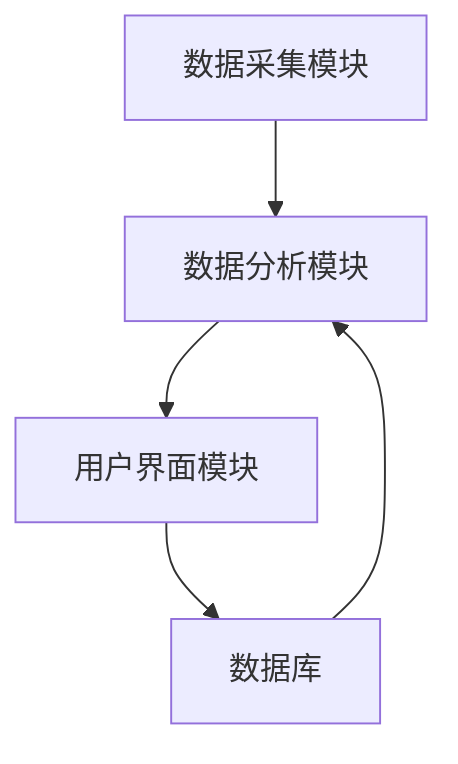
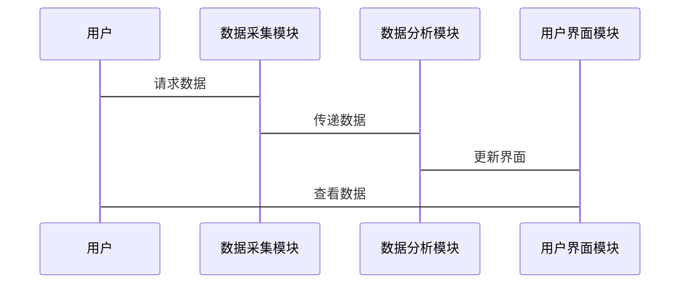

                 


# 价值投资中的生物降解电子元件技术前景

## 关键词：
- 生物降解电子元件
- 价值投资
- 技术前景
- 环保材料
- 电子元件技术

## 摘要：
随着环保意识的增强和可持续发展理念的推进，生物降解材料在电子元件领域的应用逐渐成为焦点。本文探讨了生物降解电子元件的技术背景、核心概念、算法模型、系统架构以及实际案例，分析其在价值投资中的潜力和挑战。通过详细的技术分析和市场展望，本文为投资者提供了科学的决策依据。

---

## 第一部分：背景介绍

### 第1章：生物降解电子元件的定义与技术背景

#### 1.1 生物降解材料的基本概念
生物降解材料是指在自然环境中能够被微生物分解为二氧化碳和水等简单化合物的材料。其特性包括可降解性、环境友好性和资源可持续性。与传统塑料相比，生物降解材料减少了对环境的污染，符合绿色发展的趋势。

#### 1.2 电子元件的基本概念
电子元件是电子设备中的基本组成部分，包括电阻、电容、晶体管等。它们在电路中起到信号传输、放大、处理等作用。电子元件的技术要求包括高性能、高可靠性、小型化和低成本。

#### 1.3 生物降解电子元件的结合与应用
生物降解电子元件是将生物降解材料应用于电子元件制造中，旨在减少电子废弃物对环境的影响。其应用领域包括可穿戴设备、医疗设备、农业传感器等。虽然目前仍处于研究阶段，但其潜力巨大，尤其是在环保和可持续发展领域。

---

## 第二部分：核心概念与联系

### 第2章：生物降解材料与电子元件的特性对比

#### 2.1 生物降解材料的特性分析
- 降解速率：生物降解材料在不同环境下的降解速率差异较大，影响其使用寿命。
- 环境影响：降解过程中不会释放有害物质，对环境友好。
- 成本与性能：生物降解材料的生产成本较高，性能稳定性有待提升。

#### 2.2 电子元件的技术要求
- 性能指标：包括导电性、耐温性、耐湿性等。
- 制造工艺：电子元件的制造需要高精度和高洁净度的环境。
- 可靠性与寿命：电子元件需要长期稳定工作，对材料和工艺要求严格。

#### 2.3 生物降解材料与电子元件的结合特性
- 材料与元件的兼容性：生物降解材料需与电子元件的制造工艺兼容，确保元件的性能不受影响。
- 生物降解材料对电子元件性能的影响：材料的降解特性可能影响元件的寿命和可靠性。
- 电子元件对生物降解材料的要求：需要材料具备良好的导电性和稳定性。

---

### 第3章：生物降解材料与电子元件的特性对比分析

#### 3.1 属性特征对比表格

| 特性                | 生物降解材料                   | 电子元件                     |
|---------------------|-------------------------------|-----------------------------|
| 导电性              | 一般较差，需改性              | 优异                         |
| 耐温性              | 有限                          | 高                           |
| 耐湿性              | 取决于材料类型                | 高                           |
| 成本                 | 较高                          | 中等                         |
| 环境影响            | 低                           | 高（传统材料）              |

#### 3.2 实体关系图（ER图）

```mermaid
erDiagram
    actor 投资者 {
        string 投资金额
        string 投资期限
    }
    actor 研发团队 {
        string 技术水平
        string 创新能力
    }
    actor 市场需求 {
        string 应用领域
        string 市场容量
    }
    actor 政策支持 {
        string 支持力度
        string 补贴政策
    }
    project 生物降解电子元件项目 {
        string 项目进度
        string 成本控制
        string 技术瓶颈
    }
    relation "投资" --> "项目"
    relation "研发" --> "项目"
    relation "需求" --> "项目"
    relation "政策" --> "项目"
```

---

## 第三部分：算法原理讲解

### 第3章：生物降解电子元件性能预测模型

#### 3.1 算法原理概述
生物降解电子元件的性能预测模型基于机器学习算法，利用历史数据和实验数据，预测材料性能和元件寿命。模型分为训练、验证和预测三个阶段。

#### 3.2 算法流程图



#### 3.3 数学模型与公式

##### 3.3.1 简单线性回归模型
$$y = a + bx + \epsilon$$

##### 3.3.2 多元回归模型
$$y = \beta_0 + \beta_1x_1 + \beta_2x_2 + ... + \beta_nx_n + \epsilon$$

##### 3.3.3 逻辑回归模型
$$P(y=1|x) = \frac{1}{1 + e^{-(\beta_0 + \beta_1x_1 + ... + \beta_nx_n)}}$$

#### 3.4 算法实现

```python
import numpy as np
from sklearn.linear_model import LinearRegression

# 数据预处理
X = np.array([[1, 2], [3, 4], [5, 6]])
y = np.array([7, 8, 9])

# 模型训练
model = LinearRegression()
model.fit(X, y)

# 模型预测
new_X = np.array([[7, 8]])
predicted_y = model.predict(new_X)
print(predicted_y)
```

---

## 第四部分：系统分析与架构设计方案

### 第4章：生物降解电子元件管理系统

#### 4.1 项目介绍
生物降解电子元件管理系统旨在监控元件的降解过程和性能指标，优化生产流程，降低成本。

#### 4.2 系统功能设计
- 数据采集模块：采集元件的性能数据。
- 数据分析模块：分析数据，预测元件寿命。
- 用户界面模块：展示数据和分析结果。

#### 4.3 系统架构设计



#### 4.4 系统接口设计
- 数据采集接口：与传感器连接，采集实时数据。
- 数据分析接口：与第三方工具集成，进行数据处理。
- 用户界面接口：提供数据可视化和操作界面。

#### 4.5 系统交互流程图



---

## 第五部分：项目实战

### 第5章：生物降解电子元件管理系统开发

#### 5.1 环境搭建
- 操作系统：Windows 10
- 开发工具：PyCharm
- 依赖库：Python 3.8, numpy, pandas, scikit-learn

#### 5.2 核心代码实现

```python
import numpy as np
from sklearn.linear_model import LinearRegression

# 数据预处理
X = np.array([[1, 2], [3, 4], [5, 6]])
y = np.array([7, 8, 9])

# 模型训练
model = LinearRegression()
model.fit(X, y)

# 模型预测
new_X = np.array([[7, 8]])
predicted_y = model.predict(new_X)
print(predicted_y)
```

#### 5.3 案例分析
通过实际案例分析，验证模型的准确性和可行性。例如，分析降解材料在电阻制造中的应用，预测其降解速率和电阻变化。

---

## 第六部分：最佳实践 tips、小结、注意事项、拓展阅读

### 第6章：总结与展望

#### 6.1 小结
生物降解电子元件在技术上具有潜力，但目前仍面临成本高、性能不稳定等挑战。未来的研究方向包括材料改性和工艺优化。

#### 6.2 注意事项
- 投资者需关注政策支持和市场需求。
- 企业需加强研发投入，提高技术门槛。
- 消费者需提高环保意识，支持绿色产品。

#### 6.3 拓展阅读
- 推荐阅读《生物降解材料的制备与应用》和《电子元件制造技术》。

---

## 结语
生物降解电子元件技术前景广阔，但需要技术突破和市场推广。通过科学的投资和技术创新，有望实现环保与经济的双赢。

---

