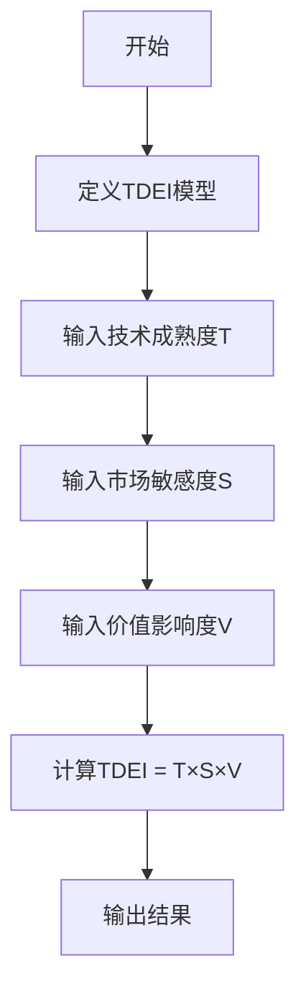
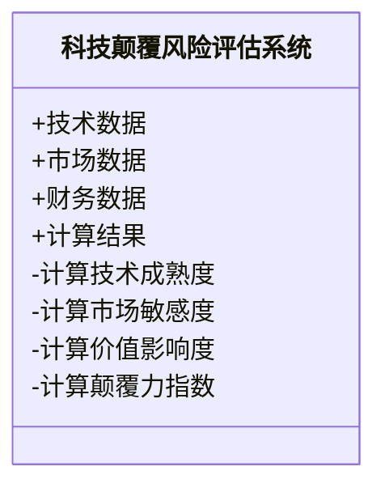
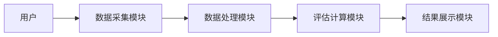
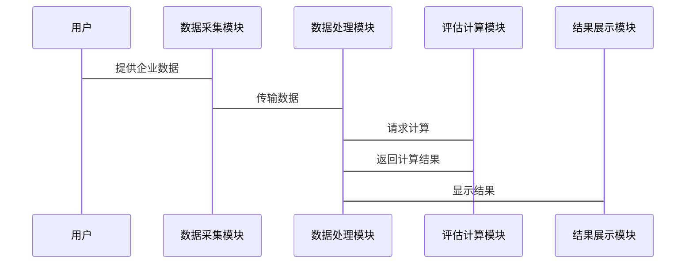

                 


# 价值投资中的科技颠覆风险评估

> 关键词：价值投资，科技颠覆，风险评估，投资策略，技术分析

> 摘要：在科技快速发展的今天，价值投资面临前所未有的挑战。科技颠覆性创新正在改变传统行业，投资决策需要考虑科技对企业价值的影响。本文从科技颠覆的定义出发，分析其对价值投资的影响，探讨如何评估科技颠覆风险，结合数学模型和系统设计，提供实际案例和投资策略建议。

---

# 第1章 科技颠覆与价值投资概述

## 1.1 科技对投资领域的影响

### 1.1.1 科技发展对传统行业的颠覆性影响

科技的发展不断改变着 industries 的运作方式。例如，人工智能和大数据技术的应用彻底改变了金融行业的运作模式。科技颠覆不仅体现在技术层面，更深层次地影响企业的商业模式和价值创造方式。

### 1.1.2 价值投资在科技时代的挑战与机遇

价值投资的核心理念是寻找被市场低估的企业，长期持有以获得超额收益。然而，科技的快速发展使得企业价值的评估变得更为复杂。投资者需要考虑科技对企业未来盈利能力的影响，传统的企业估值模型可能不再适用。

## 1.2 科技颠覆风险评估的定义与内涵

### 1.2.1 科技颠覆的定义

科技颠覆是指新技术或创新模式对企业现有业务模式、市场地位或行业结构产生根本性改变的过程。这种改变可能在短期内不明显，但长期来看会彻底改变行业格局。

### 1.2.2 风险评估的核心要素

科技颠覆风险评估需要考虑以下几个核心要素：
- **技术成熟度**：技术是否已经成熟，能否大规模应用。
- **市场敏感度**：市场对新技术的接受程度和反应速度。
- **价值影响度**：新技术对企业价值的具体影响，包括成本、收入和利润。

### 1.2.3 价值投资中的科技颠覆风险

在价值投资中，科技颠覆风险是指新技术可能对企业当前的估值模型产生重大影响，导致企业价值大幅波动的风险。这种风险需要投资者在评估时予以特别关注。

## 1.3 传统价值投资的局限性

### 1.3.1 传统价值投资的基本原理

传统价值投资主要关注企业的财务指标，如市盈率、市净率等，假设企业的基本面不会发生重大变化。这种假设在科技快速发展的今天显得过于乐观。

### 1.3.2 科技发展对传统估值模型的冲击

新技术的出现可能导致企业的商业模式发生根本性变化，传统的估值指标可能无法准确反映企业的未来价值。例如，互联网公司可能通过数据资产创造新的价值来源，传统财务指标难以捕捉这种变化。

### 1.3.3 颠覆性科技对企业价值的影响

颠覆性科技可能导致企业的竞争优势丧失，市场份额减少，甚至被淘汰。这种情况下，企业的价值可能会大幅下降，甚至归零。

---

# 第2章 科技颠覆风险评估的核心概念

## 2.1 颠覆性科技的识别与分类

### 2.1.1 颠覆性科技的识别标准

- **创新性**：是否带来新的技术或商业模式。
- **影响范围**：是否影响多个行业或仅限于某个领域。
- **可行性**：是否能够实现商业化应用。

### 2.1.2 颠覆性科技的分类

- **技术型颠覆**：通过技术创新改变行业格局。
- **模式型颠覆**：通过商业模式创新改变市场结构。
- **生态型颠覆**：通过构建生态系统实现整体颠覆。

### 2.1.3 颠覆性科技的生命周期

颠覆性科技通常经历以下几个阶段：
1. **萌芽阶段**：技术初步出现，市场关注度较低。
2. **成长阶段**：技术逐步成熟，市场开始关注。
3. **成熟阶段**：技术广泛应用，市场格局发生变化。
4. **稳定阶段**：技术成为行业标准，市场趋于稳定。

## 2.2 风险评估的理论基础

### 2.2.1 风险评估的基本原理

风险评估的核心是通过分析可能的风险因素，预测其对企业价值的影响。在科技颠覆风险评估中，需要特别关注新技术对企业未来盈利能力的影响。

### 2.2.2 科技颠覆风险的特殊性

与传统风险相比，科技颠覆风险具有更强的不确定性和波动性。新技术的应用可能带来巨大的机会，但也可能引发企业价值的大幅波动。

### 2.2.3 风险评估的数学模型

科技颠覆风险评估需要建立数学模型，将技术成熟度、市场敏感度和价值影响度等因素量化。

---

# 第3章 科技颠覆风险评估的数学模型与算法原理

## 3.1 颠覆力指数模型

### 3.1.1 模型的定义与公式

颠覆力指数模型（TDEI）是一个量化科技颠覆潜力的数学模型，公式为：

$$
TDEI = T \times S \times V
$$

其中：
- \( T \) 表示技术成熟度。
- \( S \) 表示市场敏感度。
- \( V \) 表示价值影响度。

### 3.1.2 模型的输入变量

- **技术成熟度（T）**：0（未成熟）到1（完全成熟）。
- **市场敏感度（S）**：0（完全不敏感）到1（高度敏感）。
- **价值影响度（V）**：0（无影响）到1（重大影响）。

### 3.1.3 模型的输出结果

TDEI的取值范围为0到1，值越高表示科技的颠覆潜力越大。

### 3.1.4 颠覆力指数模型的流程图



## 3.2 颠覆力指数模型的实现

### 3.2.1 核心代码

```python
def calculate_tdei(T, S, V):
    tdei = T * S * V
    return tdei

# 示例
T = 0.8  # 技术成熟度
S = 0.7  # 市场敏感度
V = 0.9  # 价值影响度
result = calculate_tdei(T, S, V)
print(f"颠覆力指数：{result}")
```

### 3.2.2 代码解读

- **函数定义**：`calculate_tdei`函数接受三个参数：技术成熟度、市场敏感度和价值影响度，计算并返回颠覆力指数。
- **示例调用**：设置T=0.8，S=0.7，V=0.9，计算结果为0.504。

### 3.2.3 案例分析

假设某科技公司的技术成熟度为0.8，市场敏感度为0.7，价值影响度为0.9，其颠覆力指数为0.504，说明该科技的颠覆潜力较大。

---

# 第4章 系统分析与架构设计方案

## 4.1 系统分析

### 4.1.1 项目背景

科技颠覆风险评估是一个复杂的过程，需要整合多种数据源，包括技术数据、市场数据和企业财务数据。

### 4.1.2 系统功能设计

系统需要实现以下功能：
1. 数据采集：获取企业的财务数据和技术数据。
2. 评估计算：使用颠覆力指数模型计算科技颠覆潜力。
3. 结果展示：以可视化形式展示评估结果。

### 4.1.3 领域模型类图



## 4.2 系统架构设计

### 4.2.1 系统架构图



### 4.2.2 系统接口设计

- **数据接口**：与企业数据库和市场数据源对接。
- **用户接口**：提供友好的用户界面，方便用户输入数据和查看结果。

### 4.2.3 系统交互流程



---

# 第5章 项目实战

## 5.1 环境安装

### 5.1.1 安装Python和相关库

```bash
python --version
pip install numpy pandas matplotlib
```

## 5.2 核心代码实现

### 5.2.1 数据处理代码

```python
import pandas as pd
import numpy as np

def load_data(file_path):
    data = pd.read_csv(file_path)
    return data

def preprocess_data(data):
    # 数据预处理代码
    return data

def save_results(results, file_path):
    results.to_csv(file_path, index=False)
```

### 5.2.2 评估计算代码

```python
def calculate_tdei_batch(data):
    tdei_scores = []
    for index, row in data.iterrows():
        T = row['技术成熟度']
        S = row['市场敏感度']
        V = row['价值影响度']
        tdei = T * S * V
        tdei_scores.append(tdei)
    return pd.Series(tdei_scores)
```

## 5.3 实际案例分析

### 5.3.1 案例背景

某科技公司面临新技术的颠覆性风险，需要评估其对公司的潜在影响。

### 5.3.2 数据分析

使用颠覆力指数模型计算颠覆潜力，结果如下：

| 企业名称 | 技术成熟度 (T) | 市场敏感度 (S) | 价值影响度 (V) | 颠覆力指数 (TDEI) |
|---------|----------------|----------------|----------------|--------------------|
| 公司A   | 0.8            | 0.7            | 0.9            | 0.504              |

### 5.3.3 结果解读

公司A的颠覆力指数为0.504，表明其面临较高的颠覆风险。投资者需要谨慎评估其投资价值。

## 5.4 项目小结

通过实际案例分析，我们可以看到科技颠覆风险评估的实际应用价值。投资者可以利用模型量化风险，做出更明智的投资决策。

---

# 第6章 最佳实践与总结

## 6.1 最佳实践

### 6.1.1 投资策略建议

- 保持对新兴科技的关注，及时评估其对投资标的潜在影响。
- 结合颠覆力指数模型，量化风险，制定合理的投资策略。

### 6.1.2 数据质量的重要性

确保数据来源可靠，数据处理准确，才能得到可靠的评估结果。

### 6.1.3 模型局限性

颠覆力指数模型只是一个参考工具，实际投资决策需要结合多方面因素。

## 6.2 小结

科技颠覆风险评估是价值投资中不可忽视的重要环节。通过量化分析和实际案例分析，投资者可以更好地应对科技对企业价值的影响，制定更科学的投资策略。

## 6.3 注意事项

- 风险评估结果仅供参考，实际投资需谨慎。
- 定期更新模型参数，适应市场变化。
- 关注潜在的黑天鹅事件，保持警惕。

## 6.4 拓展阅读

- 《技术分析与价值投资》
- 《科技企业估值模型》
- 《风险管理与投资策略》

---

通过以上内容，我们可以看到科技颠覆风险评估在价值投资中的重要性。投资者需要不断学习新技术，完善评估模型，才能在科技快速发展的今天做出明智的投资决策。

