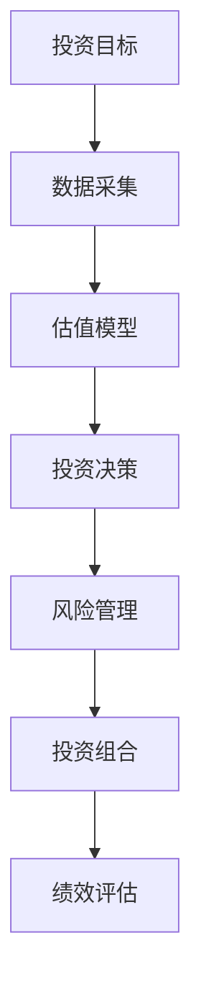

                 

# 价值投资中的耐心：长期持有的力量

## 关键词：价值投资, 长期持有, 耐心, 股票投资, 投资策略

## 摘要：本文深入探讨了价值投资中的耐心和长期持有策略的重要性。通过分析长期持有在价值投资中的优势、挑战以及系统化的实施方法，结合实际案例和系统架构设计，展示了如何通过耐心和长期持有实现投资目标。文章还探讨了心理因素对长期投资的影响，并提供了实际操作建议。

---

# 第一部分: 价值投资中的耐心与长期持有概述

---

# 第1章: 价值投资与耐心投资的背景

## 1.1 价值投资的核心概念

### 1.1.1 投资的基本原理

投资的核心在于通过合理配置资产，实现财富的保值与增值。价值投资强调对标的内在价值的深入分析，寻找市场价格低于内在价值的投资机会。

### 1.1.2 价值投资的定义与特征

价值投资是一种基于对公司基本面分析的投资策略，强调以低于内在价值的价格买入优质资产，并长期持有。其特征包括：

1. **基本面分析**：关注企业的财务状况、行业地位、竞争优势等。
2. **逆市场思维**：在市场恐慌时寻找低估机会，在市场狂热时保持冷静。
3. **长期视角**：注重企业的长期价值，而非短期价格波动。

### 1.1.3 耐心在投资中的重要性

耐心是价值投资的核心要素。市场短期波动可能导致投资者情绪波动，而耐心帮助投资者坚持长期策略，避免因短期损失而错失长期收益。

---

## 1.2 长期持有的历史案例

### 1.2.1 美国铁路大王：J.D.罗特希尔德

J.D.罗特希尔德通过长期持有美国铁路公司股票，在市场波动中坚持持有，最终获得巨大收益。这一案例展示了长期持有优质资产的巨大潜力。

### 1.2.2 巴菲特的长期投资策略

沃伦·巴菲特是价值投资的代表人物，他通过长期持有伯克希尔·哈撒韦等优质公司，实现了财富的持续增长。巴菲特强调，投资不是投机，而是通过持有优质资产获得长期收益。

### 1.2.3 鲍勃·皮埃尔的长期价值投资

鲍勃·皮埃尔通过长期持有可口可乐等优质企业，展现了价值投资的长期稳定性。他的投资策略强调对企业内在价值的判断，而非短期市场波动。

---

## 1.3 价值投资与长期持有的关系

### 1.3.1 价值投资的核心理念

价值投资的核心理念是寻找市场价格低于内在价值的资产，并长期持有，等待市场重新发现其真实价值。

### 1.3.2 长期持有在价值投资中的地位

长期持有是价值投资的基石。通过长期持有，投资者能够充分实现复利效应，避免因频繁交易而产生的高额成本。

### 1.3.3 耐心与长期持有的区别与联系

耐心是心理层面的品质，而长期持有是策略层面的执行。耐心帮助投资者在市场波动中保持冷静，而长期持有则是将这种耐心转化为具体的行动策略。

---

# 第2章: 长期持有策略的优势与挑战

## 2.1 长期持有的优势

### 2.1.1 减少市场波动的影响

长期持有可以有效过滤短期市场波动的影响，使投资者更关注企业的长期价值。

### 2.1.2 降低交易成本

频繁交易会产生佣金、印花税等成本，而长期持有则大幅降低了这些交易成本。

### 2.1.3 享受复利效应

通过长期持有优质资产，投资者可以充分享受复利效应，实现财富的指数级增长。

---

## 2.2 长期持有的挑战

### 2.2.1 市场波动的不确定性

尽管长期持有能够减少波动影响，但市场的不确定性仍然存在，可能导致短期亏损。

### 2.2.2 信息不对称的问题

市场信息的不对称可能导致投资者无法准确评估企业的内在价值，增加投资风险。

### 2.2.3 心理因素的影响

市场的波动和外界的干扰可能影响投资者的心理，导致决策失误。

---

## 2.3 长期持有与价值投资的结合

### 2.3.1 价值投资中的长期持有策略

通过长期持有，投资者能够充分实现复利效应，同时避免因短期波动而错失长期收益。

### 2.3.2 长期持有如何实现价值发现

长期持有使投资者有足够的时间进行深入研究，发现企业的潜在价值。

### 2.3.3 长期持有与市场周期的关系

长期持有能够帮助投资者穿越市场周期，避免因周期波动而遭受损失。

---

## 2.4 本章小结

长期持有在价值投资中具有重要地位，其优势包括减少波动、降低交易成本和享受复利效应。然而，长期持有也面临市场波动、信息不对称和心理因素等挑战。通过结合价值投资，长期持有策略能够在复杂市场中实现稳健收益。

---

# 第3章: 价值投资中的系统性分析

## 3.1 价值投资的核心分析框架

### 3.1.1 财务分析的重要性

财务分析是价值投资的核心步骤，通过分析企业的财务报表，评估其盈利能力、成长性和抗风险能力。

### 3.1.2 行业分析的关键点

行业分析帮助投资者了解企业的行业地位和竞争优势，选择具有增长潜力的行业。

### 3.1.3 公司竞争优势的评估

评估企业的竞争优势，如品牌、技术、管理团队等，是判断其长期价值的重要因素。

---

## 3.2 长期持有中的风险管理

### 3.2.1 风险的定义与分类

投资风险包括市场风险、流动性风险和信用风险等，需要通过多元化和风险分散来降低。

### 3.2.2 长期持有中的风险管理策略

通过分散投资、选择优质资产和定期评估投资组合，可以有效降低长期持有的风险。

### 3.2.3 风险评估与调整

定期评估投资组合的风险，并根据市场变化进行调整，是长期持有中的重要步骤。

---

## 3.3 价值投资中的决策流程

### 3.3.1 投资决策的步骤

1. **确定投资目标**：明确投资目的和风险承受能力。
2. **基本面分析**：对企业财务状况、行业地位和竞争优势进行深入分析。
3. **估值判断**：通过DCF等方法评估企业内在价值。
4. **投资决策**：判断市场价格是否低于内在价值，决定是否买入并长期持有。
5. **风险管理**：通过分散投资和定期评估降低风险。

### 3.3.2 决策中的关键因素

- **估值**：市场价格与内在价值的差距。
- **竞争优势**：企业的核心竞争力。
- **管理团队**：管理层的稳定性和能力。

---

## 3.4 本章小结

价值投资中的系统性分析包括财务分析、行业分析和竞争优势评估。长期持有需要结合风险管理，通过分散投资和定期评估降低风险。科学的决策流程是实现长期持有的关键。

---

# 第4章: 长期持有中的心理因素

## 4.1 投资者心理与长期持有

### 4.1.1 心理因素对投资决策的影响

投资者的心理因素，如贪婪和恐惧，常常导致短期决策失误。长期持有需要克服这些心理障碍，保持理性。

### 4.1.2 长期持有中的心理挑战

市场的短期波动可能引发投资者的恐慌或贪婪情绪，长期持有需要强大的心理素质。

### 4.1.3 心理素质的培养与提升

通过学习、实践和自我反思，投资者可以逐步培养耐心和冷静的心态。

---

## 4.2 长期持有中的情绪管理

### 4.2.1 惶惧与贪婪的控制

投资者需要控制贪婪和恐惧情绪，避免在市场高点追涨或低点恐慌卖出。

### 4.2.2 投资决策中的情绪化倾向

情绪化决策可能导致投资失误，长期持有需要避免情绪化的影响。

### 4.2.3 情绪管理的策略与方法

通过制定投资计划、设定止损和止盈点、定期复盘等方式，可以有效管理情绪。

---

## 4.3 长期持有中的耐心与纪律

### 4.3.1 耐心在投资中的体现

耐心使投资者能够在市场低谷时坚持持有，等待价值回归。

### 4.3.2 纪律在长期持有中的作用

严格的纪律帮助投资者避免随意更改投资策略，保持长期持有的稳定性。

### 4.3.3 耐心与纪律的平衡

耐心和纪律需要有机结合，避免过度僵化或过于激进。

---

## 4.4 本章小结

心理因素在长期持有中起着关键作用。投资者需要克服贪婪和恐惧，通过情绪管理和纪律约束，保持耐心和冷静，实现长期持有目标。

---

# 第5章: 长期持有策略的系统化实施

## 5.1 系统化投资策略的定义

系统化投资策略强调通过科学的方法和严格的投资纪律，实现长期稳定的收益。

### 5.1.1 系统化投资的特征

- **科学性**：基于数据和模型的投资决策。
- **纪律性**：严格执行投资计划，避免情绪化决策。
- **稳定性**：通过分散投资和风险控制，实现稳健收益。

### 5.1.2 系统化投资与非系统化投资的区别

系统化投资注重逻辑和纪律，而非系统化投资更多依赖主观判断和经验。

### 5.1.3 系统化投资的优势

- **降低风险**：通过分散投资和风险控制，减少投资风险。
- **提高效率**：系统化方法能够快速筛选投资机会。
- **长期稳定**：系统化投资注重长期收益，避免短期波动的影响。

---

## 5.2 系统化长期持有的实施步骤

### 5.2.1 确定投资目标和策略

明确投资目标，制定长期持有的策略，包括资产配置、风险承受能力等。

### 5.2.2 构建投资组合

通过分散投资，选择不同行业和资产类别的标的，降低投资风险。

### 5.2.3 定期评估和调整

定期评估投资组合的表现，根据市场变化和企业情况调整投资策略。

### 5.2.4 保持耐心和纪律

坚持长期持有，避免因短期波动而改变投资策略。

---

## 5.3 系统化投资的数学模型

### 5.3.1 复利计算公式

$$
FV = PV \times (1 + r)^n
$$

其中，FV为终值，PV为现值，r为年化收益率，n为投资年数。

### 5.3.2 风险调整后的收益计算

$$
\text{夏普比率} = \frac{E[r - r_f]}{\sigma}
$$

其中，\(E[r - r_f]\)为资产的超额收益期望值，\(\sigma\)为超额收益的标准差。

---

## 5.4 系统化投资的系统架构设计

### 5.4.1 系统功能设计

- **数据采集**：收集企业财务数据、市场数据等。
- **估值模型**：应用DCF等方法进行企业估值。
- **投资决策**：根据估值结果和市场情况制定投资策略。
- **风险管理**：通过风险评估和调整优化投资组合。

### 5.4.2 系统架构图

---

## 5.5 本章小结

系统化投资策略通过科学的方法和严格的纪律，实现长期稳定的收益。系统化实施包括目标设定、投资组合构建、定期评估和调整，以及保持耐心和纪律。

---

# 第6章: 长期持有策略的实战案例分析

## 6.1 成功案例分析

### 6.1.1 巴菲特的伯克希尔投资

通过长期持有伯克希尔，巴菲特实现了巨额财富增长，展现了长期持有的巨大潜力。

### 6.1.2 镜头公司（ kodak ）的教训

镜公司因未能及时转型而被市场抛弃，长期持有必须选择具有持续竞争优势的企业。

---

## 6.2 失败案例分析

### 6.2.1 得不偿失的短期交易

频繁交易不仅增加成本，还可能导致投资亏损，长期持有更符合价值投资理念。

### 6.2.2 忽视风险的盲目持有

选择具有高风险的资产可能导致重大损失，长期持有需要结合风险管理。

---

## 6.3 实战经验总结

### 6.3.1 长期持有需要选择优质企业

选择具有强大竞争优势和良好财务状况的企业，是长期持有的关键。

### 6.3.2 风险管理是长期持有的保障

通过分散投资和定期评估，可以降低长期持有中的风险。

### 6.3.3 心理素质是长期持有的基础

克服贪婪和恐惧，保持耐心和纪律，是实现长期持有的重要条件。

---

## 6.4 本章小结

长期持有需要选择优质企业，结合风险管理，保持耐心和纪律。成功的案例展示了长期持有的巨大潜力，而失败案例则提醒我们注意风险和选择。

---

# 第7章: 总结与未来展望

## 7.1 本章总结

价值投资中的耐心和长期持有是实现稳健收益的关键。通过系统性分析和风险管理，投资者可以在复杂市场中实现长期目标。

## 7.2 未来展望

随着市场的发展和技术的进步，长期持有策略将更加重要。未来的投资将更加依赖于系统化分析和科技手段，帮助投资者实现长期收益。

---

# 结语

价值投资中的耐心和长期持有是一种需要坚持的投资理念。通过深入的系统分析和风险管理，投资者可以在复杂市场中实现长期稳定的收益。未来的投资将更加依赖于系统化方法，帮助投资者克服短期波动，实现长期目标。耐心和长期持有不仅是投资策略，更是一种投资智慧。

--- 

通过以上内容，我们系统地探讨了价值投资中的耐心与长期持有策略，结合理论分析和实战案例，为投资者提供了科学的指导和实用的建议。

