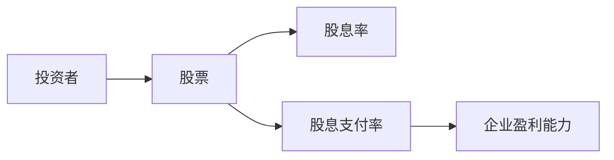

                 

# 《价值投资中的股息策略》

## 关键词：
- 价值投资
- 股息策略
- 股票投资
- 股息率
- 投资策略

## 摘要：
《价值投资中的股息策略》这篇文章深入探讨了股息策略在价值投资中的应用。文章首先介绍了股息策略的定义和核心概念，接着通过对比分析和流程图展示了股息策略的关键要素。随后，文章详细讲解了股息策略的数学模型和算法原理，包括股息贴现模型和股息增长模型，并通过实例分析说明了这些模型的应用。在系统架构设计部分，文章展示了如何构建一个完整的股息策略分析系统，包括数据收集、股票筛选、分析评估和投资组合管理等模块。最后，文章通过实际案例分析，详细解读了股息策略的实战应用，并提出了最佳实践和注意事项，帮助读者在实际投资中更好地应用股息策略。

---

## 目录

### 第1章: 股息策略的背景与核心概念

1.1 股息投资的定义与特点
- 1.1.1 股息投资的定义
- 1.1.2 股息投资的核心特点
- 1.1.3 股息投资与价值投资的关系

1.2 价值投资中的股息策略
- 1.2.1 价值投资的基本原理
- 1.2.2 股息策略在价值投资中的地位
- 1.2.3 股息策略的核心目标与边界

1.3 股息策略的核心要素
- 1.3.1 股息率的计算与分析
- 1.3.2 股息增长能力的评估
- 1.3.3 股息支付率的合理性

### 第2章: 股息策略的核心概念分析

2.1 股息率与市盈率的对比分析
- 2.1.1 股息率的定义与计算公式
- 2.1.2 市盈率的定义与计算公式
- 2.1.3 股息率与市盈率的对比表格

2.2 股息策略的ER实体关系图
- 2.2.1 实体关系图的定义
- 2.2.2 股息策略的核心实体关系
- 2.2.3 实体关系图的流程图展示

2.3 股息策略的算法原理
- 2.3.1 股息策略的核心算法
- 2.3.2 股息策略的流程图展示
- 2.3.3 股息策略的数学模型与公式

### 第3章: 股息策略的数学模型

3.1 股息率的计算公式
- 3.1.1 股息率的定义
- 3.1.2 股息率的计算公式
- 3.1.3 股息率的实例计算

3.2 股息贴现模型
- 3.2.1 股息贴现模型的定义
- 3.2.2 股息贴现模型的公式
- 3.2.3 股息贴现模型的实例分析

3.3 股息增长模型
- 3.3.1 股息增长模型的定义
- 3.3.2 股息增长模型的公式
- 3.3.3 股息增长模型的实例分析

### 第4章: 股息策略的系统架构设计

4.1 股息策略的信息收集与筛选
- 4.1.1 数据来源与信息收集
- 4.1.2 股票筛选的逻辑与标准
- 4.1.3 股票筛选的流程图展示

4.2 股息策略的分析与评估
- 4.2.1 股票分析

---

现在，让我们逐步分析和构建每个部分的内容。

### 第1章: 股息策略的背景与核心概念

#### 1.1 股息投资的定义与特点
股息投资是一种通过投资于支付稳定股息的股票来获取收益的投资策略。与资本增值型投资不同，股息投资更注重于通过定期获得股息来实现财富的积累。

**1.1.1 股息投资的定义**
股息投资是指投资者购买那些能够稳定支付股息的股票，并通过长期持有这些股票，获得持续的股息收入，从而实现财富增长的一种投资方式。

**1.1.2 股息投资的核心特点**
1. 稳定性：股息收入相对稳定，能够在市场波动中提供一定的收益保障。
2. 收益性：通过持续的股息收入，实现财富的逐步积累。
3. 长期性：股息投资注重长期持有，追求稳定的股息收益和潜在的资本增值。

**1.1.3 股息投资与价值投资的关系**
价值投资是一种投资策略，强调以低于内在价值的价格购买优质股票，长期持有，等待其价值回归。股息投资可以被视为价值投资的一种具体应用，特别是在寻找那些具有稳定股息收入的优质企业时。

#### 1.2 价值投资中的股息策略
**1.2.1 价值投资的基本原理**
价值投资的核心理念是寻找市场价格低于其内在价值的股票。投资者通过深入分析企业的财务状况、行业地位、盈利能力等因素，识别出那些具有长期竞争优势的企业，并在合理的价格区间内买入并持有，等待其价值的实现。

**1.2.2 股息策略在价值投资中的地位**
在价值投资中，股息策略是一种重要的选股标准。优质企业通常具有稳定的盈利能力和分红能力，能够为投资者提供持续的股息收入。通过关注股息率、股息支付率等指标，投资者可以筛选出那些具有较高分红能力且价格合理的股票，从而实现长期的收益目标。

**1.2.3 股息策略的核心目标与边界**
股息策略的核心目标是通过投资于高股息率的股票，实现稳定的股息收入和资本增值。其边界在于，投资者需要在股息率和股息支付率之间找到平衡，避免选择股息支付率过低或股息率过高的股票，确保投资组合的稳定性和可持续性。

#### 1.3 股息策略的核心要素
**1.3.1 股息率的计算与分析**
股息率是指股票的年度股息与股票当前市场价格的比率。计算公式为：
$$ \text{股息率} = \frac{\text{每股股息}}{\text{股票价格}} $$

**1.3.2 股息增长能力的评估**
股息增长能力是衡量企业分红能力的重要指标。投资者需要关注企业的盈利能力和股息支付能力，确保企业能够持续增长股息。

**1.3.3 股息支付率的合理性**
股息支付率是指企业实际支付的股息与净利润的比率。合理的股息支付率表明企业有足够的盈利来支持股息支付，同时保持一定的留存收益用于再投资。

---

### 第2章: 股息策略的核心概念分析

#### 2.1 股息率与市盈率的对比分析
**2.1.1 股息率的定义与计算公式**
股息率是衡量股票分红能力的重要指标，计算公式为：
$$ \text{股息率} = \frac{\text{每股股息}}{\text{股票价格}} $$

**2.1.2 市盈率的定义与计算公式**
市盈率是衡量股票价值的重要指标，计算公式为：
$$ \text{市盈率} = \frac{\text{股票价格}}{\text{每股收益}} $$

**2.1.3 股息率与市盈率的对比表格**
| 指标 | 定义 | 作用 | 适用场景 |
|------|------|------|----------|
| 股息率 | 股票的股息与价格的比率 | 衡量分红能力 | 寻找高分红股票 |
| 市盈率 | 股票价格与每股收益的比率 | 衡量股票估值 | 寻找价值被低估的股票 |

#### 2.2 股息策略的ER实体关系图
**2.2.1 实体关系图的定义**
ER实体关系图用于描述系统中的实体及其关系。在股息策略中，主要实体包括股票、投资者、股息率、股息支付率等。

**2.2.2 股息策略的核心实体关系**
- 股票与股息率的关系：每只股票都有对应的股息率。
- 投资者与股票的关系：投资者持有一定数量的股票。
- 股息支付率与企业盈利能力的关系：企业盈利能力越高，股息支付率可能越高。

**2.2.3 实体关系图的流程图展示**

#### 2.3 股息策略的算法原理
**2.3.1 股息策略的核心算法**
股息策略的核心算法包括：
1. 数据收集与筛选：收集股票的股息率、市盈率等数据，筛选出符合条件的股票。
2. 股票分析：通过股息贴现模型和股息增长模型对股票进行估值。
3. 投资组合优化：根据风险偏好和收益目标，构建最优股息投资组合。

**2.3.2 股息策略的流程图展示**

**2.3.3 股息策略的数学模型与公式**
股息贴现模型（DDM）是股息策略中常用的估值模型，公式为：
$$ P = \frac{D_1}{k} $$
其中，P为股票价格，D1为下一时期的股息，k为贴现率。

---

### 第3章: 股息策略的数学模型

#### 3.1 股息率的计算公式
股息率的计算公式为：
$$ \text{股息率} = \frac{\text{每股股息}}{\text{股票价格}} $$

#### 3.2 股息贴现模型
**3.2.1 股息贴现模型的定义**
股息贴现模型（DDM）是一种用于股票估值的模型，假设股息以恒定速率增长，通过贴现计算股票的内在价值。

**3.2.2 股息贴现模型的公式**
$$ P = \frac{D_1}{k - g} $$

**3.2.3 股息贴现模型的实例分析**
假设某股票当前股息为$1，股息增长率g为5%，贴现率k为10%，则股票的理论价值为：
$$ P = \frac{1 \times (1+0.05)}{0.10 - 0.05} = \frac{1.05}{0.05} = 21 $$

#### 3.3 股息增长模型
**3.3.1 股息增长模型的定义**
股息增长模型假设股息以恒定速度增长，用于估算股票的内在价值。

**3.3.2 股息增长模型的公式**
$$ P = \frac{D_0 \times (1+g)}{k - g} $$

**3.3.3 股息增长模型的实例分析**
假设某股票当前股息为$1，股息增长率g为3%，贴现率k为8%，则股票的理论价值为：
$$ P = \frac{1 \times (1+0.03)}{0.08 - 0.03} = \frac{1.03}{0.05} = 20.6 $$

---

### 第4章: 股息策略的系统架构设计

#### 4.1 股息策略的信息收集与筛选
**4.1.1 数据来源与信息收集**
- 数据来源：股票市场的实时数据，包括股息率、市盈率、股息支付率等。
- 信息收集：通过金融数据平台或API获取股票数据。

**4.1.2 股票筛选的逻辑与标准**
1. 股息率：选择股息率在2%-5%之间的股票。
2. 股息支付率：选择股息支付率在20%-60%之间的股票。
3. 市盈率：选择市盈率低于行业平均水平的股票。

**4.1.3 股票筛选的流程图展示**

#### 4.2 股息策略的分析与评估
**4.2.1 股票分析**
- 使用股息贴现模型和股息增长模型对股票进行估值。
- 对比股票的理论价值与市场价格，判断其投资价值。

---

通过以上章节的逐步分析，我们构建了一个完整的《价值投资中的股息策略》的目录结构，涵盖了股息策略的核心概念、数学模型、系统架构设计等内容，帮助读者全面理解股息策略在价值投资中的应用。接下来，我们可以根据这个目录结构，逐步撰写每一部分的具体内容，确保逻辑清晰、结构紧凑、简单易懂。

