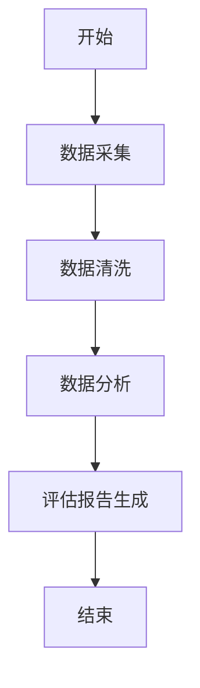

                 


# 价值投资中的行业壁垒评估

> 关键词：价值投资，行业壁垒，投资分析，企业竞争优势，投资策略

> 摘要：本文系统地探讨了价值投资中行业壁垒评估的核心概念、方法论和实践应用。通过深入分析行业壁垒的定义、类型和评估维度，结合实际案例，构建了一个完整的行业壁垒评估框架。文章从理论到实践，详细介绍了如何通过定性和定量分析方法，结合系统架构设计，实现对行业壁垒的全面评估，为投资者提供了实用的决策支持。

---

# 第一部分: 价值投资中的行业壁垒评估基础

## 第1章: 价值投资与行业壁垒概述

### 1.1 价值投资的核心理念
#### 1.1.1 价值投资的定义与起源
价值投资是一种投资策略，由本杰明·格雷厄姆和戴维·多德提出，强调以低于内在价值的价格买入优质股票并长期持有。其核心理念是寻找市场中的“烟蒂股”，即那些被市场忽视但具有内在价值的企业。

#### 1.1.2 价值投资的基本原则
- 质量优先：选择财务健康、管理优秀的企业。
- 安全边际：买入价格应低于企业的内在价值。
- 长期视角：关注企业的长期竞争优势，而非短期波动。

#### 1.1.3 价值投资与行业壁垒的关系
行业壁垒是企业竞争优势的核心来源。价值投资者需要识别具有强大行业壁垒的企业，以确保其投资标的能够在行业中长期保持竞争优势。

### 1.2 行业壁垒的定义与分类
#### 1.2.1 行业壁垒的定义
行业壁垒是指行业内企业在竞争中形成的障碍，使新进入者难以进入市场或难以与现有企业竞争。这些障碍可以是技术、资源、品牌、政策等多种因素的组合。

#### 1.2.2 行业壁垒的主要类型
- **技术壁垒**：企业通过技术专利或专有技术形成的竞争优势。
- **资源壁垒**：企业拥有独特的资源储备或原材料供应。
- **品牌壁垒**：知名品牌在消费者心中的认知和信任形成的竞争优势。
- **政策壁垒**：政府通过政策法规限制新进入者的竞争。
- **规模壁垒**：企业通过规模效应降低成本，形成价格竞争优势。

#### 1.2.3 行业壁垒的特征与作用
- **特征**：长期性、动态性、可测量性。
- **作用**：保护企业免受竞争压力，提升企业的定价能力和市场份额。

### 1.3 行业壁垒评估的重要性
#### 1.3.1 行业壁垒对投资决策的影响
- 强大的行业壁垒意味着企业具有更强的盈利能力和发展潜力。
- 行业壁垒的存在可以降低企业的经营风险，提升投资的安全边际。

#### 1.3.2 行业壁垒与企业竞争优势的关系
企业竞争优势的核心来源是其行业壁垒。强大的行业壁垒能够确保企业在行业中长期保持领先地位。

#### 1.3.3 行业壁垒评估的现实意义
- 帮助投资者识别具有长期竞争优势的企业。
- 为投资决策提供科学依据，降低投资风险。

### 1.4 本章小结
本章介绍了价值投资的核心理念和行业壁垒的基本概念，强调了行业壁垒在价值投资中的重要性。通过分析行业壁垒的类型和特征，为后续的行业壁垒评估奠定了理论基础。

---

## 第2章: 行业壁垒的核心概念与理论框架

### 2.1 行业壁垒的核心要素
#### 2.1.1 市场准入门槛
市场准入门槛是行业壁垒的重要组成部分，包括资金、技术、政策等多方面的限制。

#### 2.1.2 技术壁垒
技术壁垒是通过技术创新形成的竞争优势，能够有效防止竞争对手的模仿。

#### 2.1.3 资源壁垒
资源壁垒是指企业拥有独特的资源储备或原材料供应，形成竞争优势。

#### 2.1.4 品牌壁垒
品牌壁垒是通过长期的品牌建设形成的消费者信任和忠诚度，增强企业的市场地位。

#### 2.1.5 政策壁垒
政策壁垒是指政府通过政策法规限制新进入者，保护现有企业的竞争优势。

### 2.2 行业壁垒的评估维度
#### 2.2.1 市场集中度分析
市场集中度是衡量行业壁垒的重要指标，可以通过计算CR4（前四家企业市场份额）来评估。

#### 2.2.2 行业竞争结构分析
行业竞争结构分析是通过迈克尔·波特的五力模型来评估行业壁垒，包括新进入者的威胁、替代品的威胁、供应商的议价能力、买方的议价能力和现有竞争者之间的竞争程度。

#### 2.2.3 企业盈利能力分析
企业盈利能力是衡量行业壁垒的重要指标，可以通过ROE（净资产收益率）、净利率等指标进行分析。

#### 2.2.4 行业发展趋势分析
行业发展趋势分析是通过研究行业未来的增长潜力和竞争格局，评估行业壁垒的可持续性。

### 2.3 行业壁垒的理论模型
#### 2.3.1 迈克尔·波特的五力分析模型
迈克尔·波特的五力分析模型是一个经典的行业分析工具，包括新进入者的威胁、替代品的威胁、供应商的议价能力、买方的议价能力和现有竞争者之间的竞争程度。

#### 2.3.2 行业生命周期理论
行业生命周期理论将行业分为导入期、成长期、成熟期和衰退期，不同阶段的行业壁垒具有不同的特征。

#### 2.3.3 核心竞争力理论
核心竞争力理论强调企业通过独特的资源和能力形成核心竞争力，从而在行业中建立强大的壁垒。

### 2.4 本章小结
本章详细介绍了行业壁垒的核心要素和评估维度，并结合经典的理论模型，为行业壁垒的评估提供了理论支持。

---

## 第3章: 行业壁垒评估的方法论

### 3.1 行业壁垒评估的基本步骤
#### 3.1.1 确定评估目标
明确评估的目标，例如评估某个行业的市场准入门槛或技术壁垒。

#### 3.1.2 收集行业数据
通过行业报告、公司财报、政策文件等多渠道收集行业数据。

#### 3.1.3 分析行业壁垒
结合定性和定量分析方法，评估行业的核心壁垒。

#### 3.1.4 得出评估结论
根据分析结果，得出行业壁垒的强弱，并提出投资建议。

### 3.2 定性分析方法
#### 3.2.1 行业研究报告分析
通过阅读行业研究报告，了解行业的市场结构、竞争格局和未来发展趋势。

#### 3.2.2 专家访谈与案例分析
通过与行业专家的访谈，结合实际案例分析，深入理解行业壁垒的具体表现。

#### 3.2.3 竞争对手分析
通过分析竞争对手的市场份额、技术优势、品牌影响力等，评估行业壁垒的强弱。

### 3.3 定量分析方法
#### 3.3.1 市场集中度指数（CR）计算
通过计算CR4（前四家企业市场份额）来衡量行业的市场集中度。

#### 3.3.2 行业利润率分析
通过分析行业的平均利润率，评估行业的盈利能力。

#### 3.3.3 企业规模与市场份额分析
通过分析企业的规模和市场份额，评估企业的竞争优势。

### 3.4 综合评估模型
#### 3.4.1 行业壁垒综合评估框架
结合定性和定量分析方法，构建一个综合评估框架，从市场集中度、竞争结构、盈利能力等多个维度评估行业壁垒。

#### 3.4.2 行业壁垒评分体系
通过制定评分标准，对行业的各个维度进行评分，最终得出行业的壁垒强弱。

#### 3.4.3 行业壁垒指数计算
通过加权计算，得出行业的壁垒指数，为投资决策提供量化依据。

### 3.5 本章小结
本章详细介绍了行业壁垒评估的基本步骤和方法论，结合定性和定量分析方法，为读者提供了一个系统化的评估框架。

---

## 第4章: 行业壁垒评估的系统分析与架构设计

### 4.1 行业壁垒评估系统概述
#### 4.1.1 系统目标与范围
行业壁垒评估系统的目标是通过数据采集、分析和报告生成，为投资者提供科学的行业壁垒评估结果。

#### 4.1.2 系统功能模块划分
- 数据采集模块：负责收集行业数据。
- 数据分析模块：负责对数据进行定性和定量分析。
- 评估报告生成模块：负责生成评估报告。

#### 4.1.3 系统输入输出分析
- 输入：行业数据、政策文件、公司财报等。
- 输出：行业壁垒评估报告。

### 4.2 行业壁垒评估系统架构设计
#### 4.2.1 数据采集模块
- 数据来源：行业报告、公司财报、政策文件等。
- 数据格式：结构化数据和非结构化数据。

#### 4.2.2 数据分析模块
- 数据清洗：对数据进行清洗和预处理。
- 数据分析：通过定性和定量分析方法，评估行业壁垒。

#### 4.2.3 评估报告生成模块
- 报告内容：行业壁垒评估结果、投资建议、风险提示等。

### 4.3 行业壁垒评估系统流程图


### 4.4 本章小结
本章从系统架构的角度，详细介绍了行业壁垒评估系统的功能模块和流程设计，为后续的系统实现奠定了基础。

---

## 第5章: 行业壁垒评估的项目实战

### 5.1 项目背景与目标
#### 5.1.1 项目背景
通过实际案例分析，验证行业壁垒评估方法的有效性。

#### 5.1.2 项目目标
评估某行业的市场集中度和竞争结构，得出行业壁垒的强弱。

### 5.2 环境安装与数据准备
#### 5.2.1 环境安装
- 安装Python和相关库（Pandas、NumPy、Matplotlib）。
- 安装Mermaid工具用于绘制图表。

#### 5.2.2 数据准备
- 收集行业数据，包括市场份额、利润率、政策文件等。

### 5.3 系统核心实现
#### 5.3.1 数据采集与清洗
```python
import pandas as pd

# 数据采集
data = pd.read_csv('industry_data.csv')

# 数据清洗
data.dropna(inplace=True)
data = data[data['year'] == 2023]
```

#### 5.3.2 行业集中度计算
```python
def calculate_cr4(data):
    # 按市场份额降序排序
    data_sorted = data.sort_values('market_share', ascending=False)
    # 计算CR4
    cr4 = data_sorted['market_share'].head(4).sum()
    return cr4

cr4 = calculate_cr4(data)
print(f"CR4: {cr4}")
```

#### 5.3.3 行业壁垒评估报告生成
```python
# 生成评估报告
import matplotlib.pyplot as plt

data.plot(kind='bar', x='company', y='market_share')
plt.title('Market Share Analysis')
plt.xlabel('Company')
plt.ylabel('Market Share (%)')
plt.show()
```

### 5.4 实际案例分析
#### 5.4.1 案例背景
以某科技行业为例，分析其市场集中度和竞争结构。

#### 5.4.2 数据分析
- 计算CR4：前四家企业市场份额总和为70%。
- 分析行业竞争结构：供应商议价能力强，替代品威胁较低。

#### 5.4.3 评估结果
- 行业壁垒较强，市场集中度较高。
- 建议投资者关注前几家企业。

### 5.5 本章小结
本章通过实际案例分析，详细展示了行业壁垒评估的系统实现过程，为读者提供了实践参考。

---

## 第6章: 总结与最佳实践

### 6.1 总结
行业壁垒评估是价值投资中不可或缺的重要环节。通过科学的评估方法和系统的架构设计，投资者可以更好地识别具有长期竞争优势的企业。

### 6.2 最佳实践
- **数据驱动**：基于数据的分析，避免主观判断。
- **长期视角**：关注企业的长期竞争优势，而非短期波动。
- **动态调整**：行业壁垒是动态变化的，需要定期评估和调整。

### 6.3 注意事项
- **数据质量**：确保数据的准确性和完整性。
- **模型优化**：根据实际情况优化评估模型。
- **风险管理**：关注行业风险，制定合理的风险管理策略。

### 6.4 拓展阅读
- 《价值投资实战策略》
- 《行业分析与投资决策》
- 《企业竞争优势分析》

### 6.5 本章小结
本章总结了全文的核心内容，并提出了最佳实践和注意事项，为读者提供了实用的投资建议。

---

# 附录: 行业壁垒评估的Python代码实现

```python
import pandas as pd
import numpy as np
import matplotlib.pyplot as plt

# 数据采集与清洗
data = pd.read_csv('industry_data.csv')
data.dropna(inplace=True)

# 市场集中度计算
def calculate_cr4(data):
    data_sorted = data.sort_values('market_share', ascending=False)
    cr4 = data_sorted['market_share'].head(4).sum()
    return cr4

cr4 = calculate_cr4(data)
print(f"CR4: {cr4}")

# 行业壁垒评估报告生成
data.plot(kind='bar', x='company', y='market_share')
plt.title('Market Share Analysis')
plt.xlabel('Company')
plt.ylabel('Market Share (%)')
plt.show()
```

---

通过本文的系统分析和实践案例，读者可以全面理解价值投资中的行业壁垒评估，并能够实际操作相关分析。希望本文能为投资者提供有价值的参考和指导。

