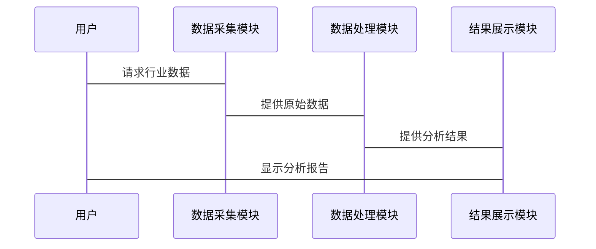

                 


# 价值投资中的行业转型机会识别

---

## 关键词
价值投资、行业转型、机会识别、技术分析、投资策略、市场趋势

---

## 摘要
本文深入探讨了价值投资中如何识别行业转型机会，通过分析行业生命周期、竞争优势和宏观经济因素，结合数据挖掘和数学模型，提供了一套系统的方法论。文章从理论到实践，结合实际案例，帮助投资者在复杂多变的市场中捕捉行业转型带来的投资机会。

---

# 第1章：价值投资概述

## 1.1 价值投资的核心概念
### 1.1.1 价值投资的定义与特点
- **定义**：价值投资是一种以内在价值为基础的投资策略，强调购买被市场低估的资产。
- **特点**：注重长期投资、注重基本面分析、逆向投资、安全边际。

### 1.1.2 价值投资的基本原理
- **市场有效性**：市场并非总是有效，存在价格与价值的偏离。
- **安全边际**：购买价格低于内在价值，以降低风险。
- **长期视角**：关注企业的长期盈利能力，而非短期波动。

### 1.1.3 价值投资与成长投资的区别
| 方面 | 价值投资 | 成长投资 |
|------|-----------|----------|
| 目标 | 买入低估资产 | 投资高增长企业 |
| 风险 | 更低 | 更高 |
| 时间框架 | 长期 | 长期 |

---

## 1.2 行业分析的重要性
### 1.2.1 行业分析的定义
行业分析是对特定行业内的市场结构、竞争状况、发展趋势等进行系统性研究。

### 1.2.2 行业分析在价值投资中的作用
- **识别优势行业**：找到具有竞争优势的行业。
- **评估企业价值**：通过行业分析判断企业的相对竞争力。
- **规避风险**：通过行业分析识别行业周期性风险。

### 1.2.3 行业分析的基本方法
1. **行业生命周期分析**：判断行业所处阶段。
2. **竞争结构分析**：使用波特五力模型。
3. **宏观经济分析**：考虑宏观经济对行业的影响。

---

# 第2章：行业生命周期与竞争优势

## 2.1 行业生命周期的阶段分析
### 2.1.1 初创期
- **特点**：市场需求小，企业数量少，技术不成熟。
- **投资机会**：技术创新企业的潜在价值。

### 2.1.2 成长期
- **特点**：市场需求快速增长，行业规模扩大。
- **投资机会**：行业内快速扩张的企业。

### 2.1.3 成熟期
- **特点**：市场趋于饱和，竞争激烈，行业增长放缓。
- **投资机会**：具有成本优势或差异化优势的企业。

### 2.1.4 衰退期
- **特点**：市场需求下降，企业利润减少。
- **投资机会**：转型或并购的机会。

---

## 2.2 竞争优势分析框架
### 2.2.1 成本优势
- **定义**：企业通过更低的成本生产产品。
- **来源**：规模效应、技术优势、供应链优势。

### 2.2.2 差异化优势
- **定义**：通过提供独特的产品或服务吸引客户。
- **来源**：技术创新、品牌优势、服务差异化。

### 2.2.3 网络效应
- **定义**：产品或服务的价值随用户数量增加而增加。
- **例子**：社交媒体平台、操作系统。

---

## 2.3 行业评估标准
### 2.3.1 行业规模
- **衡量指标**：市场规模、增长率。

### 2.3.2 行业集中度
- **衡量指标**：CR4（前四家企业市场份额）。

### 2.3.3 行业政策
- **影响因素**：政府补贴、税收政策、行业监管。

---

# 第3章：基于数据分析的行业转型机会识别

## 3.1 数据挖掘与行业分析
### 3.1.1 数据收集
- **数据来源**：公开财报、行业报告、市场数据。

### 3.1.2 数据清洗与预处理
- **步骤**：去除缺失值、处理异常值、标准化数据。

### 3.1.3 数据分析
- **方法**：聚类分析、回归分析、时间序列分析。

---

## 3.2 时间序列分析与行业预测
### 3.2.1 时间序列分析的基本原理
- **定义**：通过时间数据预测未来的趋势。

### 3.2.2 行业趋势预测模型
- **ARIMA模型**：用于预测行业增长率。

### 3.2.3 案例分析
- **案例**：使用ARIMA模型预测科技行业的增长率。

---

## 3.3 数学模型与公式
### 3.3.1 回归分析
- **公式**：$y = \beta_0 + \beta_1x + \epsilon$
- **应用**：预测行业收入与GDP的关系。

### 3.3.2 时间序列分析
- **公式**：ARIMA模型的参数估计。
- **应用**：预测行业拐点。

---

# 第4章：系统分析与架构设计

## 4.1 系统功能设计
### 4.1.1 功能模块
- 数据采集模块、数据分析模块、报告生成模块。

### 4.1.2 系统架构
- **分层架构**：数据层、业务逻辑层、用户界面层。

### 4.1.3 接口设计
- RESTful API：数据接口、报告接口。

---

## 4.2 系统架构设计
### 4.2.1 模块划分
- 数据采集、数据处理、数据分析、结果展示。

### 4.2.2 架构选型
- 微服务架构：模块独立部署。

---

## 4.3 系统交互设计
### 4.3.1 交互流程图
- 用户请求分析 -> 数据采集 -> 数据处理 -> 结果展示。

### 4.3.2 交互流程图示例


---

# 第5章：项目实战

## 5.1 环境安装
### 5.1.1 安装Python
- 使用Anaconda安装Python 3.8以上版本。

### 5.1.2 安装依赖库
- `pip install pandas numpy scikit-learn`

---

## 5.2 核心实现代码
### 5.2.1 数据采集代码
```python
import pandas as pd
import requests

def get_industry_data():
    url = "https://example.com/api/industry_data"
    response = requests.get(url)
    data = response.json()
    df = pd.DataFrame(data)
    return df
```

### 5.2.2 数据分析代码
```python
from sklearn.cluster import KMeans

def analyze_industry(df):
    X = df[['revenue', 'profit']]
    kmeans = KMeans(n_clusters=3)
    kmeans.fit(X)
    df['cluster'] = kmeans.predict(X)
    return df
```

---

## 5.3 实际案例分析
### 5.3.1 案例背景
- 分析科技行业转型机会。

### 5.3.2 分析结果
- 转型成功的行业：云计算、人工智能。

---

## 5.4 项目小结
- 通过代码实现数据分析，识别行业转型机会。
- 结合实际案例，验证模型的有效性。

---

# 第6章：总结与展望

## 6.1 总结
- 价值投资中的行业转型机会识别需要结合行业分析和数据分析。
- 通过系统化的方法，投资者可以更准确地识别转型机会。

## 6.2 投资策略建议
1. **关注行业生命周期**：在成熟期寻找成本优势企业。
2. **利用数据工具**：通过算法预测行业拐点。
3. **分散投资**：降低行业转型风险。

## 6.3 未来展望
- **技术进步**：人工智能在行业分析中的应用。
- **数据源扩展**：更多数据源的接入。

---

# 结语
通过本文的系统分析，读者可以掌握价值投资中行业转型机会识别的方法，并在实际投资中应用这些策略。未来，随着技术的进步，行业分析将更加精准，为投资者提供更多的机会。

--- 

感谢您的耐心阅读，希望这篇文章对您有所帮助！

