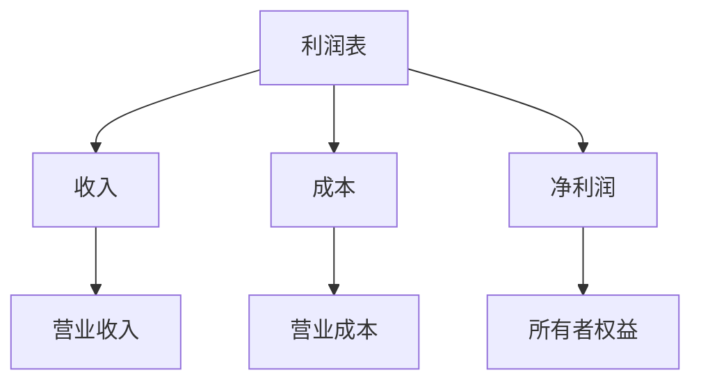
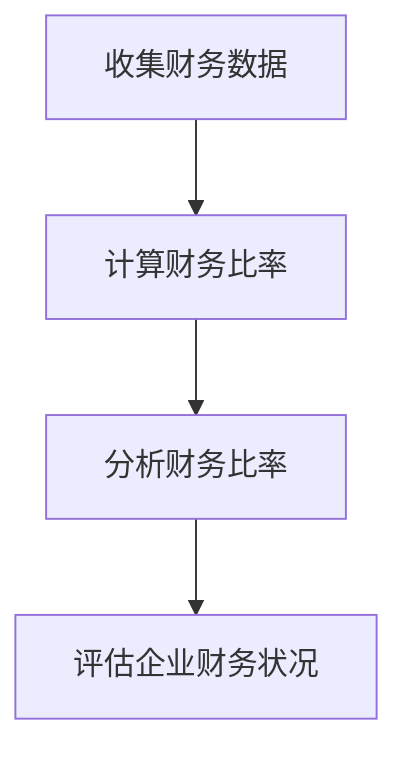
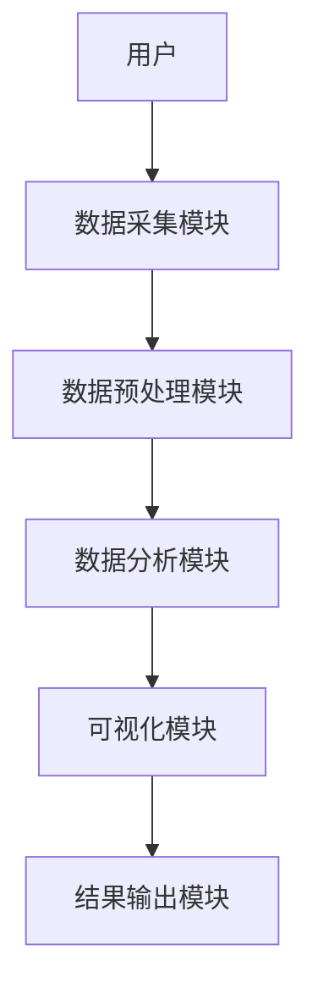

                 


# 价值投资中的财务报表分析：读懂数字背后的故事

> 关键词：价值投资，财务报表分析，财务指标，企业估值，投资策略

> 摘要：财务报表分析是价值投资中的核心技能，通过对利润表、资产负债表和现金流量表的深入分析，识别企业的财务健康状况、盈利能力与成长潜力，从而发现被市场低估的投资机会。本文从价值投资的基本理念出发，详细讲解财务报表分析的核心概念、算法原理、系统架构设计，并通过实战案例帮助读者掌握财务报表分析的技巧，提升投资决策能力。

---

# 第1章 价值投资与财务报表分析概述

## 1.1 价值投资的核心理念
### 1.1.1 价值投资的起源与核心思想
价值投资由本杰明·格雷厄姆和菲利普·费雪等投资大师提出，核心理念是寻找市场低估的股票，长期持有优质企业，获得超额收益。其本质是通过对企业基本面的深入分析，评估其内在价值，判断其市场价格是否被低估。

### 1.1.2 财务报表分析在价值投资中的重要性
财务报表是企业经营状况的“晴雨表”，通过分析财务报表，投资者可以评估企业的盈利能力、财务健康状况和成长潜力，从而做出明智的投资决策。格雷厄姆曾强调，投资者必须具备解读财务报表的能力，才能准确评估企业的内在价值。

### 1.1.3 价值投资的基本原则与方法
- **基本原则**：安全边际、长期投资、价值发现。
- **方法**：通过分析财务报表，寻找低估值的优质企业，关注企业的盈利能力、财务健康状况和成长潜力。

## 1.2 财务报表分析的基础知识
### 1.2.1 财务报表的基本结构与组成
财务报表包括三大部分：
1. 利润表：反映企业在一定会计期间的经营成果。
2. 资产负债表：反映企业在某一特定日期的财务状况。
3. 现金流量表：反映企业在一定会计期间的现金流入和流出情况。

### 1.2.2 财务报表的主要类型与用途
- **利润表**：用于评估企业的盈利能力，分析收入来源和成本结构。
- **资产负债表**：用于评估企业的资产状况、负债水平和所有者权益。
- **现金流量表**：用于分析企业的现金流入和流出，评估企业的流动性。

### 1.2.3 财务报表分析的基本方法与工具
- **横向比较**：将同一企业在不同期间的财务数据进行比较，分析其变化趋势。
- **纵向比较**：将同一行业内的不同企业进行比较，评估企业的相对优势。
- **比率分析**：通过计算财务比率，评估企业的盈利能力、偿债能力、运营能力和成长能力。

## 1.3 价值投资中的财务报表分析目标
### 1.3.1 识别企业财务健康状况
通过分析资产负债表，评估企业的资产结构、负债水平和所有者权益状况，判断企业的财务健康状况。

### 1.3.2 评估企业盈利能力与成长潜力
通过分析利润表，评估企业的收入增长、成本控制和盈利能力，判断企业的成长潜力。

### 1.3.3 发掘被市场低估的投资机会
通过对比企业的内在价值和市场价格，寻找被市场低估的投资机会。

## 1.4 本章小结
本章从价值投资的基本理念出发，介绍了财务报表分析在价值投资中的重要性，并详细讲解了财务报表的基本结构、组成和分析方法，为后续章节的深入分析奠定了基础。

---

# 第2章 财务报表分析的核心概念与联系

## 2.1 财务报表分析的核心概念
### 2.1.1 利润表：企业盈利能力的晴雨表
利润表反映了企业在一定会计期间的收入、成本和利润情况，是评估企业盈利能力的重要工具。通过分析利润表，可以了解企业的收入来源、成本结构和利润构成。

### 2.1.2 资产负债表：企业的资产与负债结构
资产负债表反映了企业在某一特定日期的资产、负债和所有者权益状况。通过分析资产负债表，可以评估企业的资产质量、负债水平和财务杠杆。

### 2.1.3 现金流量表：企业现金流动的动态记录
现金流量表反映了企业在一定会计期间的现金流入和流出情况，是评估企业流动性的重要工具。通过分析现金流量表，可以了解企业的经营现金流、投资现金流和筹资现金流。

## 2.2 财务报表核心指标对比分析
### 2.2.1 利润表与资产负债表的关系
- 利润表中的净利润会影响资产负债表中的所有者权益。
- 利润表中的收入和成本会影响资产负债表中的应收账款和应付账款。

### 2.2.2 现金流量表与利润表的关联
- 利润表中的净利润与现金流量表中的经营活动现金流密切相关。
- 现金流量表中的投资活动现金流会影响资产负债表中的固定资产和投资性资产。

### 2.2.3 财务报表核心指标对比表
| 指标类型 | 利润表指标 | 资产负债表指标 | 现金流量表指标 |
|----------|------------|----------------|----------------|
| 收入     | 营业收入    |                | 经营活动现金流 |
| 成本     | 营业成本    |                |                |
| 利润     | 净利润      | 所有者权益     |                |
| 资产     |            | 总资产          | 投资活动现金流 |
| 负债     |            | 总负债          |                |
| 现金流   |            |                | 筹资活动现金流 |

## 2.3 财务报表分析的ER实体关系图


---

# 第3章 财务报表分析的算法原理

## 3.1 财务比率分析方法
### 3.1.1 常用财务比率分类
财务比率可以分为四类：
1. **盈利能力比率**：如净利率（Net Profit Margin）、净资产收益率（ROE）。
2. **偿债能力比率**：如流动比率（Current Ratio）、速动比率（Quick Ratio）。
3. **运营能力比率**：如存货周转率（Inventory Turnover Ratio）、应收账款周转率（Accounts Receivable Turnover Ratio）。
4. **成长能力比率**：如营业收入增长率（Revenue Growth Rate）、净利润增长率（Net Profit Growth Rate）。

### 3.1.2 财务比率计算公式
#### 净利润率（Net Profit Margin）
$$ \text{净利润率} = \frac{\text{净利润}}{\text{营业收入}} $$

#### 净资产收益率（ROE）
$$ \text{ROE} = \frac{\text{净利润}}{\text{所有者权益}} $$

#### 流动比率（Current Ratio）
$$ \text{流动比率} = \frac{\text{流动资产}}{\text{流动负债}} $$

### 3.1.3 财务比率分析的步骤与流程


## 3.2 财务比率分析的代码实现
### 3.2.1 安装必要的库
```python
import pandas as pd
import numpy as np
```

### 3.2.2 读取财务数据
```python
# 假设财务数据存储在Excel文件中
df = pd.read_excel('financial_data.xlsx')
```

### 3.2.3 计算财务比率
```python
# 计算净利润率
net_profit_margin = df['净利润'] / df['营业收入']

# 计算净资产收益率
roe = df['净利润'] / df['所有者权益']

# 计算流动比率
current_ratio = df['流动资产'] / df['流动负债']
```

### 3.2.4 可视化分析
```python
import matplotlib.pyplot as plt

plt.plot(net_profit_margin, label='净利润率')
plt.plot(roe, label='ROE')
plt.plot(current_ratio, label='流动比率')
plt.legend()
plt.show()
```

---

# 第4章 财务报表分析的系统架构设计

## 4.1 系统功能设计
### 4.1.1 数据采集模块
- 从企业财报中提取财务数据，包括利润表、资产负债表和现金流量表。
- 数据清洗与预处理，确保数据的准确性和完整性。

### 4.1.2 数据分析模块
- 使用Python和Pandas进行数据处理。
- 计算各种财务比率，生成可视化图表。
- 通过机器学习算法对财务数据进行预测和分析。

## 4.2 系统架构设计


---

# 第5章 项目实战：价值投资中的财务报表分析

## 5.1 安装必要的工具
- 安装Python和Jupyter Notebook。
- 安装Pandas、NumPy、Matplotlib和Scikit-learn库。

## 5.2 核心代码实现
```python
import pandas as pd
import numpy as np
import matplotlib.pyplot as plt

# 读取财务数据
df = pd.read_csv('financial_data.csv')

# 计算财务比率
df['净利率'] = df['净利润'] / df['营业收入']
df['ROE'] = df['净利润'] / df['所有者权益']
df['流动比率'] = df['流动资产'] / df['流动负债']

# 可视化分析
plt.figure(figsize=(10, 6))
plt.plot(df['净利率'], label='净利率')
plt.plot(df['ROE'], label='ROE')
plt.plot(df['流动比率'], label='流动比率')
plt.legend()
plt.show()
```

## 5.3 实际案例分析
### 5.3.1 案例背景
选择一家上市公司，分析其最近三年的财务报表，评估其盈利能力、财务健康状况和成长潜力。

### 5.3.2 数据分析
通过计算净利率、ROE和流动比率，评估企业的财务状况。

### 5.3.3 投资建议
根据分析结果，判断企业是否被市场低估，是否值得长期投资。

---

# 第6章 最佳实践与注意事项

## 6.1 投资实战中的注意事项
- 保持对市场的敏感性，关注宏观经济和行业趋势。
- 严格遵守价值投资的原则，避免盲目跟风。
- 定期复盘和调整投资组合，及时止损和止盈。

## 6.2 小结
通过系统学习和实践，读者可以掌握财务报表分析的核心技能，提升投资决策能力。

## 6.3 拓展阅读
- 格雷厄姆的《证券分析》
- 纳什的《穷查理宝典》
- 巴菲特的股东信

