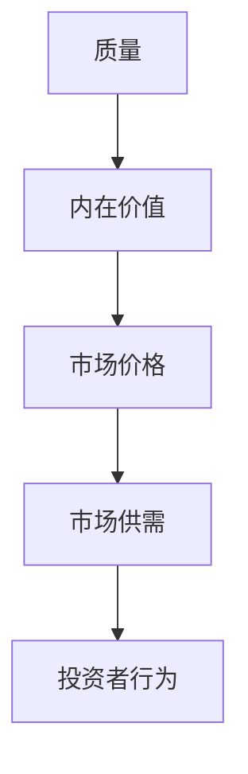
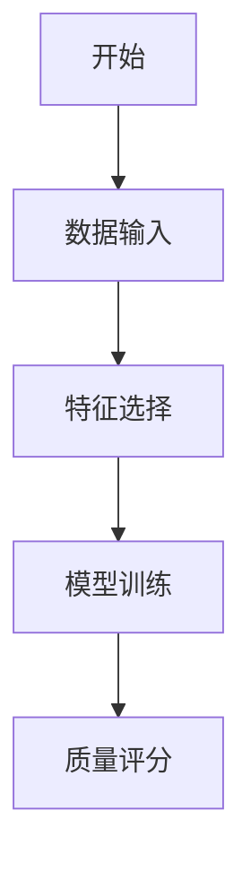
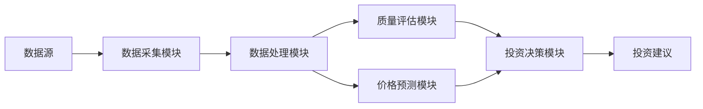
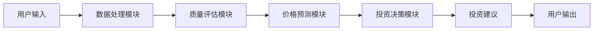

                 


# 价值投资中的质量vs价格：巴菲特的演变

## 关键词：
- 价值投资
- 巴菲特
- 质量
- 价格
- 投资策略

## 摘要：
本文探讨了价值投资中的质量和价格之间的关系，重点分析了巴菲特的投资理念演变。通过对比分析、数学模型和实际案例，深入剖析了质量和价格在价值投资中的动态平衡，为投资者提供了系统化的分析框架和实践指导。

---

# 第一部分: 价值投资中的质量与价格基础

## 第1章: 价值投资的基本概念

### 1.1 价值投资的定义与核心理念
#### 1.1.1 价值投资的基本定义
价值投资是一种投资策略，强调以低于其内在价值的价格购买优质资产。其核心在于识别市场低估的机会，长期持有优质资产以实现超额收益。

#### 1.1.2 价值投资的核心理念
- **市场先生理论**：市场情绪波动导致价格波动，投资者应独立思考，避免随市场波动盲目决策。
- **安全边际**：购买价格低于内在价值，确保投资的安全性和潜在收益。

#### 1.1.3 价值投资与其它投资策略的对比
| 投资策略 | 核心思想 | 优缺点 |
|----------|----------|--------|
| 价值投资 | 寻找低估资产，注重长期价值 | 风险较低，收益稳定，但需要深入研究 |
| 技术分析 | 通过价格和成交量预测未来走势 | 适用于短期交易，但受市场情绪影响较大 |
| 成长投资 | 投资高成长性企业 | 风险较高，收益潜力大 |

### 1.2 巴菲特的投资理念演变
#### 1.2.1 巴菲特早期的投资策略
- 早期受到本杰明·格雷厄姆的影响，注重安全边际和低估值股票。
- 通过购买折价的保险和金融公司股票，积累初始财富。

#### 1.2.2 巴菲特成熟期的投资理念
- 强调企业内在价值，不仅关注价格，更注重企业的质量、竞争力和管理团队。
- 选择具有持续竞争优势和良好管理的企业，长期持有。

#### 1.2.3 巴菲特投资理念的演变过程
1. **早期：格雷厄姆式投资**：注重低估值，寻找市场低估的机会。
2. **中期：竞争优势理论**：关注企业的护城河，选择具有竞争优势的企业。
3. **后期：管理与文化驱动**：强调企业文化和管理层质量，认为优秀管理层能创造持续价值。

### 1.3 质量与价格的关系
#### 1.3.1 质量的定义与衡量标准
- **质量**：企业质地，包括盈利能力、财务健康、竞争优势和管理层质量。
- **衡量标准**：ROE（净资产收益率）、毛利率、净利率、负债率、市场占有率等。

#### 1.3.2 价格的定义与影响因素
- **价格**：资产的市场价格，受供需、市场情绪和宏观经济因素影响。
- **影响因素**：市场情绪、宏观经济、行业趋势、公司基本面。

#### 1.3.3 质量与价格的动态平衡
- 质量决定长期价值，价格反映市场对质量的定价。
- 投资者应寻找质量高且价格低估的资产，平衡短期价格波动与长期价值。

---

## 第2章: 质量与价格的核心概念对比

### 2.1 质量与价格的属性特征对比
| 属性 | 质量 | 价格 |
|------|------|------|
| 稳定性 | 高 | 低 |
| 可预测性 | 较高 | 较低 |
| 影响因素 | 企业基本面 | 市场情绪、宏观经济 |
| 时间维度 | 长期 | 短期 |

### 2.2 质量与价格的关系图


### 2.3 质量与价格的数学模型
#### 2.3.1 质量评估的线性回归模型
$$ Q = \beta_0 + \beta_1P + \epsilon $$
其中，Q为质量评分，P为价格，$\epsilon$为误差项。

#### 2.3.2 价格预测的非线性模型
$$ P = aQ^2 + bQ + c $$
其中，a、b、c为系数，Q为质量评分。

---

## 第3章: 质量与价格的算法原理

### 3.1 质量与价格评估的算法流程
1. 数据收集：收集企业的财务数据和市场数据。
2. 特征选择：筛选关键的质量指标（如ROE、毛利率）和价格数据。
3. 模型训练：使用回归模型或机器学习算法预测质量和价格的关系。
4. 模型验证：通过回测和交叉验证评估模型的准确性。

### 3.2 质量评估的数学模型
#### 3.2.1 线性回归模型
$$ y = \beta_0 + \beta_1x + \epsilon $$
其中，y为质量评分，x为价格，$\beta_0$和$\beta_1$为回归系数。

#### 3.2.2 决策树模型


### 3.3 价格预测的Python实现
```python
import numpy as np
import matplotlib.pyplot as plt

# 示例数据
prices = np.array([50, 60, 70, 80, 90])
qualities = np.array([70, 80, 75, 85, 90])

# 线性回归模型
slope, intercept = np.polyfit(prices, qualities, 1)
predicted_qualities = slope * prices + intercept

# 可视化
plt.scatter(prices, qualities)
plt.plot(prices, predicted_qualities, color='red')
plt.xlabel('Price')
plt.ylabel('Quality')
plt.title('Price vs Quality Relationship')
plt.show()
```

---

## 第4章: 系统分析与架构设计方案

### 4.1 问题场景介绍
投资者需要在市场中找到质量高且价格低估的资产，构建一个系统化的价值投资框架。

### 4.2 系统功能设计
- 数据采集模块：收集企业财务数据和市场数据。
- 质量评估模块：使用算法模型评估企业质量。
- 价格预测模块：预测资产的市场价格。
- 投资决策模块：根据质量与价格的关系，生成投资建议。

### 4.3 系统架构设计


### 4.4 系统接口设计
- 数据接口：与数据源（如Yahoo Finance）连接，获取实时数据。
- 用户接口：提供可视化界面，展示质量评分和价格预测结果。

### 4.5 系统交互流程图


---

## 第5章: 项目实战

### 5.1 环境安装
- 安装必要的Python库：numpy、pandas、scikit-learn、matplotlib。
- 数据获取工具：使用Yahoo Finance API获取股票数据。

### 5.2 系统核心实现源代码
```python
import pandas as pd
from sklearn.linear_model import LinearRegression
import matplotlib.pyplot as plt

# 获取数据
def get_stock_data(ticker):
    # 示例数据，实际应从API获取
    data = {
        'Price': [50, 60, 70, 80, 90],
        'Quality': [70, 80, 75, 85, 90]
    }
    return pd.DataFrame(data)

# 质量评估函数
def assess_quality(prices, qualities):
    model = LinearRegression()
    model.fit(prices.reshape(-1, 1), qualities)
    return model.predict(prices.reshape(-1, 1))

# 可视化函数
def visualize_results(prices, qualities, predicted_qualities):
    plt.scatter(prices, qualities, color='blue')
    plt.plot(prices, predicted_qualities, color='red')
    plt.xlabel('Price')
    plt.ylabel('Quality')
    plt.title('Price vs Quality Relationship')
    plt.show()

# 主程序
if __name__ == "__main__":
    ticker = 'AAPL'
    data = get_stock_data(ticker)
    prices = data['Price'].values
    qualities = data['Quality'].values
    predicted_qualities = assess_quality(prices, qualities)
    visualize_results(prices, qualities, predicted_qualities)
```

### 5.3 代码应用解读与分析
- 数据获取：从API获取股票的历史数据，提取价格和相关财务指标。
- 质量评估：使用线性回归模型预测质量评分，评估企业质量。
- 可视化：绘制价格与质量的关系图，帮助投资者直观理解两者关系。

### 5.4 实际案例分析
以苹果公司为例，分析其质量和价格的关系：
1. **数据收集**：获取苹果的历史股价和财务数据。
2. **质量评估**：计算ROE、毛利率等指标，评估企业质量。
3. **价格预测**：使用回归模型预测未来股价。
4. **投资决策**：当预测价格低于内在价值时，建议买入。

### 5.5 项目小结
通过系统化的分析和算法模型，投资者可以更准确地评估资产质量，预测市场价格，制定科学的投资策略。

---

## 第6章: 最佳实践 tips

### 6.1 小结
- 质量和价格是价值投资中的关键因素，投资者应综合考虑两者的动态平衡。
- 通过系统化的分析框架和算法模型，可以提高投资决策的科学性。

### 6.2 注意事项
- **数据质量**：确保数据来源可靠，避免错误分析。
- **模型局限性**：算法模型仅供参考，市场实际情况可能复杂多变。
- **风险管理**：设定止损点，控制投资风险。

### 6.3 拓展阅读
- 巴菲特的《致股东的信》
- 《股票作手回忆录》
- 《投资学原理》

---

## 结语
通过本文的系统化分析，读者可以深入了解巴菲特的价值投资理念，掌握质量和价格之间的关系，学会使用算法模型进行投资决策。价值投资不仅是一种方法，更是一种长期的思维模式，帮助投资者在市场中找到真正的价值。

---

# END

