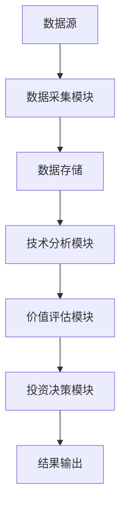

                 


# 价值投资中的颠覆性技术分析

---

## 关键词：价值投资，颠覆性技术，技术分析，投资策略，技术驱动型投资

---

## 摘要：本文探讨了如何将颠覆性技术分析与价值投资相结合，识别技术驱动的投资机会，构建创新的投资策略。通过分析技术的生命周期、市场影响和行业趋势，结合基本面分析和技术创新评估，为投资者提供前瞻性的指导。

---

## 第一部分：引言

### 第1章：价值投资与颠覆性技术分析的背景

#### 1.1 价值投资的定义与核心理念
- **价值投资**：以低于内在价值的价格购买优质资产，长期持有，追求超额收益。核心理念包括安全边际、内在价值和市场有效性的分析。
- **技术分析**：通过历史价格和交易量数据预测未来走势，关注市场信号而非基本面因素。
- **结合价值投资与技术分析**：利用技术分析识别趋势，结合基本面评估内在价值，优化投资决策。

#### 1.2 颠覆性技术的定义与特征
- **颠覆性技术**：能够创造新市场或破坏现有市场秩序的技术创新，如人工智能、区块链等。
- **特征**：
  - 市场破坏性：可能淘汰现有产品或企业。
  - 技术创新性：采用新技术或新商业模式。
  - 市场适应性：最初在低端市场或新市场成功，逐渐侵蚀主流市场。

#### 1.3 价值投资与颠覆性技术结合的意义
- 提高投资决策的准确性。
- 把握技术变革带来的投资机会。
- 应对技术颠覆带来的投资风险。

---

## 第二部分：价值投资的理论基础

### 第2章：价值投资的核心理论

#### 2.1 价值投资的基本原理
- **市场有效性分析**：市场并非总是有效，存在短期波动和误定价机会。
- **安全边际**：买入价格低于内在价值，以降低风险并确保安全空间。
- **内在价值计算**：通过DCF模型等方法评估资产的真实价值。

#### 2.2 价值投资的历史发展
- **起源**：20世纪初，格雷厄姆和多德提出价值投资理念。
- **发展历程**：从传统方法到现代结合技术分析的趋势。
- **现代应用**：结合技术进步和市场变化，动态调整投资策略。

#### 2.3 价值投资与技术分析的结合
- **技术分析在价值投资中的作用**：识别市场趋势，辅助估值判断。
- **结合方法**：通过技术信号筛选潜在投资标的，再进行基本面分析。

---

## 第三部分：颠覆性技术分析的核心理论

### 第3章：颠覆性技术的定义与特征

#### 3.1 颠覆性技术的定义
- **颠覆性技术**：通过技术创新或商业模式改变市场结构的技术，可能来自新兴领域。

#### 3.2 颠覆性技术的特征
- **技术属性**：创新性、可扩展性。
- **市场属性**：破坏性、适应性。
- **生命周期**：从萌芽到成熟，经历多个阶段。

---

## 第四部分：技术分析与投资策略

### 第4章：技术驱动的行业分析

#### 4.1 行业分析方法
- **行业评估**：分析行业现状、竞争格局和技术趋势。
- **技术竞争力评估**：比较各公司的技术创新能力和市场适应性。

#### 4.2抽丝剥茧：技术对行业的影响
- **案例分析**：如人工智能对金融行业的颠覆，区块链对支付行业的改变。
- **投资机会识别**：关注具有技术优势和市场潜力的企业。

---

## 第五部分：系统设计与实战项目

### 第5章：系统架构设计

#### 5.1 技术分析系统框架
- **系统目标**：构建一个整合技术分析与价值投资的决策支持系统。
- **功能模块**：
  - 数据采集：获取市场数据和技术创新信息。
  - 分析模块：技术指标分析和颠覆性技术评估。
  - 投资决策支持：生成投资建议和风险评估。

#### 5.2 系统架构图


#### 5.3 实战项目：基于人工智能的技术投资分析
- **环境安装**：安装数据分析工具如Python、Pandas、Matplotlib。
- **代码实现**：
  ```python
  import pandas as pd
  import matplotlib.pyplot as plt

  # 示例代码：计算相对强弱指数（RSI）
  def calculate_rsi(data, period=14):
      delta = data['Close'].diff(1)
      up = delta.where(delta > 0, 0)
      down = delta.where(delta < 0, 0)
      ma_up = up.rolling(period).mean()
      ma_down = down.rolling(period).mean()
      rsi = ma_up / ma_down
      return rsi

  # 应用RSI指标
  data['RSI'] = calculate_rsi(data)
  plt.plot(data['RSI'])
  plt.show()
  ```
- **结果分析**：通过RSI指标判断市场超买超卖状态，辅助投资决策。

---

## 第六部分：结论与展望

### 第6章：结论与投资建议
- **结论**：颠覆性技术分析与价值投资结合，提升投资决策的科学性和前瞻性。
- **投资建议**：
  - 关注技术创新和市场潜力。
  - 结合技术分析和基本面分析，制定个性化投资策略。
  - 保持对新兴技术的关注，及时调整投资组合。

### 附录
- **术语表**：解释书中使用的关键术语。
- **工具推荐**：数据分析工具、技术趋势分析工具等。
- **数据源**：建议的数据来源和获取方法。

---

通过以上结构，文章系统地阐述了价值投资与颠覆性技术分析的结合，提供了理论支持和实践指导，帮助投资者在技术驱动的市场中把握投资机会。

