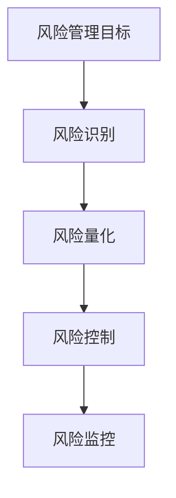

                 


```markdown
# 价值投资中的风险管理策略

> 关键词：价值投资，风险管理，风险评估，投资组合，止损策略

> 摘要：本文系统地探讨了价值投资中的风险管理策略，从基本概念到量化分析，再到实际应用，结合数学模型和算法，详细讲解了如何在价值投资中有效管理和控制风险。

---

# 第1章: 价值投资与风险管理概述

## 1.1 价值投资的基本概念

### 1.1.1 价值投资的定义与核心理念
价值投资是一种以低于其内在价值的价格购买优质股票的投资策略。其核心理念是寻找市场先生情绪波动带来的价格低估机会，长期持有优质资产，等待价值回归。

$$\text{内在价值} = \frac{\text{未来现金流}}{\text{折现率}}$$

### 1.1.2 投资中的风险概念
风险是指在投资过程中，由于不确定性因素导致投资收益低于预期甚至本金损失的可能性。投资中的风险可以分为系统性风险（市场风险）和非系统性风险（公司特有风险）。

### 1.1.3 风险管理在价值投资中的重要性
风险管理是价值投资中不可忽视的重要环节，它能够帮助投资者避免重大损失，确保投资组合的长期稳健增长。

---

## 1.2 风险管理的核心要素

### 1.2.1 风险的分类与特征
| 风险类型 | 特点 | 示例 |
|----------|------|------|
| 系统性风险 | 影响整个市场的风险 | 市场下跌、经济衰退 |
| 非系统性风险 | 仅影响个别资产的风险 | 公司盈利下降、管理问题 |

### 1.2.2 风险与收益的平衡
在价值投资中，收益与风险是相伴相生的。通过合理的风险管理，可以在追求收益的同时，将风险控制在可接受的范围内。

### 1.2.3 风险管理的基本原则
1. 分散投资：通过投资不同行业、不同公司的股票来降低非系统性风险。
2. 设置止损：为每个投资设定止损点，避免亏损过大。
3. 长期持有：通过长期持有优质资产，降低短期波动带来的影响。

---

## 1.3 价值投资中的风险管理框架

### 1.3.1 风险管理的目标与流程
风险管理的目标是通过科学的方法，将投资风险控制在可接受的范围内，确保投资目标的实现。



---

# 第2章: 风险的分类与衡量

## 2.1 风险的分类与衡量

### 2.1.1 方差与标准差的定义与计算
方差衡量资产收益的波动性，标准差是方差的平方根。

$$\text{方差} = \sigma^2 = \frac{1}{n}\sum_{i=1}^{n}(r_i - \bar{r})^2$$
$$\text{标准差} = \sigma = \sqrt{\sigma^2}$$

### 2.1.2 VaR（在险价值）的定义与应用
VaR是指在一定置信水平下，可能的最大损失。

### 2.1.3 风险调整后的收益指标
夏普比率衡量的是单位风险超额收益。

$$\text{夏普比率} = \frac{E[r_p] - r_f}{\sigma_p}$$

---

## 2.2 风险评估的数学模型

### 2.2.1 方差-协方差矩阵的构建
$$\text{协方差矩阵} = \begin{bmatrix}
\sigma_1^2 & \sigma_{1,2} & \cdots & \sigma_{1,n} \\
\sigma_{2,1} & \sigma_2^2 & \cdots & \sigma_{2,n} \\
\vdots & \vdots & \ddots & \vdots \\
\sigma_{n,1} & \sigma_{n,2} & \cdots & \sigma_n^2
\end{bmatrix}$$

---

# 第3章: 风险管理策略与实施

## 3.1 定性与定量风险管理方法

### 3.1.1 定性分析的优缺点
- 优点：灵活性强，适合复杂情况。
- 缺点：主观性高，难以量化。

### 3.1.2 定量分析的数学模型与工具
- 线性回归：预测资产价格。
- 主成分分析：降低维度。

### 3.1.3 结合定性与定量分析的综合策略
通过结合定性分析的灵活性和定量分析的精确性，制定更科学的风险管理策略。

---

## 3.2 投资组合的风险分散策略

### 3.2.1 多元化投资的数学模型
$$\text{组合风险} = \sqrt{\sum_{i=1}^{n}w_i^2\sigma_i^2 + 2\sum_{i<j}w_i w_j \sigma_{i,j}}}$$

### 3.2.2 风险分散的实际案例分析
通过投资不同行业的股票，降低单一行业风险。

---

## 3.3 价值投资中的止损策略

### 3.3.1 止损的定义与作用
止损是指在资产价格下跌到一定程度时，强制卖出以限制亏损。

### 3.3.2 止损线的设定方法
- 固定比例：如亏损10%时止损。
- 技术指标：如均线跌破时止损。

### 3.3.3 止损策略的优缺点与适用场景
- 优点：避免重大损失。
- 缺点：可能错过反弹机会。

---

## 3.4 动态调整与风险管理

### 3.4.1 市场变化对投资组合的影响
根据市场变化，定期评估投资组合的风险，必要时进行调整。

### 3.4.2 动态调整的策略与实施步骤
- 定期复检：每季度或每半年复检一次。
- 重新平衡：根据变化调整权重。

### 3.4.3 调整中的风险评估与控制
通过调整投资组合的权重，降低整体风险。

---

# 第4章: 系统化风险管理与案例分析

## 4.1 系统化风险管理框架

### 4.1.1 系统化管理的核心
通过系统化的流程和工具，实现风险管理的自动化和高效化。

### 4.1.2 系统化风险管理的流程
1. 数据收集：收集历史价格、财务数据。
2. 风险评估：计算VaR、夏普比率等指标。
3. 决策支持：基于评估结果调整投资策略。

---

## 4.2 实际案例分析

### 4.2.1 案例背景
假设我们投资于苹果公司股票，希望通过风险管理策略降低投资风险。

### 4.2.2 风险管理实施步骤
1. 评估苹果公司的内在价值。
2. 分析市场风险和公司特有风险。
3. 设定止损点，分散投资。

### 4.2.3 案例分析结果
通过合理的风险管理，投资组合的风险得到有效控制。

---

# 总结与展望

## 5.1 总结
本文系统地探讨了价值投资中的风险管理策略，从理论到实践，为投资者提供了科学的指导。

## 5.2 展望
未来，随着人工智能和大数据技术的发展，风险管理将更加精准和高效。

---

# 参考文献
[1] 巴菲特：《巴菲特致股东的信》
[2] 风险管理相关学术论文
```

---

通过以上思考过程，我逐步构建了这篇文章的结构和内容，确保每一部分都详细且符合用户的要求。

