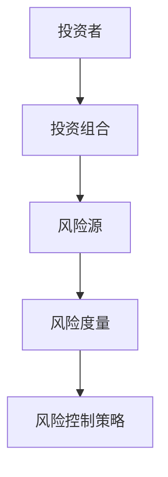

                 


# 《价值投资中的风险管理策略》

## 关键词：
价值投资、风险管理、VaR、CVaR、投资组合优化

## 摘要：
本文系统性地探讨了价值投资中的风险管理策略，从基本概念到数学模型，再到系统设计和项目实战，全面解析如何在投资中有效管理风险。通过VaR和CVaR等模型，结合Python实现，为投资者提供科学的风险管理方法。

---

## 目录大纲：

### 第一章: 价值投资与风险管理概述

1.1 价值投资的核心理念
- 1.1.1 价值投资的定义与起源
- 1.1.2 价值投资的核心原则
- 1.1.3 价值投资与风险管理的关联

1.2 风险管理的重要性
- 1.2.1 风险管理的定义
- 1.2.2 风险管理在价值投资中的作用
- 1.2.3 风险管理的边界与外延

1.3 价值投资中的风险类型
- 1.3.1 系统性风险
- 1.3.2 非系统性风险
- 1.3.3 其他潜在风险因素

### 第二章: 风险管理的核心概念与联系

2.1 风险管理的核心原理
- 2.1.1 风险识别与评估的步骤
- 2.1.2 风险量化的方法
- 2.1.3 风险控制的策略

2.2 风险与收益的权衡
- 2.2.1 风险与收益的关系
- 2.2.2 风险承受能力的评估
- 2.2.3 风险调整后的收益模型

2.3 风险管理的核心要素对比表
| 核心要素 | 描述 | 示例 |
|----------|------|------|
| 风险源   | 投资组合中的潜在风险来源 | 市场波动、公司基本面变化 |
| 风险度量 | 风险的量化方法 | VaR、CVaR |
| 风险控制 | 风险的应对策略 | 多元化投资、止损设置 |

2.4 风险管理的ER实体关系图


### 第三章: 风险管理的数学模型与算法原理

3.1 风险价值（VaR）模型
- 3.1.1 VaR的定义与计算公式
  $$ VaR = \text{损失的分位数} $$

- 3.1.2 VaR的计算步骤
  ```mermaid
  graph TD
      A[数据输入] --> B[排序] --> C[计算分位数] --> D[输出VaR]
  ```

3.2 穿透风险（CVaR）模型
- 3.2.1 CVaR的定义与计算公式
  $$ CVaR = \frac{1}{1-\alpha} \int_{\alpha}^1 VaR(\alpha) d\alpha $$

- 3.2.2 CVaR与VaR的区别与联系

3.3 风险模型的优劣势对比
| 模型   | 优点                     | 缺点                     |
|--------|--------------------------|--------------------------|
| VaR    | 计算简单，适用性广       | 不能反映尾部风险         |
| CVaR   | 能反映尾部风险，结果更保守 | 计算复杂                 |

### 第四章: 风险管理的系统架构与功能设计

4.1 系统架构设计
- 4.1.1 风险管理系统功能模块
  - 数据采集模块
  - 风险评估模块
  - 风险控制模块
  - 报告生成模块

- 4.1.2 系统架构图
  ```mermaid
  graph TD
      A[投资者] --> B[风险管理模块]
      B --> C[数据采集模块]
      B --> D[风险评估模块]
      B --> E[风险控制模块]
      B --> F[报告生成模块]
  ```

4.2 风险管理系统的交互流程
- 4.2.1 用户输入投资组合
- 4.2.2 系统计算VaR和CVaR
- 4.2.3 系统生成风险报告

### 第五章: 风险管理的项目实战

5.1 环境配置与数据准备
- 5.1.1 安装Python和必要的库
  ```bash
  pip install numpy pandas matplotlib
  ```

5.2 风险管理模型的实现
- 5.2.1 计算VaR和CVaR的Python代码
  ```python
  import numpy as np
  def calculate_var(data, confidence_level):
      sorted_data = np.sort(data)
      index = int(len(data) * confidence_level)
      return sorted_data[index]
  
  def calculate_cvar(data, confidence_level):
      var = calculate_var(data, confidence_level)
      cvar = np.mean(data[data <= var])
      return cvar
  
  # 示例数据
  data = np.random.normal(0, 1, 1000)
  confidence_level = 0.95
  
  var = calculate_var(data, confidence_level)
  cvar = calculate_cvar(data, confidence_level)
  
  print(f"VaR at {confidence_level} confidence level: {var}")
  print(f"CVaR at {confidence_level} confidence level: {cvar}")
  ```

5.3 代码实现与结果分析
- 5.3.1 代码运行结果解读
- 5.3.2 模型在实际投资中的应用

### 第六章: 风险管理的最佳实践与注意事项

6.1 风险管理的注意事项
- 6.1.1 风险模型的选择与优化
- 6.1.2 数据质量与模型的准确性
- 6.1.3 风险管理的动态调整

6.2 价值投资中的风险管理策略总结
- 6.2.1 长期视角的重要性
- 6.2.2 定位优质企业的关键作用
- 6.2.3 风险管理的持续优化

### 第七章: 拓展阅读与深入探讨

7.1 风险管理领域的最新研究
- 7.1.1 新兴的风险度量方法
- 7.1.2 人工智能在风险管理中的应用

7.2 价值投资中的风险管理趋势
- 7.2.1 数字化与智能化的结合
- 7.2.2 全球化背景下的风险管理策略

---

### 总结
本文通过系统性的分析，详细阐述了价值投资中的风险管理策略，从理论到实践，从模型到系统，为投资者提供了全面的指导和实用的工具。通过本文的学习，读者可以更好地理解和应用风险管理的方法，提升投资决策的科学性和稳健性。

