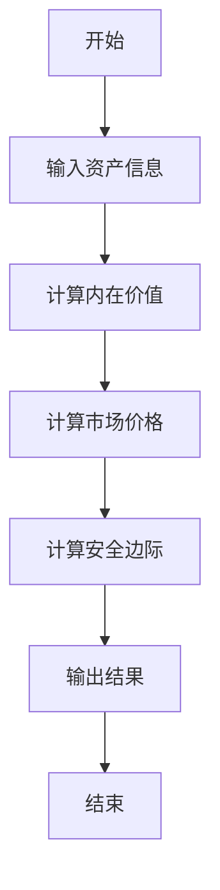
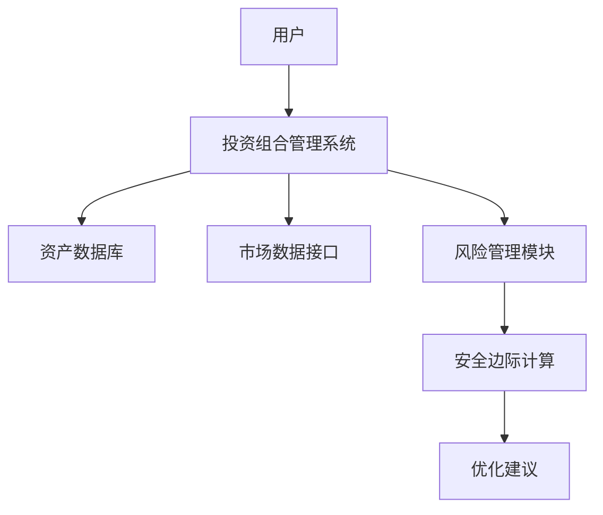

                 


# 《价值投资中的风险管理：安全边际的作用》

---

## 关键词：
- 价值投资
- 风险管理
- 安全边际
- 投资组合
- 数学模型
- 系统架构

---

## 摘要：
本书深入探讨了价值投资中的风险管理，重点分析了安全边际在投资决策中的作用。通过理论与实践相结合的方式，本书首先介绍了价值投资和风险管理的基本概念，接着详细阐述了安全边际的定义、计算方法及其在投资组合中的应用。随后，从数学和系统架构的角度，分析了安全边际的量化模型和投资组合管理系统的设计。最后，通过实际案例展示了安全边际在价值投资中的实际应用，并总结了相关的最佳实践和注意事项。本书适合投资专业人士、学生以及对价值投资感兴趣的所有读者阅读。

---

## 目录大纲：

### 第一部分：价值投资与风险管理基础

#### 第1章：价值投资与风险管理概述

##### 1.1 价值投资的核心理念
- 1.1.1 价值投资的定义与特点
  - 价值投资的定义：以低于内在价值的价格购买优质资产。
  - 特点：长期主义、注重基本面、安全边际。
- 1.1.2 风险管理在价值投资中的重要性
  - 风险管理的目标：保护资本，确保投资组合的长期稳健增长。
  - 风险管理的核心：识别、评估和控制风险。
- 1.1.3 安全边际的定义与作用
  - 安全边际的定义：资产的实际价值与市场价格之间的差距。
  - 安全边际的作用：提供缓冲，降低投资风险。

##### 1.2 价值投资中的风险类型
- 1.2.1 市场风险
  - 市场波动对资产价格的影响。
  - 系统性风险与非系统性风险的区别。
- 1.2.2 信用风险
  - 债务人违约的风险。
  - 评级机构的作用。
- 1.2.3 流动性风险
  - 资产难以快速变现的风险。
  - 市场深度与流动性的关系。
- 1.2.4 操作风险
  - 投资决策中的错误或失误。
  - 内部控制的重要性。

##### 1.3 安全边际的定义与计算
- 1.3.1 安全边际的定义
  - 安全边际 = 内在价值 - 市场价格。
- 1.3.2 安全边际的计算方法
  - 基于DCF模型的内在价值计算。
  - 安全边际的百分比表示法。
- 1.3.3 安全边际的应用场景
  - 在市场低迷时寻找低估资产。
  - 在市场繁荣时避免过度投资。

##### 1.4 本章小结

---

### 第二部分：安全边际的理论与实践

#### 第2章：安全边际的理论基础

##### 2.1 投资决策中的安全边际原理
- 2.1.1 资产的安全边际与内在价值
  - 内在价值的计算公式：$$ V = \frac{CF}{r - g} $$
  - 安全边际的计算公式：$$ Margin of Safety = V - P $$
- 2.1.2 安全边际与投资风险的关系
  - 边际安全增加时，风险降低。
  - 安全边际与资产类别（股票、债券）的结合。
- 2.1.3 资产定价模型与安全边际
  - 市场价格与内在价值的偏离反映了安全边际的存在。

##### 2.2 安全边际与资产配置
- 2.2.1 资产配置的基本原理
  - 资产配置的目标：分散风险，平衡收益。
  - 资产配置的类型：股票、债券、现金等。
- 2.2.2 安全边际在资产配置中的应用
  - 根据资产的安全边际比例分配投资比例。
  - 行业或地区的安全边际差异对配置的影响。
- 2.2.3 不同资产类别中的安全边际分析
  - 股票：高成长性企业的安全边际。
  - 债券：信用评级与违约风险的关系。
  - 现金：流动性与机会成本的平衡。

##### 2.3 本章小结

---

### 第三部分：安全边际的数学模型与算法

#### 第3章：安全边际的数学模型

##### 3.1 内在价值的计算公式
- 3.1.1 内在价值的定义
  - 内在价值是资产的未来现金流的现值。
- 3.1.2 内在价值的计算公式
  - 股票的内在价值：$$ V_{stock} = \frac{D}{k} $$
  - 债券的内在价值：$$ V_{bond} = \sum_{t=1}^{n} \frac{C}{(1 + r)^t} + \frac{F}{(1 + r)^n} $$
- 3.1.3 内在价值与安全边际的关系
  - 安全边际 = 内在价值 - 市场价格。

##### 3.2 安全边际的量化方法
- 3.2.1 安全边际的量化指标
  - 安全边际率 = (内在价值 - 市场价格) / 市场价格。
  - 相对安全边际：与行业或市场平均水平的比较。
- 3.2.2 安全边际的统计分析
  - 历史安全边际的分布情况。
  - 安全边际与资产回报率的相关性。
- 3.2.3 安全边际的风险调整模型
  - 考虑波动率的调整：$$ Adjusted\ Margin = Margin - \sigma $$
  - 考虑流动性风险的调整。

##### 3.3 算法原理与流程图

###### 算法流程图（使用 Mermaid）



##### 3.4 本章小结

---

### 第四部分：投资组合管理中的安全边际应用

#### 第4章：投资组合管理中的安全边际应用

##### 4.1 投资组合管理的背景介绍
- 4.1.1 投资组合管理的目标
  - 实现资产的最优配置，平衡风险与收益。
- 4.1.2 投资组合管理的核心问题
  - 如何选择具有足够安全边际的资产。
  - 如何动态调整组合以应对市场变化。

##### 4.2 投资组合的构建与优化
- 4.2.1 资产选择的标准
  - 安全边际的高低。
  - 资产的流动性。
  - 资产的长期增长潜力。
- 4.2.2 投资组合的优化方法
  - 使用数学模型（如均值-方差优化）进行优化。
  - 结合安全边际的约束条件。
- 4.2.3 优化后的投资组合
  - 优化后的资产配置比例。
  - 组合的预期收益与风险。

##### 4.3 投资组合的风险管理
- 4.3.1 定期再平衡
  - 定期检查组合的安全边际。
  - 根据市场变化调整权重。
- 4.3.2 动态调整策略
  - 根据市场波动调整安全边际要求。
  - 优化后的投资组合的预期表现。

##### 4.4 系统架构与接口设计

###### 系统架构图（使用 Mermaid）



##### 4.5 本章小结

---

### 第五部分：项目实战与案例分析

#### 第5章：项目实战与案例分析

##### 5.1 项目背景与目标
- 5.1.1 项目背景
  - 构建一个基于安全边际的投资组合管理系统。
- 5.1.2 项目目标
  - 实现资产的安全边际计算。
  - 自动生成优化的投资组合建议。
  - 提供实时市场数据支持。

##### 5.2 环境配置与代码实现
- 5.2.1 环境配置
  - 安装Python、Pandas、NumPy、Scipy等库。
  - 数据源：Yahoo Finance API。
- 5.2.2 核心代码实现
  - 内在价值计算函数。
  - 安全边际计算函数。
  - 投资组合优化算法。
  - 示例代码：

```python
import pandas as pd
import numpy as np

def calculate_intrinsic_value(cash_flows, discount_rate, growth_rate):
    terminal_value = cash_flows[-1] * (1 + growth_rate) / (discount_rate - growth_rate)
    intrinsic_value = terminal_value / (1 + discount_rate) ** len(cash_flows)
    return intrinsic_value

def calculate_margin_of_safety(intrinsic_value, market_price):
    return intrinsic_value - market_price

# 示例数据
cash_flows = [100, 110, 121]
discount_rate = 0.1
growth_rate = 0.05

iv = calculate_intrinsic_value(cash_flows, discount_rate, growth_rate)
market_price = 100
mos = calculate_margin_of_safety(iv, market_price)
print(f"内值: {iv:.2f}, 市场价格: {market_price}, 安全边际: {mos:.2f}")
```

##### 5.3 案例分析与实际应用
- 5.3.1 案例分析
  - 选择一家公司的历史数据。
  - 计算其内在价值和安全边际。
  - 比较不同时间点的安全边际变化。
- 5.3.2 实际应用
  - 如何根据安全边际进行买卖决策。
  - 如何动态调整投资组合。

##### 5.4 本章小结

---

### 第六部分：高级策略与注意事项

#### 第6章：高级策略与注意事项

##### 6.1 高级策略
- 6.1.1 动态调整安全边际
  - 根据市场环境调整安全边际要求。
  - 在牛市中降低安全边际要求，在熊市中提高要求。
- 6.1.2 多因素模型的结合
  - 结合行业、地域、资产类别等因素进行分析。
  - 使用多元回归模型预测风险。

##### 6.2 注意事项
- 6.2.1 安全边际的局限性
  - 安全边际无法完全消除风险。
  - 市场的非理性可能导致安全边际失效。
- 6.2.2 数据与模型的选择
  - 数据的准确性和完整性。
  - 模型的适用性和可解释性。
- 6.2.3 持续学习与适应
  - 随着市场变化不断更新知识和策略。
  - 关注新的风险因素和投资机会。

##### 6.3 最佳实践
- 6.3.1 定期回顾与调整
  - 定期检查投资组合的安全边际。
  - 根据市场变化进行必要的调整。
- 6.3.2 长期视角
  - 避免短期波动的干扰。
  - 保持长期投资的耐心和信心。
- 6.3.3 保持学习
  - 深入理解价值投资的理论和实践。
  - 关注行业动态和市场趋势。

##### 6.4 本章小结

---

### 第七部分：总结与展望

#### 第7章：总结与展望

##### 7.1 全书总结
- 7.1.1 主要内容回顾
  - 价值投资的核心理念。
  - 安全边际的定义与应用。
  - 投资组合管理的系统设计。
- 7.1.2 本书的创新点
  - 理论与实践的结合。
  - 数学模型与系统架构的详细讲解。

##### 7.2 未来展望
- 7.2.1 研究方向
  - 结合人工智能技术进行风险管理。
  - 开发更复杂的多因子模型。
- 7.2.2 实际应用
  - 推动安全边际在机构投资中的应用。
  - 提供更多的案例分析和实证研究。

##### 7.3 本章小结

---

## 结束语：
通过系统的理论学习和实际案例分析，本书旨在帮助读者深入理解安全边际在价值投资中的重要作用，并能够将其应用于实际的投资决策中。无论是对于刚入门的投资者，还是对于经验丰富的投资专业人士，本书都能提供有价值的见解和指导。

---

## 拓展阅读：
1. 《投资最重要的事情》——本杰明·格雷厄姆
2. 《证券分析》——本杰明·格雷厄姆 & 大卫·多德
3. 《风险管理与投资组合》——哈里·马科维茨
4. 《算法驱动的投资》——安德鲁·凯拉什
5. 《价值投资实战策略》——彼得·林奇

