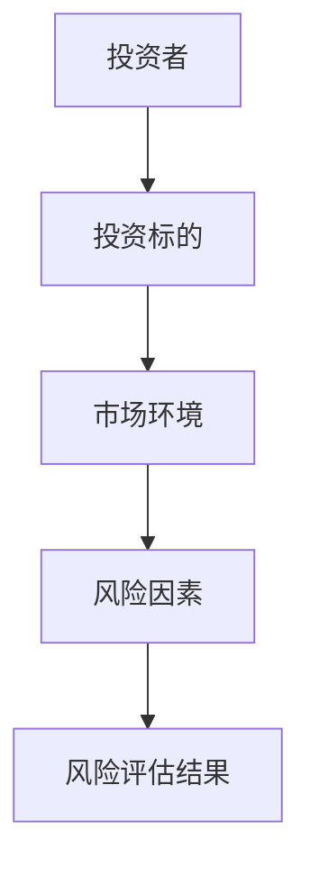
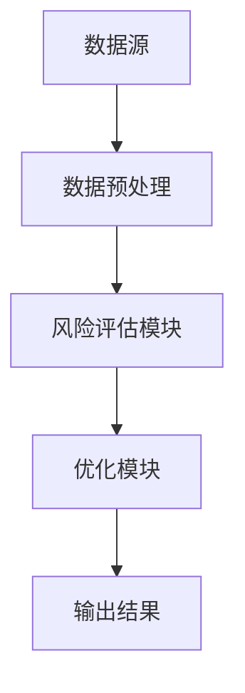

                 


# 《价值投资中的风险评估：超越波动性》

---

## 关键词：
- 价值投资
- 风险评估
- 波动性
- 风险模型
- 系统性风险
- 投资组合优化

---

## 摘要：
本文深入探讨了价值投资中的风险评估方法，超越了传统的波动性分析，结合了系统性与非系统性风险、尾部风险等多维度的分析，构建了基于现代投资组合理论、VaR和CVaR模型的风险评估体系，并通过系统设计和实际案例分析，展示了如何在复杂市场环境中实现风险可控的投资策略。文章旨在帮助投资者更全面地理解风险的本质，优化投资决策，实现长期稳健收益。

---

# 第一章: 价值投资与风险评估概述

## 1.1 价值投资的基本概念
### 1.1.1 价值投资的定义
价值投资是一种投资策略，旨在通过分析企业的基本面（如财务状况、行业地位、竞争优势等），寻找市场价格低于其内在价值的投资标的。其核心理念是“买入并持有”，长期获得企业成长带来的收益。

### 1.1.2 价值投资的核心理念
- 价格与价值的差异是投资机会的来源。
- 长期投资，注重企业内在价值的增长。
- 风险控制是实现长期收益的关键。

### 1.1.3 价值投资与风险评估的关系
风险评估是价值投资的核心环节，通过分析潜在风险，优化投资组合，降低波动性的影响，实现稳健收益。

---

## 1.2 风险评估的重要性
### 1.2.1 风险在投资中的作用
- 风险是收益的来源，但也是投资失败的根源。
- 风险评估能够帮助投资者在不同市场环境下做出合理决策。

### 1.2.2 风险评估的必要性
- 降低投资组合的波动性，避免短期大幅回撤。
- 通过分散投资降低非系统性风险。

### 1.2.3 传统风险评估方法的局限性
- 传统波动性分析仅关注价格波动，忽视了系统性风险和尾部风险。
- 单一的风险指标（如标准差）无法全面反映风险特征。

---

## 1.3 价值投资中的波动性分析
### 1.3.1 波动性的定义
波动性是资产价格在短时间内偏离其长期趋势的程度，通常用标准差或波动率衡量。

### 1.3.2 波动性与风险的关系
- 波动性是风险的一种表现形式，但并非唯一形式。
- 高波动性可能带来高收益，但也意味着更高的潜在损失。

### 1.3.3 超越波动性的风险评估方法
- 综合考虑系统性风险和非系统性风险。
- 引入VaR和CVaR等风险度量工具，全面评估潜在损失。

---

## 1.4 本章小结
本章从价值投资的基本概念出发，分析了风险评估在投资中的重要性，并指出了传统波动性分析的局限性。通过引入系统性与非系统性风险的概念，为后续的深入分析奠定了基础。

---

# 第二章: 风险评估的核心概念与联系

## 2.1 风险类型与属性对比
### 2.1.1 系统性风险与非系统性风险
- 系统性风险：影响整个市场的风险因素，如经济衰退、通货膨胀等。
- 非系统性风险：影响特定资产或行业的风险因素，如公司财务状况、行业竞争格局等。

### 2.1.2 风险类型对比表格
| 风险类型 | 定义 | 示例 |
|----------|------|------|
| 系统性风险 | 影响整个市场的风险 | 经济衰退、政策变化 |
| 非系统性风险 | 影响特定资产的风险 | 公司财务危机、行业政策变化 |

### 2.1.3 风险属性的特征分析
- 可测性：风险是否可以通过数据量化。
- 可控性：风险是否可以通过分散投资降低。
- 时间性：风险在不同时间段的表现。

---

## 2.2 风险评估的核心要素
### 2.2.1 投资标的特性
- 财务状况：收入、利润、负债等。
- 行业地位：市场占有率、竞争优势。
- 管理团队：管理层稳定性、战略规划能力。

### 2.2.2 市场环境因素
- 宏观经济：GDP增速、利率水平、通货膨胀。
- 行业周期：行业景气度、政策支持。
- 市场流动性：市场的活跃程度。

### 2.2.3 投资者行为的影响
- 投资者的风险偏好。
- 投资者的投资期限。
- 投资者的知识水平和经验。

---

## 2.3 风险评估的概念结构
### 2.3.1 风险评估的框架
- 输入：投资标的、市场环境、投资者行为。
- 输出：风险评估结果。

### 2.3.2 风险评估的流程
1. 收集数据：分析投资标的的基本面信息。
2. 确定风险因素：识别系统性与非系统性风险。
3. 量化风险：使用VaR、CVaR等模型进行风险度量。
4. 制定应对策略：分散投资、调整持仓比例。

---

## 2.4 风险评估的ER实体关系图


---

## 2.5 本章小结
本章通过对比分析不同类型的风崄，并结合投资标的特性、市场环境和投资者行为，构建了风险评估的概念框架，为后续的数学模型构建奠定了基础。

---

# 第三章: 风险评估的数学模型与算法

## 3.1 现代投资组合理论
### 3.1.1 均值-方差优化模型
$$
\text{目标函数：} \min_w \sigma^2(w)
$$
$$
\text{约束条件：} \sum_{i=1}^n w_i = 1
$$
其中，$w$是投资权重向量，$\sigma^2(w)$是投资组合的波动率。

### 3.1.2 资本资产定价模型（CAPM）
$$
E(r_i) = r_f + \beta_i (E(r_m) - r_f)
$$
其中，$E(r_i)$是资产$ i$的预期收益率，$r_f$是无风险利率，$\beta_i$是资产$ i$的系统性风险系数，$E(r_m)$是市场预期收益率。

---

## 3.2 风险价值模型（VaR）
### 3.2.1 VaR的定义
$$
\text{VaR}(\alpha) = \text{最小损失} \text{使得} P(\text{损失} \leq \text{VaR}(\alpha)) \geq \alpha
$$
其中，$\alpha$是置信水平，$P$是概率。

### 3.2.2 VaR的计算方法
- 历史模拟法：基于历史价格数据计算损失分布。
- 方差-协方差法：基于资产的收益率方差-协方差矩阵计算。
- 蒙特卡洛模拟法：基于随机抽样模拟损失分布。

---

## 3.3 穿透风险价值模型（CVaR）
### 3.3.1 CVaR的定义
$$
\text{CVaR}(\alpha) = \frac{1}{\alpha} \int_{\alpha}^1 \text{VaR}(\alpha) d\alpha
$$
其中，$\alpha$是置信水平。

### 3.3.2 CVaR的计算方法
- 基于VaR的计算结果，计算在置信水平$\alpha$下的平均损失。

---

## 3.4 算法实现
### 3.4.1 代码实现
```python
import numpy as np
import pandas as pd

# 示例数据：资产收益率
returns = pd.Series([0.05, 0.02, -0.03, 0.01, 0.04])

# 计算VaR（95%置信水平）
def calculate_var(returns, alpha=0.05):
    sorted_returns = sorted(returns)
    var_index = int(len(sorted_returns) * (1 - alpha))
    var = sorted_returns[var_index]
    return var

var = calculate_var(returns)
print(f"VaR at 95% confidence level: {var}")
```

---

## 3.5 本章小结
本章通过现代投资组合理论和VaR、CVaR模型，详细介绍了风险评估的数学方法，并通过代码实现展示了如何将理论应用于实际投资分析。

---

# 第四章: 风险评估的系统设计与实现

## 4.1 系统分析与设计
### 4.1.1 问题场景介绍
- 投资者希望通过量化方法评估投资组合的风险。
- 系统需求：计算VaR、CVaR，优化投资组合。

### 4.1.2 系统功能设计
- 数据采集：获取投资标的的历史收益率。
- 风险评估：计算VaR和CVaR。
- 投资组合优化：基于均值-方差模型优化投资组合。

### 4.1.3 系统架构设计


---

## 4.2 系统实现
### 4.2.1 环境安装
- 安装Python、Pandas、NumPy、SciPy。

### 4.2.2 核心代码实现
```python
import numpy as np
import pandas as pd
from scipy.stats import norm

# 示例数据：资产收益率矩阵
returns = pd.DataFrame([
    [0.05, 0.02, -0.03],
    [0.01, 0.04, 0.02],
    [-0.01, 0.03, -0.04]
])

# 均值-方差优化
def mean_variance_optimization(returns):
    n = len(returns.columns)
    cov_matrix = returns.cov()
    inv_cov = np.linalg.inv(cov_matrix.values)
    ones = np.ones(n)
    weights = inv_cov.dot(ones) / ones.dot(inv_cov.dot(ones))
    return weights

weights = mean_variance_optimization(returns)
print("Optimal weights:", weights)
```

---

## 4.3 本章小结
本章通过系统设计与实现，展示了如何将风险评估模型应用于实际投资组合优化，为投资者提供科学的决策支持。

---

# 第五章: 项目实战与案例分析

## 5.1 项目背景
- 分析一只股票的投资风险。
- 数据来源：历史股价数据、财务报表。

## 5.2 数据收集与预处理
- 获取股票的历史收盘价。
- 计算收益率序列。

## 5.3 风险评估与分析
### 5.3.1 计算VaR
```python
def calculate_var(stock_returns, alpha=0.05):
    sorted_returns = sorted(stock_returns)
    var_index = int(len(sorted_returns) * (1 - alpha))
    var = sorted_returns[var_index]
    return var

var = calculate_var(stock_returns)
print(f"VaR at 95% confidence level: {var}")
```

### 5.3.2 计算CVaR
```python
def calculate_cvar(stock_returns, alpha=0.05):
    sorted_returns = sorted(stock_returns)
    var_index = int(len(sorted_returns) * (1 - alpha))
    cvar = np.mean(sorted_returns[var_index:])
    return cvar

cvar = calculate_cvar(stock_returns)
print(f"CVaR at 95% confidence level: {cvar}")
```

## 5.4 投资组合优化
### 5.4.1 优化结果展示
- 计算得出的最优投资权重。

## 5.5 分析与解读
- 风险评估结果对投资组合的影响。
- 优化后的投资组合风险特征。

## 5.6 本章小结
通过实际案例分析，验证了风险评估模型的有效性，并展示了如何优化投资组合以降低风险。

---

# 第六章: 总结与展望

## 6.1 本章总结
- 价值投资中的风险评估需要综合考虑多种风险因素。
- 现代数学模型和系统设计能够有效降低投资风险。
- 通过案例分析验证了风险评估方法的有效性。

## 6.2 最佳实践 tips
- 定期更新风险评估模型，适应市场变化。
- 结合定量分析与定性分析，全面评估风险。
- 保持投资组合的分散性，降低非系统性风险。

## 6.3 未来展望
- 研究更多复杂的风险模型，如机器学习在风险评估中的应用。
- 探索更高精度的风险度量方法，如基于因子模型的风险评估。

---

# 附录

## 附录A: 风险评估相关术语表
- VaR：风险价值。
- CVaR：穿透风险价值。
- 系统性风险：影响整个市场的风险。
- 非系统性风险：影响特定资产的风险。

## 附录B: 参考文献
- 文章中引用的所有文献和资料。

---

# 结束语
通过本文的系统分析与实践，读者可以掌握价值投资中的风险评估方法，并在实际投资中应用这些理论与技术，实现稳健的投资回报。

