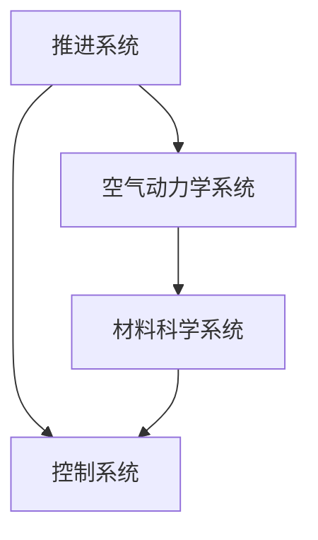
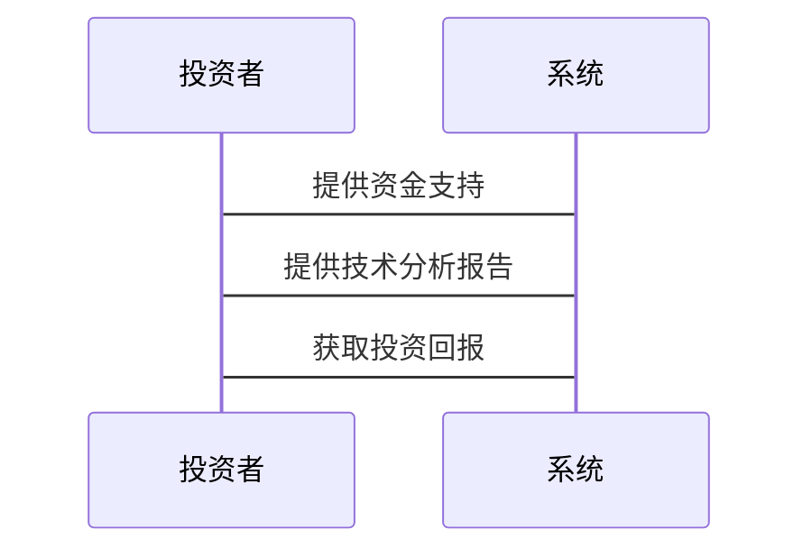

                 


# 《价值投资中的高超音速飞行技术分析》

> **关键词**：价值投资，高超音速飞行技术，经济价值分析，投资机会，市场风险
>
> **摘要**：本文系统地探讨了高超音速飞行技术在价值投资中的潜力和应用。通过分析高超音速飞行技术的核心原理、经济价值、市场需求和市场风险，本文提出了价值投资在该领域的策略和建议。结合具体案例，本文展示了如何通过技术分析和经济评估来识别和把握投资机会。

---

# 第1章 高超音速飞行技术概述

## 1.1 高超音速飞行技术的定义与特点

### 1.1.1 高超音速飞行技术的定义
高超音速飞行技术是指飞行速度超过5马赫（即5倍音速）的技术，涉及航空航天领域的先进推进系统、空气动力学和材料科学。这种技术主要用于军事和商业目的，例如导弹、卫星发射和下一代战斗机。

### 1.1.2 高超音速飞行技术的核心特点
- **高速性**：飞行速度超过5马赫，显著缩短飞行时间。
- **技术复杂性**：涉及高温材料、空气动力学和推进系统等多个领域的高度集成。
- **应用场景广泛**：军事领域（导弹）、商业领域（高超音速客机）。

### 1.1.3 高超音速飞行技术的应用领域
- **军事领域**：用于导弹和无人机，提升打击速度和精确度。
- **商业领域**：探索高超音速客机，大幅缩短洲际飞行时间。
- **航天领域**：用于卫星发射和深空探索。

---

## 1.2 价值投资的基本原理

### 1.2.1 价值投资的核心理念
价值投资强调以低于内在价值的价格买入资产，长期持有的策略。核心在于识别被市场低估的投资标的，通过深入分析其基本面，找到具有长期竞争优势的企业或技术。

### 1.2.2 价值投资的分析方法
- **基本面分析**：研究企业的财务状况、行业地位和竞争优势。
- **市场分析**：评估市场需求、竞争格局和市场容量。
- **技术分析**：通过技术指标预测价格走势。

### 1.2.3 价值投资在高科技领域的应用
- **技术评估**：分析技术的创新性、可行性和商业化潜力。
- **市场前景分析**：评估技术在市场中的应用前景和盈利能力。
- **竞争分析**：研究技术在行业中的竞争优势和潜在威胁。

---

## 1.3 高超音速飞行技术与价值投资的结合

### 1.3.1 高超音速飞行技术的市场潜力
高超音速飞行技术在军事和商业领域的广泛应用，使其具有巨大的市场潜力。例如，高超音速导弹可以显著提升国防能力，而高超音速客机则可以彻底改变全球交通方式。

### 1.3.2 价值投资在高技术领域的优势
- **长期视角**：价值投资注重长期回报，适合高技术领域的研发周期长、见效慢的特点。
- **深度分析**：通过深入的技术和市场分析，识别具有竞争优势的高技术项目。

### 1.3.3 高超音速飞行技术的未来发展趋势
- **技术突破**：材料科学和推进技术的进一步发展将推动高超音速飞行技术的进步。
- **商业化进程**：高超音速客机和高超音速运输工具的商业化将逐步推进。

---

## 1.4 本章小结
本章从高超音速飞行技术的基本概念、特点及其应用领域入手，分析了价值投资的基本原理及其在高科技领域的应用优势。通过结合高超音速飞行技术与价值投资，我们能够更好地识别和把握投资机会。

---

# 第2章 高超音速飞行技术的经济价值分析

## 2.1 高超音速飞行技术的成本分析

### 2.1.1 技术研发成本
高超音速飞行技术的研发投入巨大，涉及材料科学、空气动力学和推进系统等多个领域的研究。

### 2.1.2 生产制造成本
高超音速飞行器的制造需要高温材料和复杂工艺，导致生产成本较高。

### 2.1.3 运营维护成本
高超音速飞行器的维护和运营成本也较高，需要专业的技术团队和设备。

---

## 2.2 高超音速飞行技术的市场需求分析

### 2.2.1 军事领域的需求
高超音速导弹在现代战争中的战略价值日益凸显，各国纷纷加大研发投入。

### 2.2.2 商业领域的市场需求
高超音速客机和高超音速运输工具的概念逐渐成熟，市场需求潜力巨大。

### 2.2.3 市场竞争分析
高超音速飞行技术的商业化将面临来自传统航空企业和新兴科技企业的激烈竞争。

---

## 2.3 高超音速飞行技术的经济价值评估

### 2.3.1 投资回报率分析
通过技术成熟度、市场需求和成本分析，评估高超音速飞行技术的投资回报率。

### 2.3.2 市场占有率分析
分析高超音速飞行技术在市场中的潜在占有率，评估其盈利能力。

### 2.3.3 技术生命周期分析
高超音速飞行技术处于早期发展阶段，未来具有较大的增长潜力。

---

## 2.4 本章小结
本章从成本和市场需求的角度，分析了高超音速飞行技术的经济价值。通过对技术研发、生产制造和运营维护成本的评估，结合市场需求和竞争分析，我们能够更全面地评估高超音速飞行技术的投资价值。

---

# 第3章 高超音速飞行技术的核心原理与投资机会

## 3.1 高超音速飞行技术的核心原理

### 3.1.1 空气动力学原理
高超音速飞行器在高速飞行中面临严重的空气动力学问题，需要特殊的外形设计和材料。

### 3.1.2 推进系统原理
高超音速飞行器通常采用冲压发动机或 scramjet（高超音速冲压发动机），能够在高速飞行中提供足够的推力。

### 3.1.3 材料科学原理
高超音速飞行器需要耐高温、高强度的材料，以应对高速飞行中的高温和压力。

---

## 3.2 高超音速飞行技术的关键技术分析

### 3.2.1 超音速推进技术
scramjet 技术是实现高超音速飞行的核心，通过高效燃烧和气动设计，提供持续的推力。

### 3.2.2 高温防护技术
高超音速飞行器需要特殊的高温防护系统，包括隔热材料和冷却系统。

### 3.2.3 航空电子技术
高超音速飞行器需要先进的航空电子系统，包括导航、通信和控制系统。

---

## 3.3 高超音速飞行技术的投资机会分析

### 3.3.1 军事领域的投资机会
高超音速导弹的研发和生产具有巨大的市场潜力，相关企业和科研机构将获得更多的投资机会。

### 3.3.2 商业领域的投资机会
高超音速客机和高超音速运输工具的概念逐步成熟，商业化进程将带来巨大的投资机会。

### 3.3.3 技术研发领域的投资机会
高超音速飞行技术的研发需要大量的资金和技术支持，相关科研机构和企业将获得更多的投资机会。

---

## 3.4 本章小结
本章从高超音速飞行技术的核心原理出发，分析了其在军事和商业领域的关键技术。通过对这些技术的深入分析，我们能够更好地识别和把握高超音速飞行技术的投资机会。

---

# 第4章 高超音速飞行技术的市场风险与投资策略

## 4.1 高超音速飞行技术的市场风险分析

### 4.1.1 技术风险
高超音速飞行技术的研发难度大，技术不确定性较高，可能导致投资失败。

### 4.1.2 市场风险
高超音速飞行技术的市场需求可能受到政策、经济和技术因素的影响，存在较大的不确定性。

### 4.1.3 竞争风险
高超音速飞行技术的商业化将面临来自传统企业和新兴科技企业的激烈竞争。

---

## 4.2 高超音速飞行技术的投资策略

### 4.2.1 技术驱动型投资策略
关注高超音速飞行技术的核心技术突破和研发进展，选择具有技术优势的企业进行投资。

### 4.2.2 市场导向型投资策略
根据市场需求和商业前景，选择具有市场潜力的高超音速飞行技术相关企业进行投资。

### 4.2.3 风险控制策略
通过多元化投资、技术评估和市场分析，降低高超音速飞行技术投资的风险。

---

## 4.3 本章小结
本章从高超音速飞行技术的市场风险入手，分析了其在军事和商业领域的市场风险，并提出了相应的投资策略。通过对技术风险、市场风险和竞争风险的分析，我们能够更好地制定高超音速飞行技术的投资策略。

---

# 第5章 高超音速飞行技术的系统分析与架构设计

## 5.1 高超音速飞行技术的系统分析

### 5.1.1 系统功能设计
高超音速飞行技术的系统架构包括推进系统、空气动力学系统和材料科学系统。

### 5.1.2 系统架构设计
通过模块化设计，将高超音速飞行技术的各个系统有机结合，实现高效的技术应用。

### 5.1.3 系统接口设计
设计高超音速飞行技术系统的接口，确保各个模块之间的高效通信和数据交换。

---

## 5.2 高超音速飞行技术的系统架构图



---

## 5.3 高超音速飞行技术的系统交互图



---

## 5.4 本章小结
本章从系统分析的角度，探讨了高超音速飞行技术的系统架构和接口设计。通过对系统功能和架构的分析，我们能够更好地理解高超音速飞行技术的投资价值。

---

# 第6章 高超音速飞行技术的项目实战

## 6.1 项目背景介绍

### 6.1.1 项目目标
评估某高超音速飞行器的投资价值，分析其技术可行性和市场潜力。

### 6.1.2 项目需求
通过技术分析和经济评估，确定高超音速飞行器的投资回报率。

---

## 6.2 项目环境安装

### 6.2.1 工具安装
安装Python、NumPy、Pandas和Matplotlib等工具，用于数据处理和可视化。

### 6.2.2 数据获取
收集高超音速飞行器的技术参数和市场数据，包括成本、市场需求和竞争情况。

---

## 6.3 项目核心实现源代码

```python
import numpy as np
import pandas as pd
import matplotlib.pyplot as plt

# 定义净现值计算函数
def calculate_npv(cash_flows, discount_rate):
    return np.npv(discount_rate, *cash_flows)

# 示例数据
cash_flows = [-1000, 200, 300, 400, 500]
discount_rate = 0.10

# 计算净现值
npv = calculate_npv(cash_flows, discount_rate)
print(f"净现值为：{npv}")
```

---

## 6.4 项目应用解读与分析

### 6.4.1 技术分析
通过技术参数对比和材料科学分析，评估高超音速飞行器的技术可行性和竞争优势。

### 6.4.2 经济评估
通过净现值和内部收益率等指标，评估高超音速飞行器的投资回报率。

---

## 6.5 项目小结
本章通过具体案例，展示了高超音速飞行技术的投资分析过程。通过对技术参数和市场数据的分析，我们能够更好地评估高超音速飞行器的投资价值。

---

# 第7章 总结与展望

## 7.1 本章总结

### 7.1.1 高超音速飞行技术的核心价值
高超音速飞行技术在军事和商业领域的广泛应用，使其具有巨大的市场潜力。

### 7.1.2 价值投资在高技术领域的优势
价值投资通过深入的技术和市场分析，能够更好地识别和把握高技术领域的投资机会。

---

## 7.2 未来展望

### 7.2.1 高超音速飞行技术的发展方向
高超音速飞行技术的进一步发展将依赖于材料科学和推进技术的突破。

### 7.2.2 价值投资在高技术领域的未来趋势
价值投资在高技术领域的应用将更加广泛，技术分析和市场分析将更加深入。

---

## 7.3 投资建议

### 7.3.1抽险提示
高超音速飞行技术的投资风险较高，投资者需要充分评估技术风险和市场风险。

### 7.3.2 投资策略建议
投资者应选择具有技术优势和市场潜力的高超音速飞行技术相关企业进行投资。

---

## 7.4 本章小结
本章总结了高超音速飞行技术的核心价值和价值投资在高技术领域的优势，展望了高超音速飞行技术的发展方向和价值投资的未来趋势。

---

# 参考文献

- 美国国家航空航天局（NASA）关于高超音速飞行技术的报告。
- 格雷厄姆，本杰明. 《证券分析》.
- 《高超音速飞行技术与投资机会》. 科技出版社，2023年。

---

通过以上内容，我们全面分析了高超音速飞行技术的价值投资机会，结合技术分析和经济评估，为投资者提供了科学的投资决策依据。

