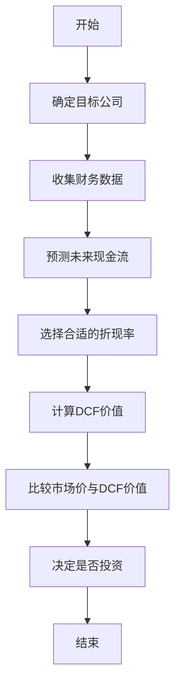
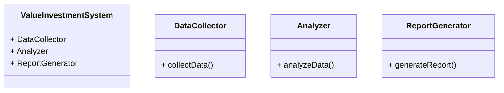
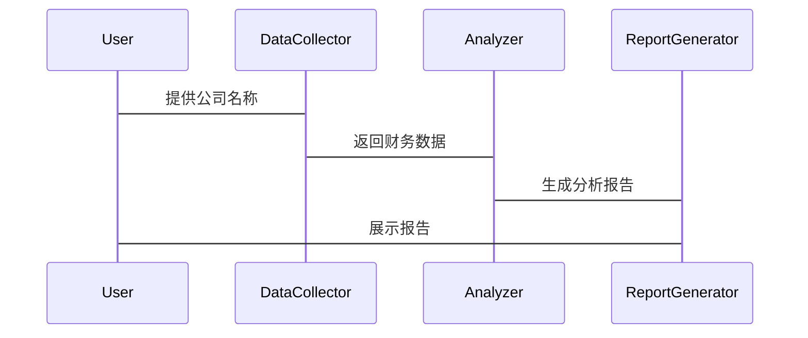

                 


# 价值投资在不同市场环境下的应用

> 关键词：价值投资，市场环境，投资策略，内在价值，DCF模型

> 摘要：本文深入探讨了价值投资在不同市场环境下的应用策略，分析了市场环境对投资决策的影响，并通过实际案例和系统设计，展示了如何在不同市场条件下优化投资组合。

---

## 第1章: 价值投资的概述

### 1.1 价值投资的定义与核心理念

#### 1.1.1 价值投资的定义
价值投资是一种以基本面分析为基础的投资策略，强调以低于内在价值的价格购买优质资产。其核心在于识别市场低估的机会，并长期持有这些资产，直到其价值回归。

#### 1.1.2 价值投资的核心理念
价值投资的核心理念是寻找市场中的“烟蒂股”，即那些被市场忽视或低估的公司。投资者通过深入分析公司的财务状况、行业地位和竞争优势，识别出具有长期增长潜力的公司，并在合理价格下投资。

#### 1.1.3 价值投资与其他投资策略的对比
与其他策略如趋势投资和技术分析不同，价值投资强调对公司内在价值的分析，而非市场的短期波动。这种策略更注重长期稳健的回报，而非短期收益。

### 1.2 价值投资的历史与发展

#### 1.2.1 价值投资的起源
价值投资的起源可以追溯到20世纪初，本杰明·格雷厄姆和戴维·多德是这一理念的奠基人。他们提出，股票的内在价值是其未来现金流的现值，而市场价格往往偏离这一价值。

#### 1.2.2 价值投资的发展历程
随着时间的推移，价值投资发展出了多种流派，如格雷厄姆的保守价值投资和彼得·林奇的成长型价值投资。这些发展使得价值投资更加多样化，适应不同的市场环境。

#### 1.2.3 价值投资在现代投资学中的地位
价值投资作为投资学的重要组成部分，强调安全边际和长期持有。它在学术界和实践中都具有重要地位，被广泛应用于机构投资和个人投资中。

### 1.3 价值投资的哲学基础

#### 1.3.1 价值投资的哲学思想
价值投资的哲学基础是基于“市场先生”的概念，认为市场价格反映了投资者的集体情绪，而非公司的实际价值。投资者应独立于市场情绪，做出理性的决策。

#### 1.3.2 价值投资与人性的关联
人性中的贪婪和恐惧导致市场波动，而价值投资通过分析公司的基本面，帮助投资者克服情绪影响，做出更理性的决策。

#### 1.3.3 价值投资与市场心理的关系
市场心理影响股票价格，但价值投资强调关注企业的内在价值，而非市场的短期波动。通过识别市场心理的偏差，投资者可以在市场低估时买入，在高估时卖出。

---

## 第2章: 价值投资的核心概念与联系

### 2.1 核心概念原理

#### 2.1.1 内在价值的定义与计算
内在价值是基于公司未来现金流的现值，计算公式为：
$$
\text{内在价值} = \sum_{t=1}^{n} \frac{\text{CF}_t}{(1+r)^t}
$$
其中，CF_t为第t年的现金流，r为折现率。

#### 2.1.2 市场价值的波动性分析
市场价值受供需关系、市场情绪和宏观经济因素影响，往往偏离内在价值。价值投资者寻找市场价值低于内在价值的机会。

#### 2.1.3 安全边际的理论基础
安全边际是指买入价格与内在价值的差距，用于缓冲短期波动和计算错误。通过预留安全边际，投资者降低风险，提高投资的可靠性。

### 2.2 核心概念对比表格

#### 表2-1: 内在价值与市场价值对比

| **属性**       | **内在价值**                 | **市场价值**                 |
|-----------------|------------------------------|------------------------------|
| 计算基础         | 公司未来现金流折现           | 市场供需关系                 |
| 时间稳定性       | 长期稳定                     | 短期波动                     |
| 受影响因素       | 公司基本面                   | 市场情绪和宏观经济因素       |

### 2.3 ER实体关系图

```mermaid
erDiagram
    investor {
        id
        name
        investment_amount
    }
    company {
        id
        name
        industry
        revenue
        profit
    }
    investment_analysis {
        id
        investor_id
        company_id
        analysis_date
        value_report
    }
    investor --> investment_analysis
    company --> investment_analysis
```

---

## 第3章: 市场环境对价值投资的影响

### 3.1 不同市场环境下的价值投资策略

#### 3.1.1 牛市环境下的价值投资策略
在牛市中，市场情绪高涨，股票价格可能远高于内在价值。此时，价值投资者应寻找被高估的股票卖出，或暂时退出市场，等待更好的买入机会。

#### 3.1.2 熊市环境下的价值投资策略
熊市中，市场情绪低落，股票价格可能低于内在价值。此时，价值投资者可以积极买入优质资产，利用市场的恐慌获取低估的投资机会。

#### 3.1.3 震荡市环境下的价值投资策略
震荡市中，市场波动较大，股票价格频繁波动。价值投资者应保持耐心，专注于长期基本面分析，避免短期波动的干扰。

### 3.2 市场环境变化的分析方法

#### 3.2.1 市场周期的识别方法
通过分析市场的历史波动和当前趋势，识别市场所处的周期阶段，如牛市、熊市或震荡市。

#### 3.2.2 市场情绪的分析工具
使用情绪指标（如恐慌指数、投资者情绪指数）和市场估值指标（如市盈率、市净率）来判断市场情绪。

#### 3.2.3 市场风险的评估指标
通过波动率、VaR（Value at Risk）等指标评估市场风险，并据此调整投资组合。

### 3.3 应对策略与案例分析

#### 3.3.1 牛市应对策略
案例：2007年美国次贷危机前的牛市中，许多股票被高估，价值投资者选择卖出或持有现金，避免高位被套。

#### 3.3.2 熊市应对策略
案例：2008年全球金融危机期间，巴菲特大量买入优质资产，如美国运通和高盛的股票，利用市场的低估实现长期收益。

#### 3.3.3 震荡市应对策略
案例：2020年新冠疫情导致的市场震荡中，价值投资者选择持有优质股票，并在价格波动中逐步建仓，最终实现收益。

---

## 第4章: 价值投资的评估方法

### 4.1 内在价值的评估模型

#### 4.1.1 DCF模型的原理与应用
DCF（Discounted Cash Flow）模型通过预测公司的未来现金流，并以合理的折现率计算其现值，得出内在价值。

#### 4.1.2 DCF模型的数学公式
$$
\text{DCF Value} = \sum_{t=1}^{n} \frac{\text{CF}_t}{(1+r)^t}
$$
其中，CF_t为第t年的现金流，r为折现率，n为预测期数。

#### 4.1.3 DCF模型的优缺点分析
优点：DCF模型能够准确反映公司未来现金流的现值，是评估内在价值的有效工具。缺点：模型依赖于对未来现金流的准确预测，实际操作中存在较高的主观性和不确定性。

### 4.2 价值评估的流程图



### 4.3 价值评估的数学模型

#### 公式4-1: 现金流折现公式
$$
\text{DCF Value} = \frac{\text{CF}_1}{(1+r)^1} + \frac{\text{CF}_2}{(1+r)^2} + \dots + \frac{\text{CF}_n}{(1+r)^n}
$$

#### 示例
假设某公司未来三年的现金流分别为100万、150万和200万，折现率为10%。计算DCF价值：
$$
\text{DCF Value} = \frac{100}{1.1} + \frac{150}{1.1^2} + \frac{200}{1.1^3} \approx 90.91 + 123.96 + 136.75 \approx 351.62 \text{万元}
$$

---

## 第5章: 系统分析与架构设计方案

### 5.1 价值投资分析系统的构建

#### 5.1.1 系统功能需求分析
系统需具备数据收集、分析、评估和报告生成功能，支持多市场环境下的投资策略分析。

#### 5.1.2 系统功能设计图


#### 5.1.3 系统架构设计图


### 5.2 系统接口设计

#### 5.2.1 数据接口的设计
系统通过API接口获取公司财务数据和市场数据，支持多种数据源的接入。

#### 5.2.2 用户界面的设计
用户友好的界面，提供数据输入、分析结果展示和报告生成功能。

#### 5.2.3 系统交互流程图


---

## 第6章: 项目实战

### 6.1 项目环境的安装与配置

#### 6.1.1 环境需求
安装Python、Pandas、NumPy等工具，配置Jupyter Notebook进行数据分析。

### 6.2 核心代码实现

#### 6.2.1 数据收集与处理
```python
import pandas as pd
import numpy as np

# 假设收集的数据如下：
data = {
    'Year': [2020, 2021, 2022],
    'CashFlow': [100, 150, 200]
}
df = pd.DataFrame(data)
```

#### 6.2.2 DCF模型实现
```python
def calculate_dcf(cash_flows, discount_rate):
    n = len(cash_flows)
    dcf = 0
    for t in range(n):
        dcf += cash_flows[t] / (1 + discount_rate) ** (t + 1)
    return dcf

dcf_value = calculate_dcf(df['CashFlow'], 0.1)
print(f"DCF Value: {dcf_value}")
```

### 6.3 案例分析与解读

#### 6.3.1 实际案例
以某公司为例，假设其未来三年现金流分别为100万、150万和200万，折现率为10%。计算得出DCF价值约为351.62万元，若当前股价为300万元，具有投资价值。

#### 6.3.2 投资决策
根据DCF模型，建议以低于351.62万元的价格买入该公司的股票。

---

## 第7章: 总结与展望

### 7.1 总结
价值投资在不同市场环境下的应用需要投资者具备扎实的基本面分析能力，并能够根据市场环境调整策略。通过DCF模型和系统分析，投资者可以更科学地进行投资决策。

### 7.2 展望
未来，随着人工智能和大数据技术的发展，价值投资的分析将更加精准和高效。投资者可以通过技术手段优化分析过程，提高投资效率和收益。

### 7.3 注意事项
价值投资强调长期持有和安全边际，投资者需具备耐心和纪律性，避免短期波动的干扰。

### 7.4 拓展阅读
推荐阅读《证券分析》（本杰明·格雷厄姆）、《聪明的投资者》（彼得·林奇）等书籍，深入理解价值投资的理论与实践。

---

通过以上结构化的内容，读者可以系统地理解价值投资在不同市场环境下的应用策略，并在实际投资中加以运用。

