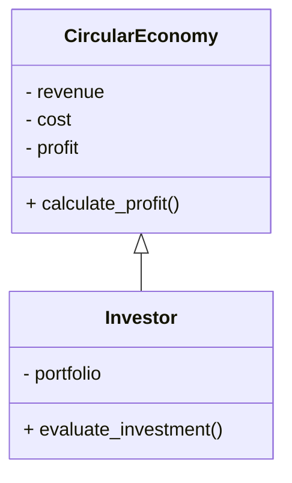
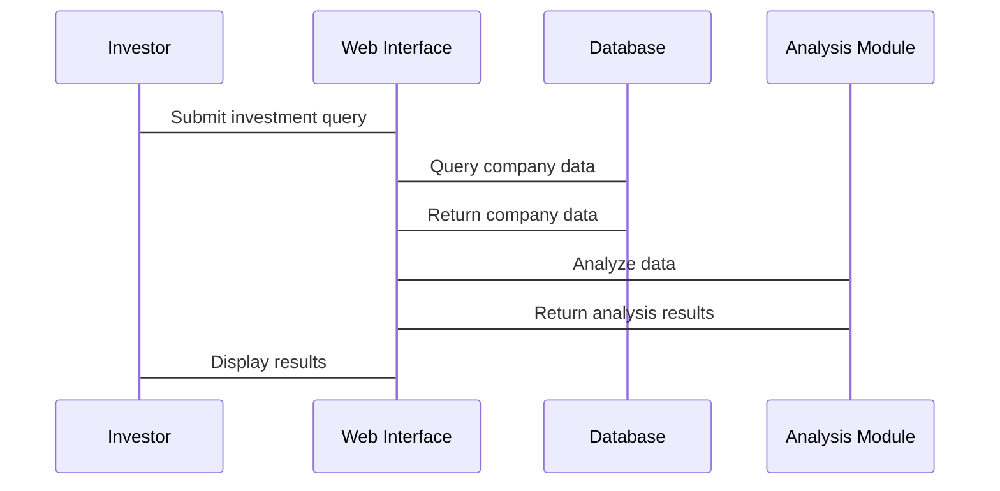

                 


# 价值投资在循环经济中的应用：可持续商业模式的机遇

## 关键词：价值投资，循环经济，可持续商业模式，数学模型，系统架构

## 摘要：  
随着全球资源枯竭和环境问题的加剧，循环经济作为一种可持续发展模式，正受到越来越多的关注。价值投资作为一种长期、稳健的投资策略，也在寻找新的增长点。本文将探讨价值投资在循环经济中的应用，分析循环经济的商业模式，构建数学模型和算法，设计系统架构，并通过实际案例展示如何在循环经济中实现可持续商业模式。本文旨在为投资者和企业提供了理论依据和实践指导，以抓住循环经济中的投资机遇。

---

## 第一部分：价值投资与循环经济的背景

### 第1章：价值投资与循环经济的概述

#### 1.1 价值投资的基本概念

价值投资是一种以企业基本面分析为核心的长期投资策略，其核心在于寻找市场价格低于其内在价值的股票。投资者通过分析企业的财务报表、盈利能力、竞争优势等因素，寻找具有长期增长潜力的企业进行投资。与短期投机不同，价值投资强调长期持有的稳健策略。

**循环经济的定义与特征**  
循环经济是以资源高效利用和循环利用为核心的发展模式，通过减少资源消耗和环境污染，实现经济与环境的协调发展。循环经济强调“减量化、再利用、再循环”原则，将废弃物视为资源，重新纳入生产过程。

**价值投资与循环经济的结合**  
随着环境问题的加剧，循环经济模式逐渐成为企业可持续发展的关键。价值投资者可以将循环经济企业作为投资标的，通过分析其商业模式、资源利用效率和市场前景，寻找具有长期增长潜力的企业。

---

#### 1.2 循环经济的发展背景

**全球资源枯竭与环境问题的加剧**  
随着全球人口的增加和经济的快速发展，资源消耗速度远超地球的自我修复能力。传统线性经济模式导致资源枯竭、环境污染等问题，已经威胁到人类的可持续发展。

**循环经济在可持续发展中的重要性**  
循环经济通过减少资源消耗和废弃物产生，降低对环境的压力，同时为企业创造新的价值增长点。循环经济模式不仅有助于环境保护，还能提高企业的资源利用效率，降低成本，增强竞争力。

**价值投资在循环经济中的潜在机遇**  
循环经济企业通常具有较高的社会责任感和可持续发展潜力。价值投资者可以通过分析这些企业的财务状况、竞争优势和市场前景，找到具有长期增长潜力的投资标的。

---

#### 1.3 价值投资的核心要素

**财务表现与企业价值评估**  
价值投资者关注企业的盈利能力、资产负债状况和现金流情况。在循环经济领域，企业通过资源高效利用和废弃物再利用，往往能够实现更高的利润率和更低的运营成本。

**可持续发展指标与企业社会责任**  
循环经济企业通常注重环境保护和社会责任，这些因素可能影响企业的品牌形象和市场地位。价值投资者将这些因素纳入评估体系，寻找具有长期增长潜力的企业。

**循环经济模式对企业价值的影响**  
循环经济模式可以通过降低资源消耗和废弃物处理成本，提高企业的盈利能力和竞争力。同时，循环经济模式还能增强企业的社会责任感，提升品牌形象，吸引更多的消费者和投资者。

---

## 第二部分：循环经济的商业模式分析

### 第2章：循环经济的商业模式

#### 2.1 循环经济的主要模式

**产品生命周期管理**  
循环经济强调延长产品的生命周期，通过设计可重复使用的产品或模块化设计，降低产品的更换频率。例如，租赁模式是一种典型的循环经济商业模式，企业通过租赁产品获取持续收入，而不是一次性销售产品。

**资源效率优化**  
循环经济通过优化资源的利用效率，减少资源的浪费。例如，企业在生产过程中采用节能技术，降低能源消耗，同时提高生产效率。

**逆向物流与产品回收**  
逆向物流是循环经济的重要组成部分，指将产品或其组成部分从消费者处回收，重新用于生产或其他用途。例如，企业可以建立回收网络，收集废弃的电子产品，提取其中的贵金属进行再利用。

---

#### 2.2 价值投资与循环经济的结合

**循环经济对企业盈利能力的影响**  
循环经济模式可以通过降低资源消耗和废弃物处理成本，提高企业的盈利能力。例如，企业通过回收和再利用原材料，可以降低生产成本，提高利润率。

**可持续商业模式对投资价值的提升**  
可持续商业模式通常具有更高的市场认可度和更强的抗风险能力。例如，循环经济企业可能面临更少的政策风险和环境风险，从而吸引更多的投资者。

**循环经济中的风险与机会评估**  
循环经济模式也存在一定的风险，例如技术风险、市场风险和政策风险。投资者需要全面评估这些风险，并制定相应的风险管理策略。

---

#### 2.3 循环经济中的关键成功因素

**技术创新与成本优化**  
技术创新是循环经济发展的核心驱动力。企业需要不断研发新技术，提高资源利用效率，降低生产成本。

**市场需求与消费者行为变化**  
随着环保意识的增强，消费者越来越倾向于选择环保产品。循环经济企业需要满足消费者的需求，提供符合环保理念的产品和服务。

**政策支持与法规环境**  
政府政策和法规对循环经济的发展具有重要影响。例如，政府可以通过税收优惠、补贴和法规限制，推动企业采用循环经济模式。

---

## 第三部分：价值投资中的数学模型与算法

### 第3章：循环经济中的数学模型

#### 3.1 循环经济的收益与成本分析

**收益模型：资源节约与成本降低的数学表达**  
企业通过循环经济模式可以节约资源和降低生产成本。例如，企业通过回收材料，可以降低原材料成本。收益模型可以表示为：

$$ \text{收益} = \text{销售收入} - \text{成本} $$

其中，成本包括生产成本、物流成本和回收成本等。

**成本模型：循环经济模式下的初始投资与运营成本**  
循环经济模式需要一定的初始投资，例如建立回收网络和开发新产品。成本模型可以表示为：

$$ \text{总成本} = \text{初始投资} + \text{运营成本} $$

---

#### 3.2 循环经济中的风险评估

**风险因素分析：市场波动、政策变化、技术风险**  
循环经济模式面临多种风险，例如市场波动可能导致需求下降，政策变化可能导致法规调整，技术风险可能导致项目失败。

**风险评估模型：VaR（在险价值）与CVaR（条件在险价值）**  
VaR（Value at Risk）是衡量投资风险的重要指标，表示在一定置信水平下，投资可能遭受的最大损失。CVaR（Conditional Value at Risk）是VaR的扩展，表示在VaR水平下的平均损失。

$$ \text{VaR} = \text{损失的分位数} $$

$$ \text{CVaR} = \text{平均损失} $$

---

#### 3.3 价值投资的数学公式

**股票内在价值公式**  
股票的内在价值是其未来现金流的现值。价值投资者通常使用股利折扣模型（DDM）或自由现金流模型（DCF）来评估股票的内在价值。

$$ V = \frac{D}{k} $$

其中，\( D \) 是股利，\( k \) 是折现率。

**股东权益价值公式**  
股东权益价值是企业未来现金流的现值减去债务价值。

$$ E = V - D $$

---

### 第4章：算法原理与流程图

#### 4.1 循环经济中的算法流程

**数据收集与清洗**  
首先，收集循环经济企业的相关数据，包括财务数据、市场数据和环境数据。然后，对数据进行清洗，去除无效数据和异常值。

**模型构建与训练**  
使用机器学习算法，例如线性回归、决策树和随机森林，构建预测模型。模型用于预测企业的盈利能力、市场前景和环境影响。

**结果分析与优化**  
通过分析模型结果，识别具有高投资价值的企业。根据模型预测结果，优化投资组合，降低风险。

---

#### 4.2 使用Python实现的算法代码

```python
import pandas as pd
from sklearn.linear_model import LinearRegression

# 数据预处理
data = pd.read_csv('circular_economy_data.csv')
data = data.dropna()

# 模型训练
model = LinearRegression()
model.fit(data[['revenue', 'cost']], data['profit'])

# 预测结果
predictions = model.predict(data[['revenue', 'cost']])
print(predictions)
```

---

## 第四部分：系统分析与架构设计方案

### 第4章：系统架构与项目实战

#### 4.1 系统功能设计

**领域模型（Mermaid 类图）**  


**系统架构设计（Mermaid 架构图）**  
```mermaid
container Circular Economy System {
    [Database]
    [Web Interface]
    [Analysis Module]
}
```

**系统交互（Mermaid 序列图）**  


---

## 第五部分：项目实战

### 第5章：循环经济价值投资实战

#### 5.1 环境安装

**安装Python和相关库**  
安装Python和必要的库，例如NumPy、Pandas、Scikit-learn和Matplotlib。

```bash
pip install numpy pandas scikit-learn matplotlib
```

---

#### 5.2 系统核心实现源代码

```python
import numpy as np
import pandas as pd
from sklearn.linear_model import LinearRegression
import matplotlib.pyplot as plt

# 数据加载与处理
data = pd.read_csv('circular_economy_data.csv')
data = data.dropna()

# 模型训练
model = LinearRegression()
model.fit(data[['revenue', 'cost']], data['profit'])

# 可视化
plt.scatter(data['revenue'], data['profit'])
plt.plot(data['revenue'], model.predict(data[['revenue', 'cost']]), color='red')
plt.xlabel('Revenue')
plt.ylabel('Profit')
plt.show()
```

---

## 第六部分：总结与展望

### 第6章：总结与展望

**总结**  
价值投资在循环经济中的应用为企业提供了新的增长点，同时也为投资者提供了长期稳健的投资机会。本文通过分析循环经济的商业模式，构建了数学模型和算法，并设计了系统架构，展示了如何在循环经济中实现可持续商业模式。

**未来展望**  
随着技术的进步和环境问题的加剧，循环经济将成为未来经济发展的重要方向。价值投资者需要持续关注循环经济领域的创新和发展，抓住新的投资机遇。同时，企业也需要不断优化其商业模式，提高资源利用效率，增强竞争力。

---

## 参考文献  
1. 格雷厄姆，本杰明. 《证券分析》. 北京: 北京大学出版社, 2004.  
2. 《循环经济促进法》，中华人民共和国国家发展和改革委员会，2008年。  
3. 王小平. 《循环经济与企业可持续发展》. 北京: 经济管理出版社, 2010.  

---

通过本文的分析和探讨，读者可以深入了解价值投资在循环经济中的应用，掌握循环经济的商业模式和数学模型，为投资决策提供理论依据和实践指导。

