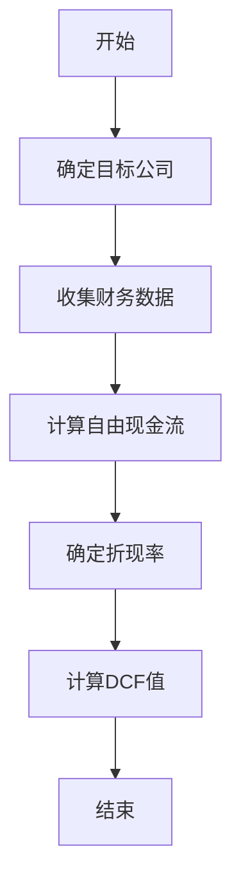
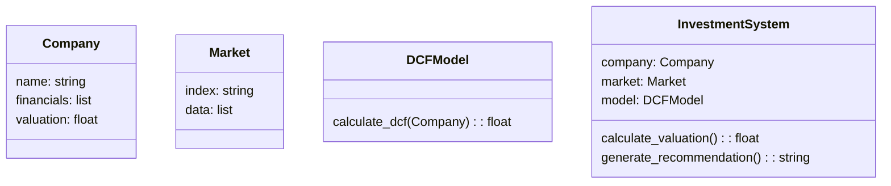
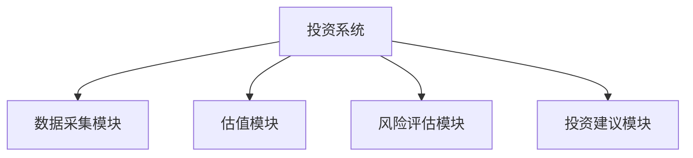
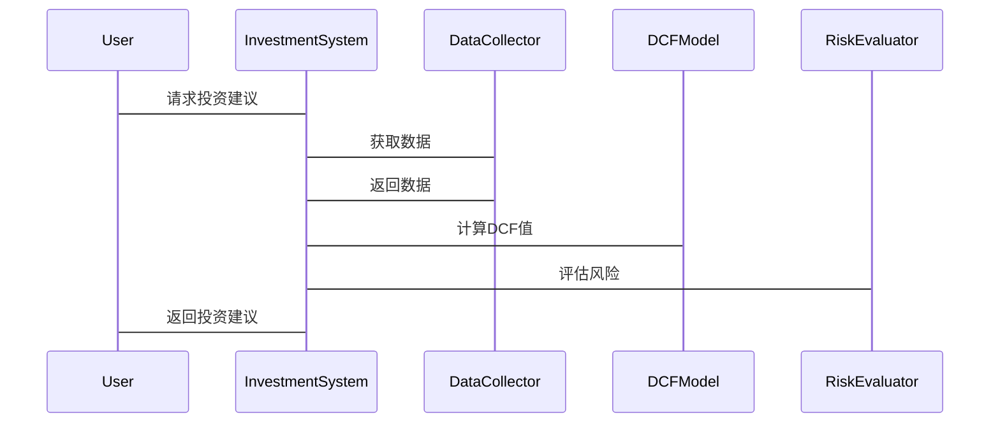

                 


# 价值投资在新兴市场的应用

## 关键词：价值投资、新兴市场、DCF模型、系统架构、投资策略

## 摘要：  
本文探讨了价值投资在新兴市场的应用，从理论基础到实际操作进行了全面分析。通过数学模型、算法实现和系统设计，展示了如何在新兴市场中应用价值投资策略。文章结合实际案例，详细讲解了DCF模型的原理和实现，并通过系统架构设计，展示了如何构建一个高效的投资分析系统。最后，提出了最佳实践和未来研究方向。

---

# 第1章: 价值投资的基本概念与原理

## 1.1 价值投资的定义与核心理念  
### 1.1.1 价值投资的定义  
价值投资是一种基于对公司内在价值的评估，以低于其内在价值的价格买入并长期持有的投资策略。其核心在于寻找市场低估的公司，通过长期持有实现收益。

### 1.1.2 价值投资的核心理念  
- **安全边际**：买入价格低于内在价值，确保有一定的安全空间。  
- **长期视角**：关注公司的长期盈利能力，而非短期市场波动。  
- **逆向思维**：在市场恐慌时寻找低估机会，在市场疯狂时保持冷静。  

### 1.1.3 价值投资与新兴市场的结合  
新兴市场通常具有高增长潜力，但波动性较大。价值投资在新兴市场的应用需要结合市场特点，寻找具有竞争优势的公司，同时考虑区域风险和政策影响。

---

## 1.2 新兴市场的特点与挑战  
### 1.2.1 新兴市场的定义与范围  
新兴市场是指那些经济快速增长、市场机制逐步完善、但尚未完全成熟的国家或地区，如中国、印度、东南亚等。

### 1.2.2 新兴市场的特点  
- **高增长潜力**：新兴市场通常具有较高的经济增长率。  
- **市场波动性大**：由于市场机制不完善，价格波动剧烈。  
- **信息不透明**：部分公司信息披露不规范，增加了投资难度。  

### 1.2.3 新兴市场投资的主要挑战  
- **政策风险**：新兴市场国家的政策变化可能对市场产生重大影响。  
- **流动性风险**：部分新兴市场国家的流动性不足，可能影响资产变现。  
- **估值偏差**：新兴市场中部分公司可能被高估或低估，增加了判断难度。

---

## 1.3 价值投资在新兴市场的必要性  
### 1.3.1 新兴市场中的投资机会  
新兴市场中存在许多具有竞争优势的公司，尤其是在科技、消费、制造等领域，这些公司可能尚未被市场充分发现。

### 1.3.2 价值投资在新兴市场的独特优势  
- **挖掘低估机会**：新兴市场中部分公司可能因市场波动或信息不对称被低估。  
- **长期增长潜力**：新兴市场整体增长较快，价值投资可以通过长期持有分享增长红利。  

### 1.3.3 价值投资与新兴市场结合的可行性  
价值投资的核心理念与新兴市场的特点可以有机结合，通过深入研究和长期持有，可以在新兴市场中获得超额收益。

---

## 1.4 本章小结  
本章从价值投资的基本概念出发，分析了新兴市场的特点和挑战，并探讨了价值投资在新兴市场的必要性和可行性。价值投资在新兴市场的应用需要结合市场特点，注重长期视角和安全边际。

---

# 第2章: 价值投资的核心概念与联系  

## 2.1 价值投资的核心概念  
### 2.1.1 股票的内在价值  
内在价值是公司未来现金流的现值，是价值投资的核心。  

### 2.1.2 市场价值与内在价值的关系  
市场价值围绕内在价值波动，当市场价值低于内在价值时，投资机会出现。

### 2.1.3 价值投资的核心要素  
- **现金流**：公司未来产生的现金流是内在价值的基础。  
- **折现率**：用于将未来现金流折现为现值的关键参数。  

---

## 2.2 新兴市场的特殊性与价值投资的适应性  
### 2.2.1 新兴市场的特殊性  
- **市场波动大**：新兴市场的价格波动通常高于成熟市场。  
- **行业集中度低**：新兴市场中可能存在大量小公司，竞争格局不清晰。  

### 2.2.2 价值投资在新兴市场的适应性  
- **行业选择**：在新兴市场中，优先选择具有竞争优势和高增长潜力的行业。  
- **公司筛选**：注重公司的财务健康、管理团队和竞争优势。  

### 2.2.3 新兴市场与成熟市场的对比  
| 特性 | 新兴市场 | 成熟市场 |  
|------|----------|----------|  
| 市场波动 | 高 | 低 |  
| 信息透明度 | 低 | 高 |  
| 投资机会 | 多 | 少 |  

---

## 2.3 价值投资与其他投资策略的对比  
### 2.3.1 价值投资与成长投资的对比  
- **目标**：价值投资追求低估，成长投资追求高增长。  
- **风险**：价值投资风险较低，成长投资风险较高。  

### 2.3.2 价值投资与趋势投资的对比  
- **目标**：价值投资基于基本面，趋势投资基于价格走势。  
- **策略**：价值投资注重长期，趋势投资注重短期。  

### 2.3.3 价值投资与套利投资的对比  
- **目标**：价值投资寻找低估，套利投资寻找价格差。  
- **风险**：价值投资风险较低，套利投资风险较高。  

---

## 2.4 本章小结  
本章分析了价值投资的核心概念，并探讨了其在新兴市场的适应性。通过对比不同投资策略，明确了价值投资在新兴市场的独特优势和适用场景。

---

# 第3章: 价值投资的算法原理与数学模型  

## 3.1 价值投资的核心算法  
### 3.1.1 股票估值的核心算法  
股票的内在价值可以通过现金流贴现模型（DCF）进行评估。

### 3.1.2 现金流贴现模型（DCF模型）  
DCF模型是价值投资中常用的估值方法，公式如下：  
$$DCF = \sum_{t=1}^{n} \frac{CF_t}{(1 + r)^t} + \frac{TV}{(1 + r)^n}$$  

其中，$CF_t$ 是第 $t$ 年的现金流，$r$ 是折现率，$TV$ 是终值。

### 3.1.3 市盈率与市净率的比较分析  
- **市盈率（P/E）**：股价与每股收益的比值，适用于盈利稳定的公司。  
- **市净率（P/B）**：股价与每股净资产的比值，适用于资产密集型公司。  

---

## 3.2 DCF模型的数学公式与流程图  
### 3.2.1 DCF模型的数学公式  
$$DCF = \sum_{t=1}^{n} \frac{CF_t}{(1 + r)^t} + \frac{TV}{(1 + r)^n}$$  

### 3.2.2 DCF模型的流程图  


---

## 3.3 算法实现与代码示例  
### 3.3.1 DCF模型的Python实现  
```python
def calculate_dcf(cash_flows, discount_rate, terminal_value):
    dcf = 0
    for t in range(len(cash_flows)):
        dcf += cash_flows[t] / (1 + discount_rate) ** t
    dcf += terminal_value / (1 + discount_rate) ** len(cash_flows)
    return dcf

# 示例
cash_flows = [100, 150, 200]
discount_rate = 0.1
terminal_value = 500
dcf_value = calculate_dcf(cash_flows, discount_rate, terminal_value)
print("DCF 值为:", dcf_value)
```

---

## 3.4 本章小结  
本章详细讲解了价值投资的核心算法，特别是DCF模型的数学公式和实现方法。通过代码示例，展示了如何在实际操作中应用这些算法。

---

# 第4章: 系统分析与架构设计  

## 4.1 系统分析与功能设计  
### 4.1.1 系统目标  
构建一个基于价值投资策略的投资分析系统，用于新兴市场的投资决策支持。

### 4.1.2 系统功能设计  
- **数据采集**：收集目标公司的财务数据和市场数据。  
- **估值模型**：应用DCF模型进行股票估值。  
- **风险评估**：分析投资风险，包括政策风险和市场风险。  
- **投资建议**：基于估值结果，生成投资建议。  

### 4.1.3 系统功能设计的类图  


---

## 4.2 系统架构设计  
### 4.2.1 系统架构图  


### 4.2.2 系统接口设计  
- **数据接口**：与财务数据供应商对接，获取公司数据。  
- **用户接口**：提供直观的界面，展示估值结果和投资建议。  

### 4.2.3 系统交互序列图  


---

## 4.3 本章小结  
本章通过系统分析与架构设计，展示了如何构建一个基于价值投资策略的投资分析系统。系统设计考虑了数据采集、估值模型和风险评估等关键模块。

---

# 第5章: 项目实战与案例分析  

## 5.1 项目实战  
### 5.1.1 项目目标  
在新兴市场中，选择一家公司进行价值投资分析，验证DCF模型的有效性。

### 5.1.2 数据收集与处理  
收集目标公司的财务数据和行业数据，清洗和整理数据。

### 5.1.3 模型构建与验证  
应用DCF模型进行估值，与市场价格进行对比，验证模型的有效性。

---

## 5.2 案例分析  
### 5.2.1 案例背景  
以某新兴市场中的科技公司为例，分析其价值投资机会。

### 5.2.2 数据分析  
- **财务数据**：收入、利润、现金流等。  
- **市场数据**：股价、市盈率、市净率等。  

### 5.2.3 投资决策  
基于DCF模型的估值结果，判断是否买入、持有或卖出。

---

## 5.3 代码实现与结果分析  
### 5.3.1 代码实现  
```python
# 示例代码：计算DCF值
cash_flows = [100, 150, 200]
discount_rate = 0.1
terminal_value = 500
dcf_value = calculate_dcf(cash_flows, discount_rate, terminal_value)
print("DCF 值为:", dcf_value)
```

### 5.3.2 结果分析  
通过DCF模型计算出的目标股价与市场价格进行对比，判断是否存在低估或高估。

---

## 5.4 本章小结  
本章通过实际案例分析，展示了如何在新兴市场中应用价值投资策略。通过项目实战，验证了DCF模型的有效性，为投资者提供了实操指导。

---

# 第6章: 最佳实践与小结  

## 6.1 投资策略建议  
### 6.1.1 长期视角  
价值投资强调长期持有，避免短期市场波动的干扰。  

### 6.1.2 风险控制  
在新兴市场中，需注重风险控制，分散投资，避免过度集中。  

### 6.1.3 持续学习  
市场环境不断变化，投资者需持续学习，更新知识和技能。

---

## 6.2 价值投资在新兴市场的未来展望  
### 6.2.1 动态调整模型  
随着市场的变化，需不断优化DCF模型，适应新兴市场的特殊性。  

### 6.2.2 多因子模型  
结合多个因子，如价值因子、成长因子等，构建更全面的估值模型。  

### 6.2.3 技术与数据驱动  
利用大数据和人工智能技术，提高投资决策的效率和准确性。

---

## 6.3 本章小结  
本章总结了价值投资在新兴市场的应用经验，提出了最佳实践建议，并展望了未来的研究方向。

---

# 结语  

价值投资在新兴市场的应用具有广阔前景，但需要投资者具备扎实的理论基础和实战经验。通过本文的分析，读者可以更好地理解价值投资的核心理念，并在实际操作中灵活运用。未来，随着技术的进步和市场的变化，价值投资在新兴市场的应用将更加多样化和高效化。

--- 

通过以上结构和内容的详细规划，我们可以逐步展开每个章节的具体内容，确保文章逻辑清晰、内容详实、技术深度足够，为读者提供一篇高质量的技术博客文章。

