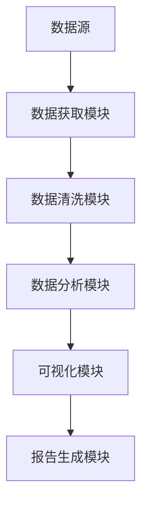

                 


# 《价值投资在新兴市场的机遇与挑战：以BRICS为例》

---

## 关键词：
- 价值投资
- 新兴市场
- BRICS
- 经济分析
- 价值评估
- 量化投资
- 机器学习

---

## 摘要：
本文从价值投资的核心理念出发，结合BRICS国家（巴西、俄罗斯、印度、中国、南非）的经济特点和市场环境，系统分析了新兴市场中的投资机遇与挑战。通过数学模型和算法原理的深入探讨，结合实际案例分析和系统架构设计，为投资者提供了在新兴市场中进行价值投资的理论依据和实践指导。本文还提出了基于机器学习的价值投资策略，为投资者在复杂多变的市场环境中提供了新的思路。

---

## 第1章：新兴市场与价值投资的概述

### 1.1 新兴市场的定义与特点
#### 1.1.1 新兴市场的定义
新兴市场是指那些经济快速发展、市场机制逐步完善但尚未完全成熟的国家和地区。这些国家通常具有较高的经济增长潜力，但同时也伴随着较高的市场波动性和不确定性。

#### 1.1.2 BRICS国家的经济特点
- **巴西**：作为南半球最大的经济体，巴西的经济以农业、工业和服务业为主，资源优势显著，但经济结构相对单一。
- **俄罗斯**：俄罗斯的经济高度依赖能源行业，天然气和石油出口占据其GDP的重要部分，但也面临产业结构单一和地缘政治风险。
- **印度**：印度是全球增长最快的经济体之一，服务业和信息技术产业发达，人口红利为其经济发展提供了强劲动力。
- **中国**：作为全球第二大经济体，中国经济的多样性、规模和增长潜力使其成为新兴市场的核心。
- **南非**：南非的经济结构相对多元化，但面临着较高的失业率和贫富差距问题。

#### 1.1.3 新兴市场的机遇与挑战
- **机遇**：高增长潜力、丰富的资源储备、庞大的消费市场。
- **挑战**：市场波动性大、政策不确定性、基础设施不完善、金融监管相对薄弱。

### 1.2 价值投资的核心概念
#### 1.2.1 价值投资的定义
价值投资是一种投资策略，强调以低于公平价值的价格买入优质资产。其核心在于寻找市场中被低估的投资标的，通过长期持有实现收益。

#### 1.2.2 价值投资的基本原理
- **安全边际**：买入价格低于内在价值，以降低投资风险。
- **长期视角**：关注企业的长期盈利能力，而非短期市场波动。
- **基本面分析**：通过对企业财务状况、行业地位和管理团队的分析，评估其内在价值。

#### 1.2.3 价值投资与新兴市场的结合
在新兴市场中，价值投资需要结合当地的经济特点和市场环境。例如，在中国经济中，可以关注低市盈率的制造业企业或具有强大竞争优势的科技公司。

---

## 第2章：BRICS国家的经济与市场分析

### 2.1 BRICS国家的经济概况
#### 2.1.1 巴西的经济特点
巴西的经济以农业和能源行业为主，但近年来，其经济结构逐渐向多元化方向发展，服务业和信息技术产业的重要性不断提升。

#### 2.1.2 俄罗斯的经济特点
俄罗斯的经济高度依赖能源出口，尤其是天然气和石油。地缘政治风险和国际油价波动对俄罗斯经济影响显著。

#### 2.1.3 印度的经济特点
印度的经济以信息技术和服务业为主，消费市场庞大，人口红利为其经济发展提供了强大动力。

#### 2.1.4 中国的经济特点
中国经济的多样性、规模和增长潜力使其成为全球最大的新兴市场。中国制造业的全球竞争力和科技行业的快速发展为其价值投资提供了丰富的机会。

#### 2.1.5 南非的经济特点
南非的经济结构相对多元化，但面临着较高的失业率和贫富差距问题，经济增速相对缓慢。

### 2.2 BRICS国家的市场特点
#### 2.2.1 市场波动性分析
新兴市场的股票价格波动性较高，受到政策变化、国际油价波动和地缘政治风险的影响较大。

#### 2.2.2 市场流动性分析
与发达国家市场相比，新兴市场的流动性较低，尤其是在市场波动加剧时，投资者可能面临流动性不足的风险。

#### 2.2.3 市场结构分析
新兴市场的金融体系通常不够完善，金融监管相对薄弱，投资者可能面临更多的信息不对称和市场操纵风险。

---

## 第3章：价值投资在新兴市场的核心策略

### 3.1 价值投资的基本策略
#### 3.1.1 低市盈率策略
通过寻找市盈率低于行业平均水平的公司，寻找被市场低估的投资标的。

#### 3.1.2 低市净率策略
通过比较市净率与行业平均水平，寻找资产质量较高且估值合理的公司。

#### 3.1.3 高股息率策略
关注那些股息率较高且具备稳定分红能力的公司，尤其是在新兴市场中，高股息率股票可能具有较高的吸引力。

### 3.2 新兴市场中的价值投资策略
#### 3.2.1 行业选择策略
- **防守性行业**：如公用事业、消费品行业，这些行业的需求相对稳定，受经济周期波动的影响较小。
- **周期性行业**：如能源、材料行业，这些行业的表现与经济周期密切相关，但在市场底部可能具有较高的投资价值。

#### 3.2.2 公司基本面分析
- **财务状况**：关注企业的盈利能力、资产负债情况和现金流状况。
- **行业地位**：选择具有竞争优势和行业龙头地位的公司。
- **管理团队**：关注公司的管理团队的稳定性和战略规划能力。

#### 3.2.3 市场周期分析
在市场周期的不同阶段，价值投资策略应有所不同。例如，在市场低迷时期，可以关注那些估值严重低于内在价值的公司；而在市场繁荣时期，可以寻找那些估值合理且具有持续增长潜力的公司。

---

## 第4章：价值投资的数学模型与算法原理

### 4.1 价值投资的数学模型
#### 4.1.1 市盈率模型
市盈率（P/E）= 股价 / 每股净利润

#### 4.1.2 市净率模型
市净率（P/B）= 股价 / 每股净资产

#### 4.1.3 股息率模型
股息率 = 每股股息 / 股价

### 4.2 价值投资的算法原理
#### 4.2.1 基于机器学习的价值投资策略
- **数据采集与处理**：收集BRICS国家的市场数据，包括股价、财务指标、行业指数等。
- **特征工程**：提取关键特征，如市盈率、市净率、股息率、ROE（净资产收益率）等。
- **模型训练**：使用机器学习算法（如随机森林、支持向量机）进行分类或回归分析，预测股票的内在价值。
- **模型优化**：通过交叉验证和网格搜索优化模型参数，提升预测准确性。

#### 4.2.2 算法实现与优化
```python
import pandas as pd
from sklearn.ensemble import RandomForestRegressor
from sklearn.model_selection import train_test_split
from sklearn.metrics import mean_absolute_error

# 数据加载与预处理
df = pd.read_csv('BRICS_stocks.csv')
X = df[['PE', 'PB', 'ROE']]
y = df['True Value']

# 数据划分
X_train, X_test, y_train, y_test = train_test_split(X, y, test_size=0.2, random_state=42)

# 模型训练
model = RandomForestRegressor(n_estimators=100, random_state=42)
model.fit(X_train, y_train)

# 模型预测
y_pred = model.predict(X_test)

# 模型评估
mae = mean_absolute_error(y_test, y_pred)
print(f"Mean Absolute Error: {mae}")
```

---

## 第5章：系统架构与项目实战

### 5.1 价值投资分析系统的架构设计
#### 5.1.1 系统功能设计
- **数据获取模块**：从金融数据源获取BRICS国家的股票数据。
- **数据清洗模块**：对数据进行预处理，去除缺失值和异常值。
- **数据分析模块**：基于数学模型和机器学习算法，评估股票的内在价值。
- **可视化模块**：生成图表和报告，帮助投资者直观理解分析结果。

#### 5.1.2 系统架构设计


### 5.2 项目实战
#### 5.2.1 环境安装
安装必要的Python库，如Pandas、Scikit-learn、Matplotlib等。

#### 5.2.2 核心实现源代码
```python
import pandas as pd
import numpy as np
import matplotlib.pyplot as plt
from sklearn.ensemble import RandomForestRegressor
from sklearn.model_selection import train_test_split
from sklearn.metrics import mean_absolute_error

# 数据加载与预处理
df = pd.read_csv('BRICS_stocks.csv')
df = df.dropna()
df = df[df['PE'] < 50]  # 去除市盈率过高的数据点

# 特征选择
features = ['PE', 'PB', 'ROE']
target = 'True Value'

# 数据划分
X = df[features]
y = df[target]
X_train, X_test, y_train, y_test = train_test_split(X, y, test_size=0.2, random_state=42)

# 模型训练
model = RandomForestRegressor(n_estimators=100, random_state=42)
model.fit(X_train, y_train)

# 预测与评估
y_pred = model.predict(X_test)
mae = mean_absolute_error(y_test, y_pred)
print(f"Mean Absolute Error: {mae}")

# 可视化
importances = model.feature_importances_
indices = np.argsort(importances)[::-1]

plt.figure()
plt.title('Feature Importances')
plt.bar(range(X.shape[1]), importances[indices], align='center')
plt.xticks(range(X.shape[1]), features[indices], rotation=45)
plt.show()
```

#### 5.2.3 实际案例分析
以中国某制造业企业为例，分析其市盈率、市净率和ROE等指标，判断其是否符合价值投资的条件。

#### 5.2.4 项目小结
通过实际案例分析，验证了基于机器学习的价值投资策略在新兴市场中的有效性，并提出了优化方向。

---

## 第6章：总结与展望

### 6.1 总结
本文系统分析了价值投资在新兴市场中的机遇与挑战，结合BRICS国家的经济特点和市场环境，提出了适合新兴市场的价值投资策略。通过数学模型和算法原理的深入探讨，结合实际案例分析和系统架构设计，为投资者提供了在新兴市场中进行价值投资的理论依据和实践指导。

### 6.2 展望
未来，随着大数据和人工智能技术的不断发展，价值投资在新兴市场中的应用将更加广泛和深入。建议投资者结合市场环境和企业基本面，灵活调整投资策略，同时注重风险管理，以实现长期稳定的收益。

---

## 关注与建议
- **风险管理**：新兴市场的波动性较大，投资者需要注重风险管理，合理配置资产。
- **长期视角**：价值投资需要耐心和信心，关注企业的长期盈利能力，而非短期市场波动。
- **持续学习**：新兴市场的环境复杂多变，投资者需要不断学习和适应市场变化。

---

## 推荐阅读
- 《价值投资实战策略》
- 《机器学习在金融中的应用》
- 《新兴市场投资指南》

