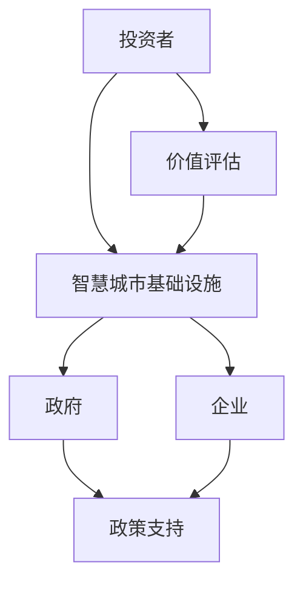
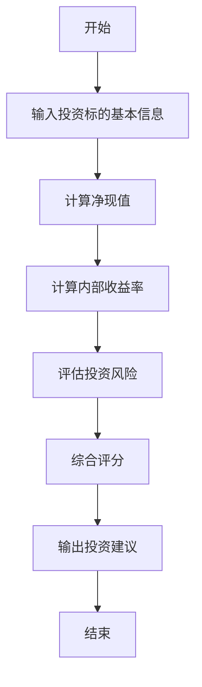
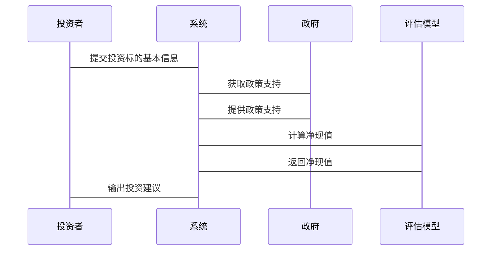

                 


# 价值投资在智慧城市发展中的应用：基础设施投资新思路

> **关键词**：价值投资、智慧城市、基础设施、投资模型、算法原理、系统架构

> **摘要**：  
> 本文探讨了价值投资在智慧城市建设中的应用，重点分析了基础设施投资的新思路。通过背景分析、核心概念、算法模型、系统架构设计和项目实战，本文提出了基于价值投资的智慧城市基础设施投资策略，为投资者提供了科学的决策依据。文章结合数学模型和实际案例，深入剖析了价值投资在智慧城市建设中的优势和实施路径。

---

## 第1章: 智慧城市的发展背景与价值投资概述

### 1.1 智慧城市的发展背景

#### 1.1.1 智慧城市的定义与特点
智慧城市建设是全球城市化进程的重要趋势，通过信息技术与城市基础设施的深度融合，实现城市资源的高效利用和管理。智慧城市具有以下几个特点：
- **智能化**：利用大数据、人工智能等技术实现城市管理的智能化。
- **协同化**：城市各系统之间高度协同，形成有机整体。
- **可持续性**：注重资源节约和环境友好，推动绿色城市发展。
- **数据驱动**：以数据为核心，构建城市决策的科学依据。

#### 1.1.2 智慧城市发展的驱动力
智慧城市建设的驱动力主要来自以下几个方面：
- **技术进步**：大数据、云计算、物联网等技术的快速发展为智慧城市提供了技术支撑。
- **政策支持**：各国政府纷纷出台政策，推动智慧城市建设。
- **社会需求**：城市化进程加快，人们对高效、便捷的城市服务需求日益增长。

#### 1.1.3 智慧城市与传统城市的主要区别
传统城市主要依赖人工管理，而智慧城市则通过数字化手段实现城市管理的自动化、智能化。以下是智慧城市与传统城市的区别：

| **方面** | **传统城市** | **智慧城市** |
|----------|--------------|--------------|
| 管理方式 | 人工为主      | 数字化、智能化 |
| 资源利用 | 低效          | 高效、可持续 |
| 服务方式 | 离散化        | 协调化、一体化 |

### 1.2 价值投资的基本概念

#### 1.2.1 价值投资的定义
价值投资是一种长期投资策略，强调以低于内在价值的价格买入优质资产。其核心理念是寻找被市场低估的投资标的，通过长期持有实现超额收益。

#### 1.2.2 价值投资的核心理念
- **安全边际**：买入价格低于内在价值，确保投资的安全性。
- **长期视角**：关注企业的长期价值，而非短期波动。
- **精选个股**：通过基本面分析，选择具有竞争优势的企业。

#### 1.2.3 价值投资与传统投资的区别
以下是价值投资与其他投资策略的主要区别：

| **方面** | **价值投资**             | **其他投资策略** |
|----------|--------------------------|------------------|
| 投资理念 | 以低于内在价值的价格买入 | 以技术分析为主   |
| 持股时间 | 长期持有                | 短期交易         |
| 分析方法 | 基本面分析              | 技术分析         |

### 1.3 智慧城市基础设施投资的背景

#### 1.3.1 智慧城市基础设施的定义
智慧城市基础设施是指支撑智慧城市运行的各类硬件设施，包括但不限于智能交通系统、智慧电网、智慧水务、智慧通信网络等。

#### 1.3.2 智慧城市基础设施投资的现状
当前，智慧城市建设如火如荼，但基础设施投资面临以下挑战：
- **资金不足**：智慧城市建设需要大量资金，但部分城市财政压力较大。
- **投资风险**：基础设施项目周期长，回报不确定。
- **技术复杂性**：基础设施涉及多个技术领域，投资决策复杂。

#### 1.3.3 智慧城市基础设施投资的意义
- **促进城市发展**：通过基础设施投资，提升城市管理水平和居民生活质量。
- **推动技术创新**：智慧基础设施建设推动技术创新，促进产业升级。
- **实现可持续发展**：通过高效利用资源，减少浪费，实现绿色城市发展。

---

## 第2章: 价值投资与智慧城市基础设施的关系

### 2.1 价值投资在智慧城市中的核心要素

#### 2.1.1 投资标的的选择标准
价值投资在智慧城市建设中的核心要素包括：
- **项目可行性**：项目是否符合智慧城市发展的总体规划。
- **财务可行性**：项目的投资回报率是否合理。
- **技术可行性**：项目是否具备技术实施条件。
- **政策支持**：是否获得政府政策支持。

#### 2.1.2 投资标的价值评估方法
价值评估是价值投资的核心，主要包括以下几个步骤：
1. **确定评估指标**：如净现值（NPV）、内部收益率（IRR）等。
2. **数据收集与分析**：收集项目相关的财务数据和市场数据。
3. **模型构建**：建立数学模型，计算项目的价值。
4. **评估结果**：根据模型计算结果，判断项目是否值得投资。

#### 2.1.3 投资标的风险评估模型
风险评估是价值投资的重要组成部分，常用的模型包括：
- **VaR模型**：计算潜在损失的最大值。
- **蒙特卡洛模拟**：通过模拟不同情景，评估项目风险。

### 2.2 价值投资与智慧城市基础设施的结合

#### 2.2.1 智慧城市基础设施的价值属性
智慧城市基础设施的价值主要体现在以下几个方面：
- **社会效益**：提升城市管理效率，改善居民生活质量。
- **经济效益**：通过高效运营，降低成本，创造收益。
- **技术优势**：采用先进技术，提升城市竞争力。

#### 2.2.2 价值投资在智慧城市基础设施中的应用场景
价值投资在智慧城市建设中的应用场景包括：
- **项目融资**：通过价值评估，吸引投资者。
- **风险管理**：通过风险评估模型，降低投资风险。
- **决策支持**：为政府和企业决策提供数据支持。

#### 2.2.3 价值投资与智慧城市基础设施的协同发展
价值投资与智慧城市基础设施的协同发展主要体现在以下几个方面：
- **技术创新**：价值投资推动技术创新，提升基础设施水平。
- **资源整合**：通过价值投资，整合资源，实现协同发展。
- **可持续发展**：价值投资促进绿色城市发展，实现可持续发展。

### 2.3 价值投资与智慧城市基础设施的关系图谱

#### 2.3.1 实体关系图（Mermaid流程图）


#### 2.3.2 核心概念对比表格
以下是价值投资与智慧城市基础设施的关系对比：

| **方面** | **价值投资**             | **智慧城市基础设施**          |
|----------|--------------------------|-----------------------------|
| 核心目标 | 实现长期超额收益         | 支撑智慧城市建设             |
| 实施方式 | 选择优质标的进行投资     | 建设智能化基础设施           |
| 关系     | 投资者提供资金支持       | 基础设施为投资者创造价值     |

---

## 第3章: 价值投资的数学模型与算法

### 3.1 价值投资的核心算法

#### 3.1.1 投资价值评估模型
价值评估模型是价值投资的核心工具，常用的模型包括：
- **DCF模型**：现金流折现模型，用于评估企业的内在价值。
- **PE模型**：市盈率模型，用于评估股票的估值。

#### 3.1.2 投资回报率计算公式
投资回报率（ROI）的计算公式为：
$$ ROI = \frac{\text{净收益}}{\text{投资成本}} \times 100\% $$

#### 3.1.3 投资风险评估模型
风险评估模型常用的有：
- **标准差模型**：用于评估资产的风险。
- **Beta系数模型**：用于评估资产相对于市场的波动性。

### 3.2 投资价值评估的数学推导

#### 3.2.1 净现值（NPV）公式
$$ NPV = \sum_{t=1}^{n} \frac{CF_t}{(1 + r)^t} $$
其中，$CF_t$ 是第 $t$ 年的现金流，$r$ 是折现率。

#### 3.2.2 内部收益率（IRR）公式
$$ IRR = r \text{ 满足 } \sum_{t=1}^{n} \frac{CF_t}{(1 + r)^t} = 0 $$

#### 3.2.3 投资评分模型
$$ \text{评分} = \alpha \times \text{收益} + \beta \times \text{风险} + \gamma \times \text{流动性} $$

### 3.3 投资评估算法的流程图（Mermaid）


---

## 第4章: 智慧城市基础设施投资的系统分析与架构设计

### 4.1 智慧城市基础设施投资系统架构

#### 4.1.1 系统功能设计（领域模型Mermaid类图）
```mermaid
classDiagram
class 投资者 {
    - 资金
    - 风险偏好
    - 投资目标
}
class 基础设施 {
    - 项目
    - 财务数据
    - 技术参数
}
class 政府 {
    - 政策
    - 资金支持
}
investor -> infrastructure: 提供资金
infrastructure -> government: 获取政策支持
```

#### 4.1.2 系统架构设计（Mermaid架构图）


#### 4.1.3 系统接口设计
- **投资者接口**：提供投资标的基本信息。
- **政府接口**：提供政策支持和资金支持。
- **系统接口**：提供价值评估和风险评估服务。

#### 4.1.4 系统交互流程（Mermaid序列图）


---

## 第5章: 价值投资在智慧城市基础设施中的项目实战

### 5.1 智慧交通项目实战

#### 5.1.1 项目环境配置
- **技术环境**：Python 3.8、Jupyter Notebook
- **数据来源**：公开的交通数据和政府政策文件

#### 5.1.2 项目核心实现源代码
```python
import numpy as np
import pandas as pd

def calculate_npv(cash_flows, discount_rate):
    return np.npv(discount_rate, *cash_flows)

def calculate_irr(cash_flows):
    return np.irr(cash_flows)

# 示例数据
cash_flows = [-100, 30, 30, 30, 30]
discount_rate = 0.08

npv = calculate_npv(cash_flows, discount_rate)
 irr = calculate_irr(cash_flows)

print(f"NPV: {npv}")
print(f"IRR: {irr}")
```

#### 5.1.3 项目总结
通过智慧交通项目实战，我们验证了价值投资在智慧城市基础设施中的应用。通过净现值和内部收益率的计算，我们可以科学地评估项目的投资价值，为投资者提供决策依据。

---

## 第6章: 最佳实践与小结

### 6.1 小结
价值投资在智慧城市基础设施中的应用，不仅能够帮助投资者实现长期收益，还能够推动智慧城市建设的可持续发展。通过科学的价值评估模型和风险评估模型，我们可以更好地选择投资标的，降低投资风险。

### 6.2 注意事项
- **数据质量**：价值评估模型依赖于高质量的数据，数据的准确性和完整性至关重要。
- **模型局限性**：价值评估模型有一定的局限性，需要结合实际情况进行调整。
- **政策风险**：智慧城市基础设施投资需要考虑政策变化带来的影响。

### 6.3 拓展阅读
- **书籍推荐**：《价值投资实战策略》、《智慧城市：理念与实践》
- **技术文档**：Net现值与内部收益率的计算方法
- **在线课程**：价值投资与智慧城市建设

---

## 结语

通过本文的分析，我们深入探讨了价值投资在智慧城市基础设施投资中的应用。从理论到实践，从模型到代码，我们为投资者和城市建设者提供了科学的决策依据。未来，随着技术的进步和政策的支持，价值投资在智慧城市中的应用将更加广泛，为城市的可持续发展注入新的动力。

