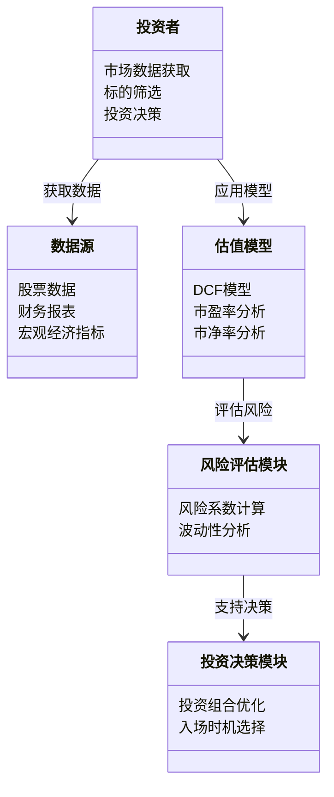

                 


# 价值投资在波动市场中的优势

---

## 关键词：
- 价值投资、波动市场、内在价值、安全边际、DCF模型、风险管理、长期投资

---

## 摘要：
价值投资是一种以长期视角为基础的投资策略，通过寻找市场价格低于内在价值的标的物进行投资。在波动市场中，价值投资因其对基本面的关注和对长期价值的坚持，展现出了显著的优势。本文将从价值投资的核心理念、数学模型、系统架构、实战案例等多个维度，深入分析其在波动市场中的独特优势，并结合技术与投资的结合，为投资者提供实用的指导。

---

## 第一部分: 价值投资的背景与核心概念

---

### 第1章: 价值投资的起源与核心理念

#### 1.1 价值投资的起源
- **1.1.1 投资学说的演变**
  - 从古典投资学说（如股利增长模型）到现代投资组合理论（MPT）的发展历程。
  - 价值投资的起源：本杰明·格雷厄姆与戴维·多德的贡献。
- **1.1.2 价值投资的定义与核心要素**
  - 价值投资：以低于内在价值的价格买入优质资产，长期持有。
  - 核心要素：内在价值、安全边际、长期视角。
- **1.1.3 价值投资与波动市场的关系**
  - 波动市场的定义与特性：短期价格波动 vs. 长期价值。
  - 价值投资在波动市场中的定位：逆向投资。

#### 1.2 波动市场的特性
- **1.2.1 市场波动的成因**
  - 市场情绪的波动：贪婪与恐惧的周期性。
  - 宏观经济因素：利率、通货膨胀、政策变化。
  - 企业基本面变化：盈利波动、行业周期。
- **1.2.2 市场周期性分析**
  - 牛市、熊市、震荡市的定义与特征。
  - 周期性波动对投资策略的影响。
- **1.2.3 投资者心理与市场波动的关系**
  - 投资者情绪对市场波动的放大效应。
  - 价值投资者的心理优势：冷静、理性、耐心。

#### 1.3 价值投资的核心理念
- **1.3.1 内在价值与市场价值的对比**
  - 内在价值的定义：资产的真实价值，独立于市场价格。
  - 市场价值的波动性：短期价格受情绪影响，长期趋近于内在价值。
- **1.3.2 安全边际的概念与应用**
  - 安全边际：内在价值与市场价格的差额，作为投资的安全垫。
  - 安全边际的计算公式：
    $$ \text{安全边际} = \text{内在价值} - \text{市场价格} $$
  - 安全边际率：
    $$ \text{安全边际率} = \frac{\text{安全边际}}{\text{市场价格}} $$
- **1.3.3 价值投资与成长投资的对比**
  - 核心目标对比：
    - 价值投资：寻找低估资产，注重安全边际。
    - 成长投资：寻找高增长企业，注重未来潜力。
  - 优缺点对比：
    - 价值投资：防御性强，波动市场中稳定性高。
    - 成长投资：进攻性强，波动市场中风险更大。

---

## 第二部分: 价值投资的核心概念与分析框架

---

### 第2章: 价值投资的核心概念

#### 2.1 内在价值的计算方法
- **2.1.1 现金流折现模型（DCF）的原理**
  - DCF模型的核心思想：将未来现金流折现为现值，作为内在价值的估计。
  - DCF模型的步骤：
    1. 预测未来现金流。
    2. 确定合适的折现率。
    3. 计算现值，得出内在价值。
  - DCF模型的数学公式：
    $$ \text{内在价值} = \sum_{t=1}^{n} \frac{CF_t}{(1 + r)^t} + \frac{TV}{(1 + r)^n} $$
    其中，$CF_t$ 是第 t 年的现金流，$r$ 是折现率，$TV$ 是终值。
  - DCF模型的优缺点：
    - 优点：能够准确反映资产的内在价值。
    - 缺点：预测现金流和折现率的难度较大。

- **2.1.2 市盈率与市净率的对比分析**
  - 市盈率（P/E）：
    $$ \text{市盈率} = \frac{\text{股价}}{\text{每股净利润}} $$
  - 市净率（P/B）：
    $$ \text{市净率} = \frac{\text{股价}}{\text{每股净资产}} $$
  - 对比分析：
    - 市盈率适合盈利稳定的公司，市净率适合资产密集型行业。
    - 在波动市场中，市净率可能更可靠。

- **2.1.3 股东权益收益率（ROE）的计算与应用**
  - ROE的计算公式：
    $$ \text{ROE} = \frac{\text{净利润}}{\text{股东权益}} $$
  - ROE的意义：衡量公司使用股东资金的效率。
  - 在波动市场中，高ROE公司更具防御性。

#### 2.2 财务报表分析基础
- **2.2.1 利润表的关键指标分析**
  - 收入、成本、利润、毛利率、净利率。
  - 利润表的趋势分析：判断企业盈利能力的变化。
- **2.2.2 资产负债表的核心要素解读**
  - 资产、负债、所有者权益。
  - 重点关注：应收账款、存货、流动资产与流动负债。
- **2.2.3 现金流量表的解读与现金流健康度评估**
  - 经营活动、投资活动、筹资活动的现金流。
  - 现金流健康度：经营活动现金流为正，投资活动现金流合理。

#### 2.3 安全边际的数学模型
- **2.3.1 安全边际的计算公式**
  $$ \text{安全边际} = \text{内在价值} - \text{市场价格} $$
- **2.3.2 安全边际的相对指标分析**
  $$ \text{安全边际率} = \frac{\text{安全边际}}{\text{市场价格}} $$
- **2.3.3 安全边际的应用**
  - 安全边际越高，投资风险越小。
  - 在波动市场中，安全边际是投资决策的重要依据。

#### 2.4 价值投资与成长投资的对比分析
- **2.4.1 核心目标的对比**
  - 价值投资：寻找低估资产，注重安全边际。
  - 成长投资：寻找高增长企业，注重未来潜力。
- **2.4.2 风险与收益的对比**
  - 价值投资：收益稳定，风险较低。
  - 成长投资：收益高，风险高。

---

## 第三部分: 价值投资的系统分析与架构设计

---

### 第3章: 价值投资的系统分析与架构设计

#### 3.1 问题场景介绍
- 投资者在波动市场中如何选择投资标的？
- 如何通过技术手段辅助价值投资决策？

#### 3.2 系统功能设计（领域模型）


#### 3.3 系统架构设计


#### 3.4 系统接口设计
- 数据接口：
  - 获取股票数据（如Yahoo Finance API）。
  - 获取财务报表数据（如Alpha Vantage API）。
- 估值接口：
  - DCF模型计算接口。
  - 市盈率/市净率计算接口。

#### 3.5 系统交互设计
```mermaid
sequenceDiagram
    投资者 -> 数据采集模块: 请求数据
    数据采集模块 -> 数据源: 获取股票数据
    数据源 --> 数据采集模块: 返回股票数据
    投资者 -> 估值模型: 应用DCF模型
    估值模型 --> 风险评估模块: 评估风险
    风险评估模块 --> 投资决策模块: 支持决策
    投资者 <- 投资决策模块: 提供投资建议
```

---

## 第四部分: 价值投资的实战与技术应用

---

### 第4章: 价值投资的实战案例

#### 4.1 案例背景
- 某制造企业的基本面分析：
  - 财务数据：净利润稳步增长，ROE较高。
  - 行业地位：行业龙头，竞争优势明显。
  - 市场价格：当前股价低于DCF模型计算的内在价值。

#### 4.2 数据采集与分析
- 使用Python代码获取股票数据：
```python
import yfinance as yf
import pandas as pd

# 下载股票数据
stock_data = yf.download('AAPL', start='2022-01-01', end='2023-12-31')
# 计算DCF模型
def calculate_intrinsic_value(...):
    # DCF模型实现
    pass
```

#### 4.3 安全边际计算
- 计算安全边际：
  $$ \text{安全边际} = \text{DCF模型计算的内在价值} - \text{当前股价} $$
- 安全边际率：
  $$ \text{安全边际率} = \frac{\text{安全边际}}{\text{当前股价}} $$

#### 4.4 投资决策
- 根据安全边际率，决定是否投资。
- 如果安全边际率较高，建议买入并长期持有。

---

## 第五部分: 总结与展望

---

### 第5章: 总结与展望

#### 5.1 本章总结
- 价值投资的核心优势在于其长期视角和对内在价值的关注。
- 在波动市场中，价值投资通过安全边际和基本面分析，能够有效规避短期风险。
- 技术的进步为价值投资提供了强大的工具支持，如数据获取、模型计算和风险评估。

#### 5.2 展望
- 未来，价值投资将更加依赖于技术手段，如人工智能和大数据分析。
- 随着市场的波动加剧，价值投资的优势将进一步显现。
- 投资者需要不断学习和适应市场变化，结合技术与投资知识，做出更明智的决策。

---

## 关键词：
- 价值投资、波动市场、内在价值、安全边际、DCF模型、风险管理、长期投资

---

## 总结：
通过本文的详细分析，我们可以看到，价值投资在波动市场中具有显著的优势。从理论到实践，从分析到决策，价值投资的每一步都需要投资者具备扎实的分析能力和坚定的长期视角。未来，随着技术的进步，价值投资将更加高效和精准，为投资者创造更多的价值。

