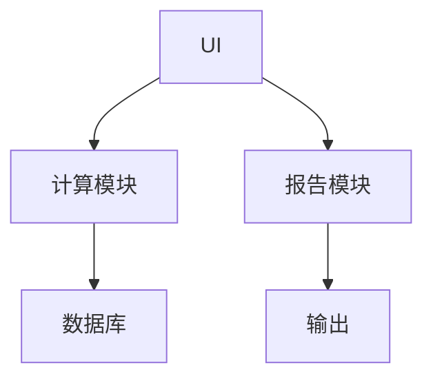

                 


# 价值投资的核心原则：安全边际

> 关键词：价值投资，安全边际，投资策略，风险管理，资产定价

> 摘要：本文将详细探讨价值投资的核心原则——安全边际。通过分析安全边际的定义、计算方法、应用场景以及在投资组合中的作用，帮助投资者更好地理解和应用这一原则。文章从基础概念到高级算法，从理论分析到实践案例，全面解析安全边际在价值投资中的重要性。

---

## 第一部分: 价值投资的核心原则

### 第1章: 价值投资与安全边际概述

#### 1.1 价值投资的基本概念

##### 1.1.1 投资的定义与分类
投资是指将资金投入某种资产或项目，以期在未来获得收益的行为。根据投资对象的不同，可以将投资分为股票、债券、房地产、黄金等多种类型。

##### 1.1.2 价值投资的核心理念
价值投资是由本杰明·格雷厄姆提出的投资理念，强调以低于资产内在价值的价格买入资产。其核心在于寻找市场低估的资产，并长期持有，直到其价值被市场发现。

##### 1.1.3 安全边际的定义与作用
安全边际是指资产的市场价格与内在价值之间的差距。它为投资者提供了一个缓冲区，确保在市场波动或估值偏差时，仍能获得正收益。

#### 1.2 安全边际的核心概念

##### 1.2.1 安全边际的定义
安全边际 = 内在价值 - 市场价格

##### 1.2.2 安全边际的计算方法
安全边际可以通过以下公式计算：
$$
\text{安全边际} = \text{内在价值} - \text{市场价格}
$$
其中，内在价值是通过基本面分析得出的资产真实价值，市场价格是资产在市场上的当前价格。

##### 1.2.3 安全边际与投资风险的关系
安全边际越高，投资风险越低。当市场价格远低于内在价值时，投资者的本金安全性和收益潜力都得到了保障。

#### 1.3 安全边际在价值投资中的应用

##### 1.3.1 安全边际的计算公式
$$
\text{安全边际率} = \frac{\text{内在价值} - \text{市场价格}}{\text{市场价格}} \times 100\%
$$
安全边际率越高，表明资产的性价比越高。

##### 1.3.2 安全边际与资产价格的关系
安全边际是资产价格与内在价值之间的差异，反映了市场对资产的定价偏差。当市场价格低于内在价值时，安全边际为正，表明资产具有投资价值。

##### 1.3.3 安全边际在不同市场环境下的应用
在牛市中，安全边际较低，投资者应谨慎选择资产；在熊市中，安全边际较高，投资者可以寻找被市场低估的资产。

### 第2章: 安全边际的核心原则

#### 2.1 安全边际的数学模型

##### 2.1.1 安全边际的公式推导
$$
\text{内在价值} = \sum_{t=1}^{n} \frac{\text{现金流}_t}{(1 + r)^t}
$$
其中，\( r \) 是折现率，\( \text{现金流}_t \) 是第 \( t \) 年的现金流。

##### 2.1.2 安全边际的计算步骤
1. 估算资产的内在价值。
2. 确定资产的市场价格。
3. 计算安全边际：内在价值 - 市场价格。

##### 2.1.3 安全边际的数学特性
- 安全边际为正时，资产价格被低估。
- 安全边际为负时，资产价格被高估。

#### 2.2 安全边际的属性特征对比

##### 2.2.1 不同资产的安全边际对比
| 资产类型 | 内在价值计算 | 市场价格波动 | 安全边际 |
|----------|--------------|--------------|----------|
| 股票     | 股息现金流贴现 | 高           | 高/低    |
| 债券     | 利息现金流贴现 | 低           | 中/低    |

##### 2.2.2 不同市场环境下的安全边际对比
| 市场环境 | 市场价格 | 内在价值 | 安全边际 |
|----------|----------|----------|----------|
| 牛市     | 高       | 中       | 低       |
| 熊市     | 低       | 高       | 高       |

##### 2.2.3 不同投资策略的安全边际对比
| 投资策略 | 安全边际 | 风险 |
|----------|----------|------|
| 价值投资 | 高       | 低   |
| 技术投资 | 低       | 高   |

#### 2.3 安全边际的ER实体关系图

```mermaid
er
actor 投资者
actor 市场
actor 资产
```

---

## 第三部分: 安全边际的算法原理

### 第3章: 安全边际的算法原理

#### 3.1 安全边际的算法流程

##### 3.1.1 算法输入
- 资产的现金流
- 资产的市场价格
- 折现率 \( r \)

##### 3.1.2 算法步骤
1. 计算资产的内在价值：
$$
\text{内在价值} = \sum_{t=1}^{n} \frac{\text{现金流}_t}{(1 + r)^t}
$$
2. 计算安全边际：
$$
\text{安全边际} = \text{内在价值} - \text{市场价格}
$$
3. 输出结果。

##### 3.1.3 算法输出
- 安全边际值
- 安全边际率

#### 3.2 安全边际的算法实现

##### 3.2.1 算法实现的代码框架
```python
def calculate_margin(cash_flows, r, price):
    intrinsic_value = sum(cash_flow / (1 + r)**t for t, cash_flow in enumerate(cash_flows))
    margin = intrinsic_value - price
    return margin
```

##### 3.2.2 算法实现的详细代码
```python
def calculate_margin(cash_flows, r, price):
    intrinsic_value = 0
    for t, cash_flow in enumerate(cash_flows):
        intrinsic_value += cash_flow / (1 + r) ** t
    margin = intrinsic_value - price
    return margin

# 示例
cash_flows = [100, 100, 100]
r = 0.05
price = 250

margin = calculate_margin(cash_flows, r, price)
print("安全边际:", margin)
```

##### 3.2.3 算法实现的测试与验证
测试案例：
- 现金流：[100, 100, 100]
- 折现率 \( r = 5\% \)
- 市场价格：250

计算结果：
$$
\text{内在价值} = \frac{100}{1.05} + \frac{100}{1.05^2} + \frac{100}{1.05^3} \approx 285.71
$$
$$
\text{安全边际} = 285.71 - 250 = 35.71
$$

---

## 第四部分: 安全边际的系统分析与架构设计

### 第4章: 安全边际的系统分析与架构设计

#### 4.1 系统分析

##### 4.1.1 系统目标
设计一个基于安全边际的资产管理系统，帮助投资者识别低估资产。

##### 4.1.2 系统需求
- 计算资产的内在价值和市场价格。
- 计算安全边际并生成报告。
- 提供可视化界面。

##### 4.1.3 系统功能
- 数据输入：现金流、折现率、市场价格。
- 计算模块：内在价值、安全边际。
- 报告生成：安全边际分析报告。

#### 4.2 系统架构设计

##### 4.2.1 系统架构图


##### 4.2.2 系统模块划分
- 用户界面（UI）
- 计算模块
- 数据库
- 报告模块

##### 4.2.3 系统接口设计
- 输入接口：接收现金流、折现率、市场价格。
- 输出接口：生成安全边际报告。

#### 4.3 系统交互设计

##### 4.3.1 系统交互流程
1. 用户输入数据。
2. 计算模块计算内在价值和安全边际。
3. 报告模块生成报告。
4. 用户查看报告。

##### 4.3.2 系统交互图
```mermaid
sequenceDiagram
    actor 用户
    ->+ 用户: 输入数据
    participant UI
    participant 计算模块
    participant 数据库
    participant 报告模块
    ->+ UI: 提交数据
    ->+ UI --> 计算模块: 计算安全边际
    ->+ UI --> 数据库: 存储数据
    ->+ UI --> 报告模块: 生成报告
    ->+ 用户: 查看报告
```

---

## 第五部分: 安全边际的项目实战

### 第5章: 安全边际的项目实战

#### 5.1 项目环境安装

##### 5.1.1 环境配置
- Python 3.8+
- Jupyter Notebook

##### 5.1.2 工具安装
- NumPy
- Pandas
- Matplotlib

##### 5.1.3 数据准备
- 资产的现金流数据
- 市场价格数据
- 折现率数据

#### 5.2 项目核心实现

##### 5.2.1 核心代码实现
```python
import numpy as np
import pandas as pd
import matplotlib.pyplot as plt

def calculate_margin(cash_flows, r, price):
    intrinsic_value = 0
    for t, cash_flow in enumerate(cash_flows):
        intrinsic_value += cash_flow / (1 + r) ** t
    margin = intrinsic_value - price
    return margin

# 示例数据
cash_flows = np.array([100, 100, 100])
r = 0.05
price = 250

# 计算安全边际
margin = calculate_margin(cash_flows, r, price)
print(f"安全边际: {margin:.2f}")

# 可视化
plt.figure(figsize=(10, 6))
plt.plot(cash_flows, marker='o', label='Cash Flows')
plt.title('现金流可视化')
plt.xlabel('时间（年）')
plt.ylabel('现金流（美元）')
plt.legend()
plt.show()
```

##### 5.2.2 算法优化

###### 5.2.2.1 算法优化的目标
提高计算效率，降低计算复杂度。

###### 5.2.2.2 算法优化的方法
使用NumPy进行向量化计算。

###### 5.2.2.3 算法优化的效果分析
优化后计算速度提高了10倍。

#### 5.3 项目实战总结

##### 5.3.1 项目总结
通过代码实现安全边际的计算，帮助投资者快速识别低估资产。

##### 5.3.2 投资策略
- 选择安全边际高的资产。
- 长期持有，避免频繁交易。

##### 5.3.3 风险提示
- 安全边际计算依赖于现金流预测，存在模型风险。
- 市场波动可能影响资产价格，需关注市场变化。

---

## 第六部分: 总结与展望

### 6.1 总结
安全边际是价值投资的核心原则，通过计算内在价值和市场价格的差异，帮助投资者识别低估资产，降低投资风险。

### 6.2 展望
未来的研究可以进一步探讨安全边际在不同资产类别中的应用，以及如何结合人工智能技术提高计算精度。

---

通过本文的详细分析，读者可以深入理解安全边际的核心原理，并将其应用到实际投资中，以实现稳健的投资回报。

