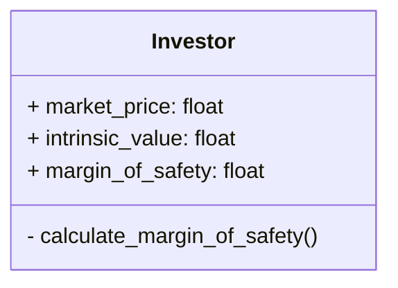
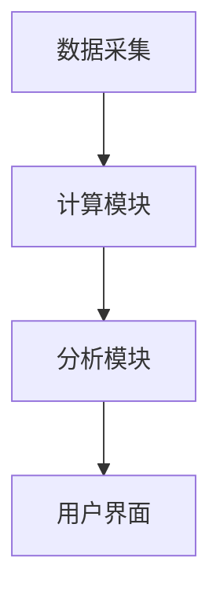
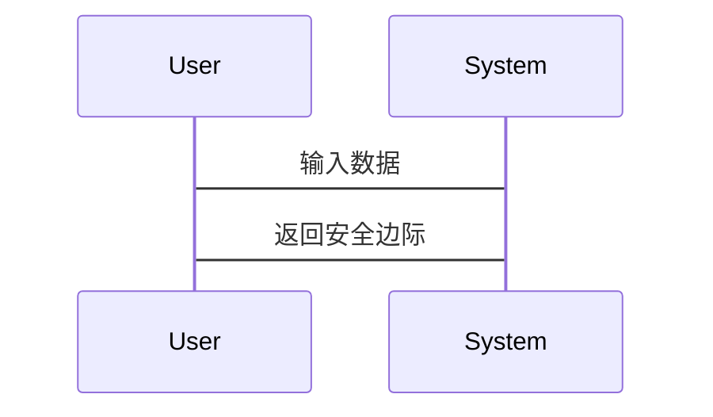

                 


# 价值投资的核心原则：安全边际

> 关键词：价值投资, 安全边际, 投资策略, 投资风险, 股票分析

> 摘要：价值投资是一种以基本面分析为基础的投资策略，其核心原则是通过寻找具有安全边际的标的物，实现长期稳定的收益。本文将从价值投资的背景、安全边际的定义与计算、算法实现、系统设计以及项目实战等多个方面，详细分析安全边际在价值投资中的核心地位与实际应用。

---

# 第1章: 价值投资的背景与核心理念

## 1.1 价值投资的起源与发展

### 1.1.1 价值投资的起源
价值投资是一种投资策略，起源于20世纪初。本杰明·格雷厄姆（Benjamin Graham）是价值投资的奠基人。他在1924年与戴维·多德（David Dodd）共同出版了《证券分析》一书，首次系统地阐述了价值投资的理念。

### 1.1.2 价值投资的发展历程
在20世纪30年代的经济大萧条期间，格雷厄姆的理论得到了实践验证。他的学生沃伦·巴菲特（Warren Buffett）继承并发展了这一理论，使其成为现代投资学的重要流派之一。

### 1.1.3 价值投资的核心理念
价值投资的核心理念是：市场价格与内在价值之间的差异为安全边际提供保障。投资者应通过深入分析企业的基本面，寻找市场价格低于内在价值的投资标的。

---

## 1.2 安全边际的定义与重要性

### 1.2.1 安全边际的定义
安全边际是指投资标的的市场价格与内在价值之间的差距。这个差距越大，投资的风险越小，收益的确定性越高。

### 1.2.2 安全边际的重要性
安全边际是价值投资的核心原则。它通过降低投资风险，提高了投资的可持续性和稳定性。在市场波动中，安全边际能够为投资者提供缓冲空间，避免因价格波动导致的损失。

### 1.2.3 安全边际与投资风险的关系
安全边际越大，投资风险越小。通过建立合理的安全边际，投资者可以在市场波动中保持冷静，避免因短期价格波动而做出错误决策。

---

## 1.3 价值投资与安全边际的核心要素

### 1.3.1 价值投资的核心要素
1. **内在价值**：通过基本面分析，计算出企业的真实价值。
2. **市场价格**：市场的交易价格，受市场情绪和外部因素影响。
3. **安全边际**：内在价值与市场价格之间的差距。

### 1.3.2 安全边际的核心要素
1. **内在价值计算**：通过财务指标（如市盈率、市净率、股息率等）评估企业的内在价值。
2. **市场价格波动**：分析市场价格的历史波动性和未来趋势。
3. **安全边际宽度**：确定市场价格与内在价值之间的合理差距。

### 1.3.3 价值投资与安全边际的关系
安全边际是价值投资的核心原则。通过建立合理的安全边际，投资者可以在市场波动中实现长期稳定的收益。

---

## 1.4 本章小结
本章介绍了价值投资的起源与发展，重点阐述了安全边际的定义与重要性，并分析了其与投资风险的关系。通过安全边际，投资者可以在市场波动中保持冷静，避免因短期价格波动导致的损失。

---

# 第2章: 安全边际的核心概念与原理

## 2.1 安全边际的数学模型与公式

### 2.1.1 安全边际的计算公式
安全边际（Margin of Safety）的计算公式为：

$$\text{安全边际} = \text{内在价值} - \text{市场价格}$$

### 2.1.2 安全边际的数学模型
内在价值的计算模型可以表示为：

$$\text{内在价值} = \frac{\text{股息}}{\text{贴现率}}$$

其中，贴现率反映了投资者对风险的偏好。

### 2.1.3 安全边际的公式推导
假设某企业股票的市场价格为 $P$，内在价值为 $V$，则安全边际为：

$$\text{安全边际} = V - P$$

如果 $V > P$，则该股票具有投资价值。

---

## 2.2 安全边际的属性特征对比

### 2.2.1 安全边际与其它投资概念的对比
| 概念       | 定义                                       | 与安全边际的关系                 |
|------------|------------------------------------------|----------------------------------|
| 市盈率     | 市场价格与每股收益的比值                 | 安全边际的核心指标之一           |
| 市净率     | 市场价格与每股净资产的比值               | 安全边际的核心指标之一           |
| 股息率     | 每股股息与市场价格的比值                 | 安全边际的核心指标之一           |

### 2.2.2 安全边际的特征分析
1. **可量化**：可以通过数学公式计算。
2. **动态性**：随着市场价格和内在价值的变化而变化。
3. **风险控制**：通过建立安全边际，降低投资风险。

### 2.2.3 安全边际的属性对比表格
| 属性       | 特征                         |
|------------|------------------------------|
| 计算方式   | 数学公式计算                 |
| 应用领域   | 价值投资                     |
| 变化因素   | 市场价格、内在价值变化         |

---

## 2.3 安全边际的ER实体关系图

```mermaid
erDiagram
    investorinvests<-->"投资"-->stock_market
    stock_market<-->"交易"-->stock_price
    stock_price<-->"计算"-->intrinsic_value
    intrinsic_value<-->"比较"-->margin_ofSafety
```

---

## 2.4 本章小结
本章通过数学模型和公式，详细阐述了安全边际的核心概念与计算方法。通过对安全边际的属性特征分析和ER实体关系图的绘制，进一步明确了其在价值投资中的重要作用。

---

# 第3章: 安全边际的算法原理与实现

## 3.1 安全边际的算法原理

### 3.1.1 安全边际算法的概述
安全边际算法的核心是通过计算内在价值与市场价格的差值，判断投资标的是否具有安全边际。

### 3.1.2 安全边际算法的实现步骤
1. 计算内在价值。
2. 获取市场价格。
3. 计算安全边际。
4. 判断是否具有投资价值。

### 3.1.3 安全边际算法的流程图

```mermaid
graph TD
    A[开始] -> B[计算内在价值]
    B -> C[获取市场价格]
    C -> D[计算安全边际]
    D -> E[判断是否具有投资价值]
    E -> F[结束]
```

---

## 3.2 安全边际算法的Python实现

### 3.2.1 环境安装与配置
```bash
pip install numpy pandas matplotlib
```

### 3.2.2 核心代码实现
```python
import numpy as np
import pandas as pd

def calculate_margin_of_safety(intrinsic_value, market_price):
    return intrinsic_value - market_price

# 示例数据
intrinsic_values = np.array([100, 150, 200])
market_prices = np.array([80, 120, 180])

# 计算安全边际
margin_of_safety = calculate_margin_of_safety(intrinsic_values, market_prices)

# 输出结果
print("安全边际:", margin_of_safety)
```

### 3.2.3 代码的功能解读与分析
上述代码通过Python实现了安全边际的计算。`calculate_margin_of_safety`函数接收内在价值和市场价格作为输入，返回安全边际值。通过示例数据，我们可以看到，当内在价值大于市场价格时，安全边际为正，投资标的具有投资价值。

---

## 3.3 安全边际算法的数学模型与公式

### 3.3.1 数学模型的建立
内在价值的计算公式为：

$$\text{内在价值} = \frac{\text{股息}}{\text{贴现率}}$$

安全边际的计算公式为：

$$\text{安全边际} = \text{内在价值} - \text{市场价格}$$

### 3.3.2 公式的详细推导
假设某企业的股息为 $D$，贴现率为 $r$，市场价格为 $P$，则内在价值为：

$$\text{内在价值} = \frac{D}{r}$$

因此，安全边际为：

$$\text{安全边际} = \frac{D}{r} - P$$

### 3.3.3 公式的实际应用
以某股票为例，假设股息为 $2$，贴现率为 $0.05$，市场价格为 $35$，则内在价值为：

$$\text{内在价值} = \frac{2}{0.05} = 40$$

安全边际为：

$$\text{安全边际} = 40 - 35 = 5$$

---

## 3.4 本章小结
本章通过Python代码和数学公式，详细阐述了安全边际的算法原理与实现。通过对安全边际的计算，投资者可以快速判断投资标的是否具有安全边际。

---

# 第4章: 安全边际的系统分析与架构设计

## 4.1 问题场景介绍

### 4.1.1 投资决策中的问题场景
在投资决策中，投资者需要通过基本面分析，寻找具有安全边际的投资标的。然而，市场价格波动和内在价值计算的复杂性，使得投资决策面临较大的挑战。

### 4.1.2 安全边际在投资中的应用
通过建立安全边际模型，投资者可以量化投资风险，优化投资组合。

### 4.1.3 系统设计的目标与范围
系统设计的目标是通过自动化计算和分析，帮助投资者快速判断投资标的的安全边际。

---

## 4.2 系统功能设计

### 4.2.1 领域模型的建立



### 4.2.2 领域模型的mermaid类图


---

## 4.3 系统架构设计

### 4.3.1 系统架构的概述
系统架构包括数据采集、计算模块、分析模块和用户界面四个部分。

### 4.3.2 系统架构的mermaid架构图



---

## 4.4 系统接口设计

### 4.4.1 系统接口的定义
系统接口包括数据输入接口、计算接口和结果输出接口。

### 4.4.2 系统接口的交互流程
1. 用户输入投资标的的基本面数据。
2. 系统计算内在价值和市场价格。
3. 系统计算安全边际并输出结果。

### 4.4.3 系统接口的实现方式
通过API接口实现数据的输入与输出。

---

## 4.5 系统交互设计

### 4.5.1 系统交互的概述
系统交互包括用户与系统的输入、计算和输出三个阶段。

### 4.5.2 系统交互的mermaid序列图



---

## 4.6 本章小结
本章通过系统架构设计和接口设计，详细阐述了如何将安全边际的理论应用于实际投资中。通过自动化系统，投资者可以更高效地进行投资决策。

---

# 第5章: 安全边际的项目实战

## 5.1 项目背景与目标

### 5.1.1 项目背景
本项目旨在通过Python代码实现安全边际的计算，帮助投资者快速判断投资标的的投资价值。

### 5.1.2 项目目标
1. 实现安全边际的计算功能。
2. 提供用户友好的交互界面。
3. 输出投资决策建议。

### 5.1.3 项目范围
本项目仅限于股票投资标的的安全边际计算。

---

## 5.2 项目核心实现

### 5.2.1 核心代码实现

```python
import numpy as np
import pandas as pd

def calculate_margin_of_safety(intrinsic_value, market_price):
    return intrinsic_value - market_price

# 示例数据
intrinsic_values = pd.Series([100, 150, 200])
market_prices = pd.Series([80, 120, 180])

# 计算安全边际
margin_of_safety = calculate_margin_of_safety(intrinsic_values, market_prices)

# 输出结果
print("安全边际:", margin_of_safety)
```

---

## 5.3 项目实战分析

### 5.3.1 实际案例分析
以某股票为例，假设其内在价值为 $200$，市场价格为 $180$，则安全边际为：

$$\text{安全边际} = 200 - 180 = 20$$

由于安全边际为正，该股票具有投资价值。

### 5.3.2 投资决策建议
根据安全边际的计算结果，投资者可以做出以下决策：
1. **安全边际为正**：买入并持有。
2. **安全边际为负**：卖出或避免投资。

---

## 5.4 本章小结
本章通过项目实战，详细展示了如何通过Python代码实现安全边际的计算。通过实际案例分析，投资者可以更好地理解安全边际的实际应用。

---

# 第6章: 总结与扩展

## 6.1 本章总结
本章总结了安全边际在价值投资中的核心地位与实际应用。通过数学模型、算法实现和系统设计，投资者可以更好地理解安全边际的计算方法与应用策略。

## 6.2 最佳实践 tips
1. 在投资决策中，始终关注安全边际。
2. 定期复盘投资组合，及时调整。
3. 结合市场环境，灵活运用安全边际理论。

## 6.3 小结
安全边际是价值投资的核心原则。通过合理计算和应用安全边际，投资者可以在市场波动中实现长期稳定的收益。

## 6.4 注意事项
1. 安全边际的计算需要基于可靠的财务数据。
2. 投资者应根据市场环境调整安全边际的宽裕程度。
3. 避免过度依赖安全边际，忽略其他风险因素。

## 6.5 拓展阅读
1. 《证券分析》——本杰明·格雷厄姆
2. 《 Warren Buffett and the Art of Stock Market Investing》——克里斯托弗·布朗

---

# 结语

通过本文的详细分析，读者可以全面理解安全边际在价值投资中的核心地位与实际应用。无论是从理论还是实践角度，安全边际都是投资者实现长期稳定收益的重要保障。希望本文能够为投资者提供有价值的参考与启发。

--- 

**全文完**

