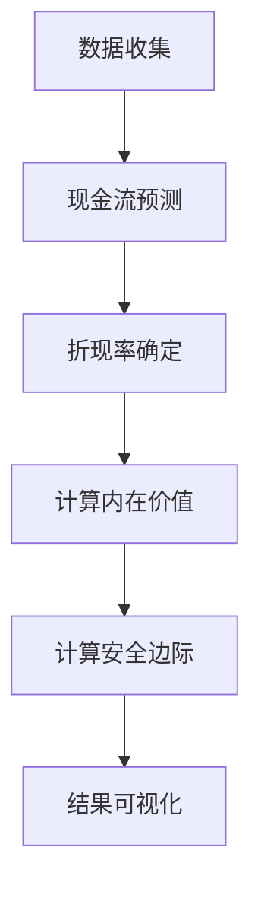
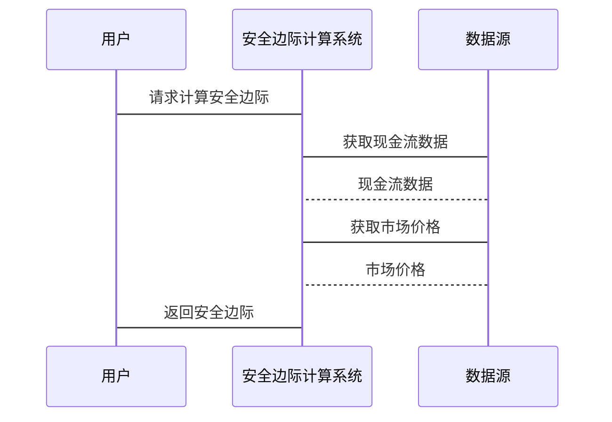

                 


# 价值投资的核心原则：安全边际理论

> **关键词**：价值投资，安全边际，内在价值，风险管理，投资策略，数学模型，股票选择

> **摘要**：本文深入探讨了价值投资的核心原则——安全边际理论。通过分析安全边际的定义、计算方法及其在投资决策中的应用，本文为投资者提供了如何在实际操作中应用这一理论的指导。从数学模型到实际案例，从风险管理到投资组合优化，本文全面解析了安全边际理论的精髓。

---

# 第一部分: 引言

## 第1章: 价值投资与安全边际概述

### 1.1 价值投资的起源与发展

#### 1.1.1 价值投资的定义与核心理念
- **定义**：价值投资是一种投资策略，强调以低于资产内在价值的价格买入，长期持有，等待市场重新认识其价值。
- **核心理念**：寻找市场低估的资产，通过安全边际降低投资风险。

#### 1.1.2 格雷厄姆与安全边际理论的提出
- **本杰明·格雷厄姆**：被誉为“价值投资之父”，其著作《证券分析》奠定了安全边际理论的基础。
- **安全边际理论的提出**：通过预留安全边际，确保即使估值有误，投资者也不会遭受重大损失。

#### 1.1.3 安全边际与投资策略的关系
- **安全边际是价值投资的基石**：通过计算安全边际，投资者可以识别出具有足够安全空间的投资标的。

### 1.2 安全边际的基本概念

#### 1.2.1 安全边际的定义
- **安全边际**：买入价格与内在价值之间的差额，即 $$安全边际 = 内在价值 - 市场价格$$。

#### 1.2.2 安全边际的属性特征对比
| 属性 | 特征 |
|------|------|
| 计算基础 | 内在价值与市场价格 |
| 目标 | 降低投资风险 |
| 应用场景 | 股票、债券等资产的估值与投资决策 |

#### 1.2.3 安全边际与投资风险的关系
- **正相关关系**：安全边际越大，投资风险越小。
- **风险控制工具**：通过预留安全边际，投资者可以在市场波动中保持稳健。

### 1.3 价值投资的核心原则

#### 1.3.1 内在价值的定义与计算
- **内在价值**：资产在未来现金流的现值。
- **计算公式**：$$内在价值 = \frac{预期现金流}{折现率}$$。

#### 1.3.2 安全边际与内在价值的关系
- **安全边际是内在价值与市场价格的差额**，即 $$安全边际 = 内在价值 - 市场价格$$。
- **安全边际的意义**：确保在市场波动中，投资者不会因估值错误而遭受损失。

#### 1.3.3 价值投资与市场波动的结合
- **市场波动是机会**：价值投资者在市场恐慌时寻找被低估的资产。
- **安全边际是防御性投资策略**：通过预留安全边际，投资者可以在市场波动中保护资本。

### 1.4 本章小结
本章介绍了价值投资的起源与发展，详细阐述了安全边际的基本概念及其在投资策略中的核心地位。通过安全边际，投资者可以在市场波动中降低风险，实现稳健的投资回报。

---

# 第二部分: 安全边际的理论与应用

## 第2章: 安全边际的数学模型与计算方法

### 2.1 安全边际的数学模型

#### 2.1.1 内在价值的计算公式
- **预期现金流**：基于公司财务状况和行业前景预测的未来现金流。
- **折现率**：反映市场风险和通货膨胀的贴现率。
- **计算公式**：$$内在价值 = \frac{预期现金流}{折现率}$$。

#### 2.1.2 安全边际的计算公式
- **安全边际**：$$安全边际 = 内在价值 - 市场价格$$。

#### 2.1.3 安全边际的可视化分析


### 2.2 安全边际的计算步骤

#### 2.2.1 数据收集与处理
- 收集公司财务报表、行业数据和宏观经济指标。
- 清洗数据，剔除异常值和缺失值。

#### 2.2.2 现金流预测
- 使用历史数据和行业趋势预测未来现金流。
- 考虑经济增长、行业竞争和公司战略等因素。

#### 2.2.3 折现率的确定
- 确定合适的折现率，通常使用无风险利率加风险溢价。
- 计算公式：$$折现率 = 无风险利率 + 风险溢价$$。

#### 2.2.4 内在价值与安全边际的计算
- 计算内在价值：$$内在价值 = \frac{预期现金流}{折现率}$$。
- 计算安全边际：$$安全边际 = 内在价值 - 市场价格$$。

### 2.3 安全边际的可视化分析

#### 使用 Mermaid 绘制安全边际计算流程图


### 2.4 本章小结
本章详细讲解了安全边际的数学模型和计算方法，通过mermaid图展示了计算流程，帮助读者理解如何通过数学模型计算安全边际。

---

## 第3章: 安全边际在投资决策中的应用

### 3.1 安全边际在股票选择中的应用

#### 3.1.1 股票筛选标准
- **低市盈率（P/E）**：市盈率低于行业平均水平。
- **低市净率（P/B）**：市净率低于行业平均水平。
- **高股息率**：股息率高于行业平均水平。

#### 3.1.2 安全边际与投资决策的关系
- **安全边际是决策的关键**：只有当市场价格低于内在价值时，才考虑买入。
- **实例分析**：某公司内在价值为100元，市场价格为80元，安全边际为20元，可以考虑买入。

#### 3.1.3 实例分析：如何通过安全边际选择股票
- 案例：某公司内在价值为100元，市场价格为80元，安全边际为20元。
- 结论：买入该股票，因为安全边际足够大。

### 3.2 安全边际与风险管理

#### 3.2.1 风险管理的核心原则
- **分散投资**：通过分散投资降低特定风险。
- **风险与收益匹配**：高风险投资需要更高的安全边际。

#### 3.2.2 安全边际在风险管理中的作用
- **降低投资风险**：通过预留安全边际，减少因估值错误导致的损失。
- **实例分析**：某公司内在价值为100元，市场价格为90元，安全边际为10元。如果内在价值被低估10%，即实际价值为90元，安全边际为0，投资者可能面临损失。

### 3.3 安全边际与投资组合管理

#### 3.3.1 投资组合管理的基本原理
- **分散投资**：通过投资不同资产降低风险。
- **资产配置**：根据市场环境调整资产配置。

#### 3.3.2 安全边际在投资组合中的应用
- **选择具有足够安全边际的资产**：确保投资组合整体具有安全边际。
- **实例分析**：投资组合中包含多个具有正安全边际的股票，降低整体风险。

#### 3.3.3 实例分析：如何通过安全边际优化投资组合
- 案例：投资组合中包含A、B、C三只股票，每只股票都有正的安全边际。
- 结论：投资组合整体具有较高的安全边际，风险较低。

### 3.4 本章小结
本章探讨了安全边际在投资决策中的应用，包括股票选择、风险管理与投资组合管理。通过实例分析，展示了如何通过安全边际优化投资决策。

---

## 第4章: 安全边际的系统分析与架构设计

### 4.1 系统功能设计（领域模型Mermaid类图）


### 4.2 系统架构设计Mermaid架构图

```mermaid
container 安全边际计算系统 {
    组件 安全边际计算模块 {
        算法：$$安全边际 = 内在价值 - 市场价格$$
    }
    组件 数据获取模块 {
        获取现金流数据
        获取市场价格
    }
    组件 折现率确定模块 {
        确定折现率
    }
}
```

### 4.3 系统接口设计与交互Mermaid序列图



### 4.4 本章小结
本章通过系统分析与架构设计，展示了安全边际计算系统的整体架构和功能模块。通过mermaid图，清晰地展示了系统的功能、架构和交互流程。

---

## 第5章: 项目实战

### 5.1 环境安装与配置

#### 5.1.1 安装Python环境
- 使用Anaconda或Pyenv安装Python 3.8或更高版本。

#### 5.1.2 安装必要的Python库
```bash
pip install pandas numpy matplotlib
```

### 5.2 核心实现源代码

#### 5.2.1 安全边际计算模块
```python
import pandas as pd
import numpy as np

def calculate_intrinsic_value(cash_flows, discount_rate):
    return cash_flows / discount_rate

def calculate_margin_of_safety(intrinsic_value, market_price):
    return intrinsic_value - market_price

# 示例数据
cash_flows = [100, 120, 140]  # 预期现金流
discount_rate = 0.08  # 折现率
market_price = 80  # 市场价格

# 计算内在价值
intrinsic_value = calculate_intrinsic_value(cash_flows, discount_rate)
# 计算安全边际
margin_of_safety = calculate_margin_of_safety(intrinsic_value[-1], market_price)

print(f"内在价值: {intrinsic_value[-1]:.2f}")
print(f"安全边际: {margin_of_safety:.2f}")
```

#### 5.2.2 数据可视化模块
```python
import matplotlib.pyplot as plt

def visualize_margin_of_safety(intrinsic_values, market_prices):
    plt.plot(intrinsic_values, label='内在价值')
    plt.plot(market_prices, label='市场价格')
    plt.xlabel('时间')
    plt.ylabel('价值')
    plt.legend()
    plt.show()

# 示例数据
intrinsic_values = [80, 90, 100]
market_prices = [70, 80, 90]

visualize_margin_of_safety(intrinsic_values, market_prices)
```

### 5.3 代码应用解读与分析

#### 5.3.1 安全边际计算模块
- **函数`calculate_intrinsic_value`**：计算内在价值，使用预期现金流和折现率。
- **函数`calculate_margin_of_safety`**：计算安全边际，使用内在价值和市场价格。

#### 5.3.2 数据可视化模块
- **函数`visualize_margin_of_safety`**：绘制内在价值和市场价格的折线图，直观展示安全边际。

### 5.4 实际案例分析与详细解读

#### 5.4.1 案例分析：某公司股票
- **数据**：预期现金流为[100, 120, 140]，折现率为8%，市场价格为80。
- **计算**：内在价值为100/0.08=1250，安全边际为1250-80=1170。
- **结论**：安全边际较大，可以考虑买入。

### 5.5 本章小结
本章通过项目实战，展示了如何使用Python编写安全边际计算模块和数据可视化模块。通过实际案例分析，帮助读者理解如何将安全边际理论应用于实际投资中。

---

## 第6章: 最佳实践与小结

### 6.1 最佳实践

#### 6.1.1 定期评估安全边际
- 市场价格和内在价值都会变化，定期评估安全边际，调整投资组合。

#### 6.1.2 结合市场环境
- 在市场恐慌时寻找安全边际大的资产，在市场狂热时降低仓位。

#### 6.1.3 长期持有
- 价值投资强调长期持有，避免频繁交易，降低交易成本。

### 6.2 注意事项

#### 6.2.1 安全边际不是万能药
- 安全边际只能降低风险，不能完全消除风险。

#### 6.2.2 谨防估值错误
- 估值错误可能导致安全边际为负，投资者需要谨慎。

#### 6.2.3 综合考虑多种因素
- 安全边际是重要指标，但需要结合其他因素如公司基本面、行业前景等。

### 6.3 拓展阅读

#### 6.3.1 推荐书籍
- 《证券分析》——本杰明·格雷厄姆
- 《投资学原理》——理查德·阿斯特

#### 6.3.2 网站与资源
- 网站：投资论坛、财经网站
- 工具：财务分析软件、数据可视化工具

### 6.4 本章小结
本章总结了安全边际理论的最佳实践，强调了安全边际的重要性，同时也提醒投资者需要注意的风险和挑战。通过拓展阅读和实践，投资者可以进一步提高自己的投资能力。

---

# 第三部分: 结论

## 第7章: 安全边际理论的总结与展望

### 7.1 本研究的主要结论
- 安全边际是价值投资的核心原则，通过预留安全边际，投资者可以降低投资风险。
- 安全边际的计算和应用需要结合实际市场情况，综合考虑多种因素。

### 7.2 对未来研究的展望
- 进一步研究安全边际在不同类型资产中的应用。
- 探讨安全边际与其他投资策略的结合，如成长投资和指数投资。

### 7.3 本章小结
本章总结了全文的主要结论，并对未来研究进行了展望。安全边际理论是价值投资的重要基石，未来的研究将进一步丰富其应用。

---

# 参考文献

（此处列出参考文献，包括书籍、期刊文章、网络资源等。）

---

通过以上结构，文章详细探讨了安全边际理论的核心概念、数学模型、系统分析和实际应用，为投资者提供了全面的指导。

