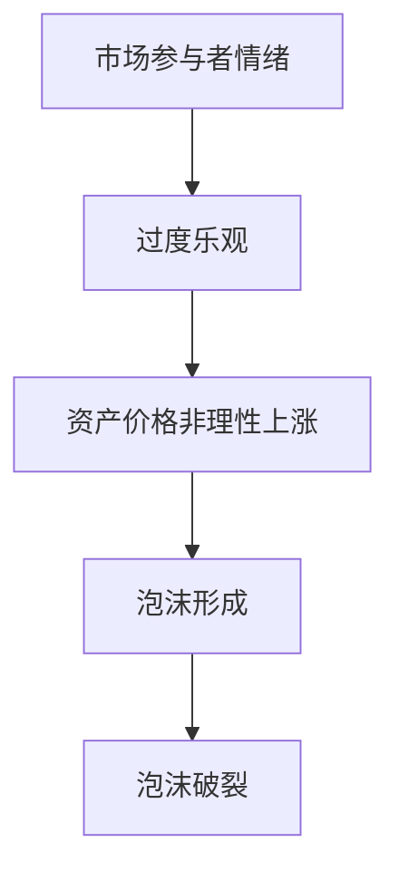

                 

# 价值投资者如何应对市场泡沫

---

## 关键词
- 价值投资, 市场泡沫, 风险管理, 安全边际, 投资策略

---

## 摘要
在市场泡沫的背景下，价值投资者需要通过基本面分析、安全边际和长期视角来识别低估资产，同时运用风险管理策略保护投资组合。本文从市场泡沫的形成机制、价值投资的核心策略、风险管理与防御性投资、投资者心理与行为分析以及系统化投资方法等方面展开，帮助投资者在泡沫环境中做出明智决策。

---

## 第一部分: 市场泡沫与价值投资概述

### 第1章: 市场泡沫的背景与价值投资的定义

#### 1.1 市场泡沫的形成机制
##### 1.1.1 泡沫的定义与特征
市场泡沫是指资产价格偏离其内在价值的非理性上涨现象，通常由投资者的过度乐观和羊群效应引发。泡沫的特征包括价格与基本面脱节、交易量激增、市场参与者情绪亢奋等。

##### 1.1.2 市场泡沫的历史案例分析
历史上的市场泡沫包括17世纪的郁金香狂热、20世纪90年代的互联网泡沫以及2008年的次贷危机。这些案例展示了泡沫的形成、膨胀和破裂过程。

##### 1.1.3 泡沫的形成原因与周期性
泡沫的形成主要由人类心理因素（贪婪与恐惧）、信息不对称、杠杆效应和市场结构复杂化驱动。泡沫具有周期性，通常经历五个阶段：认知、兴奋、疯狂、怀疑和崩盘。

#### 1.2 价值投资的核心理念
##### 1.2.1 价值投资的定义与特点
价值投资是一种以内在价值为导向的投资策略，强调通过基本面分析寻找被市场低估的资产。其特点是长期视角、注重安全边际和逆向投资。

##### 1.2.2 价值投资与投机的区分
价值投资关注长期稳健收益，而投机关注短期价格波动。两者的主要区别在于投资目标和时间框架。

##### 1.2.3 价值投资的长期视角
价值投资强调长期持有优质资产，关注企业的基本面和竞争优势，而非短期市场波动。

#### 1.3 价值投资与市场泡沫的关系
##### 1.3.1 泡沫环境下的投资机会
泡沫环境可能导致某些资产价格被高估，但也会出现被低估的机会。价值投资者可以通过识别真正具有竞争优势的企业进行投资。

##### 1.3.2 泡沫环境中的投资风险
泡沫环境增加了市场的不确定性和波动性，可能导致短期亏损和长期资本损失。

##### 1.3.3 价值投资者在泡沫中的角色
价值投资者在泡沫环境中扮演着理性分析者的角色，通过坚持基本面分析和安全边际原则，帮助市场回归理性。

---

### 第2章: 价值投资的核心策略分析

#### 2.1 基本面分析
##### 2.1.1 基本面分析的定义与方法
基本面分析通过研究企业的财务报表、行业地位、竞争优势等因素，评估其内在价值。

##### 2.1.2 财务指标分析
- **市盈率（P/E）**：股价与每股收益的比率，用于衡量股票的估值。
- **市净率（P/B）**：股价与每股净资产的比率，用于衡量股票的估值。
- **ROE（净资产收益率）**：衡量企业的盈利能力。

##### 2.1.3 行业分析与竞争优势评估
行业分析帮助投资者了解企业的市场地位和竞争优势，从而判断其长期发展潜力。

#### 2.2 安全边际
##### 2.2.1 安全边际的定义与作用
安全边际是指资产的市场价格低于其内在价值的部分，用于缓冲短期市场波动带来的风险。

##### 2.2.2 安全边际的计算方法
安全边际 = 内在价值 - 市场价格

#### 2.3 长期视角与耐心资本
##### 2.3.1 长期投资的优势与挑战
长期投资能够避免短期波动的干扰，但需要面对市场短期非理性波动的挑战。

##### 2.3.2 耐心资本在泡沫环境中的应用
耐心资本通过长期持有优质资产，避免短期市场波动的影响。

##### 2.3.3 长期视角与短期波动的平衡
价值投资者需要在长期视角和短期波动之间找到平衡，避免因短期波动影响长期决策。

---

### 第3章: 风险管理与防御性投资

#### 3.1 风险管理的定义与重要性
##### 3.1.1 风险管理的核心理念
风险管理是通过识别、评估和控制风险，降低投资组合的波动性和潜在损失。

##### 3.1.2 风险管理在价值投资中的作用
风险管理帮助投资者在市场波动中保持投资纪律，避免过度损失。

##### 3.1.3 风险管理的常见工具与方法
- **资产配置**：分散投资于不同资产类别和行业，降低风险。
- **对冲工具**：使用衍生品对冲市场风险。

#### 3.2 防御性投资策略
##### 3.2.1 防御性投资的定义与特点
防御性投资通过投资低波动性、高分红的资产，降低市场风险。

##### 3.2.2 防御性投资的资产配置策略
- **债券**：提供稳定的收益和较低的风险。
- **蓝筹股**：具有较高的市场地位和稳定的收益。

##### 3.2.3 防御性投资在泡沫环境中的应用
在市场泡沫期间，防御性投资可以帮助投资者规避市场的大幅波动。

#### 3.3 投资组合的分散化
##### 3.3.1 分散化投资的定义与优势
分散化投资通过将资金分配到不同的资产和行业，降低特定资产的风险。

##### 3.3.2 分散化在价值投资中的应用
价值投资者通过分散化投资，降低因个别资产价格波动带来的风险。

##### 3.3.3 分散化与风险控制的关系
分散化是风险管理的重要工具，能够有效降低投资组合的整体风险。

---

### 第4章: 投资者的心理与行为分析

#### 4.1 投资者心理的定义与影响
##### 4.1.1 投资者心理的核心要素
投资者心理包括贪婪、恐惧、过度自信等情绪，这些情绪会影响投资决策。

##### 4.1.2 投资者心理对市场的影响
贪婪和恐惧会导致市场的非理性波动，进而影响资产价格。

##### 4.1.3 投资者心理与市场泡沫的关系
市场泡沫的形成与投资者心理密切相关，过度乐观和贪婪推动泡沫的形成。

#### 4.2 投资者行为的分析与影响
##### 4.2.1 投资者行为的核心特征
投资者行为包括羊群效应、从众心理和过度交易等，这些行为会影响市场的稳定性。

##### 4.2.2 投资者行为对市场泡沫的推动作用
投资者的从众心理和贪婪行为推动了市场的非理性上涨，进而形成泡沫。

##### 4.2.3 投资者行为与风险管理的关系
投资者行为需要通过纪律和理性来控制，避免因情绪波动影响投资决策。

#### 4.3 本章小结
投资者心理和行为是影响市场泡沫的重要因素，价值投资者需要通过纪律和理性来应对市场的非理性波动。

---

### 第5章: 系统化投资方法

#### 5.1 系统化投资方法的定义与特点
系统化投资方法是通过量化模型和算法进行投资决策，具有纪律性和可重复性。

#### 5.2 系统化投资方法的核心要素
##### 5.2.1 数据收集与处理
系统化投资需要收集和处理大量的市场数据，包括价格、成交量、财务指标等。

##### 5.2.2 模型构建与回测
通过构建量化模型并进行历史数据回测，验证模型的有效性。

##### 5.2.3 模型优化与策略调整
根据市场变化和回测结果，不断优化模型并调整投资策略。

#### 5.3 系统化投资方法的优势
##### 5.3.1 纪律性
系统化投资方法避免了情绪干扰，保持投资纪律。

##### 5.3.2 可重复性
系统化投资方法可以通过历史数据验证其有效性。

##### 5.3.3 高效性
系统化投资方法能够快速处理大量数据，提高投资效率。

#### 5.4 本章小结
系统化投资方法为价值投资者提供了科学的投资工具，帮助他们在市场泡沫中做出更明智的决策。

---

### 第6章: 未来展望与投资建议

#### 6.1 未来市场的不确定性
市场泡沫的形成和破裂具有不确定性，投资者需要保持警惕。

#### 6.2 对投资者的建议
##### 6.2.1 坚持基本面分析
##### 6.2.2 保持长期视角
##### 6.2.3 重视风险管理
##### 6.2.4 保持纪律与耐心

#### 6.3 本章小结
在市场泡沫的背景下，价值投资者需要通过基本面分析、长期视角和风险管理来应对市场的不确定性，保护投资组合并实现长期稳健收益。

---

### 第7章: 结论

#### 7.1 价值投资的核心理念
价值投资是一种长期、稳健的投资策略，强调基本面分析和安全边际。

#### 7.2 市场泡沫的应对策略
价值投资者需要通过风险管理、分散投资和纪律性来应对市场泡沫带来的挑战。

#### 7.3 未来投资展望
未来的投资环境将更加复杂，价值投资者需要不断学习和适应，保持长期的纪律和耐心。

---

### 第8章: 拓展阅读与参考文献

#### 8.1 拓展阅读
- 霍华德·马克斯的《投资最重要的事情》
- 本杰明·格雷厄姆的《证券分析》
- 彼得·林奇的《投资最重要的事情》

#### 8.2 参考文献
- 约翰·坦皮科的《市场的心理驱动力》
- 约翰·博格的《投资常识》
- 约翰·奈斯比特的《Megatrends》

---

通过以上分析，价值投资者可以在市场泡沫中识别低估资产，保护投资组合，并实现长期稳健的收益。

