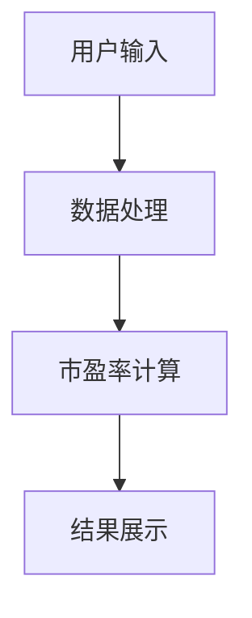

                 


# 价值投资者如何看待市盈率

> 关键词：市盈率，价值投资，估值指标，投资决策，股票分析

> 摘要：市盈率是价值投资者常用的估值指标之一，本文将从市盈率的定义、计算公式、核心原理、应用场景、系统设计、项目实战等多角度进行详细分析，帮助投资者深入理解市盈率在投资决策中的作用。

---

## 第1章: 市盈率的定义与计算

### 1.1 市盈率的基本概念

#### 1.1.1 市盈率的定义
市盈率（Price-to-Earnings Ratio，简称P/E或PER）是衡量股票价值的重要指标之一，用于评估股票价格相对于其每股收益的高低。市盈率反映了市场对公司未来盈利能力的预期。

#### 1.1.2 市盈率的计算公式
市盈率的计算公式为：
$$市盈率 = \frac{股价}{每股收益}$$

其中，每股收益（EPS）的计算公式为：
$$每股收益 = \frac{净利润}{总股本}$$

#### 1.1.3 市盈率的行业标准
市盈率的行业标准因行业而异，例如科技行业通常市盈率较高，而传统制造业的市盈率较低。投资者需要结合行业特点和市场环境分析市盈率的合理性。

---

### 1.2 市盈率与投资的关系

#### 1.2.1 市盈率在投资中的作用
市盈率是投资者评估股票价值的重要工具，可以帮助投资者判断股票是否被高估或低估。

#### 1.2.2 市盈率与股票价值的关系
市盈率低的股票可能意味着市场对其未来盈利能力的预期较低，而市盈率高的股票可能意味着市场对其未来增长的看好。

#### 1.2.3 市盈率的局限性
市盈率的局限性在于它不考虑公司的负债情况和现金流状况，也无法反映公司的成长性和创新能力。

---

## 第2章: 市盈率的核心概念与属性

### 2.1 市盈率的核心原理

#### 2.1.1 市盈率的数学模型
市盈率的数学模型可以表示为：
$$P/E = \frac{P}{E}$$

其中，P代表股票价格，E代表每股收益。

#### 2.1.2 市盈率与企业盈利的关系
市盈率与企业盈利成反比，企业盈利越高，市盈率越低，反之亦然。

#### 2.1.3 市盈率与市场预期的关系
市盈率反映了市场对企业未来盈利的预期，如果市场预期企业未来盈利将增长，市盈率可能会上升。

---

### 2.2 市盈率的属性特征对比

#### 2.2.1 市盈率与市净率的对比
市盈率和市净率（P/B）都是常用的估值指标，市盈率关注盈利能力，市净率关注资产价值。

| 特性   | 市盈率（P/E） | 市净率（P/B） |
|--------|----------------|----------------|
| 焦点   | 盈利能力       | 资产价值       |
| 适用性 | 适用于盈利稳定的公司 | 适用于资产密集型行业 |

#### 2.2.2 市盈率与股息率的对比
市盈率关注未来盈利，股息率关注当前收益。

| 特性   | 市盈率（P/E） | 股息率（D/P） |
|--------|----------------|----------------|
| 焦点   | 未来盈利       | 当前收益       |
| 适用性 | 成长型企业     | 稳定收益型企业 |

#### 2.2.3 市盈率与成长性的对比
市盈率与成长性正相关，成长型企业通常市盈率较高。

---

## 第3章: 市盈率的算法原理

### 3.1 市盈率的计算公式

#### 3.1.1 市盈率公式
$$市盈率 = \frac{股价}{每股收益}$$

#### 3.1.2 每股收益的计算公式
$$每股收益 = \frac{净利润}{总股本}$$

### 3.2 市盈率的应用算法

#### 3.2.1 市盈率的行业比较法
通过比较同行业公司的市盈率，判断目标公司的估值是否合理。

#### 3.2.2 市盈率的历史估值法
将当前市盈率与历史市盈率进行对比，判断当前估值是否处于合理区间。

#### 3.2.3 市盈率的目标估值法
根据对公司未来盈利的预测，计算目标市盈率，并与当前市盈率进行对比。

---

## 第4章: 市盈率的系统分析与架构设计

### 4.1 问题场景介绍

#### 4.1.1 问题背景
投资者需要一个系统化的工具来评估股票的市盈率，帮助做出投资决策。

#### 4.1.2 问题描述
如何构建一个基于市盈率的估值系统，帮助投资者分析股票的估值情况。

### 4.2 系统功能设计

#### 4.2.1 系统功能模块
- 数据采集模块：获取股票价格和每股收益数据。
- 市盈率计算模块：计算市盈率并进行行业对比。
- 估值分析模块：根据市盈率判断股票是否被高估或低估。

### 4.3 系统架构设计

#### 4.3.1 系统架构图（Mermaid）


---

## 第5章: 市盈率的项目实战

### 5.1 环境安装

#### 5.1.1 数据获取工具安装
安装Python和Pandas库，用于数据处理和分析。

#### 5.1.2 数据分析工具安装
安装Jupyter Notebook，用于数据可视化和分析。

### 5.2 核心实现源代码

#### 5.2.1 市盈率计算代码
```python
import pandas as pd

# 获取股票数据
data = pd.read_csv('stock_data.csv')

# 计算每股收益
eps = data['净利润'] / data['总股本']

# 计算市盈率
pe = data['股价'] / eps

# 输出结果
print(pe)
```

---

## 第6章: 最佳实践与小结

### 6.1 小结
市盈率是价值投资者常用的估值指标，但需要结合公司基本面和行业特点进行综合分析。

### 6.2 注意事项
- 市盈率高不一定意味着高风险，成长型企业市盈率高是合理的。
- 市盈率低不一定意味着低估，可能是因为公司盈利能力下降。

### 6.3 拓展阅读
- 《价值投资入门》
- 《投资学原理》

---

通过本文的分析，价值投资者可以更好地理解和应用市盈率这一估值指标，做出更明智的投资决策。

