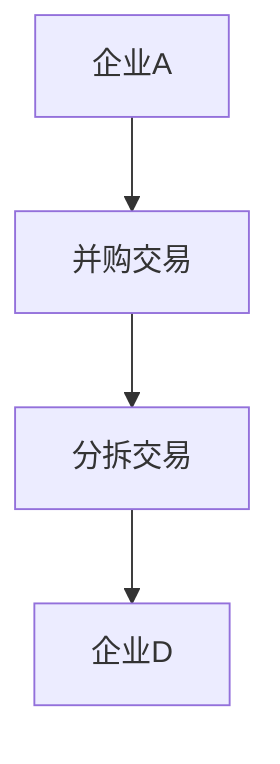
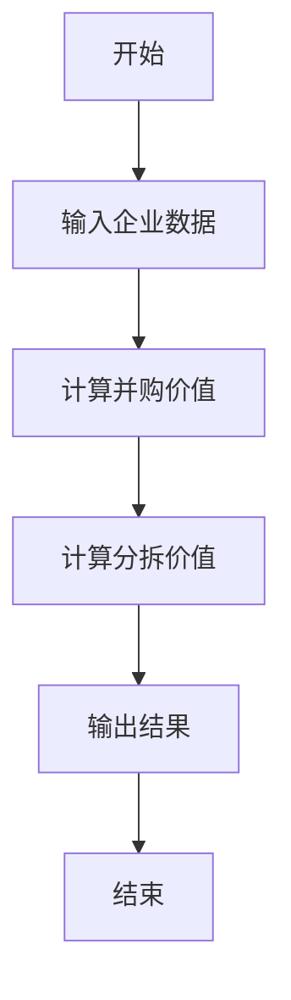
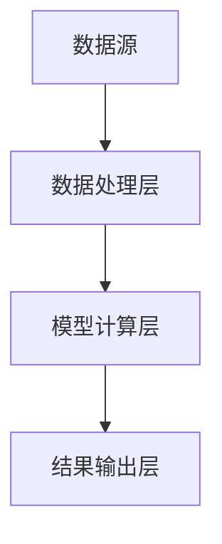

                 


# 价值投资者如何看待并购和分拆

## 关键词：价值投资，并购，分拆，企业战略，财务分析

## 摘要：  
本文探讨了价值投资者在并购和分拆中的视角，分析了这些交易对股东价值的影响，以及如何通过深入的财务分析和战略评估来识别潜在的投资机会。文章从并购和分拆的基本概念入手，结合数学模型和实际案例，为价值投资者提供了系统化的分析框架和投资策略。

---

# 第一部分：价值投资者并购与分拆的背景与基础

## 第1章：价值投资与并购分拆概述

### 1.1 价值投资的核心理念

#### 1.1.1 价值投资的定义与特点  
价值投资是一种以基本面分析为基础的投资策略，强调以低于内在价值的价格买入优质资产。其核心在于寻找市场低估的企业，并长期持有，等待价值回归。价值投资的特点包括：长期导向、注重基本面分析、关注安全边际等。

#### 1.1.2 并购与分拆在价值投资中的地位  
并购和分拆是企业战略中的重要组成部分，也是价值投资者关注的焦点。企业通过并购可以快速扩大规模、获取新技术或进入新市场；而分拆则可以帮助企业优化资产结构、提升管理效率。这些操作往往会影响企业的财务表现和市场估值，为投资者提供潜在的投资机会。

#### 1.1.3 价值投资者的长期视角  
价值投资者注重企业的长期价值，而非短期市场波动。并购和分拆作为企业战略的一部分，其成功与否往往取决于企业的长期发展潜力和管理层的决策能力。价值投资者会通过深入分析这些交易的潜在影响，来判断是否符合其长期投资目标。

---

### 1.2 并购与分拆的基本概念

#### 1.2.1 并购的定义与类型  
并购（Mergers and Acquisitions, M&A）是指一家企业收购或合并另一家企业。并购可以分为横向并购、纵向并购和混合并购：

- **横向并购**：同一行业内的企业合并，旨在扩大市场份额或消除竞争。
- **纵向并购**：企业沿着产业链上下游进行并购，以整合资源或控制成本。
- **混合并购**：企业与不同行业或业务领域的企业合并，以多元化经营或获取新技术。

#### 1.2.2 分拆的定义与类型  
分拆（Spin-off）是指企业将其一部分业务剥离出来，独立上市或成为一家新公司的过程。分拆可以分为：

- **完全分拆**：将子公司完全独立出来，原公司不再持有其股权。
- **部分分拆**：原公司仍保留对子公司的部分股权，但将其上市以优化资本结构。

#### 1.2.3 并购与分拆的驱动因素  
企业进行并购或分拆的驱动因素包括：  
1. **并购**：市场扩张、技术获取、成本协同、财务优化等。  
2. **分拆**：优化资产结构、提升管理效率、释放子公司价值等。

---

### 1.3 价值投资者如何看待企业并购与分拆

#### 1.3.1 并购对股东价值的影响  
并购的成败取决于整合后的协同效应。如果并购能够带来成本节约、收入增长或利润率提升，通常会增加股东价值。然而，许多并购失败的原因在于低估了整合难度或高估了协同效应。

#### 1.3.2 分拆对股东价值的影响  
分拆通常能够优化企业结构，提升管理效率，同时释放被分拆公司的潜在价值。对于投资者而言，分拆可能带来股价上涨的机会，尤其是当被分拆公司具有独立上市后更强的盈利能力时。

#### 1.3.3 价值投资者的并购与分拆策略  
价值投资者在并购和分拆中需要关注以下几点：  
1. **基本面分析**：评估并购或分拆的长期影响，包括财务表现、协同效应、管理能力等。  
2. **估值分析**：判断交易是否符合市场公允价值，是否存在低估或高估的情况。  
3. **风险控制**：评估并购或分拆的潜在风险，如整合失败、行业竞争加剧等。  

---

## 第2章：并购与分拆的核心概念与联系

### 2.1 并购与分拆的核心概念

#### 2.1.1 并购的核心概念与属性  
并购的核心在于通过整合资源实现价值最大化。其属性包括：  
- **战略协同性**：并购是否能带来业务协同和竞争优势。  
- **财务可行性**：并购是否能够改善财务表现，如ROE（净资产收益率）和净利润率的提升。  

#### 2.1.2 分拆的核心概念与属性  
分拆的核心在于优化企业结构和提升资产效率。其属性包括：  
- **独立性**：分拆后的企业是否具有独立的市场竞争力。  
- **价值释放**：分拆是否能够提升母公司的股价和市值。  

#### 2.1.3 并购与分拆的对比分析  
| 方面 | 并购 | 分拆 |  
|------|------|------|  
| 定义 | 收购或合并企业 | 剥离部分业务 |  
| 目的 | 扩大规模、获取技术 | 优化结构、释放价值 |  
| 影响 | 可能增加股东价值，但风险较高 | 通常优化股东价值，风险较低 |  

---

### 2.2 并购与分拆的ER实体关系图

```mermaid
er
  entity 企业A {
    key: 企业ID
    attr: 企业名称, 所属行业, 市场地位
  }
  entity 并购交易 {
    key: 交易ID
    attr: 交易时间, 交易金额, 交易类型
    role: 参与企业(企业A)
  }
  entity 分拆交易 {
    key: 分拆ID
    attr: 分拆时间, 分拆方式, 分拆价值
    role: 参与企业(企业A)
  }
```

---

### 2.3 并购与分拆的流程图



---

## 第3章：并购与分拆的算法原理与数学模型

### 3.1 并购与分拆的评估模型

#### 3.1.1 并购价值评估模型  
并购的估值通常基于目标公司的未来现金流。常用的模型包括：  

- **EBITDA倍数法**：  
$$ V = EBITDA \times 倍数 $$  
其中，EBITDA是息税折旧及摊销前利润，倍数通常为行业平均值或可比交易的倍数。

- **净现值法（NPV）**：  
$$ NPV = \sum_{t=1}^{n} \frac{CF_t}{(1 + r)^t} $$  
其中，CF_t是第t年的现金流，r是折现率。

#### 3.1.2 分拆价值评估模型  
分拆的估值通常基于分拆后公司的独立市场价值。常用的模型包括：  

- **相对估值法**：  
$$ V = P/E \times 净利润 $$  
其中，P/E是市盈率，净利润是分拆后公司的净利润。

- **重置成本法**：  
$$ V = \sum \text{资产价值} - \sum \text{负债价值} $$  

#### 3.1.3 价值投资者的评估框架  
价值投资者通常会结合上述模型，同时考虑行业趋势、竞争环境和管理层能力等因素，来综合评估并购或分拆的潜在价值。

---

### 3.2 并购与分拆的数学模型

#### 3.2.1 并购价值计算公式  
$$ V_{\text{并购}} = \text{协同效应} + \sum_{t=1}^{n} \frac{\text{现金流}_t}{(1 + r)^t} $$  

#### 3.2.2 分拆价值计算公式  
$$ V_{\text{分拆}} = \sum_{t=1}^{n} \frac{\text{现金流}_t}{(1 + r)^t} + \text{母公司的价值提升} $$  

---

### 3.3 并购与分拆的算法流程图



---

## 第4章：并购与分拆的系统分析与架构设计

### 4.1 并购与分拆的系统分析

#### 4.1.1 问题场景介绍  
在实际投资中，价值投资者需要分析企业的并购和分拆决策，判断这些交易是否能够提升企业的长期价值。例如，某科技公司进行横向并购以扩大市场份额，或者某周期性行业公司进行分拆以优化资产结构。

---

### 4.2 系统架构设计

#### 4.2.1 系统功能设计  
- **数据收集**：收集企业的财务数据、行业信息和市场数据。  
- **模型计算**：使用并购和分拆的评估模型进行价值计算。  
- **结果分析**：分析模型输出，判断交易的潜在影响。  

#### 4.2.2 系统架构图  



---

## 第5章：并购与分拆的项目实战

### 5.1 并购案例分析  
以某科技公司为例，假设其进行横向并购，目标公司具备较强的协同效应。通过EBITDA倍数法和净现值法计算并购价值，判断是否符合市场公允价值。

### 5.2 分拆案例分析  
以某周期性行业公司为例，假设其进行分拆，目标是优化资产结构。通过相对估值法和重置成本法计算分拆价值，判断分拆是否能够提升母公司的股价。

---

## 第6章：最佳实践与小结

### 6.1 关键点总结  
- 价值投资者在并购和分拆中需要关注企业的长期价值和财务表现。  
- 并购的协同效应和分拆的资产优化是关键影响因素。  

### 6.2 投资策略  
- **并购**：选择具有强大协同效应和管理能力的企业。  
- **分拆**：关注分拆后子公司的独立市场价值和母公司的价值提升。  

### 6.3 注意事项  
- 并购风险较高，需谨慎评估整合难度和行业环境。  
- 分拆通常风险较低，但需关注分拆后的管理效率和市场竞争。  

### 6.4 拓展阅读  
- 建议进一步阅读并购与分拆的经典案例，如可口可乐的并购策略和通用电气的分拆案例。

---

# 结语  
并购和分拆是企业战略的重要组成部分，也是价值投资者关注的焦点。通过深入分析企业的财务表现、战略目标和市场环境，价值投资者可以在并购和分拆中找到潜在的投资机会，实现长期稳健的收益。

--- 

希望这篇文章能够为价值投资者在并购和分拆中的决策提供有价值的参考和启发。

