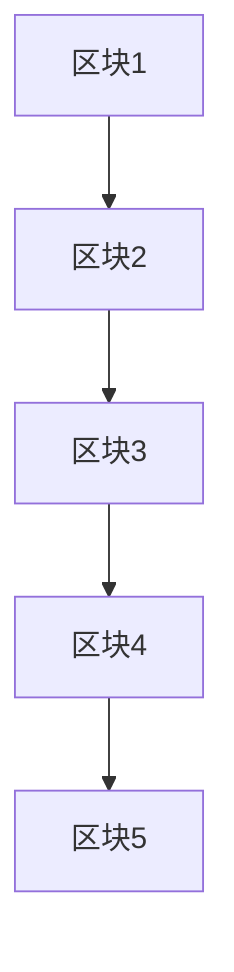
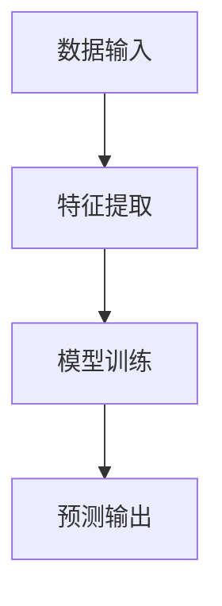
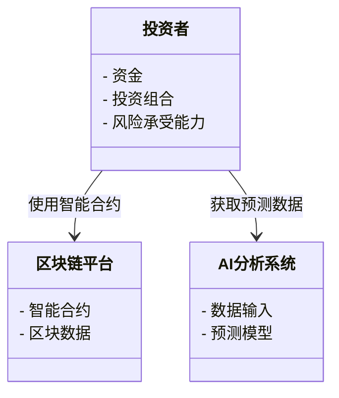
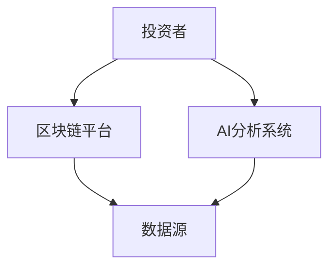

                 


# 价值投资者如何看待新兴技术：区块链、AI等

## 关键词：价值投资，区块链，人工智能，新兴技术，投资策略

## 摘要：新兴技术如区块链和人工智能正在改变投资领域，价值投资者需要理解这些技术的基本原理及其对投资策略的影响。本文通过分析区块链和AI的技术特点，探讨其在投资中的应用场景，并结合实际案例，提供技术评估和风险管理的方法，帮助投资者在新兴技术驱动的市场中做出明智决策。

---

# 引言：新兴技术与价值投资的交汇点

## 1.1 新兴技术对投资环境的影响

- **背景介绍**：随着科技的发展，区块链和人工智能等新兴技术正在改变金融市场的运作方式。投资者需要理解这些技术如何影响资产价值和市场动态。
- **核心概念**：区块链和AI如何提升投资效率、降低风险并创造新的投资机会。
- **问题解决**：新兴技术如何帮助投资者做出更明智的投资决策。
- **边界与外延**：本文聚焦于区块链和AI在投资中的应用，涵盖技术原理、投资策略和实际案例。

---

# 第一部分：区块链技术的深入分析

## 第2章：区块链技术的基础与优势

### 2.1 区块链的基本原理

#### 2.1.1 区块链的定义与核心机制

- **背景介绍**：区块链是一种去中心化的分布式账本技术，通过密码学确保数据的安全性和不可篡改性。
- **核心概念**：区块、链式结构、共识机制、哈希函数。
- **算法原理**：通过mermaid流程图展示区块链的工作流程：



- **数学模型**：区块链中的哈希函数用于生成唯一的数据指纹，确保数据完整性：

$$H(x) = \text{hash}(x)$$

### 2.2 区块链在投资中的应用场景

#### 2.2.1 数字货币与投资

- **背景介绍**：比特币和以太坊等数字货币的投资机会与风险。
- **核心概念**：数字钱包、交易确认、智能合约。

#### 2.2.2 智能合约与投资自动化

- **系统设计**：通过智能合约自动执行投资协议，减少中介依赖。

---

# 第二部分：人工智能技术的深入分析

## 第3章：人工智能技术的基础与优势

### 3.1 AI的基本原理

#### 3.1.1 人工智能的定义与分类

- **背景介绍**：AI涵盖机器学习、深度学习和自然语言处理等领域。

#### 3.1.2 机器学习的核心机制

- **算法原理**：使用mermaid流程图展示机器学习的训练过程：



- **数学模型**：线性回归模型：

$$y = \beta_0 + \beta_1x + \epsilon$$

### 3.2 AI在投资中的应用场景

#### 3.2.1 算法交易与投资决策

- **系统设计**：通过AI分析市场数据，优化投资组合。

---

# 第三部分：价值投资与新兴技术的结合

## 第4章：价值投资中的技术评估

### 4.1 评估技术公司的内在价值

#### 4.1.1 技术公司的财务分析

- **背景介绍**：分析公司的收入、利润和现金流。

#### 4.1.2 技术公司的竞争优势分析

- **核心概念**：技术壁垒、市场地位和创新能力。

### 4.2 技术风险的管理与控制

#### 4.2.1 技术风险的识别与评估

- **系统设计**：通过风险评估模型识别潜在风险。

---

# 第四部分：系统分析与架构设计

## 第5章：系统架构与接口设计

### 5.1 技术评估框架

- **系统功能设计**：领域模型设计：



### 5.2 系统架构设计

- **架构图**：



---

# 第五部分：项目实战

## 第6章：基于AI的量化投资系统

### 6.1 环境安装

- **工具安装**：安装Python、TensorFlow和Pandas。

### 6.2 系统核心实现

#### 6.2.1 数据预处理

```python
import pandas as pd

# 加载数据
data = pd.read_csv('stock_data.csv')

# 数据清洗
data.dropna(inplace=True)
```

#### 6.2.2 模型训练

```python
import tensorflow as tf
from tensorflow.keras import layers

model = tf.keras.Sequential([
    layers.Dense(64, activation='relu'),
    layers.Dense(1, activation='linear')
])

model.compile(optimizer='adam', loss='mse')
model.fit(data, labels, epochs=100, batch_size=32)
```

### 6.3 案例分析

- **实际案例**：利用AI预测股票价格并制定投资策略。

---

# 结论与展望

## 7.1 总结

- 新兴技术为价值投资者提供了新的工具和机会，但也带来了新的挑战。

## 7.2 展望

- 未来，区块链和AI将继续推动投资领域的创新，投资者需要持续学习和适应。

---

# 最佳实践 Tips

- **技术评估**：深入理解技术原理，评估其实际应用价值。
- **风险管理**：建立完善的风险控制机制，避免技术带来的投资损失。
- **持续学习**：关注技术发展趋势，保持对新兴技术的敏感性。

---

通过以上分析和实践，价值投资者可以更好地利用区块链和AI等新兴技术，提升投资决策的科学性和效率。

