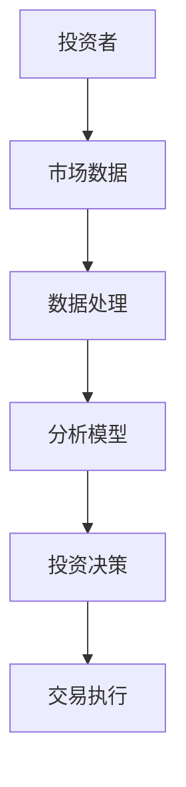

                 

# 价值投资者应该如何看待市场波动

## 关键词：价值投资、市场波动、风险管理、投资策略、系统架构

## 摘要：本文探讨了价值投资者在面对市场波动时的策略和心态。通过分析市场波动的定义、来源及其对投资的影响，结合风险管理、投资组合构建和长期视角，提供了应对波动的策略。文章还通过案例分析和技术化的系统架构设计，展示了如何在波动中识别投资机会，帮助价值投资者做出明智决策。

---

## 第一部分：引言

### 1.1 市场波动的重要性

#### 1.1.1 什么是市场波动

市场波动指的是资产价格在短期内的剧烈波动，通常由市场参与者的心理、经济数据和外部事件等因素引起。波动性是衡量市场风险的重要指标，对投资者的决策有着直接影响。

#### 1.1.2 市场波动的来源

市场波动来源于多种因素，包括经济数据发布、政策变化、公司公告、市场情绪和全球事件等。例如，经济衰退可能导致股票价格下跌，而积极的经济数据可能引发上涨。

#### 1.1.3 为什么市场波动对价值投资者重要

价值投资者关注的是企业的内在价值，而非短期价格波动。然而，市场波动可能导致优质资产价格被低估，为投资者提供买入机会。同时，波动也可能引发市场恐慌，导致非理性决策。

---

## 第二部分：市场波动的定义与特征

### 2.1 市场波动的定义

#### 2.1.1 波动性的数学定义

波动性可以用标准差或方差来衡量，反映资产价格的波动程度。例如，标准差越大，波动性越高。

$$标准差 = \sqrt{\frac{1}{n}\sum_{i=1}^{n}(x_i - \mu)^2}$$

其中，$\mu$是平均值，$x_i$是每个数据点。

#### 2.1.2 波动性的测量方法

波动性可以通过历史数据计算，也可以用期权定价模型（如黑-斯科尔斯模型）进行估计。例如，历史波动性基于过去的价格数据计算。

### 2.2 市场波动的特征

#### 2.2.1 波动性的周期性

市场波动通常呈现周期性，与经济周期密切相关。例如，经济衰退期间波动性可能增加，而复苏期间波动性可能降低。

#### 2.2.2 波动性的不对称性

市场波动往往具有不对称性，即下跌的幅度可能大于上涨的幅度，这被称为“肥尾”现象。

---

## 第三部分：价值投资的基本原理

### 3.1 价值投资的定义

#### 3.1.1 价值投资的定义

价值投资是一种投资策略，强调以低于内在价值的价格买入优质资产。其核心在于识别市场低估的公司，长期持有以实现收益。

#### 3.1.2 价值投资的核心理念

价值投资强调安全边际、长期视角和对公司基本面的深入分析。例如，巴菲特的“格雷厄姆-多德投资圈”方法，注重企业的财务健康和长期竞争优势。

### 3.2 价值投资的核心要素

#### 3.2.1 企业基本面分析

基本面分析包括对公司的财务报表、盈利能力、行业地位和管理层的评估。例如，计算市盈率（P/E）和市净率（P/B）等指标，判断资产是否被低估。

#### 3.2.2 安全边际的概念

安全边际是指买入价格与内在价值之间的差距，用于降低市场波动带来的风险。例如，以低于估计价值30%的价格买入资产，以应对潜在的波动。

---

## 第四部分：市场波动对价值投资的影响

### 4.1 市场波动与价值投资的关系

#### 4.1.1 波动性如何影响价值投资

波动可能导致资产价格偏离内在价值，为价值投资者提供买入机会。例如，市场恐慌时，优质资产价格可能被低估，为长期投资者提供入场机会。

#### 4.1.2 价值投资者如何应对市场波动

价值投资者应保持冷静，避免随市场情绪做出决策。例如，在市场下跌时，增加对优质资产的配置。

### 4.2 市场波动带来的投资机会

#### 4.2.1 低谷期的投资机会

市场低谷期可能隐藏着被低估的优质资产。例如，2008年金融危机后，许多优质企业股价大幅下跌，为长期投资者提供了买入机会。

#### 4.2.2 波动性中的套利机会

在市场波动中，可能存在套利机会，例如利用不同市场或资产之间的价差进行套利。

### 4.3 市场波动带来的投资风险

#### 4.3.1 过度波动的风险

过度波动可能导致资产价格急剧下跌，价值投资者可能面临短期损失。例如，杠杆投资在市场剧烈波动时可能引发强制平仓。

#### 4.3.2 市场波动中的常见陷阱

市场波动可能导致投资者误判资产价值，例如在市场高点买入或在低点卖出。

---

## 第五部分：应对市场波动的策略

### 5.1 风险管理策略

#### 5.1.1 风险管理的定义

风险管理是指识别、评估和应对潜在风险的过程。例如，通过分散投资降低特定资产的风险。

#### 5.1.2 投资组合构建

投资组合构建应考虑资产配置、分散投资和风险分散。例如，将资金分配到不同资产类别和行业，降低波动性对整体投资组合的影响。

#### 5.1.3 长期视角的重要性

价值投资者应关注长期趋势，避免短期波动影响决策。例如，长期持有优质资产，忽略短期价格波动。

### 5.2 价值投资中的系统性分析

#### 5.2.1 系统架构设计

系统架构设计包括数据收集、分析模型和决策支持。例如，开发一个数据平台，实时监控市场波动并提供投资建议。

#### 5.2.2 技术化分析工具

技术化分析工具如大数据分析和机器学习算法，可以辅助价值投资者识别市场趋势和潜在投资机会。例如，使用自然语言处理分析公司财报，识别财务风险。

---

## 第六部分：价值投资中的实战案例分析

### 6.1 科技股泡沫破裂后的投资机会

#### 6.1.1 泡沫破裂的背景

2000年互联网泡沫破裂后，许多科技股价格大幅下跌，为价值投资者提供了买入机会。例如，微软和苹果等公司在泡沫破裂后股价被低估，为长期投资者提供了买入机会。

#### 6.1.2 投资机会的分析

通过基本面分析，识别那些具有强大财务基础和长期竞争优势的公司。例如，分析公司的盈利能力、现金流和行业地位，判断其内在价值。

### 6.2 2008年金融危机后的投资机会

#### 6.2.1 金融危机的背景

2008年金融危机导致全球市场大幅下跌，许多优质资产价格被低估。例如，巴菲特在此期间大量买入高盛和通用电气的股票，利用市场恐慌实现长期收益。

#### 6.2.2 投资机会的分析

通过深入分析公司的财务状况和行业前景，识别那些在危机中被低估的优质资产。例如，购买银行股或房地产信托基金，利用市场低谷实现长期收益。

---

## 第七部分：总结与展望

### 7.1 总结

价值投资者应以长期视角看待市场波动，利用波动带来的投资机会。通过深入分析市场波动的定义、来源和影响，结合风险管理、投资组合构建和系统化分析，价值投资者可以在波动中实现稳健收益。

### 7.2 未来展望

随着市场环境的变化和技术的进步，价值投资的策略和工具将不断进化。例如，人工智能和大数据技术的应用，将为价值投资者提供更精准的分析工具和投资机会。

---

## 参考文献

1. 巴菲特《巴菲特致股东的信》
2. 《投资学》（书籍）
3. 《价值投资实战策略》（书籍）

---

## 附录

### 附录A：价值投资的数学模型

#### 1. 市盈率计算

$$市盈率 = \frac{股票价格}{每股收益}$$

#### 2. 市净率计算

$$市净率 = \frac{股票价格}{每股净资产}$$

### 附录B：系统架构设计图

### 附录C：投资组合优化模型

#### 最优化问题

$$最大化：E[R_p] - \lambda E[Var(R_p)]$$

#### 约束条件

$$\sum w_i = 1$$

其中，$w_i$是资产i的权重，$\lambda$是风险厌恶系数。

---

通过以上分析和结构，价值投资者可以更好地理解市场波动，制定有效的投资策略，并在波动中实现长期稳健的收益。

