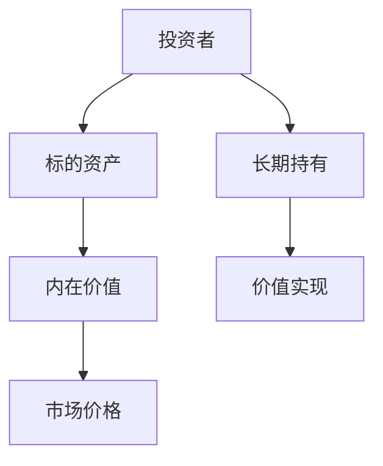
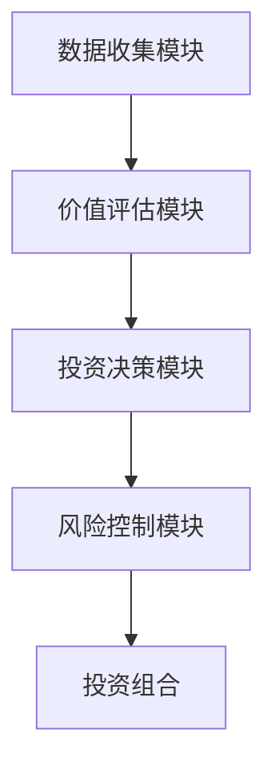
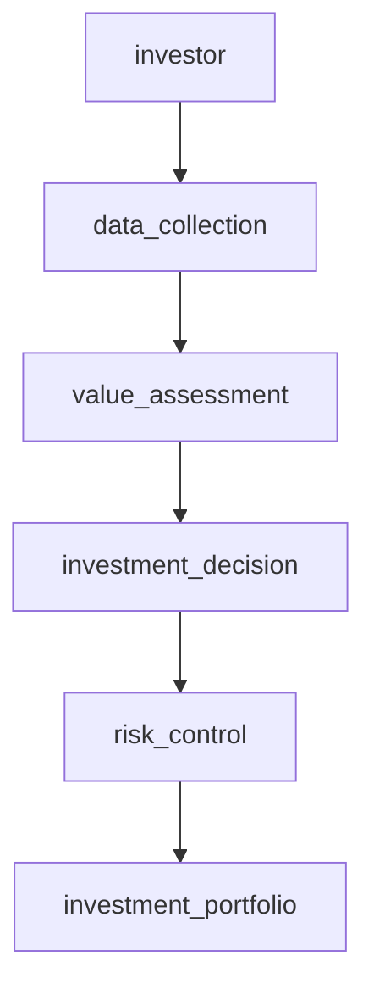

                 


# 价值投资者的耐心：长期持有的重要性

> 关键词：价值投资、耐心、长期持有、内在价值、安全边际、投资策略、数学模型

> 摘要：价值投资是一种以长期持有的方式，通过深入分析标的资产的内在价值，以低于内在价值的价格买入并长期持有的投资策略。本文从价值投资的核心理念出发，结合数学模型和算法原理，详细分析了长期持有在价值投资中的重要性，并通过系统设计和实际案例，展示了如何在实际投资中应用这些策略。文章还总结了价值投资的最佳实践和注意事项，为投资者提供了实用的指导。

---

# 第一部分: 价值投资的背景与核心理念

# 第1章: 价值投资的起源与核心理念

## 1.1 价值投资的起源

### 1.1.1 价值投资的定义

价值投资是一种以分析标的资产的内在价值为基础，以低于内在价值的价格买入并长期持有的投资策略。其核心在于寻找市场低估的资产，并通过长期持有实现价值回归。

### 1.1.2 价值投资的核心理念

价值投资的核心理念包括以下几点：

1. **安全边际**：买入价格低于内在价值，确保投资的安全性。
2. **长期持有**：通过时间的推移，内在价值逐步体现，实现收益。
3. **逆人性**：在市场恐慌时买入，在市场狂热时卖出。

### 1.1.3 价值投资与短期投资的对比

| 对比维度       | 价值投资                | 短期投资                |
|----------------|-------------------------|-------------------------|
| 投资目标       | 追求长期稳定的收益      | 追求短期收益最大化      |
| 投资策略       | 深入分析，长期持有      | 短期交易，频繁操作      |
| 风险控制       | 通过安全边际降低风险    | 通过止损控制风险        |

### 1.1.4 价值投资的边界与外延

价值投资的适用范围主要集中在股票、债券等资产类别，其局限性在于对市场短期波动的无能为力。与成长投资相比，价值投资更注重当前的估值，而成长投资则更关注未来的增长潜力。

### 1.1.5 价值投资的核心要素

#### 核心要素的定义

价值投资的核心要素包括：

1. **内在价值**：资产未来现金流的现值。
2. **安全边际**：买入价格与内在价值的差距。
3. **长期持有**：通过时间实现价值回归。

#### 核心要素的特征对比

| 核心要素       | 定义                         | 特征对比                  |
|----------------|------------------------------|---------------------------|
| 内在价值       | 资产未来现金流的现值         | 客观、可计算、受时间影响   |
| 安全边际       | 买入价格与内在价值的差距     | 提供安全垫，降低投资风险   |
| 长期持有       | 投资者长期持有标的资产       | 通过时间实现价值回归，平滑短期波动 |

#### 核心要素的ER实体关系图



### 1.1.6 本章小结

本章从价值投资的起源出发，详细介绍了其核心理念、核心要素以及与短期投资的对比。通过安全边际、内在价值和长期持有的分析，为后续的数学模型和算法原理奠定了基础。

---

## 1.2 耐心与长期持有的重要性

### 1.2.1 耐心在价值投资中的作用

耐心是价值投资成功的关键因素之一，主要体现在以下几个方面：

1. **避免短期波动的干扰**：市场短期波动可能导致投资者恐慌性抛售，耐心能够帮助投资者坚持持有，避免损失。
2. **实现价值回归**：内在价值的实现通常需要时间，耐心使得投资者能够在较长的时间内获得收益。
3. **降低交易成本**：频繁交易会增加佣金和税费成本，耐心能够减少交易次数，降低成本。

### 1.2.2 长期持有的意义

长期持有是价值投资的核心策略之一，其意义包括：

1. **平滑短期波动**：长期持有能够摊薄短期亏损，减少波动对投资组合的影响。
2. **实现复利效应**：通过长期持有，投资者能够享受复利效应，实现财富的长期增长。
3. **降低交易成本**：长期持有减少了交易次数，降低了交易成本。

### 1.2.3 长期持有与短期波动的关系

长期持有并不意味着完全忽视短期波动，而是通过时间和复利效应来平滑波动。以下是长期持有与短期波动的关系：

| 关系维度       | 长期持有               | 短期波动               |
|----------------|------------------------|------------------------|
| 投资目标       | 稳定的长期收益         | 短期收益最大化         |
| 风险控制       | 通过时间分散风险       | 通过止损控制风险       |
| 投资策略       | 长期持有，价值回归     | 短期交易，捕捉波动     |

### 1.2.4 价值投资中的耐心管理

耐心管理是价值投资成功的关键，主要包括：

1. **坚持价值投资理念**：在市场狂热时保持冷静，在市场恐慌时保持信心。
2. **定期复盘**：通过定期复盘，评估投资组合的表现，调整投资策略。
3. **持续学习**：通过学习不断优化自己的投资理念和方法。

### 1.2.5 本章小结

本章详细分析了耐心在价值投资中的重要性，强调了长期持有的意义，并通过对比长期持有与短期波动的关系，为后续的数学模型和算法原理奠定了基础。

---

## 1.3 价值投资的数学模型与算法原理

### 1.3.1 价值评估的数学模型

#### 现金流折现模型（DCF）

现金流折现模型是价值投资中最常用的数学模型之一，其核心是通过将未来现金流折现，计算资产的内在价值。

公式：
$$ PV = \sum_{t=1}^{n} \frac{CF_t}{(1+r)^t} $$

其中：
- \( PV \)：内在价值
- \( CF_t \)：第 \( t \) 年的现金流
- \( r \)：折现率
- \( n \)：现金流的期限

#### 市盈率与市净率分析

市盈率（PE）和市净率（PB）是常用的估值指标，其公式分别为：

$$ PE = \frac{P}{E} $$
$$ PB = \frac{P}{B} $$

其中：
- \( P \)：市场价格
- \( E \)：每股收益
- \( B \)：每股净资产

### 1.3.2 投资决策的算法原理

#### 算法实现的Python代码示例

```python
def calculate_intrinsic_value(cash_flows, discount_rate):
    return sum(cf / (1 + discount_rate) ** t for t, cf in enumerate(cash_flows))

# 示例数据
cash_flows = [100, 150, 200, 250]
discount_rate = 0.08

# 计算内在价值
intrinsic_value = calculate_intrinsic_value(cash_flows, discount_rate)
print(f"内在价值: {intrinsic_value:.2f}")
```

### 1.3.3 算法的数学公式与详细讲解

#### 现金流折现公式的详细讲解

现金流折现模型通过将未来现金流折现，计算资产的内在价值。以下是详细步骤：

1. **确定未来现金流**：预测资产未来每期的现金流。
2. **选择折现率**：根据市场利率和风险偏好选择合适的折现率。
3. **计算现值**：将每期现金流折现，并求和得到内在价值。

#### 市盈率与市净率的实际分析

市盈率和市净率是常用的估值指标，以下是实际分析步骤：

1. **计算市盈率**：将市场价格除以每股收益。
2. **计算市净率**：将市场价格除以每股净资产。
3. **对比分析**：通过对比市盈率和市净率与行业平均水平，判断资产是否低估。

### 1.3.4 举例说明

#### DCF模型的应用案例

假设某公司未来5年的现金流分别为100、150、200、250、300万元，折现率为8%。

计算内在价值：
$$ PV = \frac{100}{1.08^1} + \frac{150}{1.08^2} + \frac{200}{1.08^3} + \frac{250}{1.08^4} + \frac{300}{1.08^5} $$

计算结果为：
$$ PV ≈ 423.73 \text{万元} $$

#### 市盈率与市净率的实际分析

假设某公司股票的价格为20元，每股收益为2元，每股净资产为5元。

计算市盈率和市净率：
$$ PE = \frac{20}{2} = 10 $$
$$ PB = \frac{20}{5} = 4 $$

如果行业平均市盈率为12，平均市净率为5，则该公司的股票被低估。

### 1.3.5 本章小结

本章详细介绍了价值投资中的数学模型和算法原理，包括现金流折现模型、市盈率和市净率的分析方法，并通过示例说明了如何在实际中应用这些模型。

---

## 1.4 价值投资的系统分析与架构设计

### 1.4.1 系统功能设计

价值投资的系统功能设计包括以下几个方面：

1. **数据收集**：收集标的资产的财务数据和市场数据。
2. **价值评估**：使用数学模型计算内在价值。
3. **投资决策**：根据评估结果制定投资策略。
4. **风险控制**：通过安全边际和分散投资降低风险。

### 1.4.2 系统架构设计

以下是价值投资系统的架构设计：



### 1.4.3 系统交互设计

以下是系统交互流程图：



### 1.4.4 本章小结

本章通过系统分析与架构设计，展示了如何将价值投资的理念应用于实际投资中，包括数据收集、价值评估、投资决策和风险控制等模块。

---

## 1.5 价值投资的项目实战

### 1.5.1 项目环境与工具安装

以下是项目实战所需的环境和工具：

1. **Python**：用于数据分析和计算。
2. **Pandas**：用于数据处理。
3. **NumPy**：用于数值计算。
4. **Matplotlib**：用于数据可视化。

安装命令：
```bash
pip install pandas numpy matplotlib
```

### 1.5.2 核心代码实现

以下是价值评估的核心代码实现：

```python
import pandas as pd
import numpy as np

def calculate_intrinsic_value(cash_flows, discount_rate):
    return sum(cf / (1 + discount_rate) ** t for t, cf in enumerate(cash_flows))

# 示例数据
cash_flows = [100, 150, 200, 250]
discount_rate = 0.08

# 计算内在价值
intrinsic_value = calculate_intrinsic_value(cash_flows, discount_rate)
print(f"内在价值: {intrinsic_value:.2f}")

# 计算市盈率和市净率
def calculate_pe pb(price, eps, bvps):
    pe = price / eps
    pb = price / bvps
    return pe, pb

price = 20
eps = 2
bvps = 5
pe, pb = calculate_pe pb(price, eps, bvps)
print(f"市盈率: {pe:.2f}, 市净率: {pb:.2f}")
```

### 1.5.3 项目实战的案例分析

#### 案例分析：苹果公司

假设苹果公司的财务数据如下：

- 市场价格：150美元
- 每股收益：10美元
- 每股净资产：50美元
- 预测未来5年的现金流分别为：100亿、120亿、140亿、160亿、180亿美元
- 折现率：8%

计算内在价值：
$$ PV = \frac{100}{1.08^1} + \frac{120}{1.08^2} + \frac{140}{1.08^3} + \frac{160}{1.08^4} + \frac{180}{1.08^5} ≈ 493.23 \text{亿美元} $$

计算市盈率和市净率：
$$ PE = \frac{150}{10} = 15 $$
$$ PB = \frac{150}{50} = 3 $$

如果苹果公司的内在价值为493.23亿美元，市场价格为150亿美元，则该股票被低估。

### 1.5.4 项目实战的小结

本章通过实际案例分析，展示了如何将价值投资的理念应用于实际投资中，包括数据收集、价值评估和投资决策等步骤。

---

## 1.6 价值投资的最佳实践

### 1.6.1 价值投资的注意事项

1. **避免情绪化决策**：投资决策应基于理性分析，避免情绪化操作。
2. **分散投资**：通过分散投资降低风险。
3. **定期复盘**：定期评估投资组合的表现，调整投资策略。

### 1.6.2 价值投资的拓展阅读

1. **《价值》**：李杰著，详细介绍了价值投资的理论和实践。
2. **《投资的艺术》**：约翰·博格著，探讨了价值投资与长期持有的重要性。
3. **《证券分析》**：本杰明·格雷厄姆著，价值投资的奠基之作。

### 1.6.3 本章小结

本章总结了价值投资的最佳实践，包括注意事项和拓展阅读等内容，为投资者提供了实用的指导。

---

# 第二部分: 价值投资的系统分析与架构设计

## 2.1 系统功能设计

### 2.1.1 数据收集模块

数据收集模块负责收集标的资产的财务数据和市场数据，包括：

1. **财务数据**：收入、利润、现金流等。
2. **市场数据**：股价、市盈率、市净率等。

### 2.1.2 价值评估模块

价值评估模块使用数学模型计算标的资产的内在价值，包括：

1. **现金流折现模型**：计算内在价值。
2. **市盈率和市净率分析**：评估标的资产的估值水平。

### 2.1.3 投资决策模块

投资决策模块根据评估结果制定投资策略，包括：

1. **安全边际分析**：判断标的资产是否被低估。
2. **投资组合优化**：通过分散投资降低风险。

### 2.1.4 风险控制模块

风险控制模块通过安全边际和分散投资降低风险，包括：

1. **安全边际分析**：确保买入价格低于内在价值。
2. **分散投资**：通过投资不同资产降低风险。

## 2.2 系统架构设计

以下是价值投资系统的架构设计：


## 2.3 系统交互设计

以下是系统交互流程图：


## 2.4 本章小结

本章通过系统分析与架构设计，展示了如何将价值投资的理念应用于实际投资中，包括数据收集、价值评估、投资决策和风险控制等模块。

---

# 第三部分: 价值投资的项目实战

## 3.1 项目环境与工具安装

### 3.1.1 项目环境

以下是项目实战所需的环境和工具：

1. **Python**：用于数据分析和计算。
2. **Pandas**：用于数据处理。
3. **NumPy**：用于数值计算。
4. **Matplotlib**：用于数据可视化。

安装命令：
```bash
pip install pandas numpy matplotlib
```

## 3.2 核心代码实现

### 3.2.1 价值评估的核心代码

以下是价值评估的核心代码实现：

```python
import pandas as pd
import numpy as np

def calculate_intrinsic_value(cash_flows, discount_rate):
    return sum(cf / (1 + discount_rate) ** t for t, cf in enumerate(cash_flows))

# 示例数据
cash_flows = [100, 150, 200, 250]
discount_rate = 0.08

# 计算内在价值
intrinsic_value = calculate_intrinsic_value(cash_flows, discount_rate)
print(f"内在价值: {intrinsic_value:.2f}")

# 计算市盈率和市净率
def calculate_pe_pb(price, eps, bvps):
    pe = price / eps
    pb = price / bvps
    return pe, pb

price = 20
eps = 2
bvps = 5
pe, pb = calculate_pe_pb(price, eps, bvps)
print(f"市盈率: {pe:.2f}, 市净率: {pb:.2f}")
```

## 3.3 项目实战的案例分析

### 3.3.1 案例分析：苹果公司

假设苹果公司的财务数据如下：

- 市场价格：150美元
- 每股收益：10美元
- 每股净资产：50美元
- 预测未来5年的现金流分别为：100亿、120亿、140亿、160亿、180亿美元
- 折现率：8%

计算内在价值：
$$ PV = \frac{100}{1.08^1} + \frac{120}{1.08^2} + \frac{140}{1.08^3} + \frac{160}{1.08^4} + \frac{180}{1.08^5} ≈ 493.23 \text{亿美元} $$

计算市盈率和市净率：
$$ PE = \frac{150}{10} = 15 $$
$$ PB = \frac{150}{50} = 3 $$

如果苹果公司的内在价值为493.23亿美元，市场价格为150亿美元，则该股票被低估。

### 3.3.2 投资决策

基于以上分析，投资者可以做出以下投资决策：

1. **买入决策**：如果内在价值高于市场价格，且安全边际足够大，则考虑买入。
2. **持有决策**：如果内在价值与市场价格接近，且安全边际不足，则考虑持有。
3. **卖出决策**：如果内在价值低于市场价格，则考虑卖出。

## 3.4 项目实战的小结

本章通过实际案例分析，展示了如何将价值投资的理念应用于实际投资中，包括数据收集、价值评估和投资决策等步骤。

---

# 第四部分: 价值投资的最佳实践

## 4.1 价值投资的注意事项

### 4.1.1 避免情绪化决策

投资决策应基于理性分析，避免情绪化操作。以下是避免情绪化决策的建议：

1. **制定投资计划**：在市场波动时，按照预先制定的投资计划操作。
2. **定期复盘**：定期评估投资组合的表现，调整投资策略。
3. **分散投资**：通过分散投资降低风险。

### 4.1.2 分散投资

分散投资是降低风险的重要策略，以下是分散投资的建议：

1. **投资不同资产类别**：通过投资股票、债券等不同资产类别分散风险。
2. **投资不同行业**：通过投资不同行业的标的资产分散风险。
3. **投资不同地域**：通过投资不同地域的标的资产分散风险。

### 4.1.3 定期复盘

定期复盘是优化投资策略的重要步骤，以下是定期复盘的建议：

1. **评估投资组合的表现**：定期评估投资组合的收益和风险。
2. **调整投资策略**：根据市场变化和个人情况调整投资策略。
3. **学习和总结**：通过复盘学习投资经验，总结教训。

## 4.2 价值投资的拓展阅读

### 4.2.1 价值投资的经典书籍

1. **《价值》**：李杰著，详细介绍了价值投资的理论和实践。
2. **《投资的艺术》**：约翰·博格著，探讨了价值投资与长期持有的重要性。
3. **《证券分析》**：本杰明·格雷厄姆著，价值投资的奠基之作。

### 4.2.2 价值投资的在线资源

1. **巴菲特股东大会**：通过观看巴菲特股东大会了解价值投资的理念。
2. **投资博客**：通过阅读知名投资博客了解价值投资的最新动态。
3. **投资论坛**：通过参与投资论坛讨论价值投资的相关话题。

## 4.3 价值投资的实践总结

### 4.3.1 价值投资的成功案例

以下是价值投资的成功案例：

- **巴菲特**：通过长期持有优质资产，实现财富的长期增长。
- **芒格**：通过深入分析标的资产的内在价值，实现投资的成功。

### 4.3.2 价值投资的失败案例

以下是价值投资的失败案例：

- **长期资本管理公司（LTCM）**：由于过度杠杆和错误的投资策略，导致公司破产。
- **某些对冲基金**：由于忽视安全边际，导致投资失败。

## 4.4 本章小结

本章总结了价值投资的最佳实践，包括注意事项和拓展阅读等内容，为投资者提供了实用的指导。

---

# 第五部分: 总结与展望

## 5.1 总结

### 5.1.1 价值投资的核心理念

价值投资是一种以长期持有的方式，通过深入分析标的资产的内在价值，以低于内在价值的价格买入并长期持有的投资策略。

### 5.1.2 长期持有的重要性

长期持有是价值投资的核心策略之一，其重要性体现在以下几个方面：

1. **平滑短期波动**：长期持有能够摊薄短期亏损，减少波动对投资组合的影响。
2. **实现复利效应**：通过长期持有，投资者能够享受复利效应，实现财富的长期增长。
3. **降低交易成本**：长期持有减少了交易次数，降低了交易成本。

### 5.1.3 价值投资的成功关键

价值投资的成功关键在于耐心和长期持有，以下是成功的关键点：

1. **坚持价值投资理念**：在市场狂热时保持冷静，在市场恐慌时保持信心。
2. **定期复盘**：通过定期复盘，评估投资组合的表现，调整投资策略。
3. **持续学习**：通过学习不断优化自己的投资理念和方法。

## 5.2 展望

### 5.2.1 价值投资的未来发展趋势

随着市场的发展和投资者对长期持有的认识的提高，价值投资的未来发展趋势包括：

1. **量化投资**：通过量化模型实现价值投资的理念。
2. **智能投顾**：通过人工智能技术提供个性化的投资建议。
3. **ESG投资**：通过考虑环境、社会和治理因素，实现长期稳定的收益。

### 5.2.2 价值投资的未来挑战

价值投资的未来挑战包括：

1. **市场波动的加剧**：全球经济的不确定性可能导致市场波动加剧。
2. **技术进步的挑战**：技术进步可能导致传统价值投资策略的失效。
3. **投资者心理的挑战**：投资者心理的不稳定可能导致投资策略的偏离。

## 5.3 总结与展望的小结

本章总结了价值投资的核心理念和长期持有的重要性，并展望了价值投资的未来发展趋势和挑战，为投资者提供了对未来投资的展望。

---

# 结语

价值投资是一种以长期持有的方式，通过深入分析标的资产的内在价值，以低于内在价值的价格买入并长期持有的投资策略。长期持有是价值投资的核心策略之一，其重要性体现在平滑短期波动、实现复利效应和降低交易成本等方面。通过耐心和长期持有，投资者能够实现财富的长期增长。未来，随着市场的发展和投资者对长期持有的认识的提高，价值投资将会有更加广阔的发展前景。

