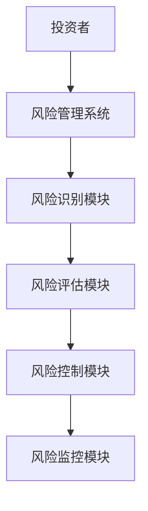
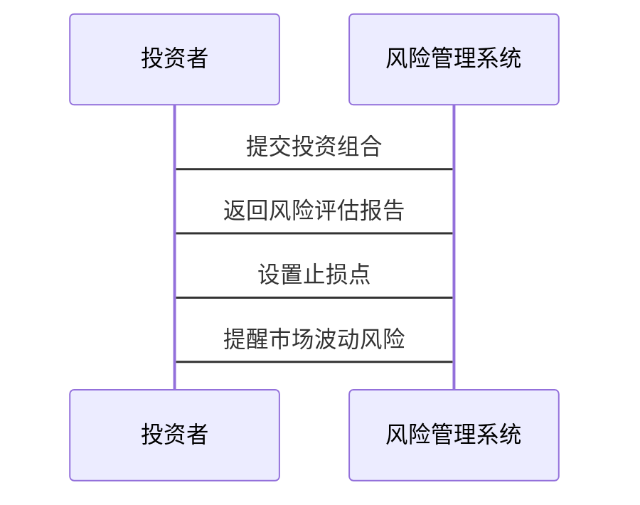

                 


# 价值投资者的风险管理：如何在追求收益的同时控制风险

---

## 关键词：
价值投资、风险管理、投资组合、风险控制、收益最大化

---

## 摘要：
本文深入探讨了价值投资者在追求收益的同时如何有效管理风险。文章从价值投资的核心理念出发，分析了风险管理的重要性，并提出了具体的风险管理策略。通过系统分析和实战案例，本文为投资者提供了在复杂市场环境中实现收益与风险平衡的实用方法。

---

## 第一部分：价值投资与风险管理的引言

### 第1章：价值投资与风险管理概述

#### 1.1 投资的基本概念
- **1.1.1 投资的定义与分类**
  - 投资是指将资金用于购买资产，以期在未来获得收益或资本增值的行为。
  - 分类：股票、债券、房地产、黄金、货币等。

- **1.1.2 价值投资的核心理念**
  - 价值投资是由本杰明·格雷厄姆等投资大师提出的，强调以低于内在价值的价格购买优质资产。
  - 核心理念：安全边际、长期视角、逆向思维。

- **1.1.3 风险管理的重要性**
  - 风险管理是指在投资过程中识别、评估和控制风险的全过程。
  - 有效管理风险是实现长期收益的基石。

#### 1.2 价值投资者的目标与挑战
- **1.2.1 追求收益的动机**
  - 价值投资者追求的是长期稳定的收益，而非短期暴利。
  - 通过深入研究和合理估值，寻找被市场低估的投资机会。

- **1.2.2 风险控制的必要性**
  - 投资市场存在不确定性，风险控制是确保投资组合稳健的关键。
  - 过度冒险可能导致本金损失，影响长期收益目标。

- **1.2.3 价值投资中的常见风险**
  - 市场波动风险：短期市场波动可能影响资产价格。
  - 估值风险：低估或高估资产价值可能导致投资失败。
  - 经济周期风险：经济波动对某些行业或资产的影响较大。

---

## 第二部分：价值投资的背景与基础

### 第2章：价值投资的背景与发展

#### 2.1 价值投资的起源与发展
- **2.1.1 价值投资的起源**
  - 20世纪初，本杰明·格雷厄姆和戴维·多德提出价值投资理念。
  - 格雷厄姆的《证券分析》和《聪明的投资者》奠定了价值投资的基础。

- **2.1.2 价值投资的发展历程**
  - 从早期的“基本面分析”到现代的量化投资，价值投资不断演变。
  - 不同市场环境下的应用和发展。

- **2.1.3 价值投资的核心人物**
  - 格雷厄姆：安全边际、margin of safety。
  - �巴菲特：格雷厄姆的信徒，强调长期价值和企业护城河。

### 第3章：价值投资的核心理念

#### 3.1 市场先生的概念
- 市场先生是格雷厄姆提出的虚拟人物，代表市场情绪。
- 市场先生每天提供买卖价格，但其情绪波动可能导致价格偏离内在价值。
- 投资者应利用市场先生的错误，以合理价格买入优质资产。

#### 3.2 安全边际的重要性
- 安全边际是指买入价格与内在价值之间的差距。
- 安全边际越大，投资风险越小，收益潜力越大。
- 安全边际是抵御市场波动的重要保障。

#### 3.3 股价波动与内在价值的关系
- 股价围绕内在价值波动，但长期趋近于内在价值。
- 价值投资者应关注长期趋势，而非短期波动。
- 内在价值是投资决策的核心依据。

---

## 第三部分：风险管理的核心概念

### 第4章：风险管理的核心概念

#### 4.1 风险的定义与分类
- **4.1.1 风险的定义**
  - 风险是指在投资过程中可能遭受损失或未能实现预期收益的可能性。
  - 风险是收益的对立面，高风险可能带来高收益，但也可能带来重大损失。

- **4.1.2 风险的分类**
  - 系统性风险：市场整体波动带来的风险，如经济衰退、通货膨胀等。
  - 非系统性风险：特定资产或行业带来的风险，如公司业绩下滑、管理问题等。
  - 流动性风险：资产难以快速变现的风险。

- **4.1.3 风险与收益的关系**
  - 高风险可能带来高收益，但并非所有高风险投资都能带来高收益。
  - 价值投资者追求的是在可控风险下的最大收益。

#### 4.2 风险管理的必要性
- **4.2.1 风险管理的目标**
  - 确保投资组合的长期稳健增长。
  - 避免重大损失，保持投资本金的安全。

- **4.2.2 风险管理的流程**
  - 识别风险：分析投资组合中的潜在风险。
  - 评估风险：量化风险的影响程度。
  - 制定策略：采取措施降低或控制风险。
  - 监控风险：持续跟踪风险变化，及时调整策略。

- **4.2.3 风险管理的工具与方法**
  - 分散投资：通过多样化投资降低非系统性风险。
  - 估值分析：确保买入价格低于内在价值，降低估值风险。
  - 止损策略：设定止损点，避免重大损失。

---

## 第四部分：价值投资中的风险管理策略

### 第5章：价值投资中的风险管理策略

#### 5.1 风险管理与价值投资策略的结合
- 价值投资强调安全边际，本质上是一种风险管理方法。
- 通过合理估值和分散投资降低风险。
- 在市场恐慌时寻找低估资产，利用市场情绪波动。

#### 5.2 止损策略的应用
- 止损是风险管理的重要工具，用于限制潜在损失。
- 确定止损点的方法：技术分析、估值分析、市场情绪等。
- 止损策略的优缺点：能够限制损失，但也可能错过后期反弹机会。

#### 5.3 投资组合的分散化
- 分散化是降低非系统性风险的有效方法。
- 通过投资不同行业、不同地区的资产降低风险。
- 分散化与价值投资的结合：选择多个优质资产，降低单一资产风险。

#### 5.4 风险控制的实战案例
- 案例分析：2008年金融危机期间，价值投资者如何通过分散化和安全边际避免重大损失。
- 案例解读：通过分散投资和严格估值，价值投资者在危机中表现优异。

---

## 第五部分：风险管理的系统分析与架构设计

### 第6章：风险管理的系统分析

#### 6.1 系统功能设计
- 投资者需要一个系统化的风险管理框架。
- 系统功能包括：风险识别、风险评估、风险控制、风险监控。

#### 6.2 系统架构设计
- 使用 Mermaid 绘制系统架构图：



#### 6.3 系统接口设计
- 投资者与系统交互的主要接口：风险评估报告、投资组合分析、止损设置等。

#### 6.4 系统交互流程
- 使用 Mermaid 绘制交互流程图：



---

## 第六部分：风险管理的项目实战

### 第7章：风险管理的项目实战

#### 7.1 环境安装与配置
- 需要安装的投资分析工具：Excel、Python、Matplotlib等。
- 数据源：获取历史价格数据、财务数据等。

#### 7.2 核心代码实现
- 使用 Python 实现风险管理系统的部分功能：

```python
import pandas as pd
import numpy as np

def calculate_value_at_risk(returns, confidence_level=0.95):
    # 计算 VaR
    sorted_returns = np.sort(returns)
    var_index = int(len(sorted_returns) * (1 - confidence_level))
    var = sorted_returns[var_index]
    return var

# 示例数据：历史收益率
returns = pd.read_csv('returns.csv')
var = calculate_value_at_risk(returns['returns'].values)
print(f"VaR at {confidence_level} confidence level: {var}")
```

#### 7.3 案例分析与解读
- 实战案例：构建一个包含股票、债券、黄金的投资组合。
- 使用 VaR 和其他风险指标评估组合风险。
- 通过历史数据验证风险管理策略的有效性。

#### 7.4 项目总结与经验分享
- 项目小结：通过系统化的方法和工具，实现投资组合的风险管理。
- 经验分享：风险管理需要持续学习和调整，适应市场变化。

---

## 第七部分：风险管理的心理因素与长期策略

### 第8章：风险管理的心理因素

#### 8.1 投资者心理与风险管理
- 认知偏差对投资决策的影响。
- 情绪化决策的危害：贪婪与恐惧导致过度交易。

#### 8.2 如何克服心理障碍
- 建立合理的投资框架，避免情绪化决策。
- 通过长期学习和实践，培养纪律性。

### 第9章：风险管理的长期策略

#### 9.1 长期视角下的风险管理
- 价值投资强调长期视角，风险管理也不例外。
- 通过复利效应实现长期稳健收益。

#### 9.2 定期复盘与策略调整
- 定期回顾投资组合的表现，评估风险管理的有效性。
- 根据市场变化调整风险控制策略。

---

## 第八部分：风险管理的未来趋势

### 第10章：风险管理的未来趋势

#### 10.1 技术进步对风险管理的影响
- 大数据分析与人工智能在风险管理中的应用。
- 高频交易与算法交易对市场风险的影响。

#### 10.2 未来风险管理的挑战与机遇
- 全球化市场中的风险管理。
- 新兴市场与创新金融工具的风险分析。

---

## 第九部分：总结与展望

### 第11章：总结与展望

#### 11.1 全文总结
- 价值投资者必须在追求收益的同时，重视风险管理。
- 风险管理是实现长期稳健收益的关键。

#### 11.2 对未来投资的展望
- 随着市场的变化，风险管理策略需要不断创新。
- 价值投资者应持续学习，适应市场环境。

---

## 最佳实践 Tips

- **风险管理是投资的首要任务**：在做出任何投资决策之前，先评估潜在风险。
- **分散投资是降低风险的有效方法**：不要将所有资金投入单一资产或行业。
- **保持长期视角**：短期波动是暂时的，长期趋势才是关键。
- **定期复盘与调整**：市场环境不断变化，风险管理策略也需要与时俱进。

---

## 附录

### 附录A：常用风险管理工具
- VaR（Value at Risk）
- R平方（R-Squared）
- 标准差（Standard Deviation）
- 最大回撤（Maximum Drawdown）

### 附录B：风险管理的数学公式

#### 1. VaR 的计算公式
$$ VaR = \text{P}_{n - (1 - \alpha)} $$

其中，$$ \alpha $$ 是置信水平，$$ n $$ 是样本数量。

#### 2. 标准差的计算公式
$$ \sigma = \sqrt{\frac{1}{N} \sum_{i=1}^{N} (x_i - \mu)^2} $$

其中，$$ \mu $$ 是平均值，$$ N $$ 是数据点数量。

---

## 作者简介

* 作者：[您的姓名]
* 职位：[您的职位]
* 书籍：[书籍名称]
* 出版社：[出版社名称]
* 出版时间：[出版日期]
* 联系方式：[联系方式]

---

通过以上结构，您可以逐步展开每一章的内容，深入探讨价值投资者的风险管理策略，并结合实际案例和系统设计，为读者提供实用的指导。

