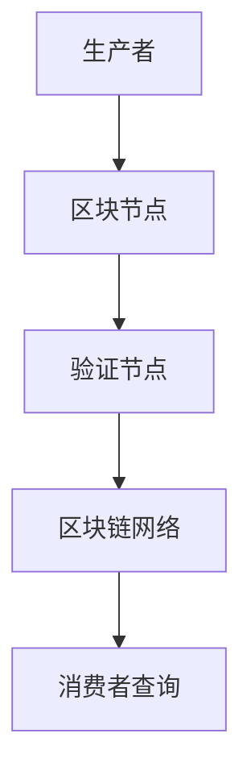
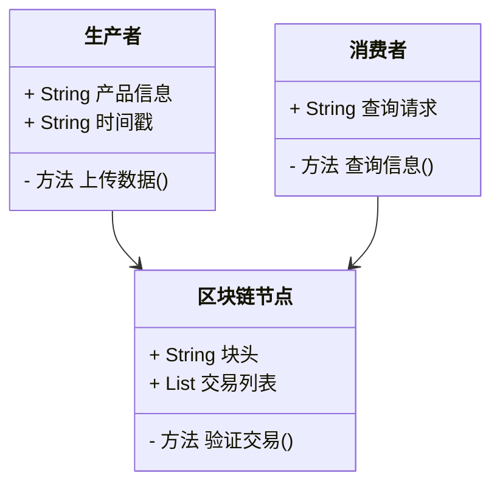

                 


# 价值投资视角下的智慧农业区块链溯源系统

> **关键词**: 区块链、智慧农业、溯源系统、价值投资、算法原理、系统架构

> **摘要**: 本文从价值投资的角度深入分析智慧农业中的区块链溯源系统，探讨其技术原理、系统设计、项目实战及投资潜力。通过详细的技术分析和实际案例，揭示区块链如何提升农业产业链的透明度和效率，为投资者提供新的投资机会。

---

## 第一章: 智慧农业与区块链的背景与现状

### 1.1 智慧农业的发展背景

#### 1.1.1 农业现代化的必要性
随着全球人口的增长和资源的有限性，农业现代化成为提高生产效率和保障粮食安全的关键。传统农业模式依赖人工劳动，效率低下且难以规模化。通过智慧农业技术的应用，可以实现精准种植、资源优化配置和环境监测，从而提高产量和质量。

#### 1.1.2 智慧农业的概念与特征
智慧农业是将信息技术、物联网、大数据和人工智能等技术应用于农业生产、管理和服务中的新型农业模式。其核心特征包括：
- **数据驱动**：利用传感器、无人机和物联网设备实时收集农田数据。
- **自动化**：通过智能系统实现自动监测、预警和决策。
- **精准化**：根据环境和作物需求进行精准管理和资源分配。

#### 1.1.3 区块链技术的兴起与应用
区块链是一种分布式账本技术，具有去中心化、不可篡改和透明性等特点。在农业中，区块链技术可以用于产品溯源、支付结算和智能合约管理，提升产业链的透明度和信任度。

---

### 1.2 区块链技术的核心优势

#### 1.2.1 区块链的基本概念与技术特点
区块链是一个由多个节点组成的分布式数据库，每个节点存储完整的账本副本。其核心特点包括：
- **去中心化**：无需依赖中心机构，数据由所有节点共同维护。
- **不可篡改**：通过密码学和共识机制确保数据的安全性和真实性。
- **透明性**：所有交易记录在区块链上公开可查，确保信息透明。

#### 1.2.2 区块链在农业中的应用潜力
区块链技术在农业中的应用主要体现在产品溯源、支付结算和智能合约管理方面。例如，消费者可以通过区块链查询农产品的生产、加工和运输信息，确保产品的来源可追溯。

#### 1.2.3 智慧农业区块链溯源系统的必要性
传统的农业溯源系统存在信息孤岛、数据不一致和信任缺失等问题。通过区块链技术，可以构建一个高效、透明和可信的溯源系统，提升消费者对农产品的信任，增加市场竞争力。

---

## 第二章: 区块链溯源系统的概念与核心要素

### 2.1 区块链溯源系统的定义

#### 2.1.1 溯源系统的概念
溯源系统是一种通过记录和追踪产品生命周期信息，确保产品来源真实可靠的技术系统。在农业中，溯源系统可以用于追踪农产品的生产、加工和运输过程。

#### 2.1.2 区块链技术在溯源中的作用
区块链技术通过去中心化和不可篡改的特点，为溯源系统提供了更高的安全性和透明度。每个农产品的信息都被记录在区块链上，确保信息的真实性和可追溯性。

---

### 2.2 区块链溯源系统的组成要素

#### 2.2.1 参与者角色分析
区块链溯源系统中的参与者包括：
- **生产者**：负责农产品的生产、加工和包装。
- **消费者**：购买和使用农产品的终端用户。
- **监管机构**：负责监督和管理农产品的质量和安全。
- **区块链平台**：提供区块链技术支持和数据存储服务。

#### 2.2.2 数据存储结构
区块链溯源系统的数据存储结构包括：
- **区块**：包含交易记录和时间戳，每个区块通过哈希值与前一个区块相连。
- **链式结构**：通过链式结构保证数据的不可篡改和可追溯性。

#### 2.2.3 交易流程与规则
区块链溯源系统的交易流程包括：
1. **数据采集**：通过传感器和物联网设备采集农产品的生产、运输和销售信息。
2. **数据上链**：将数据打包成交易，通过共识机制写入区块链。
3. **查询与验证**：消费者可以通过区块链查询和验证农产品的溯源信息。

---

### 2.3 区块链溯源系统的属性特征对比

#### 2.3.1 区块链与传统溯源系统的对比
| **特性**       | **区块链**       | **传统系统**       |
|------------------|------------------|------------------|
| 中心化程度       | 去中心化          | 高中心化          |
| 数据安全性       | 高               | 较低              |
| 透明性           | 高               | 低               |
| 成本             | 较低             | 较高              |

#### 2.3.2 系统功能对比表格
| **功能**         | **区块链系统**    | **传统系统**       |
|--------------------|-------------------|--------------------|
| 数据存储         | 去中心化存储       | 中心化存储          |
| 数据验证         | 共识机制验证       | 人工验证            |
| 查询速度         | 快               | 较慢               |

#### 2.3.3 系统性能对比分析
区块链系统在数据安全性、透明性和去中心化方面具有明显优势，但在处理大规模数据时可能面临性能瓶颈。传统系统虽然在性能上具有优势，但在信任和透明度方面存在不足。

---

## 第三章: 区块链溯源系统的算法原理与实现

### 3.1 区块链共识机制的原理

#### 3.1.1 共识机制的定义与分类
共识机制是区块链系统中用于确认交易有效性的机制。常见的共识机制包括：
- **工作量证明（PoW）**：通过计算哈希值来验证交易。
- **权益证明（PoS）**：根据持币数量分配验证权。

#### 3.1.2 适用于农业溯源的共识机制选择
在农业溯源系统中，PoS机制更为适合，因为其能耗低且适合小额高频交易。



---

### 3.2 溯源系统中的数据加密与签名算法

#### 3.2.1 数据加密的基本原理
数据加密是通过加密算法将明文转换为密文的过程。常用的加密算法包括AES和RSA。

#### 3.2.2 数字签名的实现过程
数字签名是通过公钥加密算法实现的，确保数据的完整性和真实性。

```python
import hashlib

def compute_hash(data):
    return hashlib.sha256(data.encode()).hexdigest()

# 示例数据
data = "农产品信息"
hash_value = compute_hash(data)
print(hash_value)
```

#### 3.2.3 椭圆曲线加密在农业溯源中的应用
椭圆曲线加密（ECC）是一种安全性高、计算速度快的加密算法，广泛应用于区块链系统中。

---

### 3.3 区块链溯源系统的数学模型与公式

#### 3.3.1 区块链网络中的哈希函数
哈希函数用于将数据映射为固定长度的哈希值。

$$ H(x) = \text{hash}(x) $$

#### 3.3.2 智能合约的执行逻辑
智能合约是一种自动执行的脚本，通过区块链平台实现。

$$ \text{智能合约} = \{x | x \in \text{区块链} \} $$

---

## 第四章: 智慧农业区块链溯源系统的系统架构设计

### 4.1 系统功能模块划分

#### 4.1.1 数据采集模块
数据采集模块通过传感器和物联网设备采集农田的环境数据。

#### 4.1.2 区块链存储模块
区块链存储模块负责将数据打包成交易并写入区块链。

#### 4.1.3 溯源查询模块
溯源查询模块为消费者提供农产品的溯源信息查询服务。

---

### 4.2 系统架构的分层设计

#### 4.2.1 应用层设计
应用层包括数据采集、区块链交互和用户查询三个部分。

#### 4.2.2 数据层设计
数据层负责存储和管理区块链上的溯源数据。

#### 4.2.3 网络层设计
网络层负责数据的传输和区块链节点之间的通信。



---

## 第五章: 智慧农业区块链溯源系统的项目实战

### 5.1 环境安装与配置

#### 5.1.1 安装区块链平台
选择一个适合农业溯源的区块链平台，如Hyperledger Fabric。

#### 5.1.2 安装传感器和物联网设备
采购并部署传感器和物联网设备，采集农田的环境数据。

---

### 5.2 系统核心实现源代码

#### 5.2.1 数据采集模块
```python
import time

def collect_data(sensor):
    while True:
        data = sensor.read()
        print(f"采集到数据：{data}")
        time.sleep(1)
```

#### 5.2.2 区块链存储模块
```python
from blockchain import Blockchain

bc = Blockchain()
data = "农产品信息"
bc.add_block(data)
```

---

## 第六章: 最佳实践与投资分析

### 6.1 项目经验总结

#### 6.1.1 核心经验
- 区块链技术的应用提升了农业溯源系统的透明度和安全性。
- 数据采集和传感器设备的选择对系统的性能至关重要。

#### 6.1.2 项目小结
通过区块链技术实现的农业溯源系统，不仅提高了生产效率，还为消费者提供了可靠的产品信息，具有较高的市场潜力。

---

### 6.2 投资者视角下的农业区块链机会

#### 6.2.1 农业区块链的市场潜力
随着消费者对食品溯源需求的增加，农业区块链市场具有广阔的发展前景。

#### 6.2.2 投资策略建议
- **技术驱动**：投资具有核心技术优势的区块链平台。
- **市场需求**：关注具有明确市场需求的农业应用场景。
- **政策支持**：关注政府支持的农业区块链项目。

---

### 6.3 未来发展趋势

#### 6.3.1 技术创新
随着区块链技术的不断发展，农业区块链系统将更加智能化和高效化。

#### 6.3.2 市场拓展
农业区块链技术将逐步应用于更多的农业场景，如供应链管理和金融支付。

---

## 第七章: 总结

### 7.1 文章小结
本文从价值投资的角度深入分析了智慧农业区块链溯源系统的技术原理、系统设计和投资潜力。通过详细的分析和实际案例，揭示了区块链技术在农业中的巨大潜力和应用前景。

### 7.2 未来展望
随着区块链技术的不断进步和农业现代化的持续推进，智慧农业区块链溯源系统将成为农业产业的重要组成部分，为投资者带来丰厚的回报。

---

**附录**: 更多关于智慧农业区块链溯源系统的详细资料和代码实现请参考相关文献和技术文档。

