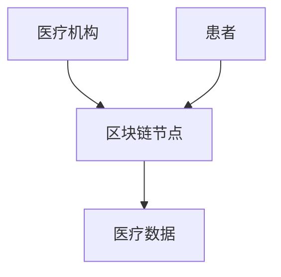
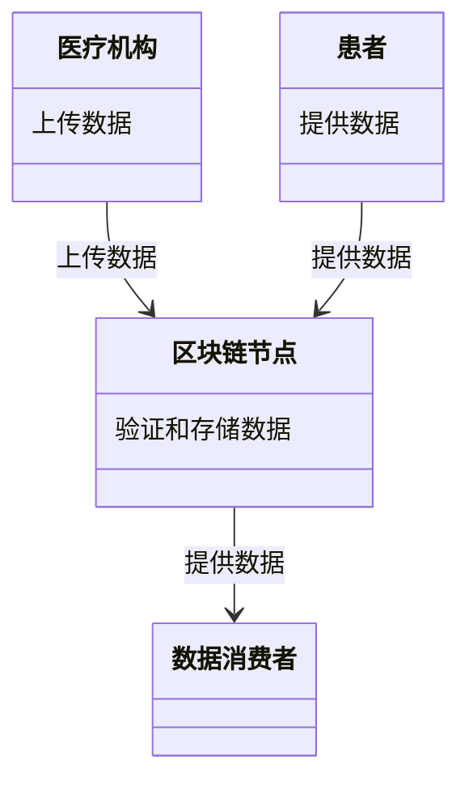
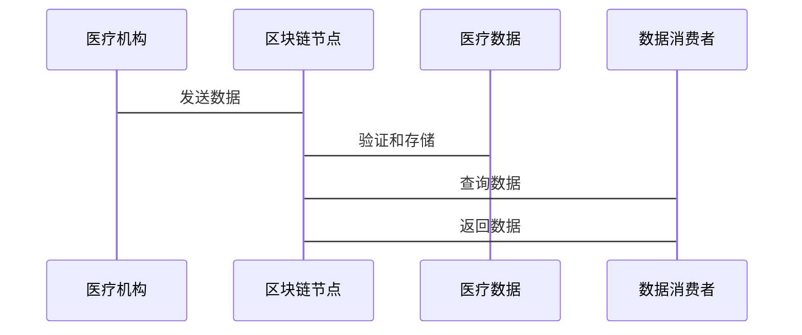

                 


```markdown
# 价值投资视角下的智慧医疗区块链数据共享系统

## 关键词
价值投资、智慧医疗、区块链、数据共享、医疗数据、系统设计、数据隐私

## 摘要
本文从价值投资的角度，探讨智慧医疗领域中区块链技术在数据共享系统中的应用。通过分析医疗数据共享的痛点，结合区块链的去中心化特性，提出了一种基于区块链的医疗数据共享系统设计方案。文章详细阐述了系统的背景、核心概念、算法原理、系统架构、项目实现及最佳实践，为价值投资者提供了技术与商业结合的视角，展示了如何利用区块链技术提升医疗数据共享的效率和安全性，实现多方共赢。

---

## 第1章: 背景与概述

### 1.1 价值投资与智慧医疗的结合
#### 1.1.1 价值投资的核心理念
价值投资是一种长期投资策略，强调通过深入分析企业的基本面，寻找具有持续竞争优势和良好治理结构的企业进行投资。其核心在于识别被市场低估的投资标的，长期持有，分享企业成长的收益。

#### 1.1.2 智慧医疗的发展现状
智慧医疗是指通过信息技术手段优化医疗资源的配置和医疗服务的流程，提升医疗效率和患者体验。随着大数据、人工智能和区块链等技术的发展，智慧医疗正在改变传统的医疗模式，推动医疗行业向更高效、更精准的方向发展。

#### 1.1.3 区块链技术在医疗数据共享中的作用
区块链技术以其去中心化、不可篡改和透明性等特点，为医疗数据的共享提供了新的解决方案。通过区块链技术，医疗数据可以在保证隐私和安全的前提下实现高效共享，提升医疗资源的利用效率，降低数据孤岛问题。

---

### 1.2 医疗数据共享的痛点与挑战
#### 1.2.1 数据孤岛问题
当前医疗数据分散在不同医疗机构和系统中，缺乏统一的标准和接口，导致数据无法有效共享，限制了医疗资源的优化配置。

#### 1.2.2 数据隐私与安全
医疗数据包含患者的敏感信息，数据泄露或篡改可能对患者造成严重后果，因此数据隐私和安全是医疗数据共享的核心挑战。

#### 1.2.3 数据共享的激励机制
现有医疗数据共享机制缺乏有效的激励措施，医疗机构和患者缺乏动力参与数据共享，导致数据共享难以大规模推广。

---

### 1.3 区块链技术在医疗数据共享中的应用前景
#### 1.3.1 区块链的去中心化特性
区块链的去中心化特性可以消除数据孤岛问题，实现医疗数据在不同机构之间的高效共享。

#### 1.3.2 区块链在医疗数据共享中的潜在价值
通过区块链技术，医疗数据可以在患者知情同意的前提下，实现安全共享，支持医疗研究和治疗优化。

#### 1.3.3 价值投资视角下的区块链数据共享系统
从价值投资的角度，区块链技术的应用可以提升医疗数据的流动性和利用效率，为投资者带来长期的收益。

---

## 第2章: 核心概念与联系

### 2.1 价值投资与区块链的结合
#### 2.1.1 价值投资的核心要素
价值投资的核心要素包括企业的财务状况、行业地位、竞争优势和治理结构等。

#### 2.1.2 区块链技术的核心原理
区块链技术通过分布式账本、共识算法和智能合约实现数据的安全存储和可信共享。

#### 2.1.3 价值投资与区块链的协同效应
区块链技术可以提升医疗数据的透明度和可信度，为价值投资者提供更可靠的投资标的。

---

### 2.2 医疗数据共享的实体关系分析
#### 2.2.1 ER实体关系图
```mermaid
erd
  节点 医疗机构, 患者, 医疗数据, 区块链节点
  医疗机构 --> 医疗数据: 上传
  患者 --> 医疗数据: 提供
  区块链节点 --> 医疗数据: 存储和验证
```

#### 2.2.2 医疗数据共享的实体属性
| 实体 | 属性 |
|------|------|
| 医疗机构 | 名称、地址、资质 |
| 患者 | ID、姓名、联系方式 |
| 医疗数据 | 数据类型、时间戳、加密标识 |

#### 2.2.3 区块链中的实体关系
```mermaid
erd
  节点 医疗机构, 患者, 区块链节点
  医疗机构 --> 区块链节点: 发送数据
  患者 --> 区块链节点: 提供数据
  区块链节点 --> 所有参与者: 提供共享数据
```

---

### 2.3 区块链数据共享系统的概念模型
#### 2.3.1 概念结构与核心要素
区块链数据共享系统由医疗机构、患者、区块链节点和数据构成，通过智能合约实现数据的安全共享。

#### 2.3.2 系统的边界与外延
系统边界包括医疗机构和患者的数据输入，区块链节点的验证和存储，以及外部数据消费者的访问。

#### 2.3.3 核心概念之间的关系


---

## 第3章: 区块链技术在医疗数据共享中的实现原理

### 3.1 区块链技术的核心算法
#### 3.1.1 共识算法（如PoW, PoS）
- 工作量证明（PoW）：通过计算找到特定哈希值的区块来获得记账权。
- 权益证明（PoS）：通过持有代币的数量来决定记账权。

#### 3.1.2 智能合约的执行机制
智能合约是区块链上的自动执行程序，用于定义数据共享的规则和条件。

#### 3.1.3 数据加密与签名算法
- 数据加密：使用公钥加密技术对医疗数据进行加密。
- 数字签名：使用私钥对数据进行签名，确保数据来源的可信性。

---

### 3.2 智能合约在医疗数据共享中的应用
#### 3.2.1 智能合约的定义与特点
智能合约是一种自动执行的程序，运行在区块链节点上，用于定义数据共享的规则和条件。

#### 3.2.2 智能合约在医疗数据共享中的实现
```solidity
contract MedicalDataSharing {
    function shareData(bytes32 hash, address sender) public {
        require(sender == msg.sender);
        // 数据共享逻辑
    }
}
```

#### 3.2.3 智能合约的安全性与可靠性
智能合约的安全性依赖于区块链网络的去中心化特性和节点的共识机制。

---

### 3.3 区块链数据共享系统的算法流程
#### 3.3.1 数据上链流程
```mermaid
graph TD
  医疗机构 --> 区块链节点: 上传数据
  区块链节点 --> 医疗数据: 验证和存储
```

#### 3.3.2 数据共享的权限控制
```mermaid
graph TD
  医疗机构 --> 区块链节点: 请求权限
  区块链节点 --> 数据消费者: 授权访问
```

#### 3.3.3 数据查询与追溯机制
```mermaid
graph TD
  数据消费者 --> 区块链节点: 查询数据
  区块链节点 --> 数据消费者: 返回数据
```

---

## 第4章: 系统分析与架构设计

### 4.1 问题场景介绍
医疗数据共享系统需要解决数据孤岛、隐私安全和激励机制不足的问题。

### 4.2 系统功能设计


### 4.3 系统架构设计


### 4.4 系统接口设计
- 医疗机构接口：数据上传接口。
- 患者接口：数据提供接口。
- 区块链节点接口：数据验证和存储接口。

### 4.5 系统交互流程


---

## 第5章: 项目实战

### 5.1 环境安装
- 安装区块链开发环境（如Solidity、Web3.js）。
- 安装医疗数据管理系统。

### 5.2 系统核心实现源代码
```python
from web3 import Web3, HTTPProvider

# 初始化区块链节点
w3 = Web3(HTTPProvider("http://localhost:8545"))

# 定义智能合约地址
contract_address = "0x123456789..."
contract = w3.eth.contract(contract_address, abi=...)

# 调用智能合约方法
tx_hash = contract.functions.shareData(data_hash, sender_address).transact()
w3.eth.waitForTransactionReceipt(tx_hash)
```

### 5.3 代码应用解读与分析
- 代码实现数据上链的过程，包括数据加密、签名和智能合约调用。

### 5.4 实际案例分析
通过具体案例分析医疗数据共享系统的实际应用和效果。

### 5.5 项目小结
总结项目实现的关键点和经验教训。

---

## 第6章: 最佳实践与展望

### 6.1 小结
从价值投资的角度，区块链技术在医疗数据共享中的应用前景广阔。

### 6.2 注意事项
- 数据隐私和安全是系统设计的重点。
- 智能合约的安全性需要严格测试。

### 6.3 拓展阅读
- 推荐阅读相关领域的技术书籍和论文，深入理解区块链技术的应用。

---

## 第7章: 附录

### 7.1 区块链数据共享系统算法流程图
```mermaid
graph TD
  医疗机构 --> 区块链节点: 上传数据
  区块链节点 --> 医疗数据: 验证和存储
  医疗数据 --> 数据消费者: 提供数据
```

### 7.2 医疗数据共享系统架构图


---

## 总结
本文从价值投资的角度，详细分析了区块链技术在医疗数据共享系统中的应用，提出了系统的整体架构和实现方案。通过理论分析和实践案例，展示了区块链技术在智慧医疗中的潜力和价值。
```

