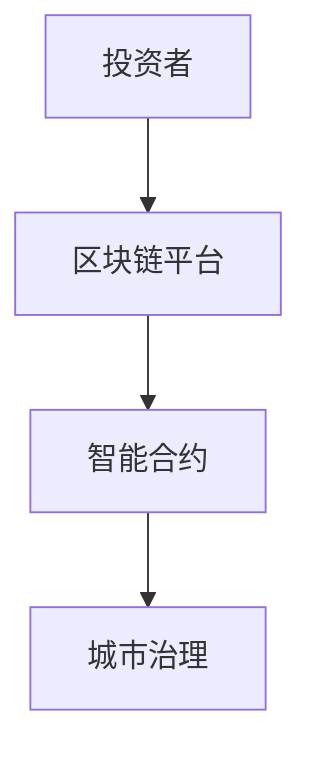
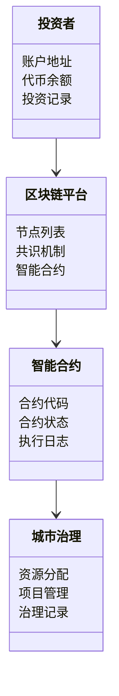

                 


# 价值投资视角下的智能城市区块链治理模式

## 关键词：价值投资、区块链、智能城市、治理模式、分布式系统

## 摘要：本文从价值投资的视角，深入分析智能城市中区块链技术的应用，探讨区块链在城市治理中的潜力与挑战。结合区块链的去中心化特性，提出价值投资驱动的治理模式，通过智能合约实现自动化治理，构建高效、透明的城市管理系统。

---

# 第一部分：价值投资与智能城市区块链治理的背景

## 第1章：价值投资的核心概念

### 1.1 价值投资的基本定义

价值投资是一种长期投资策略，强调从基本面分析入手，寻找具有持续增长潜力和内在价值的企业进行投资。其核心在于关注企业的内在价值，而非短期市场波动。价值投资者通常寻找被市场低估的优质资产，长期持有，以实现超额收益。

**价值投资的核心原则：**

1. **安全边际**：买入价格低于内在价值，确保投资的安全性。
2. **长期视角**：关注企业的长期增长潜力，而非短期收益。
3. **深入分析**：通过详尽的财务和行业分析，识别优质投资标的。

### 1.2 区块链技术与智能城市治理

区块链技术通过去中心化、不可篡改和透明性等特性，为智能城市治理提供了新的可能性。智能城市强调利用先进技术优化资源配置、提高服务效率和居民生活质量。区块链在智能城市中的应用涵盖了数据安全、身份认证、智能合约等多个方面，为城市治理提供了更加高效和透明的解决方案。

---

## 第2章：价值投资视角下的区块链治理模式

### 2.1 区块链治理的基本框架

区块链治理涉及多个方面的内容，包括共识机制、智能合约管理、节点权限分配等。区块链治理的核心目标是确保系统的安全性和高效性，同时实现去中心化的决策过程。

#### 2.1.1 区块链治理的定义

区块链治理是指通过技术手段和制度安排，实现区块链网络的稳定运行和优化。治理机制需要解决节点权限、共识算法选择、激励机制设计等问题。

#### 2.1.2 区块链治理的核心要素

1. **共识机制**：确保所有节点达成一致，维护系统的安全性。
2. **智能合约**：用于自动执行治理规则，简化管理流程。
3. **激励机制**：通过经济激励鼓励节点积极参与治理。
4. **决策机制**：制定合理的决策流程，确保治理高效。

---

## 第3章：智能城市区块链治理的核心概念与联系

### 3.1 核心概念原理

智能城市区块链治理结合了区块链技术和价值投资理念，通过智能合约实现治理规则的自动化执行。其核心概念包括：

#### 3.1.1 区块链技术的去中心化特性

去中心化是区块链的核心特征之一，通过分布式账本和点对点网络实现数据的安全存储和传输。去中心化的特性使得智能城市治理更加透明和高效，避免了传统中心化机构的效率低下和腐败问题。

#### 3.1.2 智能合约的自动化执行机制

智能合约是基于区块链的自动执行程序，能够根据预设条件自动触发相应的操作。在智能城市治理中，智能合约可以用于自动分配资源、执行合同条款、管理公共资产等，极大地提高了治理效率。

#### 3.1.3 价值投资的长期视角

价值投资强调长期视角，关注企业的内在价值和可持续发展能力。在智能城市治理中，价值投资的视角可以帮助投资者识别具有长期增长潜力的城市项目，优化资源配置，促进城市的可持续发展。

### 3.2 核心概念对比分析

以下是区块链治理、价值投资和传统治理方式的核心特征对比：

| 特性               | 区块链治理 | 价值投资 | 传统治理 |
|--------------------|------------|----------|----------|
| 决策方式           | 去中心化   | 市场驱动 | 中心化   |
| 信任基础           | 区块链技术保证 | 市场机制 | 政府机构 |
| 透明性             | 高         | 部分透明 | 低       |
| 效率               | 高         | 高       | 中       |

### 3.3 ER实体关系图

以下是智能城市区块链治理的ER实体关系图：



---

## 第4章：智能城市区块链治理的算法原理

### 4.1 算法原理概述

智能城市区块链治理的算法主要包括共识机制、智能合约执行和价值评估模型。

#### 4.1.1 区块链共识机制

共识机制是区块链治理的核心算法，确保所有节点达成一致。常用的共识机制包括：

1. **工作量证明（PoW）**：通过计算能力竞争区块的生成权。
2. **权益证明（PoS）**：根据节点持有的代币数量分配区块生成权。
3. ** delegated Proof of Stake (DPoS) **：通过选举产生见证人节点，参与区块生成和验证。

#### 4.1.2 智能合约的执行流程

智能合约的执行流程包括：

1. **触发条件**：智能合约根据预设条件自动执行。
2. **状态检查**：检查当前区块链的状态，确认是否满足执行条件。
3. **执行操作**：根据合约逻辑，执行相应的操作（如转账、数据更新）。
4. **记录日志**：将合约执行结果记录在区块链上，确保可追溯性。

#### 4.1.3 价值评估模型

价值评估模型用于评估智能城市项目的内在价值，主要包括：

1. **财务指标分析**：如ROE（净资产收益率）、现金流等。
2. **行业分析**：分析行业的增长潜力和竞争格局。
3. **技术评估**：评估区块链技术的可行性和创新性。

### 4.2 算法流程图

以下是区块链共识机制的流程图：


### 4.3 算法实现代码

以下是一个简单的区块链共识机制实现示例：

```python
def consensus(nodes):
    valid_blocks = []
    for node in nodes:
        if node.is_valid():
            valid_blocks.append(node.block)
    return valid_blocks[0] if valid_blocks else None
```

---

## 第5章：智能城市区块链治理的系统架构设计

### 5.1 项目介绍

智能城市区块链治理系统旨在通过区块链技术优化城市治理流程，实现资源的高效分配和透明管理。该系统主要包括以下几个功能模块：

1. **智能合约管理**：管理智能合约的创建、部署和执行。
2. **数据存储**：存储城市治理相关的数据，如资源分配记录、合约状态等。
3. **用户交互**：提供用户友好的界面，方便投资者和城市管理者进行操作。

### 5.2 系统功能设计

#### 5.2.1 领域模型类图

以下是系统功能的领域模型类图：



### 5.3 系统架构设计

以下是系统架构设计的架构图：


### 5.4 系统接口设计

系统接口设计包括以下几个方面：

1. **投资者接口**：投资者可以通过接口查看区块链平台的状态、进行投资操作。
2. **区块链平台接口**：提供节点管理、共识机制配置等功能。
3. **智能合约接口**：用于智能合约的部署、执行和查询。

### 5.5 系统交互设计

以下是系统交互的序列图：

```mermaid
sequenceDiagram
investor -> blockchain: 提交投资请求
blockchain -> smart_contract: 执行智能合约
smart_contract -> city_governance: 更新治理记录
investor <- blockchain: 确认投资结果
```

---

## 第6章：项目实战

### 6.1 环境安装

要运行智能城市区块链治理系统，需要以下环境：

1. **编程语言**：Python 3.8+
2. **区块链框架**：以太坊ereum或fabric。
3. **开发工具**：Visual Studio Code、PyCharm等。

### 6.2 系统核心实现源代码

以下是智能合约的实现代码：

```python
# 智能合约示例代码
def smart_contract(contract):
    if contract.is_valid():
        return contract.execute()
    else:
        return None
```

### 6.3 代码应用解读与分析

智能合约代码通过检查合约的有效性，决定是否执行合约。如果合约有效，则执行相应的操作；否则，返回None。这种机制确保了智能合约的安全性和可靠性。

### 6.4 实际案例分析

以下是一个实际案例分析：

**案例背景**：某城市计划通过区块链技术优化垃圾分类管理，采用智能合约自动分配垃圾清运资源。

**实施步骤**：
1. **部署智能合约**：智能合约负责监控垃圾清运的状态，自动分配任务。
2. **投资者参与**：投资者通过区块链平台参与投资，获得相应的代币奖励。
3. **治理记录**：所有交易记录在区块链上，确保透明可追溯。

**案例结果**：通过智能合约优化了垃圾清运流程，提高了管理效率，降低了运营成本。

### 6.5 项目小结

智能城市区块链治理系统的成功实施，不仅提高了城市的管理效率，还为投资者提供了长期价值增长的机会。通过区块链技术的去中心化特性，实现了城市治理的透明化和高效化。

---

## 第7章：总结与展望

### 7.1 最佳实践 tips

1. **深入分析**：在进行价值投资时，要深入分析企业的基本面和行业前景。
2. **选择优质平台**：选择技术成熟、团队稳定的区块链平台进行投资。
3. **关注政策支持**：关注政府政策对智能城市区块链治理的支持力度。

### 7.2 小结

本文从价值投资的视角，深入分析了智能城市区块链治理模式，探讨了区块链技术在城市治理中的潜力与挑战。通过智能合约的自动化执行和去中心化特性，为城市治理提供了高效、透明的解决方案。

### 7.3 展望

未来，随着区块链技术的不断发展和智能城市的普及，价值投资视角下的区块链治理模式将得到更广泛的应用。通过技术创新和制度优化，智能城市治理将更加高效、透明，为投资者和城市居民带来更大的价值。

---

以上是《价值投资视角下的智能城市区块链治理模式》的完整内容，希望对您有所帮助！

