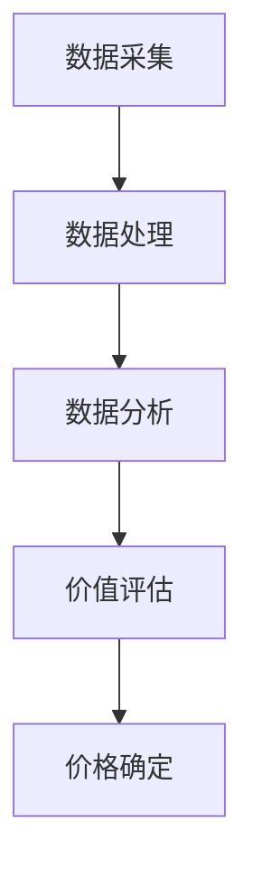

                 


```markdown
# 价值投资视角下的智能城市数据市场化

## 关键词：价值投资、数据市场化、智能城市、数据资产、投资策略、数据定价、系统架构

## 摘要：  
本文从价值投资的角度分析智能城市数据的市场化过程，探讨数据资产的评估、定价算法、系统架构设计以及实际案例分析。通过理论与实践结合，揭示数据在智能城市中的潜在价值，并为投资者提供科学的决策依据。

---

# 第1章：价值投资与智能城市数据市场化的背景

## 1.1 价值投资的基本概念

### 1.1.1 价值投资的定义  
价值投资是一种以低于内在价值的价格购买优质资产的投资策略，核心在于识别市场低估的资产并长期持有。

### 1.1.2 价值投资的核心原理  
- **内在价值**：资产的真正价值由其未来现金流的现值决定。  
- **安全边际**：购买价格低于内在价值，以降低投资风险。  

### 1.1.3 价值投资与现代金融的关系  
价值投资与现代金融学（如CAPM模型）密切相关，但更注重长期基本面分析。

---

## 1.2 智能城市数据市场化的背景

### 1.2.1 智能城市的定义与发展  
智能城市利用大数据、人工智能等技术优化城市资源配置，提升居民生活质量。

### 1.2.2 数据在智能城市中的作用  
数据是智能城市的“原料”，贯穿交通、医疗、教育等多个领域。

### 1.2.3 数据市场化的必要性  
数据的采集、处理和应用需要通过市场化机制实现高效配置。

---

## 1.3 价值投资视角下的数据市场化

### 1.3.1 数据作为资产的特性  
- **可量化**：数据价值可通过模型评估。  
- **可交易**：数据作为商品在市场中流通。  

### 1.3.2 数据市场化的挑战与机遇  
- **挑战**：数据隐私、技术门槛高。  
- **机遇**：数据价值巨大，市场需求旺盛。  

### 1.3.3 价值投资在数据市场化中的应用  
通过分析数据资产的内在价值，寻找被低估的数据投资机会。

---

# 第2章：价值投资的理论基础

## 2.1 价值投资的基本原理

### 2.1.1 股票的内在价值  
股票的内在价值由公司未来现金流的现值决定。  
$$ V = \frac{CF}{(1 + r)^n} $$  
其中，\( CF \) 为现金流，\( r \) 为折现率，\( n \) 为时间。

### 2.1.2 市场价格与内在价值的关系  
市场价格围绕内在价值波动，短期可能偏离，长期趋于一致。

### 2.1.3 安全边际的概念  
$$ \text{安全边际} = \text{内在价值} - \text{市场价格} $$  
安全边际越大，投资风险越小。

---

## 2.2 数据资产的评估方法

### 2.2.1 数据资产的分类  
- **结构化数据**：如表格数据。  
- **非结构化数据**：如文本、图像。  

### 2.2.2 数据质量的评估指标  
- **完整性**：数据是否齐全。  
- **准确性**：数据是否真实。  
- **一致性**：数据格式是否统一。  

### 2.2.3 数据资产的价值评估模型  
$$ \text{数据价值} = f(\text{数据质量} \times \text{数据量} \times \text{应用场景}) $$  

---

## 2.3 价值投资与数据市场化的结合

### 2.3.1 数据资产的长期投资价值  
数据资产的长期价值取决于其应用场景和数据质量。

### 2.3.2 数据市场的供需分析  
- **供给端**：数据生产者的数量和能力。  
- **需求端**：数据消费者的购买意愿和支付能力。  

### 2.3.3 数据资产的风险管理  
通过分散投资、设置止损等方式降低投资风险。

---

# 第3章：数据定价的算法原理

## 3.1 数据定价的基本概念

### 3.1.1 数据定价的定义  
数据定价是根据数据的内在价值和市场供需关系确定其价格。

### 3.1.2 数据定价的目标  
- **公平性**：价格反映数据的真实价值。  
- **效率性**：促进数据资源的合理配置。  

### 3.1.3 数据定价的挑战  
- **数据隐私**：如何在保护隐私的前提下定价。  
- **动态性**：数据价值随时间变化。  

---

## 3.2 数据定价的数学模型

### 3.2.1 数据价值的数学表达  
$$ \text{数据价值} = \alpha \times \text{数据质量} + \beta \times \text{数据量} + \gamma \times \text{应用场景} $$  

### 3.2.2 数据定价的公式推导  
$$ P = V - \delta $$  
其中，\( P \) 为价格，\( V \) 为数据价值，\( \delta \) 为折扣率。

### 3.2.3 数据定价的案例分析  
假设某交通数据的内在价值为 $100，市场价格为 $80，折扣率为 $10，则定价为 $70。

---

## 3.3 数据定价的流程图



---

# 第4章：数据平台的系统架构设计

## 4.1 问题场景介绍  
智能城市数据平台需要高效采集、处理和分析数据，支持数据定价和交易。

## 4.2 系统功能设计

### 4.2.1 数据采集模块  
- 实时采集城市各领域的数据。  
- 支持多种数据源（如传感器、摄像头）。  

### 4.2.2 数据存储模块  
- 使用分布式存储技术（如Hadoop）。  
- 支持结构化和非结构化数据存储。  

### 4.2.3 数据处理模块  
- 数据清洗、转换和 enrich。  
- 使用大数据处理框架（如Spark）。  

### 4.2.4 数据分析模块  
- 数据挖掘、机器学习模型训练。  
- 数据价值评估和定价计算。  

### 4.2.5 数据可视化模块  
- 数据价值展示。  
- 交易结果可视化。  

---

## 4.3 系统架构设计


---

## 4.4 系统接口设计

### 4.4.1 数据接口  
- API接口：提供数据查询、订阅服务。  

### 4.4.2 交易接口  
- 支持数据购买、交易记录查询。  

---

## 4.5 系统交互序列图

```mermaid
sequenceDiagram
    用户 -> 数据采集层: 请求数据
    数据采集层 -> 数据处理层: 数据处理请求
    数据处理层 -> 数据分析层: 数据分析请求
    数据分析层 -> 数据存储层: 数据存储请求
    数据存储层 -> 数据可视化层: 数据展示请求
    用户 <- 数据可视化层: 展示结果
```

---

# 第5章：项目实战——智慧交通数据的市场化

## 5.1 项目背景  
智慧交通数据的市场化是智能城市数据市场化的重要组成部分。

## 5.2 项目环境配置

### 5.2.1 硬件环境  
- CPU：Intel i7  
- 内存：16GB  
- 存储：500GB SSD  

### 5.2.2 软件环境  
- 操作系统：Linux  
- 开发工具：Python、Jupyter Notebook  
- 数据库：MySQL  

---

## 5.3 项目核心实现

### 5.3.1 数据采集  
```python
import requests

def get_traffic_data():
    response = requests.get("http://api.traffic.com/data")
    return response.json()
```

### 5.3.2 数据处理  
```python
import pandas as pd

def process_data(data):
    df = pd.DataFrame(data)
    df['time'] = pd.to_datetime(df['time'])
    return df
```

### 5.3.3 数据分析  
```python
from sklearn import linear_model

def predict_value(X, y):
    model = linear_model.LinearRegression()
    model.fit(X, y)
    return model.predict(X)
```

### 5.3.4 数据可视化  
```python
import matplotlib.pyplot as plt

def plot_data(df):
    plt.plot(df['time'], df['value'])
    plt.xlabel('Time')
    plt.ylabel('Value')
    plt.show()
```

---

## 5.4 项目小结  
通过智慧交通数据的市场化案例，展示了数据采集、处理、分析和可视化的全过程。

---

# 第6章：总结与展望

## 6.1 总结  
本文从价值投资的角度，分析了智能城市数据的市场化过程，探讨了数据资产的评估、定价算法和系统架构设计。

## 6.2 未来展望  
- 数据隐私保护：加强数据安全和隐私保护。  
- 数据治理：建立数据交易的法律法规和标准。  
- 数据创新：推动数据技术的创新应用。  

---

## 最佳实践 Tips  
- 数据投资需谨慎，建议进行充分的市场调研和风险评估。  
- 数据平台的设计应注重可扩展性和安全性。  

## 小结  
通过本文的分析，读者可以更好地理解智能城市数据市场化的过程，并在实际投资中做出明智的决策。

---

# 结语  
智能城市数据的市场化是一个复杂的系统工程，需要结合价值投资的理论和现代技术手段，才能实现数据价值的最大化。
```

