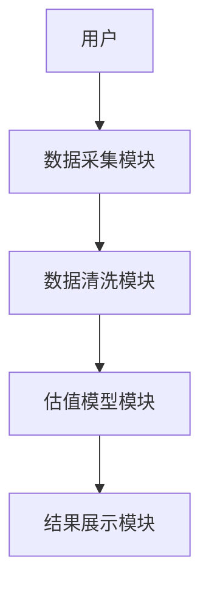

                 


# 价值投资视角下的独角兽企业估值

---

## 关键词  
- 价值投资  
- 独角兽企业  
- 估值模型  
- 财务分析  
- 竞争优势  

---

## 摘要  
在当前快速变化的商业环境中，独角兽企业的估值成为价值投资者关注的焦点。本文从价值投资的角度，系统地分析了独角兽企业的估值方法与策略。首先，我们介绍了价值投资的核心理念与独角兽企业的定义及特点。接着，我们深入探讨了独角兽企业的市场定位、竞争优势和行业趋势。随后，我们详细讲解了基于DCF模型、可比公司分析和情景分析的估值方法，并结合实际案例进行了系统设计与实战分析。最后，我们总结了估值的关键点，并提出了未来研究的方向。

---

## 正文  

---

### 第一部分：价值投资与独角兽企业的基础概述  

---

#### 第1章：价值投资与独角兽企业的定义与特点  

##### 1.1 价值投资的核心概念  

###### 1.1.1 价值投资的起源与发展  
价值投资是一种长期投资策略，起源于20世纪初，由本杰明·格雷厄姆和戴维·多德提出。其核心理念是寻找市场低估的股票，通过深入分析企业的基本面，长期持有以获得超额收益。  

###### 1.1.2 价值投资的核心理念与原则  
- **安全边际**：买入价格低于内在价值，以降低投资风险。  
- **长期视角**：关注企业的长期盈利能力，而非短期市场波动。  
- **独立思考**：避免随市场情绪盲目投资。  

###### 1.1.3 价值投资与成长投资的区别与联系  
- **区别**：价值投资注重低估值，成长投资注重高增长。  
- **联系**：两者都关注企业的基本面，但侧重点不同。  

##### 1.2 独角兽企业的定义与特点  

###### 1.2.1 独角兽企业的定义与分类  
独角兽企业是指成立时间较短（通常不超过10年）、估值超过10亿美元的企业。根据行业和商业模式，独角兽企业可以分为科技型、服务型和创新型。  

###### 1.2.2 独角兽企业的核心特征  
- 高增长性：年增长率通常超过30%。  
- 高估值：市场估值超过10亿美元。  
- 创新性：具备独特的商业模式或技术优势。  

###### 1.2.3 独角兽企业的市场现状与趋势  
近年来，科技与互联网行业涌现出大量独角兽企业，如字节跳动、滴滴出行等。这些企业通过技术创新和快速扩张占据了市场领先地位。  

##### 1.3 价值投资视角下的独角兽企业分析框架  

###### 1.3.1 价值投资与独角兽企业的结合点  
- **低估值**：寻找被市场低估的独角兽企业。  
- **高增长**：关注具备持续增长潜力的企业。  

###### 1.3.2 独角兽企业的估值挑战与机遇  
- **挑战**：高增长性导致高估值，容易引发泡沫。  
- **机遇**：早期投资独角兽企业可能获得高回报。  

###### 1.3.3 价值投资视角下的分析维度  
- **财务表现**：收入、利润、现金流等指标。  
- **竞争优势**：市场地位、技术壁垒等。  
- **行业趋势**：行业增长潜力与风险。  

---

#### 第2章：独角兽企业的市场定位与竞争分析  

##### 2.1 独角兽企业的市场定位策略  

###### 2.1.1 市场定位的核心要素  
- 目标客户：明确企业服务的客户群体。  
- 核心价值：企业提供的独特价值主张。  
- 竞争对手：分析主要竞争对手的优劣势。  

###### 2.1.2 独角兽企业的市场定位方法  
- **SWOT分析**：识别企业的优势、劣势、机会与威胁。  
- **波特五力模型**：分析行业竞争结构。  

###### 2.1.3 竞争对手分析与市场定位调整  
通过分析竞争对手的市场份额、产品定价和市场策略，调整自身的市场定位以获得竞争优势。  

##### 2.2 独角兽企业的竞争优势分析  

###### 2.2.1 核心竞争力的定义与评估  
核心竞争力是企业在市场上独特的优势，如技术、品牌、成本等。  

###### 2.2.2 独角兽企业的竞争优势来源  
- **技术创新**：通过技术专利或创新产品获得竞争优势。  
- **商业模式**：独特的商业模式降低运营成本或提高客户粘性。  

###### 2.2.3 竞争优势的可持续性分析  
评估竞争优势的可持续性，如技术更新速度、市场拓展能力等。  

##### 2.3 行业趋势与企业战略  

###### 2.3.1 行业发展趋势的识别  
通过行业研究报告和市场数据，识别行业的增长潜力和风险。  

###### 2.3.2 独角兽企业的战略调整  
根据行业趋势调整企业战略，如拓展新市场或优化产品结构。  

###### 2.3.3 企业战略与估值的关系  
战略调整可能影响企业的未来盈利能力和估值，需综合考虑。  

---

#### 第3章：独角兽企业的财务分析与估值指标  

##### 3.1 财务指标的定义与分类  

###### 3.1.1 财务指标的分类与作用  
- **盈利能力**：净利润率、ROE等。  
- **成长能力**：收入增长率、净利润增长率等。  
- **营运能力**：存货周转率、应收账款周转率等。  
- **财务健康状况**：资产负债率、流动比率等。  

###### 3.1.2 财务指标的计算公式  
- 净利润率 = 净利润 / 收入  
- ROE = 净利润 / 股东权益  

##### 3.2 独角兽企业的财务分析  

###### 3.2.1 财务数据的获取与清洗  
- 数据来源：公司财报、第三方数据平台。  
- 数据清洗：处理缺失值、异常值。  

###### 3.2.2 财务指标的计算与分析  
- 使用Python进行财务数据的清洗与分析：  
  ```python
  import pandas as pd
  df = pd.read_csv('financial_data.csv')
  df['净利率'] = df['净利润'] / df['收入']
  df['ROE'] = df['净利润'] / df['股东权益']
  ```

###### 3.2.3 财务健康状况的评估  
- 通过财务指标分析企业的盈利能力和财务风险。  

##### 3.3 估值指标的计算与分析  

###### 3.3.1 市盈率（P/E）与市净率（P/B）  
- P/E = 股价 / 每股净利润  
- P/B = 股价 / 每股净资产  

###### 3.3.2 市盈率与市净率的比较  
- 市盈率适用于盈利稳定的公司，市净率适用于净资产较多的公司。  

---

### 第二部分：价值投资视角下的独角兽企业估值方法论  

---

#### 第4章：基于DCF模型的估值方法  

##### 4.1 DCF模型的原理与步骤  

###### 4.1.1 DCF模型的核心原理  
DCF（Discounted Cash Flow）模型通过将未来现金流折现为现值，评估企业的内在价值。  

###### 4.1.2 DCF模型的步骤  
1. 预测未来现金流。  
2. 选择合适的折现率。  
3. 计算未来现金流的现值。  
4. 计算终值。  
5. 总和得到企业估值。  

##### 4.2 DCF模型的实现与优化  

###### 4.2.1 现金流预测的挑战  
- 数据不足：独角兽企业通常成立时间较短，历史数据有限。  
- 假设风险：未来现金流预测依赖于假设，可能导致偏差。  

###### 4.2.2 折现率的计算  
- 使用WACC（加权平均资本成本）作为折现率。  
- WACC = (权益成本 × 权益占比) + (债务成本 × 债务占比 × (1 - 税率))  

##### 4.3 DCF模型的优缺点  

###### 4.3.1 优点  
- 能够反映企业的未来现金流情况。  

###### 4.3.2 缺点  
- 假设敏感性高，结果可能偏差较大。  

---

#### 第5章：基于可比公司分析的估值方法  

##### 5.1 可比公司分析的原理与步骤  

###### 5.1.1 可比公司分析的原理  
通过分析可比企业的估值指标（如市盈率、市净率），推断目标企业的合理估值。  

###### 5.1.2 可比公司分析的步骤  
1. 选择可比企业。  
2. 计算可比企业的估值指标。  
3. 确定目标企业的合理估值。  

##### 5.2 可比公司分析的实现  

###### 5.2.1 可比企业的选择标准  
- 行业相同。  
- 规模相近。  

###### 5.2.2 估值指标的计算与比较  
- 计算可比企业的平均市盈率。  
- 使用平均市盈率乘以目标企业的每股收益，得到目标企业的估值。  

---

#### 第6章：基于情景分析的估值方法  

##### 6.1 情景分析的原理与步骤  

###### 6.1.1 情景分析的原理  
通过分析不同情景（如最佳、基本、最坏情况）下企业的现金流，评估企业的估值范围。  

###### 6.1.2 情景分析的步骤  
1. 定义不同情景。  
2. 预测每种情景下的现金流。  
3. 计算每种情景下的企业估值。  
4. 综合得出估值区间。  

##### 6.2 情景分析的实现  

###### 6.2.1 情景定义  
- 最佳情景：高增长、低竞争。  
- 基本情景：稳定增长、适度竞争。  
- 最坏情景：低增长、高竞争。  

###### 6.2.2 估值区间计算  
- 计算每种情景下的企业估值，综合得出估值范围。  

---

### 第三部分：系统架构与估值模型设计  

---

#### 第7章：系统架构与功能设计  

##### 7.1 系统功能设计  

###### 7.1.1 系统功能模块  
- 数据采集模块：收集企业财务数据与市场数据。  
- 数据清洗模块：处理数据中的缺失值与异常值。  
- 估值模型模块：实现DCF、可比公司分析与情景分析。  
- 结果展示模块：可视化估值结果与敏感性分析。  

##### 7.2 系统架构设计  

###### 7.2.1 系统架构图  


##### 7.3 系统接口设计  

###### 7.3.1 数据接口  
- 数据输入接口：接收企业数据。  
- 数据输出接口：输出估值结果。  

##### 7.4 系统交互设计  

###### 7.4.1 交互流程  
1. 用户输入企业数据。  
2. 系统进行数据清洗。  
3. 系统运行估值模型。  
4. 系统展示估值结果。  

---

### 第四部分：项目实战与案例分析  

---

#### 第8章：项目实战  

##### 8.1 环境安装与数据准备  

###### 8.1.1 环境安装  
- 安装Python与相关库（Pandas、NumPy、Matplotlib）。  
- 安装Jupyter Notebook用于数据分析与可视化。  

##### 8.2 系统核心实现  

###### 8.2.1 数据清洗与预处理  
```python
import pandas as pd
df = pd.read_csv('unicorn_data.csv')
df = df.dropna()
df = df[ df['收入'] > 0 ]
```

###### 8.2.2 DCF模型实现  
```python
def calculateDCF(revenue, profit_margin, growth_rate, wacc):
    cash_flow = revenue * profit_margin
    terminal_value = cash_flow * (1 + growth_rate) / (wacc - growth_rate)
    present_value = (cash_flow + terminal_value) / (1 + wacc)
    return present_value
```

##### 8.3 案例分析与结果解读  

###### 8.3.1 案例分析  
以某独角兽企业为例，使用DCF模型与可比公司分析进行估值。  

###### 8.3.2 结果解读  
- DCF模型估值：企业估值为X亿美元。  
- 可比公司分析估值：企业估值为Y亿美元。  
- 综合估值：Z亿美元。  

##### 8.4 项目小结  
通过项目实战，验证了估值方法的有效性，并掌握了系统设计与实现的流程。  

---

### 第五部分：总结与展望  

---

#### 第9章：总结与展望  

##### 9.1 总结  
本文从价值投资的角度，系统地分析了独角兽企业的估值方法与策略，提出了基于DCF模型、可比公司分析与情景分析的估值方法，并通过系统设计与项目实战进行了验证。  

##### 9.2 展望  
未来，可以进一步研究以下方向：  
- 引入机器学习模型进行估值预测。  
- 考虑更多外部因素（如政策、经济环境）对估值的影响。  

---

## 结语  
价值投资视角下的独角兽企业估值是一个复杂但 rewarding 的过程。通过本文的分析与实战，读者可以掌握系统的估值方法，并在实际投资中获得更好的收益。

--- 

**作者简介**：  
[此处可以加入作者的简介，如：  
作者是人工智能、编程和价值投资领域的资深专家，具有丰富的实践经验与深厚的理论功底。本文基于其多年的研究与实践经验完成，旨在为读者提供有价值的见解与方法。]

