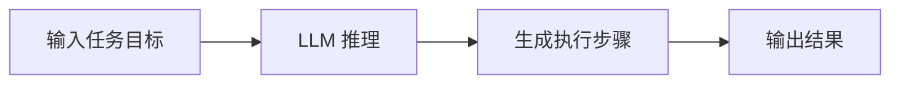
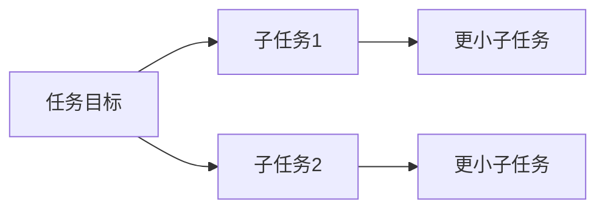
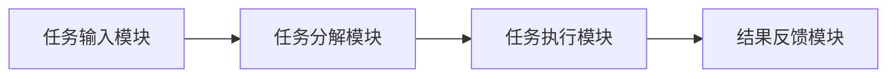

                 


# 任务导向型 AI Agent：基于 LLM 的目标完成系统

> 关键词：任务导向型 AI Agent、LLM、目标完成系统、人工智能、自然语言处理

> 摘要：本文将深入探讨任务导向型 AI Agent 的核心概念、算法原理、系统架构及其实现方法。通过结合大语言模型（LLM）的能力，本文将详细分析如何构建一个基于任务分解与执行的目标完成系统，并通过实际案例展示其应用场景和实现过程。

---

## 正文

---

# 第一部分: 任务导向型 AI Agent 的背景与概念

## 第1章: 问题背景与问题描述

### 1.1 问题背景

#### 1.1.1 当前 AI 技术的发展现状

近年来，人工智能技术发展迅速，尤其是在自然语言处理（NLP）领域，基于大语言模型（LLM）的工具如雨后春笋般涌现。这些模型能够理解并生成人类语言，极大地提升了机器处理复杂任务的能力。

#### 1.1.2 传统 AI 系统的局限性

尽管传统 AI 系统在特定任务上表现出色，但它们通常缺乏灵活性和通用性。传统系统依赖于预定义的规则和固定的逻辑，难以应对开放性、多样化的目标完成任务。

#### 1.1.3 任务导向型 AI Agent 的需求与挑战

任务导向型 AI Agent 的需求源于对通用性、灵活性和智能化的追求。它需要能够理解复杂的目标，并通过分解任务逐步完成。然而，如何有效结合 LLM 的能力，同时解决任务分解与执行中的不确定性，是当前面临的主要挑战。

---

### 1.2 问题解决思路

#### 1.2.1 任务导向型 AI Agent 的核心目标

任务导向型 AI Agent 的核心目标是通过理解和分解用户提供的任务目标，生成相应的执行步骤，并最终完成任务。这种系统能够动态调整策略，适应不同的任务需求。

#### 1.2.2 任务分解与执行的逻辑框架

任务分解是任务导向型 AI Agent 的关键步骤。通过将大任务分解为更小的子任务，系统能够更好地管理和执行每个子任务，从而提高任务完成的效率和准确性。

#### 1.2.3 基于 LLM 的目标完成系统的优势

基于 LLM 的目标完成系统能够利用语言模型的强大能力，理解任务目标并生成合理的执行步骤。LLM 的泛化能力和上下文理解能力使得系统能够在多种场景下灵活应用。

---

## 第2章: 核心概念与定义

### 2.1 任务导向型 AI Agent 的定义

#### 2.1.1 AI Agent 的基本概念

AI Agent 是一种智能体，能够感知环境、理解任务目标，并采取行动以实现目标。它通常具有自主性、反应性和社交能力。

#### 2.1.2 任务导向型 AI Agent 的特征

任务导向型 AI Agent 的核心特征包括目标驱动性、任务分解能力、动态调整能力以及与外部系统的交互能力。

#### 2.1.3 基于 LLM 的目标完成系统的区别与联系

基于 LLM 的目标完成系统是任务导向型 AI Agent 的一种实现形式。它利用 LLM 的语言理解和生成能力，实现任务目标的分解与执行。

---

## 第3章: 基于 LLM 的 AI Agent 核心原理

### 3.1 LLM 的基本原理

#### 3.1.1 Transformer 模型的核心结构

基于 Transformer 模型的 LLM 具有编码器-解码器结构，能够处理长文本序列。其核心在于注意力机制和位置编码。

#### 3.1.2 注意力机制的数学模型

注意力机制的数学模型如下：

$$
\text{Attention}(Q, K, V) = \text{softmax}\left(\frac{QK^T}{\sqrt{d_k}}\right)V
$$

其中，$Q$ 是查询向量，$K$ 是键向量，$V$ 是值向量。

#### 3.1.3 梯度下降与损失函数

LLM 的训练过程通常采用交叉熵损失函数，并通过梯度下降优化模型参数。

$$
\mathcal{L} = -\sum_{i=1}^{n} \log p(x_i | x_{<i})
$$

---

### 3.2 任务导向型 AI Agent 的算法流程

任务导向型 AI Agent 的算法流程如下：

1. 接收任务目标。
2. 利用 LLM 分解任务目标。
3. 执行每个子任务。
4. 反馈执行结果。
5. 动态调整策略。

流程图如下：



---

## 第4章: 任务分解与执行策略

### 4.1 任务分解方法

#### 4.1.1 基于目标的分解方法

任务分解可以通过多种方法实现，例如基于目标的分解方法和基于依赖关系的分解方法。

#### 4.1.2 任务分解的流程

任务分解的流程如下：

1. 理解任务目标。
2. 分解任务目标。
3. 生成子任务。
4. 执行子任务。

流程图如下：



---

## 第5章: 系统架构与设计

### 5.1 系统功能设计

#### 5.1.1 系统功能模块

系统功能模块包括任务输入模块、任务分解模块、任务执行模块和结果反馈模块。

#### 5.1.2 功能模块之间的关系

功能模块之间的关系如下：



---

## 第6章: 项目实战

### 6.1 环境安装与配置

#### 6.1.1 安装依赖

安装必要的依赖：

```
pip install transformers torch
```

---

## 第7章: 总结与展望

### 7.1 总结

任务导向型 AI Agent 是一种基于 LLM 的目标完成系统，能够理解和分解任务目标，并通过动态调整策略完成任务。

### 7.2 未来展望

未来，任务导向型 AI Agent 的发展方向包括提高任务分解的精确性、增强系统的自适应能力以及拓展更多的应用场景。

---

以上为文章的完整目录大纲结构，具体内容可以根据需要进一步扩展和详细阐述。

