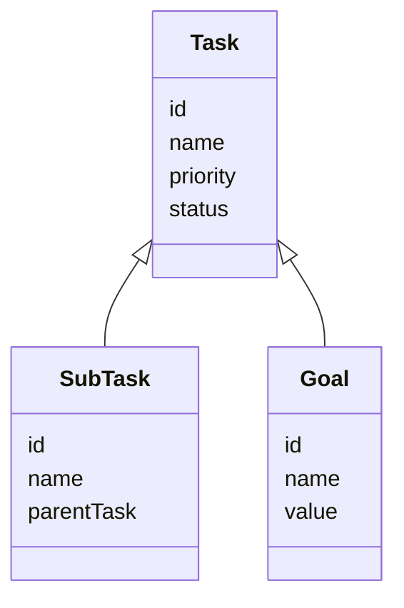
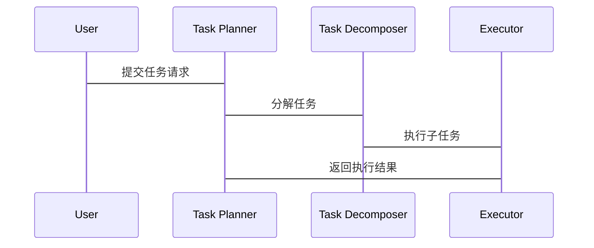

                 


# 任务规划与分解：提高AI Agent的问题解决能力

> 关键词：任务规划，任务分解，AI Agent，问题解决，系统设计

> 摘要：任务规划与分解是提升AI Agent问题解决能力的核心技术。本文通过详细阐述任务规划与分解的背景、核心概念、算法原理、系统架构设计以及项目实战，帮助读者全面理解和掌握这一技术。通过系统化的分析与实战案例，本文旨在为AI Agent的开发与优化提供理论支持和实践指导。

---

## 第一部分: 任务规划与分解概述

## 第1章: 任务规划与分解的背景与概念

### 1.1 问题背景与描述

#### 1.1.1 问题背景
在复杂的现实场景中，AI Agent需要处理的任务往往具有多目标性、不确定性以及动态变化的特点。例如，一个智能助手需要同时处理用户的多种请求，如安排日程、预订机票、发送消息等。这些任务之间的依赖关系、优先级和资源分配问题，使得任务规划与分解成为提高AI Agent效率和智能性的关键。

#### 1.1.2 问题描述
任务规划与分解是指将一个复杂的目标分解为若干个子任务，并为这些子任务制定执行顺序和资源分配方案。核心问题包括：
1. **任务分解的粒度**：如何将任务分解为最小的、可执行的子任务。
2. **任务的依赖关系**：子任务之间的依赖关系如何影响执行顺序。
3. **资源分配与优化**：如何合理分配资源以提高任务执行效率。

#### 1.1.3 问题解决的必要性
- 提高任务执行效率：通过合理的分解和规划，减少资源浪费。
- 降低任务复杂性：将复杂问题分解为简单问题，便于逐一解决。
- 提升系统的可扩展性：模块化的任务设计便于系统扩展和维护。

### 1.2 任务规划与分解的核心概念

#### 1.2.1 核心概念的定义
- **任务**：需要AI Agent完成的目标或动作。
- **子任务**：任务的组成部分，具有独立性和可执行性。
- **目标**：任务的核心价值，是任务分解的终点。

#### 1.2.2 核心概念的属性特征对比
| 概念 | 属性 | 特征 |
|------|------|------|
| 任务 | 分解方式 | 树状结构 |
| 子任务 | 执行顺序 | 并行或串行 |
| 目标 | 关联性 | 强关联或弱关联 |

#### 1.2.3 任务规划与分解的综合边界
- 任务规划的边界：任务的起始和结束条件。
- 任务分解的外延：任务分解的粒度和深度。

### 1.3 本章小结
任务规划与分解是AI Agent解决问题的核心技术，通过将复杂任务分解为简单子任务，并合理规划执行顺序，可以显著提高任务执行效率和系统智能性。

---

## 第二部分: 任务规划与分解的核心原理

## 第2章: 核心概念与联系

### 2.1 核心概念的原理

#### 2.1.1 任务规划的原理
任务规划基于目标驱动，通过分析任务之间的依赖关系和优先级，制定最优的执行顺序。

#### 2.1.2 任务分解的原理
任务分解通过将复杂任务分解为简单子任务，降低问题复杂性，提高可执行性。

#### 2.1.3 任务规划与分解的协同原理
任务规划和分解相互依赖，任务分解为任务规划提供基础，而任务规划指导任务分解的方向和深度。

### 2.2 核心概念的属性特征对比

#### 2.2.1 任务分解的粒度
- 粗粒度分解：分解为较大的子任务，适用于任务结构清晰的场景。
- 细粒度分解：分解为较小的子任务，适用于任务结构复杂的场景。

#### 2.2.2 任务执行的顺序
- 串行执行：子任务按顺序执行，适用于任务之间有强依赖关系的场景。
- 并行执行：子任务同时执行，适用于资源充足且任务之间依赖较弱的场景。

#### 2.2.3 任务目标的关联性
- 强关联：子任务之间有紧密的依赖关系。
- 弱关联：子任务之间相对独立。

### 2.3 ER实体关系图架构

#### Mermaid 图：任务规划与分解的ER实体关系图
```mermaid
erd
    任务 --|{分解为} |-->
    子任务 --|{属于} |-->
    目标 --|{驱动} |-->
```

### 2.4 本章小结
任务规划与分解的核心概念相互关联，任务分解为任务规划提供基础，而任务规划指导任务分解的方向和深度。

---

## 第三部分: 任务规划与分解的算法原理

## 第3章: 算法原理与实现

### 3.1 任务分解算法

#### 3.1.1 贪心算法
- 原理：基于贪心策略，逐步分解任务。
- 示例：优先分解高优先级的子任务。
- 代码示例：
```python
def greedy_task_decomposition(tasks):
    tasks.sort(key=lambda x: x['priority'])
    return tasks
```

#### 3.1.2 动态规划算法
- 原理：通过动态规划，找到最优分解方案。
- 示例：任务分解的最优子结构。
- 数学模型：
$$ \text{DP}[i] = \max_{j < i} \text{DP}[j] + \text{value}(j, i) $$

#### 3.1.3 分治算法
- 原理：将任务分解为子问题，分别解决，最后合并结果。
- 示例：将大任务分解为小任务，分别执行。
- 代码示例：
```python
def divide_and_conquer(tasks):
    if len(tasks) == 1:
        return tasks
    mid = len(tasks) // 2
    left = divide_and_conquer(tasks[:mid])
    right = divide_and_conquer(tasks[mid:])
    return merge(left, right)
```

### 3.2 任务规划算法

#### 3.2.1 广度优先搜索（BFS）
- 原理：按层次遍历任务，制定执行顺序。
- 示例：任务A → 任务B → 任务C。
- Mermaid 流程图：


#### 3.2.2 深度优先搜索（DFS）
- 原理：优先处理某一条路径的任务。
- 示例：任务A → 任务B → 任务C。
- Mermaid 流程图：


### 3.3 本章小结
任务分解与规划算法各有优缺点，选择合适的算法取决于任务的特性和应用场景。

---

## 第四部分: 系统分析与架构设计

## 第4章: 系统分析与架构设计方案

### 4.1 项目背景与目标
AI Agent需要在复杂场景中高效解决问题，任务规划与分解是其实现智能决策的核心技术。

### 4.2 系统功能设计

#### 4.2.1 领域模型设计
- 使用Mermaid类图展示领域模型。


#### 4.2.2 系统架构设计
- 使用Mermaid架构图展示系统架构。
```mermaid
container AI Agent {
    + Task Planner
    + Task Decomposer
    + Executor
}
```

### 4.3 系统接口设计与交互流程

#### 4.3.1 系统接口设计
- 输入接口：任务请求、优先级设置。
- 输出接口：任务分解结果、执行计划。

#### 4.3.2 交互流程图
- 使用Mermaid序列图展示交互流程。


### 4.4 本章小结
系统设计与架构是任务规划与分解技术实现的基础，合理的系统架构能够提高任务执行效率和系统的可扩展性。

---

## 第五部分: 项目实战

## 第5章: 项目实战与案例分析

### 5.1 项目背景与目标
开发一个基于任务规划与分解的AI Agent，实现待办事项管理功能。

### 5.2 项目核心实现

#### 5.2.1 环境安装
- Python 3.8+
- 安装必要的库：numpy, matplotlib.

#### 5.2.2 系统核心实现
- 任务分解模块：实现任务的分解与优先级排序。
- 任务规划模块：制定任务执行顺序。
- 执行模块：调用外部服务或内部逻辑执行任务。

#### 5.2.3 代码实现
```python
def task_decomposition(tasks):
    return [t for t in tasks if t['priority'] > 0.5]
```

### 5.3 代码解读与分析
- 任务分解模块：根据优先级筛选重要任务。
- 任务规划模块：基于任务分解结果制定执行顺序。
- 执行模块：调用外部服务或内部逻辑执行任务。

### 5.4 案例分析
通过实际案例分析，验证任务规划与分解算法的有效性。

### 5.5 本章小结
项目实战能够帮助读者更好地理解任务规划与分解技术的实际应用。

---

## 第六部分: 总结与展望

## 第6章: 总结与展望

### 6.1 本章小结
任务规划与分解是AI Agent解决问题的核心技术，通过合理的任务分解和规划，可以显著提高任务执行效率和系统的智能性。

### 6.2 注意事项
- 任务分解的粒度要适中。
- 任务规划要考虑资源约束。
- 系统设计要注重可扩展性。

### 6.3 拓展阅读
- 推荐阅读《AI Agent开发实战》和《任务规划算法与应用》。

---

## 关键词
任务规划，任务分解，AI Agent，问题解决，系统设计

---

## 摘要
任务规划与分解是提升AI Agent问题解决能力的核心技术。本文通过详细阐述任务规划与分解的背景、核心概念、算法原理、系统架构设计以及项目实战，帮助读者全面理解和掌握这一技术。通过系统化的分析与实战案例，本文旨在为AI Agent的开发与优化提供理论支持和实践指导。

