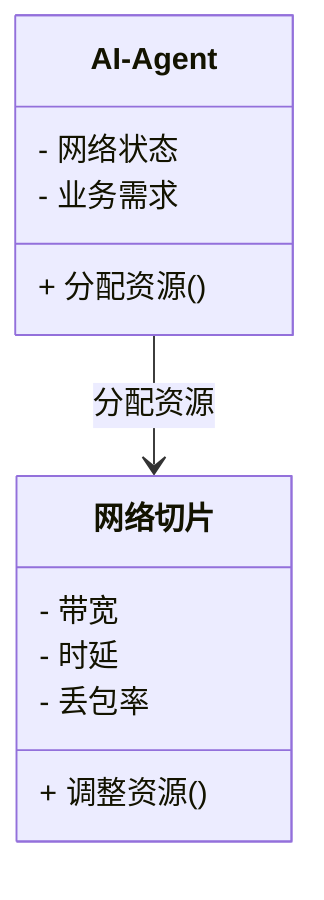
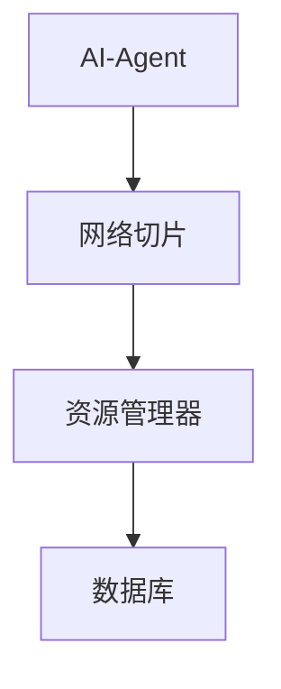
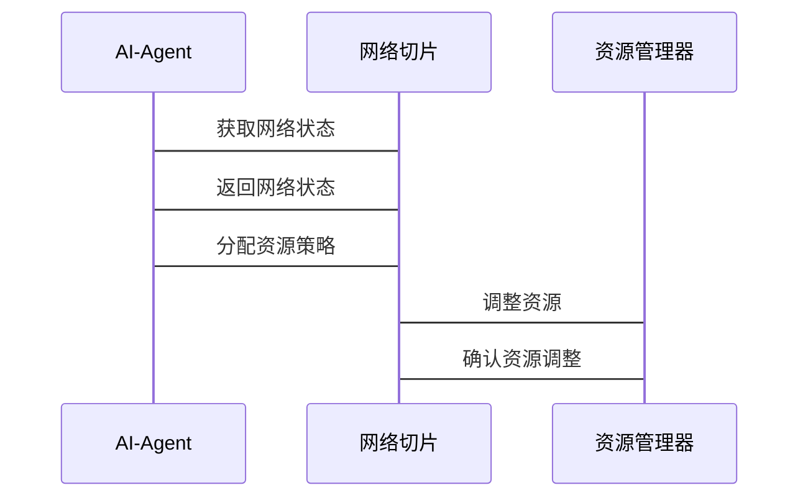

                 


# 《企业AI Agent的5G网络切片资源分配》

---

## 关键词：企业AI Agent，5G网络切片，资源分配，强化学习，网络架构

---

## 摘要：  
随着5G技术的快速发展，企业对于高效、智能的网络资源管理需求日益增长。本文深入探讨了企业AI Agent在5G网络切片资源分配中的应用，分析了其核心概念、算法原理、系统架构，并结合实际案例，展示了如何通过AI技术优化5G网络切片资源分配，提升网络性能和用户体验。

---

## 第一部分: 企业AI Agent与5G网络切片资源分配背景

### 第1章: 企业AI Agent与5G网络切片资源分配概述

#### 1.1 企业AI Agent的定义与特点  
**1.1.1 AI Agent的基本概念**  
AI Agent（智能体）是指能够感知环境、自主决策并执行任务的智能系统。它具备以下特点：  
1. **自主性**：无需外部干预，自主完成任务。  
2. **反应性**：能够实时感知环境并做出响应。  
3. **目标导向**：以特定目标为导向，优化决策过程。  
4. **学习能力**：通过数据和经验不断优化自身性能。  

**1.1.2 企业AI Agent的核心特点**  
- **定制化**：针对企业特定需求设计，提供个性化的解决方案。  
- **高效性**：通过智能算法提高资源利用率和任务处理效率。  
- **可扩展性**：能够适应企业规模和业务需求的变化。  

**1.1.3 企业AI Agent的分类与应用场景**  
- **按功能分类**：任务型AI Agent、决策型AI Agent、监控型AI Agent。  
- **应用场景**：智能制造、智慧城市、金融风控、物流优化等。  

#### 1.2 5G网络切片的基本概念  
**1.2.1 5G网络切片的定义**  
5G网络切片是指将物理网络分割成多个虚拟网络，每个切片具有独立的网络资源和服务质量（QoS）保障。  

**1.2.2 5G网络切片的关键技术**  
- **网络功能虚拟化（NFV）**：通过软件定义网络功能，实现网络切片的灵活配置。  
- **边缘计算（Edge Computing）**：将计算能力下沉到网络边缘，提升实时性和响应速度。  
- **动态资源分配**：根据业务需求动态调整网络资源。  

**1.2.3 5G网络切片的资源分配问题**  
- **资源竞争**：多个切片共享网络资源，可能导致资源冲突。  
- **动态变化**：业务需求实时变化，需要动态调整资源分配策略。  
- **优化目标**：最大化资源利用率、降低延迟、保证服务质量。  

#### 1.3 企业AI Agent与5G网络切片的结合  
**1.3.1 企业AI Agent在5G网络切片资源分配中的作用**  
- **智能决策**：通过AI算法优化资源分配策略。  
- **实时监控**：实时感知网络状态，动态调整资源分配。  
- **预测与优化**：基于历史数据预测未来需求，提前优化资源分配。  

**1.3.2 5G网络切片资源分配的挑战与机遇**  
- **挑战**：资源分配的复杂性、实时性要求高、算法优化难度大。  
- **机遇**：AI技术的应用可以显著提升网络资源利用率和用户体验。  

**1.3.3 企业AI Agent在5G网络切片资源分配中的应用前景**  
- **智能化**：通过AI Agent实现网络资源的智能化管理。  
- **高效性**：优化资源分配策略，降低网络延迟和资源浪费。  
- **扩展性**：支持多种应用场景，满足企业的多样化需求。  

#### 1.4 本章小结  
本章介绍了企业AI Agent和5G网络切片的基本概念，分析了它们在资源分配中的作用和挑战，为后续章节的深入探讨奠定了基础。

---

## 第二部分: 企业AI Agent与5G网络切片资源分配的核心概念

### 第2章: 企业AI Agent与5G网络切片的核心概念

#### 2.1 AI Agent与5G网络切片的关系  
**2.1.1 AI Agent在5G网络切片资源分配中的角色**  
- **决策者**：AI Agent通过分析网络状态和业务需求，制定资源分配策略。  
- **执行者**：AI Agent根据决策结果，动态调整网络资源。  

**2.1.2 5G网络切片资源分配的核心要素**  
- **网络资源**：包括带宽、时延、抖动、丢包率等。  
- **业务需求**：不同业务对资源的需求不同，如视频传输需要低时延和高带宽。  
- **资源分配策略**：基于业务需求和网络状态的动态调整策略。  

**2.1.3 AI Agent与5G网络切片资源分配的相互作用**  
- AI Agent通过实时感知网络状态，动态调整资源分配策略。  
- 5G网络切片的资源分配为AI Agent提供了丰富的数据和应用场景。  

#### 2.2 企业AI Agent的资源分配模型  
**2.2.1 资源分配模型的定义**  
资源分配模型是指AI Agent根据网络状态和业务需求，制定资源分配策略的数学模型。  

**2.2.2 资源分配模型的组成部分**  
- **输入层**：网络状态数据、业务需求数据。  
- **处理层**：AI算法对输入数据进行分析和处理。  
- **输出层**：资源分配策略。  

**2.2.3 资源分配模型的数学表达**  
$$ Q(s, a) = r + \gamma \max_{a'} Q(s', a') $$  
其中，\( Q(s, a) \)表示状态 \( s \) 下采取动作 \( a \) 的期望奖励，\( r \)是立即奖励，\( \gamma \)是折扣因子，\( a' \)是下一个动作。  

#### 2.3 5G网络切片资源分配的数学模型  
**2.3.1 资源分配的数学模型**  
$$ \text{目标函数} = \max_{x} \sum_{i=1}^{n} w_i x_i $$  
其中，\( x_i \)表示资源分配给第 \( i \) 个切片的数量，\( w_i \)是权重系数。  

**2.3.2 资源分配的约束条件**  
- 带宽约束：$$ \sum_{i=1}^{n} x_i \leq B $$  
- 时延约束：$$ D_i \leq D_{\text{max}} $$  
- 丢包率约束：$$ P_i \leq P_{\text{max}} $$  

**2.3.3 资源分配的目标函数**  
- 最大化资源利用率：$$ \max \sum_{i=1}^{n} x_i $$  
- 最小化网络延迟：$$ \min \max_{i} D_i $$  
- 平衡资源分配：$$ \min \sum_{i=1}^{n} (x_i - \bar{x})^2 $$  

#### 2.4 企业AI Agent与5G网络切片资源分配的ER实体关系图  

```mermaid
er
actor: 企业AI Agent
plays
 association: 参与
endactor
```

---

## 第三部分: 企业AI Agent与5G网络切片资源分配的算法原理

### 第3章: 资源分配算法原理

#### 3.1 基于强化学习的资源分配算法  
**3.1.1 强化学习的基本概念**  
强化学习是一种通过试错方法，学习最优策略的算法。  

**3.1.2 基于强化学习的资源分配模型**  
- **状态空间**：网络状态、业务需求。  
- **动作空间**：资源分配策略。  
- **奖励机制**：根据资源分配效果给予奖励。  

**3.1.3 算法的数学模型与公式**  
$$ V(s) = \max_{a} [r + V(s')] $$  
其中，\( V(s) \)表示状态 \( s \) 的价值函数，\( r \)是奖励，\( s' \)是下一个状态。  

#### 3.2 资源分配算法的实现步骤  
**3.2.1 状态空间的定义**  
- 网络状态：带宽、时延、丢包率等。  
- 业务需求：视频、语音、数据传输等。  

**3.2.2 动作空间的定义**  
- 资源分配策略：带宽分配、优先级调整等。  

---

## 第四部分: 企业AI Agent与5G网络切片资源分配的系统架构设计

### 第4章: 系统分析与架构设计方案

#### 4.1 问题场景介绍  
- **场景描述**：企业需要在5G网络切片中动态分配资源，以满足不同业务需求。  
- **问题分析**：资源分配的复杂性、实时性要求高、算法优化难度大。  

#### 4.2 系统功能设计  
**4.2.1 领域模型类图**  



**4.2.2 系统架构图**  



**4.2.3 系统接口设计**  
- **AI-Agent接口**：接收网络状态和业务需求，返回资源分配策略。  
- **网络切片接口**：根据资源分配策略调整网络资源。  

**4.2.4 系统交互序列图**  



---

## 第五部分: 企业AI Agent与5G网络切片资源分配的项目实战

### 第5章: 项目实战

#### 5.1 环境安装  
- **安装Python**：确保安装了Python 3.8及以上版本。  
- **安装依赖库**：使用pip安装numpy、scikit-learn、tensorflow等库。  

#### 5.2 系统核心实现源代码  

```python
import numpy as np
import tensorflow as tf
from sklearn.metrics import mean_squared_error

# 定义强化学习模型
class AI-Agent:
    def __init__(self):
        self.model = self.build_model()
    
    def build_model(self):
        model = tf.keras.Sequential([
            tf.keras.layers.Dense(64, activation='relu'),
            tf.keras.layers.Dense(32, activation='relu'),
            tf.keras.layers.Dense(1, activation='linear')
        ])
        model.compile(optimizer='adam', loss='mse')
        return model
    
    def train(self, state, action, reward):
        # 将状态和动作组合成输入
        input = np.concatenate([state, action])
        # 训练模型
        self.model.fit(input, reward, epochs=100, batch_size=32)
    
    def predict(self, state):
        # 预测动作
        return self.model.predict(state)

# 定义5G网络切片资源分配问题
class Network-SliceAllocator:
    def __init__(self):
        self.bandwidth = 1000  # 基准带宽
        self.latency = 50  # 基准时延
        self.packet_loss = 1  # 基准丢包率
    
    def allocate_resource(self, ai_agent):
        # 获取网络状态
        state = [self.bandwidth, self.latency, self.packet_loss]
        # 调用AI Agent进行资源分配
        action = ai_agent.predict(state)
        # 返回资源分配策略
        return action

# 实验测试
agent = AI-Agent()
allocator = Network-SliceAllocator()
allocator.allocate_resource(agent)
```

#### 5.3 代码应用解读与分析  
- **AI-Agent类**：定义了强化学习模型的结构和训练方法。  
- **Network-SliceAllocator类**：定义了5G网络切片资源分配的逻辑。  
- **实验测试**：通过训练AI Agent，实现资源分配的优化。  

#### 5.4 实际案例分析  
- **案例描述**：某企业需要在5G网络切片中分配带宽资源，满足视频传输和数据传输的需求。  
- **案例分析**：通过AI Agent优化带宽分配策略，降低网络延迟，提高视频传输质量。  

#### 5.5 项目小结  
本章通过实际案例展示了企业AI Agent在5G网络切片资源分配中的应用，验证了算法的有效性和可行性。

---

## 第六部分: 企业AI Agent与5G网络切片资源分配的最佳实践

### 第6章: 最佳实践

#### 6.1 关键点总结  
- **AI Agent的核心作用**：智能决策、实时监控、预测优化。  
- **5G网络切片的资源分配优化**：动态调整、降低延迟、提高利用率。  

#### 6.2 注意事项  
- **数据质量**：确保输入数据的准确性和实时性。  
- **算法优化**：根据实际需求调整算法参数，提升性能。  
- **系统安全性**：确保AI Agent和网络切片系统的安全性，防止数据泄露和攻击。  

#### 6.3 拓展阅读  
- **相关书籍**：《Reinforcement Learning: Theory and Algorithms》  
- **技术文档**：5G网络切片技术白皮书、AI在通信网络中的应用研究  

#### 6.4 本章小结  
本章总结了企业AI Agent与5G网络切片资源分配的关键点，提出了实际应用中的注意事项，并提供了进一步学习和研究的方向。

---

## 结语  
企业AI Agent在5G网络切片资源分配中的应用，不仅提升了网络资源的利用率，还优化了用户体验。随着AI技术的不断进步，未来在这一领域的研究和应用将更加广泛和深入。希望本文能够为相关领域的研究者和企业提供有价值的参考和指导。

---

**关键词**：企业AI Agent，5G网络切片，资源分配，强化学习，网络架构  

**摘要**：本文深入探讨了企业AI Agent在5G网络切片资源分配中的应用，分析了其核心概念、算法原理、系统架构，并结合实际案例，展示了如何通过AI技术优化5G网络切片资源分配，提升网络性能和用户体验。

