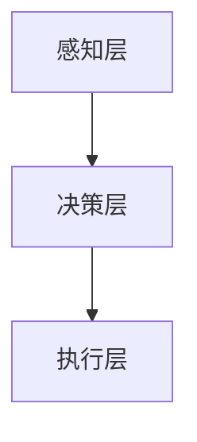
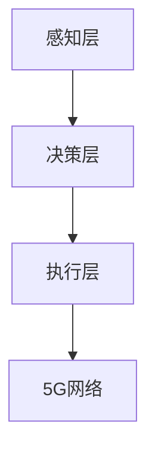

                 


# 企业AI Agent的5G网络应用策略

> 关键词：企业AI Agent，5G网络，应用策略，智能决策，网络优化

> 摘要：本文探讨了企业AI Agent在5G网络中的应用策略，分析了其核心技术原理、系统设计和实战案例，提供了详细的实现方案和优化建议。

---

## 第1章 企业AI Agent与5G网络概述

### 1.1 AI Agent的基本概念

- **定义**：AI Agent是一种智能体，能够感知环境、自主决策并执行任务。
- **特点**：
  - 自主性：无需人工干预，自动执行任务。
  - 反应性：实时感知环境变化，动态调整策略。
  - 社会性：能够与其他系统或人类进行交互协作。

### 1.2 5G网络的技术特点

- **高带宽与低延迟**：5G网络的传输速度更快，延迟更低，支持实时数据处理。
- **网络切片**：根据需求动态分配网络资源，确保不同应用场景的独立性和安全性。
- **边缘计算**：数据在靠近用户的边缘节点进行处理，减少传输延迟，提升效率。

### 1.3 AI Agent与5G网络的结合背景

- **数字化转型**：企业通过数字化手段提升效率，AI Agent作为智能化工具，5G网络提供底层支持。
- **技术进步**：AI技术成熟，5G网络普及，两者结合推动企业智能化发展。
- **应用场景扩展**：AI Agent在智能制造、智慧城市等领域发挥重要作用，5G网络为其提供高效连接。

---

## 第2章 AI Agent的核心原理与技术

### 2.1 AI Agent的体系结构

- **感知层**：通过传感器或API获取环境数据。
- **决策层**：基于数据进行分析，制定决策。
- **执行层**：通过API或控制接口执行操作。

**体系结构图**：



### 2.2 AI Agent的决策机制

- **基于规则的决策**：根据预定义规则进行判断。
- **基于模型的决策**：利用机器学习模型进行预测和优化。
- **混合决策**：结合规则和模型，提升决策准确性。

### 2.3 AI Agent的关键技术

- **自然语言处理（NLP）**：理解并生成人类语言，用于人机交互。
- **机器学习（ML）**：通过数据训练模型，实现智能决策。
- **强化学习（RL）**：通过试错优化策略，提升执行效率。

---

## 第3章 5G网络的技术特性与AI Agent的需求分析

### 3.1 5G网络的技术特性

- **切片技术**：为不同应用场景提供独立的虚拟网络，确保数据隔离和高效传输。
- **边缘计算**：将计算能力下沉到边缘节点，减少数据传输延迟。
- **大规模连接**：支持海量设备接入，满足企业级应用需求。

### 3.2 AI Agent对5G网络的需求

- **实时通信**：AI Agent需要快速响应，5G的低延迟特性满足这一需求。
- **动态资源分配**：AI Agent的任务量变化大，5G网络切片技术能灵活分配资源。
- **安全性**：AI Agent处理企业核心数据，5G网络提供端到端加密和身份认证。

---

## 第4章 AI Agent在5G网络中的关键技术创新

### 4.1 智能边缘计算

- **边缘计算架构**：AI Agent在边缘节点运行，减少数据传输距离，提升处理速度。
- **计算资源动态分配**：根据任务需求，自动调整边缘节点的计算资源。

### 4.2 基于5G切片的网络优化

- **切片划分策略**：根据AI Agent的任务类型，划分合适的网络切片。
- **资源分配算法**：动态调整切片内的带宽、时延等参数，优化网络性能。

### 4.3 AI驱动的网络自适应

- **自适应算法**：AI Agent通过学习网络状态，动态调整通信参数。
- **预测性维护**：基于历史数据预测网络故障，提前进行维护。

---

## 第5章 系统设计与实现

### 5.1 系统架构设计

- **整体架构**：AI Agent与5G网络协同工作，系统架构分为感知层、决策层和执行层。
- **组件设计**：
  - 感知层：负责数据采集。
  - 决策层：进行数据分析和决策。
  - 执行层：执行决策并反馈结果。

**系统架构图**：



### 5.2 接口设计

- **API接口**：定义标准接口，确保各模块之间的通信。
- **协议选择**：选择适合的通信协议，如HTTP、WebSocket等。

### 5.3 交互流程设计

- **数据采集**：AI Agent通过传感器或API获取环境数据。
- **数据处理**：利用机器学习模型分析数据，制定决策。
- **执行操作**：通过API或控制接口执行决策，反馈结果。

---

## 第6章 项目实战

### 6.1 环境搭建

- **硬件准备**：搭建5G网络环境，如使用5G模组或切片网络。
- **软件准备**：安装必要的开发工具和框架，如Python、TensorFlow。

### 6.2 核心代码实现

```python
import numpy as np
from sklearn import tree

# 数据预处理
data = np.array([[1, 2, 3], [4, 5, 6], [7, 8, 9]])
labels = np.array([0, 1, 2])

# 训练决策树模型
model = tree.DecisionTreeClassifier()
model.fit(data, labels)

# 预测新数据
new_data = np.array([[10, 11, 12]])
prediction = model.predict(new_data)
print(prediction)
```

### 6.3 案例分析

- **应用场景**：智能制造中的设备监控。
- **实现步骤**：
  1. 数据采集：通过5G网络实时采集设备状态数据。
  2. 数据分析：利用AI Agent分析数据，预测设备故障。
  3. 故障处理：AI Agent触发维护流程，减少停机时间。

---

## 第7章 最佳实践与优化

### 7.1 实践经验

- **模块化设计**：确保系统模块化，便于维护和扩展。
- **数据安全**：加强数据加密和访问控制，保障企业数据安全。

### 7.2 注意事项

- **性能优化**：关注AI Agent的计算效率和网络延迟，确保系统实时性。
- **故障处理**：建立完善的监控和报警机制，及时发现并解决问题。

### 7.3 未来展望

- **AI Agent的智能化提升**：通过深度学习和强化学习，进一步增强AI Agent的决策能力。
- **5G网络的扩展应用**：探索更多5G应用场景，如工业互联网、智慧城市等领域。

---

## 结语

企业AI Agent在5G网络中的应用策略为企业智能化转型提供了新的思路和方法。通过合理的系统设计和技术创新，AI Agent能够充分发挥5G网络的优势，提升企业的运营效率和竞争力。未来，随着技术的不断进步，AI Agent和5G网络的结合将更加紧密，为企业创造更多价值。

---

通过以上内容，您可以逐步深入理解企业AI Agent在5G网络中的应用策略，并将其应用到实际项目中，实现智能化的网络管理与优化。

