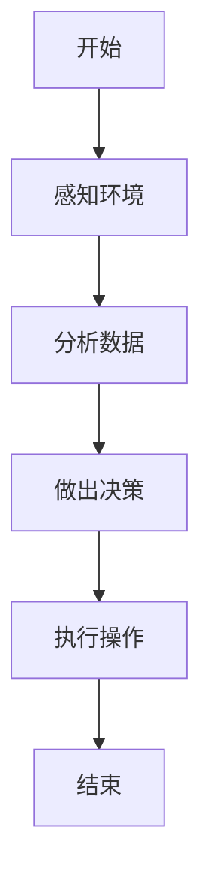
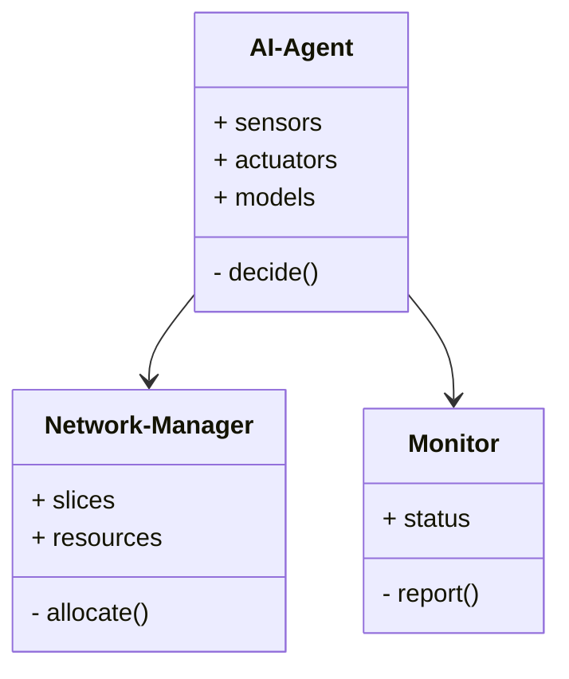
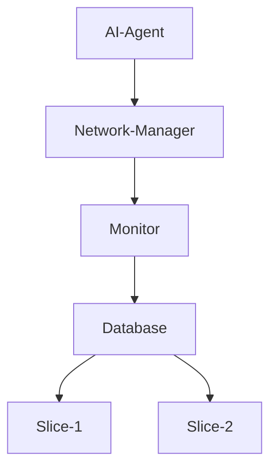
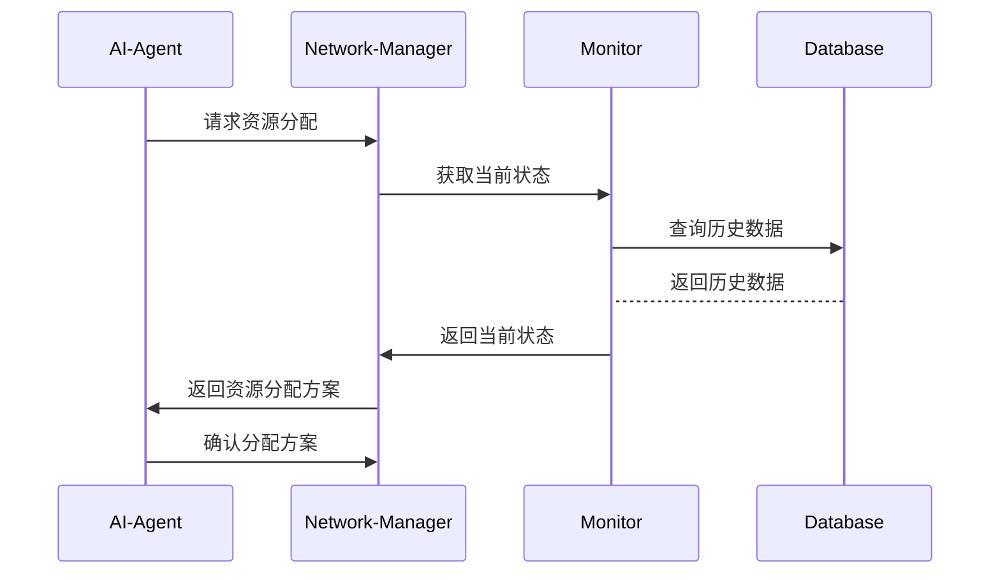

                 


# 企业AI Agent的5G网络智能切片技术

---

## 关键词：
- AI Agent
- 5G网络
- 智能切片
- 网络优化
- 机器学习

---

## 摘要：
本文深入探讨了企业AI Agent在5G网络智能切片技术中的应用，结合实际案例分析和系统设计，详细讲解了AI Agent如何通过智能切片技术优化5G网络的性能。文章从概念背景、核心原理、算法实现到系统架构，层层剖析，为企业技术团队提供实用的解决方案和实施指南。

---

# 第1章: 企业AI Agent的概述

## 1.1 什么是AI Agent

### 1.1.1 AI Agent的定义
AI Agent（人工智能代理）是一种能够感知环境、自主决策并执行任务的智能实体。它通过传感器获取信息，利用算法进行分析和推理，最终做出决策并执行操作。

**关键概念对比表：**

| 特性         | AI Agent                          | 传统软件代理                  |
|--------------|-----------------------------------|------------------------------|
| 智能性       | 高                                 | 低或无                       |
| 自主性       | 高                                 | 低或无                       |
| 学习能力     | 强                                 | 无或弱                       |

### 1.1.2 AI Agent的核心特征
1. **自主性**：能够在没有外部干预的情况下独立运行。
2. **反应性**：能够实时感知环境变化并做出响应。
3. **学习能力**：通过机器学习算法不断优化自身的决策能力。
4. **协作性**：能够与其他AI Agent或系统协同工作。

### 1.1.3 AI Agent与传统软件代理的区别
AI Agent的核心区别在于其智能性和自主性。传统代理通常基于规则或预设的逻辑执行任务，而AI Agent能够通过学习和适应来优化其行为。

---

## 1.2 5G网络智能切片技术

### 1.2.1 5G网络切片的定义
5G网络切片是指将物理网络分割成多个虚拟网络，每个切片独立运行，满足不同业务的需求。例如，视频流媒体、物联网设备和企业通信可以运行在不同的切片上。

### 1.2.2 智能切片的核心概念
智能切片通过AI技术动态调整网络资源分配，优化网络性能。其核心在于将AI Agent嵌入到网络切片管理中，实现自动化决策和优化。

### 1.2.3 5G网络切片的应用场景
1. **工业物联网**：支持设备实时通信和数据传输。
2. **增强现实**：提供低延迟和高带宽的网络环境。
3. **智能交通**：实现车辆与道路设施的高效通信。

---

## 1.3 企业AI Agent与5G网络切片的结合

### 1.3.1 企业AI Agent在5G网络中的作用
AI Agent可以监控网络性能、优化资源分配、处理异常情况，从而提升网络的整体效率。

### 1.3.2 智能切片技术对企业AI Agent的影响
智能切片为AI Agent提供了动态调整网络资源的能力，使其能够更好地适应业务需求的变化。

### 1.3.3 企业AI Agent与5G网络切片的协同工作
AI Agent通过智能切片技术，实时调整网络切片的参数，确保每个业务获得最优的网络资源。

---

## 1.4 本章小结
本章介绍了AI Agent的基本概念和5G网络切片的核心技术，强调了AI Agent在智能切片中的重要性，并为后续章节的深入分析奠定了基础。

---

# 第2章: 5G网络切片技术的背景与挑战

## 2.1 5G网络切片的背景

### 2.1.1 5G网络的特点与需求
5G网络具有高带宽、低延迟和大规模连接的特点，这些特点使其在多个领域都有广泛应用。

### 2.1.2 网络切片技术的发展历程
网络切片技术最早应用于4G网络，但5G网络的发展使其更加成熟和多样化。

### 2.1.3 5G网络切片的必要性
随着5G网络应用场景的多样化，网络切片技术能够更好地满足不同业务的需求。

---

## 2.2 5G网络切片技术的挑战

### 2.2.1 网络资源分配的复杂性
如何在多业务需求下合理分配网络资源是一个复杂的问题。

### 2.2.2 切片管理的难度
切片的动态调整和管理需要高效的算法和系统支持。

### 2.2.3 安全性和隔离性问题
不同切片之间的数据隔离和安全保护是需要重点关注的问题。

---

## 2.3 AI Agent在5G切片中的应用前景

### 2.3.1 AI Agent如何优化切片管理
AI Agent可以通过机器学习算法预测网络负载，优化切片的资源分配。

### 2.3.2 AI Agent在切片动态调整中的作用
AI Agent能够实时感知网络状态，动态调整切片参数，提升网络性能。

### 2.3.3 未来切片技术的发展趋势
未来，切片技术将更加智能化，AI Agent将在其中发挥关键作用。

---

## 2.4 本章小结
本章分析了5G网络切片的背景和挑战，并探讨了AI Agent在其中的应用前景，为后续章节的技术实现提供了背景支持。

---

# 第3章: AI Agent的核心技术与实现原理

## 3.1 AI Agent的核心技术

### 3.1.1 机器学习算法在AI Agent中的应用
机器学习算法（如随机森林、支持向量机）用于数据分析和决策。

### 3.1.2 自然语言处理技术
自然语言处理技术用于理解和生成自然语言文本，增强AI Agent的交互能力。

### 3.1.3 强化学习在AI Agent中的应用
强化学习用于优化AI Agent的决策过程，通过奖励机制提升其行为的正确性。

---

## 3.2 AI Agent的实现原理

### 3.2.1 状态感知与决策过程
AI Agent通过感知环境状态，利用算法进行分析和推理，做出决策并执行操作。

### 3.2.2 决策模型的构建
决策模型包括感知层、分析层、决策层和执行层。

### 3.2.3 机器学习算法的应用
机器学习算法用于训练AI Agent，使其能够根据历史数据预测未来状态。

---

## 3.3 AI Agent的算法实现

### 3.3.1 算法流程图


### 3.3.2 代码实现
```python
class AI-Agent:
    def __init__(self):
        self.sensors = []
        self actuators = []
        self.models = {}

    def perceive(self):
        # 获取环境数据
        pass

    def decide(self):
        # 利用模型做出决策
        pass

    def act(self):
        # 执行操作
        pass
```

---

## 3.4 本章小结
本章详细介绍了AI Agent的核心技术和实现原理，为后续章节的应用提供了理论基础。

---

# 第4章: 智能切片算法与优化

## 4.1 智能切片算法的核心原理

### 4.1.1 网络资源分配的数学模型
$$ R = \max_{x} \{ \sum x_i \cdot w_i | \sum x_i \leq C \} $$
其中，\( R \) 表示资源总量，\( x_i \) 表示分配给业务 \( i \) 的资源，\( w_i \) 表示权重，\( C \) 表示总资源限制。

### 4.1.2 算法实现步骤
1. 感知网络负载。
2. 分析业务需求。
3. 利用优化算法分配资源。
4. 调整切片参数。
5. 监控和反馈。

---

## 4.2 智能切片算法的优化

### 4.2.1 基于强化学习的优化
通过强化学习算法优化资源分配策略，提升网络性能。

### 4.2.2 基于遗传算法的优化
利用遗传算法搜索最优解，提高资源分配效率。

---

## 4.3 算法实现代码

```python
import numpy as np

def optimize_slice_resources(slice_requirements):
    # 使用强化学习算法优化资源分配
    pass

def genetic_algorithm():
    # 使用遗传算法优化资源分配
    pass
```

---

## 4.4 本章小结
本章详细介绍了智能切片算法的核心原理和优化方法，为企业AI Agent的实现提供了技术支撑。

---

# 第5章: 5G网络切片系统设计

## 5.1 问题场景介绍

### 5.1.1 业务需求分析
不同的业务需要不同的网络切片，如何高效管理这些切片是一个挑战。

### 5.1.2 系统目标
实现AI Agent驱动的智能切片管理，动态优化网络资源分配。

---

## 5.2 系统功能设计

### 5.2.1 领域模型类图


### 5.2.2 系统架构设计


---

## 5.3 接口设计与交互流程

### 5.3.1 接口设计
1. AI-Agent与Network-Manager的接口。
2. Network-Manager与Monitor的接口。
3. Monitor与Database的接口。

### 5.3.2 交互流程


---

## 5.4 本章小结
本章详细介绍了5G网络切片系统的功能设计和架构设计，为后续章节的项目实施提供了指导。

---

# 第6章: 项目实战与案例分析

## 6.1 环境安装与配置

### 6.1.1 系统环境
- 操作系统：Linux
- Python版本：3.8+
- 依赖库：numpy、scikit-learn、mermaid等。

### 6.1.2 安装步骤
```bash
pip install numpy scikit-learn mermaid
```

---

## 6.2 核心代码实现

### 6.2.1 AI-Agent实现
```python
class AI-Agent:
    def __init__(self):
        self.models = {}

    def train(self, data):
        # 训练模型
        pass

    def predict(self, input):
        # 预测结果
        pass
```

### 6.2.2 切片管理实现
```python
class Network-Manager:
    def __init__(self):
        self.slices = []

    def allocate_resources(self, requirements):
        # 分配资源
        pass
```

---

## 6.3 案例分析与解读

### 6.3.1 案例背景
某企业需要在5G网络中同时运行视频流媒体和物联网设备。

### 6.3.2 实施步骤
1. 数据采集与分析。
2. 建立AI Agent模型。
3. 切片资源分配与优化。
4. 测试与验证。

---

## 6.4 项目总结
通过本项目，我们验证了AI Agent在5G网络切片中的有效性，并展示了其在实际场景中的应用价值。

---

# 第7章: 最佳实践与小结

## 7.1 最佳实践 tips

### 7.1.1 系统设计
- 明确业务需求。
- 设计合理的系统架构。
- 确保系统的可扩展性和可维护性。

### 7.1.2 算法优化
- 根据实际需求选择合适的算法。
- 不断优化模型参数。
- 定期更新模型。

---

## 7.2 本章小结

### 7.2.1 全文总结
本文系统地介绍了企业AI Agent在5G网络智能切片中的应用，从理论到实践，详细讲解了技术实现和优化方法。

### 7.2.2 未来展望
随着AI技术的不断发展，AI Agent在5G网络中的应用将更加广泛和深入，为企业带来更大的价值。

---

# 结语
通过本文的学习，读者可以深入了解企业AI Agent在5G网络智能切片技术中的应用，掌握其实现原理和优化方法。希望本文能为企业的技术团队提供实用的指导和启发。

--- 

# 附录
1. 术语表
2. 参考文献
3. 代码仓库地址

--- 

希望本文能为您提供有价值的见解和启示！

