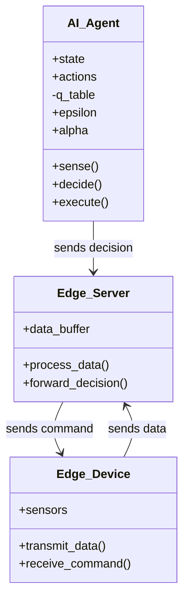
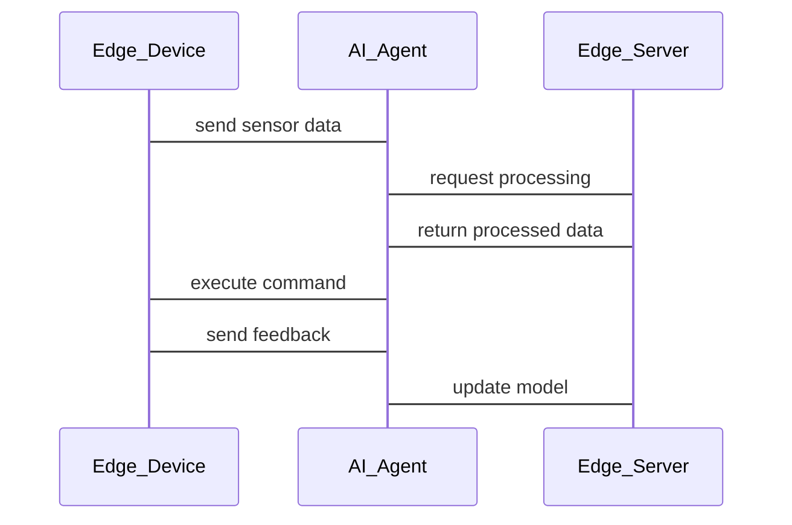

                 


# 企业AI Agent的5G边缘计算策略

## 关键词：5G边缘计算、AI Agent、边缘计算、分布式AI、企业数字化转型

## 摘要：随着5G技术的快速发展，边缘计算在企业中的应用日益广泛。AI Agent作为人工智能领域的核心技术，能够显著提升边缘计算的智能化水平。本文详细探讨了AI Agent在5G边缘计算中的策略，分析了其核心概念、算法原理、系统架构，并通过案例展示了实际应用，为企业在5G边缘计算中的智能化转型提供了参考。

---

# 第1章 企业AI Agent与5G边缘计算概述

## 1.1 5G边缘计算的背景与发展

### 1.1.1 5G技术的基本概念
5G技术通过高频段和大规模多天线技术，显著提升了网络速度和容量。5G的高带宽和低延迟为边缘计算提供了理想的技术基础，使得数据处理更靠近数据源，减少了传输延迟。

### 1.1.2 边缘计算的定义与特点
边缘计算是在靠近数据生成源的地方进行数据处理和存储，特点包括低延迟、高带宽、本地化数据处理和安全性。

### 1.1.3 5G边缘计算对企业的重要性
5G边缘计算帮助企业实现数据的实时处理和快速响应，提升了业务效率和用户体验，尤其在智能制造、智慧城市等领域具有重要意义。

## 1.2 AI Agent的基本概念

### 1.2.1 AI Agent的定义
AI Agent是具备感知环境、做出决策并采取行动的智能体，能够自主执行任务，适应环境变化。

### 1.2.2 AI Agent的核心功能
AI Agent具备感知、决策、执行和学习功能，能够处理复杂任务并优化性能。

### 1.2.3 AI Agent在企业中的应用潜力
AI Agent在企业中的应用潜力广泛，包括智能监控、自动化操作和实时数据分析，能够显著提升企业效率。

## 1.3 5G边缘计算与AI Agent的结合

### 1.3.1 5G边缘计算的优势
5G的低延迟和高带宽支持了边缘计算的实时性和高效性，为AI Agent提供了理想的数据处理环境。

### 1.3.2 AI Agent在边缘计算中的作用
AI Agent通过实时数据分析和自主决策，优化了边缘计算的资源分配和任务执行。

### 1.3.3 企业AI Agent的5G边缘计算策略的意义
通过AI Agent在5G边缘计算中的应用，企业能够实现更高效的数据处理和智能化的业务流程。

## 1.4 本章小结
本章介绍了5G边缘计算和AI Agent的基本概念，探讨了它们的结合对企业的重要性。

---

# 第2章 5G边缘计算的核心原理

## 2.1 边缘计算的体系结构

### 2.1.1 边缘计算的层次结构
边缘计算的层次结构包括设备层、网络层、计算层和应用层，每一层负责不同的数据处理和传输任务。

### 2.1.2 边缘计算的关键技术
边缘计算的关键技术包括边缘服务器、雾计算和边缘网关，这些技术共同支持数据的高效处理和传输。

## 2.2 5G网络的支持作用

### 2.2.1 5G网络的特点
5G网络的特点包括高速度、低延迟和大规模连接，为边缘计算提供了强大的网络支持。

### 2.2.2 5G如何支持边缘计算
5G通过提供高速数据传输和低延迟，优化了边缘计算的数据处理效率，支持实时任务执行。

## 2.3 本章小结
本章详细讲解了5G边缘计算的核心原理和技术支持，为后续章节奠定了基础。

---

# 第3章 AI Agent的核心原理

## 3.1 AI Agent的基本原理

### 3.1.1 AI Agent的感知与决策机制
AI Agent通过传感器或数据接口感知环境，利用算法做出决策并执行任务。

### 3.1.2 AI Agent的学习与优化
AI Agent通过机器学习和强化学习不断提升自身的感知和决策能力，优化任务执行效果。

## 3.2 AI Agent与5G边缘计算的结合

### 3.2.1 AI Agent在边缘计算中的部署
AI Agent被部署在边缘设备或边缘服务器中，负责实时数据处理和任务执行。

### 3.2.2 AI Agent如何利用5G网络优势
AI Agent利用5G的高速和低延迟，快速获取数据并做出决策，提升整体处理效率。

## 3.3 本章小结
本章详细阐述了AI Agent的核心原理及其在5G边缘计算中的应用，为后续策略制定提供了理论基础。

---

# 第4章 5G边缘计算中的AI Agent算法

## 4.1 基于强化学习的AI Agent算法

### 4.1.1 强化学习的基本概念
强化学习是一种通过试错机制来优化决策模型的算法，适用于动态环境下的任务处理。

### 4.1.2 在边缘计算中的应用
强化学习用于优化边缘计算中的资源分配和任务调度，提升整体系统性能。

### 4.1.3 算法实现的数学模型
强化学习的数学模型包括状态、动作、奖励和策略函数，通过Q-learning算法实现优化。

```python
# 强化学习算法示例：Q-learning
class QAgent:
    def __init__(self, actions, epsilon=0.1, alpha=0.1):
        self.actions = actions
        self.epsilon = epsilon
        self.alpha = alpha
        self.q_table = {}

    def get_q(self, state):
        return self.q_table.get(state, 0)

    def learn(self, state, action, reward, next_state):
        q = self.get_q(state)
        next_q = self.get_q(next_state)
        self.q_table[state] = q + self.alpha * (reward + next_q - q)
```

### 4.1.4 通俗易懂的举例说明
例如，在智能制造中，AI Agent通过强化学习算法优化生产流程中的资源分配，提升效率和降低能耗。

## 4.2 分布式AI算法在边缘计算中的应用

### 4.2.1 分布式算法的基本原理
分布式算法将计算任务分配到多个节点，通过协同完成任务，提高计算效率和容错性。

### 4.2.2 在边缘计算中的具体实现
分布式AI算法在边缘计算中的实现包括数据分割、任务分配和结果汇总，确保各节点协同工作。

### 4.2.3 算法的优缺点分析
优点：高效、容错；缺点：复杂性高、需要良好的通信机制。

## 4.3 本章小结
本章详细讲解了在5G边缘计算中常用的AI Agent算法，包括强化学习和分布式算法，并提供了实现示例。

---

# 第5章 企业AI Agent的5G边缘计算系统设计

## 5.1 系统功能设计

### 5.1.1 问题场景介绍
考虑一个智能制造工厂，需要实时监控生产线并优化资源配置。

### 5.1.2 系统功能模块划分
系统功能模块包括数据采集、AI Agent决策、执行控制和结果反馈。

### 5.1.3 功能实现
AI Agent负责数据处理和决策，执行模块根据决策执行操作，反馈系统提供实时反馈。

## 5.2 系统架构设计

### 5.2.1 领域模型（Mermaid类图）


### 5.2.2 系统架构（Mermaid架构图）


### 5.2.3 系统交互流程（Mermaid序列图）


## 5.3 本章小结
本章详细设计了企业AI Agent的5G边缘计算系统，包括功能模块、架构设计和交互流程。

---

# 第6章 项目实战：企业AI Agent的5G边缘计算实现

## 6.1 环境安装

### 6.1.1 系统环境
建议使用Linux系统，安装Python、Django框架和必要的开发工具。

### 6.1.2 安装依赖
使用pip安装所需库，如Django、numpy、scikit-learn等。

## 6.2 系统核心实现源代码

### 6.2.1 AI Agent核心代码
```python
class AIEdgeAgent:
    def __init__(self, learning_rate=0.1):
        self.lr = learning_rate
        self.q_values = {}

    def perceive(self, state):
        # 返回环境中的数据
        return state

    def decide(self, state):
        # 返回决策动作
        if state not in self.q_values:
            self.q_values[state] = 0
        return max(self.q_values[state], default=0)

    def learn(self, state, action, reward, next_state):
        # 更新Q值
        current_q = self.q_values.get(state, 0)
        next_q = max(self.q_values.get(next_state, 0), default=0)
        self.q_values[state] = current_q + self.lr * (reward + next_q - current_q)
```

### 6.2.2 边缘计算节点代码
```python
from django.core.management.base import BaseCommand
from edge.models import EdgeNode

class Command(BaseCommand):
    def handle(self, *args, **options):
        nodes = EdgeNode.objects.all()
        for node in nodes:
            # 获取数据
            data = node.get_data()
            # 传递给AI Agent
            agent = AIEdgeAgent()
            action = agent.decide(data)
            # 执行操作
            node.execute_action(action)
            # 反馈结果
            reward = node.get_reward(action)
            agent.learn(data, action, reward, node.get_next_state())
```

## 6.3 代码应用解读与分析

### 6.3.1 AI Agent核心代码解读
AI Agent通过感知环境数据，做出决策，并通过强化学习优化Q值，提升决策准确性。

### 6.3.2 边缘计算节点代码解读
边缘节点负责数据采集、传递给AI Agent进行决策，并执行操作，同时反馈结果以优化AI Agent的模型。

## 6.4 案例分析与详细讲解

### 6.4.1 案例背景
以智能制造工厂为例，AI Agent负责监控生产线并优化资源分配。

### 6.4.2 实施步骤
1. 数据采集：边缘节点收集传感器数据。
2. 决策：AI Agent基于数据做出优化决策。
3. 执行：边缘节点执行决策指令。
4. 反馈：系统收集结果并优化AI Agent模型。

## 6.5 项目小结
本项目展示了AI Agent在5G边缘计算中的实际应用，验证了其在智能制造中的有效性和高效性。

---

# 第7章 最佳实践与注意事项

## 7.1 最佳实践

### 7.1.1 系统设计
确保系统模块化设计，便于扩展和维护。

### 7.1.2 安全性
强化数据安全措施，防止数据泄露和网络攻击。

### 7.1.3 性能优化
通过分布式算法和负载均衡技术优化系统性能。

## 7.2 小结
本章总结了企业在实施AI Agent的5G边缘计算策略时的关键点和注意事项。

## 7.3 注意事项

### 7.3.1 数据隐私
确保数据处理符合隐私保护法规。

### 7.3.2 系统稳定性
定期进行系统测试和维护，确保系统稳定运行。

### 7.3.3 技术选型
根据企业需求选择合适的技术和工具，避免过度复杂化。

## 7.4 拓展阅读
建议阅读相关技术书籍，如《分布式系统：概念与设计》和《强化学习入门》。

---

# 附录

## 附录A: 5G边缘计算相关技术术语表
- 边缘计算：在数据源附近进行数据处理的技术。
- 5G网络：第五代移动通信技术，支持高速和低延迟。

## 附录B: AI Agent相关技术术语表
- 强化学习：通过试错优化决策模型的算法。
- 分布式计算：将任务分配到多个节点协同完成的技术。

---

# 参考文献
[此处列出参考文献，如《5G边缘计算技术》、《人工智能与边缘计算》等]

---

通过以上详细目录和内容安排，本文系统地探讨了企业AI Agent在5G边缘计算中的策略，从理论到实践，为企业的智能化转型提供了全面的指导和参考。

