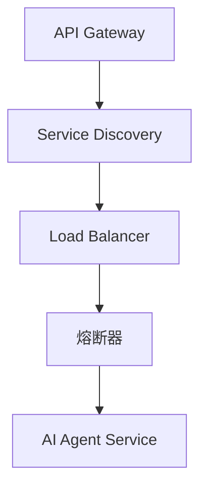

                 


# 企业AI Agent的API设计与管理

## 关键词：
企业AI Agent、API设计、API管理、RESTful API、安全性、版本控制、监控

## 摘要：
本文详细探讨了企业AI Agent的API设计与管理的关键方面，涵盖从基本概念到实际应用的全过程。通过分析API设计原则、安全性、版本控制和监控，结合实际案例，为读者提供系统化的解决方案。

---

## 正文

### 第一部分：企业AI Agent的背景与基础

#### 第1章：企业AI Agent概述

##### 1.1 什么是企业AI Agent
- **定义**：企业AI Agent是一种智能代理，利用AI技术执行企业任务，通过API进行通信。
- **核心功能**：
  - 自动化任务执行
  - 数据处理与分析
  - 服务协调与通信
- **与传统代理的区别**：
  | 特性 | 传统代理 | 企业AI Agent |
  |------|----------|--------------|
  | 智能性 | 低       | 高           |
  | 任务复杂度 | 简单    | 复杂         |
  | 决策能力 | 无或有限 | 强大         |

##### 1.2 企业AI Agent的背景与应用
- **背景**：企业数字化转型推动了对智能自动化工具的需求。
- **应用**：
  - 供应链管理
  - 客户服务自动化
  - 业务流程优化
- **发展趋势**：智能化、自动化、跨平台集成。

##### 1.3 企业AI Agent与API的关系
- API是企业AI Agent的核心通信方式，决定了其功能实现和系统集成能力。

### 第二部分：API设计的核心原则

#### 第2章：API设计的基本原则

##### 2.1 RESTful API设计规范
- **资源、表示与操作**：
  - 资源：API处理的数据实体，如用户、订单。
  - 表示：资源的格式，如JSON、XML。
  - 操作：HTTP方法，如GET、POST、PUT、DELETE。
- **最佳实践**：
  - 使用统一的根URL。
  - 支持分页和过滤。
  - 返回标准HTTP状态码。

##### 2.2 API版本控制
- **重要性**：确保API的稳定性和兼容性。
- **版本控制方法**：
  - URI路径：/api/v1/resource。
  - HTTP头：Accept: application/vnd.myapi.v1+json。
  - Custom参数：version=1.0。
- **实现策略**：
  - 分阶段发布。
  - 提供迁移指南。

##### 2.3 API安全性设计
- **重要性**：防止未授权访问和数据泄露。
- **常见安全威胁**：
  - 未认证/授权访问。
  - 数据篡改。
  - 重放攻击。
- **防护措施**：
  - OAuth 2.0认证。
  - 使用HTTPS传输。
  - 输入验证。

### 第三部分：企业AI Agent的API管理

#### 第3章：API管理平台的选择与实现

##### 3.1 API管理平台的功能与选择
- **核心功能**：
  - API发布、文档生成。
  - 访问控制、监控分析。
  - 支持团队协作。
- **平台对比**：
  | 平台 | 功能特点 | 适用场景 |
  |------|----------|----------|
  | Apigee | 全功能强大 | 大型企业 |
  | Postman | 易用性高 | 开发团队 |

##### 3.2 API生命周期管理
- **阶段划分**：
  - 设计与开发：明确需求，设计API。
  - 测试与部署：单元测试，灰度发布。
  - 监控与优化：实时监控，性能调优。

##### 3.3 API监控与日志管理
- **监控的重要性**：及时发现故障，确保API可用性。
- **日志管理**：记录请求、响应、错误信息。
- **工具推荐**：Prometheus + Grafana，ELK stack。

### 第四部分：企业AI Agent的系统架构设计

#### 第4章：系统架构与设计模式

##### 4.1 系统架构设计
- **整体架构**：
  - **服务发现**：通过注册中心实现服务发现。
  - **负载均衡**：分配请求到不同节点。
  - **熔断机制**：防止雪崩效应。
- **架构图**：



##### 4.2 系统接口设计
- **接口设计原则**：
  - 明确接口职责。
  - 使用标准协议。
  - 支持版本回退。

##### 4.3 系统交互设计
- **交互流程**：
  1. 用户请求进入API Gateway。
  2. 服务发现定位服务实例。
  3. 负载均衡分配请求。
  4. 服务处理请求并返回结果。
  5. 返回响应给用户。

### 第五部分：项目实战

#### 第5章：企业AI Agent API实战

##### 5.1 环境搭建
- **工具安装**：
  - 安装Python、Flask框架。
  - 安装Docker、Kubernetes。

##### 5.2 核心代码实现
```python
from flask import Flask, request, jsonify

app = Flask(__name__)

@app.route('/api/v1/agent', methods=['POST'])
def process_request():
    data = request.json
    # AI Agent处理逻辑
    result = {
        'status': 'success',
        'message': 'Request processed successfully'
    }
    return jsonify(result)

if __name__ == '__main__':
    app.run(debug=True)
```

##### 5.3 代码解读与分析
- **功能**：处理来自API Gateway的请求。
- **流程**：
  1. 接收请求。
  2. 解析数据。
  3. 执行AI Agent逻辑。
  4. 返回响应。

##### 5.4 案例分析
- **场景**：订单处理。
- **流程**：
  1. API Gateway接收订单请求。
  2. AI Agent检查库存。
  3. 根据结果生成响应。

### 第六部分：总结与扩展

#### 第6章：总结与最佳实践

##### 6.1 最佳实践
- **设计**：遵循RESTful原则，注重版本控制。
- **安全**：实施严格的认证和授权机制。
- **监控**：实时监控API性能，及时处理异常。

##### 6.2 小结
企业AI Agent的API设计与管理是一个复杂但关键的任务，通过合理的设计和有效的管理，可以提升系统的智能化水平和运行效率。

##### 6.3 注意事项
- **版本控制**：确保兼容性和稳定性。
- **安全性**：保护敏感数据。
- **监控**：及时发现和解决问题。

##### 6.4 拓展阅读
- 推荐书籍：《RESTful API设计实战》。
- 工具推荐：Postman、Apigee、Prometheus。

---

通过以上结构，本文系统地介绍了企业AI Agent的API设计与管理的关键点，结合理论与实践，帮助读者深入理解和应用相关技术。

