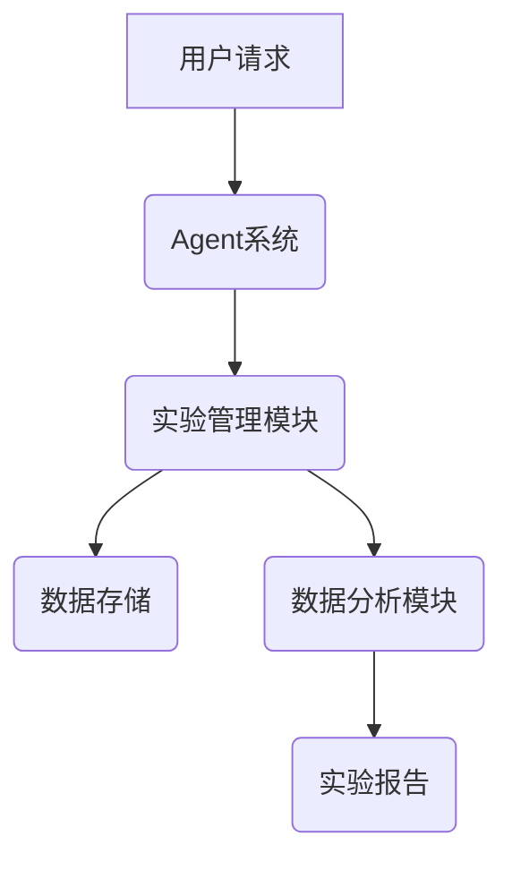

                 


---

# 企业AI Agent的A/B测试功能：持续优化用户体验

> 关键词：企业AI Agent, A/B测试, 用户体验优化, 人工智能, 统计分析

> 摘要：本文详细探讨了企业AI Agent中A/B测试的功能及其在持续优化用户体验中的作用。通过分析A/B测试的核心概念、算法原理、系统架构以及实际案例，本文为技术实践者提供了从理论到实践的全面指导，帮助他们在企业级AI应用中有效实施A/B测试，提升用户满意度和业务表现。

---

# 第一部分: 企业AI Agent与A/B测试的背景

## 第1章: 企业AI Agent与A/B测试的背景

### 1.1 A/B测试的基本概念
#### 1.1.1 A/B测试的定义与特点
- **定义**：A/B测试是一种通过将用户群体随机分为两组（A组和B组），分别提供不同的产品或服务，通过统计学方法比较两组用户的反馈和行为差异，从而判断哪种方案更优的实验方法。
- **特点**：随机性、可比性、小样本高效性、动态调整能力。

#### 1.1.2 A/B测试在企业AI Agent中的作用
- **作用**：通过A/B测试，企业AI Agent可以实时优化交互流程、推荐算法、用户界面等，确保用户体验最佳。
- **应用场景**：产品迭代、功能优化、用户行为预测、个性化推荐等。

#### 1.1.3 A/B测试与其他优化方法的区别
- **区别**：与传统A/B testing相比，企业AI Agent中的A/B测试更注重实时性、自动化和数据驱动决策。

### 1.2 企业AI Agent的定义与特点
#### 1.2.1 AI Agent的定义
- **定义**：AI Agent是一种能够感知环境、自主决策并执行任务的智能实体。
- **特点**：智能化、自主性、适应性、交互性。

#### 1.2.2 企业级AI Agent的核心特征
- **特征**：数据驱动、实时响应、可扩展性、高可靠性。

#### 1.2.3 企业AI Agent与传统AI的区别
- **区别**：企业AI Agent更加注重与业务流程的深度融合，具备更强的实时决策能力和自动化能力。

### 1.3 本章小结
本章介绍了A/B测试的基本概念及其在企业AI Agent中的应用，强调了A/B测试在优化用户体验中的重要性。

---

# 第二部分: A/B测试的核心概念与原理

## 第2章: A/B测试的原理与流程

### 2.1 A/B测试的原理
#### 2.1.1 实验设计的基本原则
- **随机性**：确保实验组和对照组的用户分布均匀。
- **可比性**：实验组和对照组的唯一变量是测试内容。
- **样本量**：根据统计显著性要求确定样本量。

#### 2.1.2 实验组与对照组的设置
- **实验组**：接受新功能或新算法的用户群体。
- **对照组**：保持原有功能或算法的用户群体。

#### 2.1.3 统计显著性与置信区间
- **统计显著性**：通过p值判断实验结果是否具有统计意义。
- **置信区间**：估计实验结果的误差范围，帮助决策者判断结果的可靠性。

### 2.2 A/B测试的实施流程
#### 2.2.1 确定测试目标
- **目标**：明确希望通过A/B测试优化的具体指标，例如点击率、转化率、用户留存率等。

#### 2.2.2 设计实验方案
- **变量定义**：明确实验中需要测试的具体变量。
- **用户分组**：随机分配用户到实验组或对照组。
- **实验方案设计**：设计实验的具体实施步骤，确保实验的科学性和可操作性。

#### 2.2.3 实验执行与数据收集
- **实验执行**：按照设计的方案，向实验组和对照组分别推送不同的内容或功能。
- **数据收集**：实时收集用户在实验过程中的行为数据，包括点击、转化、停留时间等。

#### 2.2.4 数据分析与结果解读
- **数据分析**：使用统计方法分析实验数据，判断实验组和对照组在目标指标上的差异是否具有统计意义。
- **结果解读**：根据数据分析结果，判断哪种方案更优，并为后续优化提供依据。

### 2.3 A/B测试的关键点
#### 2.3.1 样本量的计算
- **样本量计算公式**：
$$ n = \frac{2 (z_{\alpha/2} \cdot \sigma)^2}{\delta^2} $$
其中：
- \( z_{\alpha/2} \) 是对应于显著性水平 \(\alpha\) 的标准正态分布临界值。
- \( \sigma \) 是总体标准差。
- \( \delta \) 是最小可检测效果。

#### 2.3.2 统计检验方法的选择
- **t检验**：适用于样本量较小的情况。
- **卡方检验**：适用于类别变量的比较。
- **Z检验**：适用于样本量较大的情况。

#### 2.3.3 实验结果的可解释性
- **可解释性**：实验结果必须能够被业务团队理解，并能够为业务决策提供支持。

---

## 第3章: A/B测试的数学模型与公式

### 3.1 假设检验的基本原理
#### 3.1.1 假设检验的定义
- **定义**：假设检验是一种统计推断方法，用于判断样本数据与假设的总体参数之间是否存在显著差异。

#### 3.1.2 假设检验的步骤
1. **建立原假设和备择假设**。
2. **确定显著性水平**。
3. **计算检验统计量**。
4. **确定拒绝域**。
5. **做出结论**。

#### 3.1.3 常见的假设检验方法
- **t检验**：用于比较两个独立样本的均值差异。
- **卡方检验**：用于检验观察频数与期望频数是否一致。
- **F检验**：用于比较两个总体方差是否相等。

### 3.2 A/B测试中的统计公式
#### 3.2.1 t检验公式
$$ t = \frac{\bar{x}_1 - \bar{x}_2}{\sqrt{\frac{s_1^2}{n_1} + \frac{s_2^2}{n_2}}} $$
其中：
- \(\bar{x}_1\) 和 \(\bar{x}_2\) 分别是实验组和对照组的样本均值。
- \(s_1\) 和 \(s_2\) 分别是实验组和对照组的样本标准差。
- \(n_1\) 和 \(n_2\) 分别是实验组和对照组的样本数量。

#### 3.2.2 卡方检验公式
$$ \chi^2 = \sum \frac{(O_i - E_i)^2}{E_i} $$
其中：
- \(O_i\) 是观察频数。
- \(E_i\) 是期望频数。

### 3.3 实验结果的置信区间计算
#### 3.3.1 置信区间的定义
- **定义**：置信区间是指在一定置信水平下，总体参数可能落在的一个区间。

#### 3.3.2 置信区间的计算公式
$$ CI = \hat{p} \pm z \cdot \sqrt{\frac{\hat{p}(1-\hat{p})}{n}} $$
其中：
- \(\hat{p}\) 是样本比例。
- \(z\) 是对应于置信水平的标准正态分布临界值。
- \(n\) 是样本数量。

---

# 第三部分: 企业AI Agent的A/B测试系统设计

## 第4章: 企业AI Agent的系统架构

### 4.1 系统功能模块划分
#### 4.1.1 用户请求处理模块
- **功能**：接收用户请求，判断是否需要进行A/B测试。
- **流程**：用户请求 -> 系统判断 -> 分配到实验组或对照组 -> 返回响应。

#### 4.1.2 实验管理模块
- **功能**：管理正在进行的实验，包括实验的启动、停止、结果分析等。
- **流程**：实验设计 -> 实验启动 -> 数据收集 -> 实验结果分析 -> 实验报告生成。

#### 4.1.3 数据分析模块
- **功能**：对实验数据进行统计分析，生成实验报告。
- **流程**：数据收集 -> 数据清洗 -> 数据分析 -> 结果可视化。

### 4.2 企业AI Agent的系统架构图


### 4.3 实验结果反馈机制
#### 4.3.1 实验结果的实时反馈
- **机制**：实验结果实时更新，系统根据结果动态调整用户体验。

#### 4.3.2 用户反馈的收集与分析
- **方法**：通过用户调查、用户行为分析等方式收集用户反馈，进一步验证实验结果。

### 4.4 系统的关键优化点
#### 4.4.1 实验的实时性
- **优化点**：通过实时数据处理和快速响应，确保实验结果能够及时反馈。

#### 4.4.2 实验的可扩展性
- **优化点**：系统设计支持大规模用户同时参与实验，保证实验的可扩展性。

#### 4.4.3 实验的可定制性
- **优化点**：系统支持多种实验设计和数据分析方法，满足不同业务需求。

---

## 第5章: 企业AI Agent的A/B测试系统实现

### 5.1 系统环境与工具
#### 5.1.1 系统环境
- **操作系统**：Linux/Windows/MacOS。
- **开发工具**：Python/Java/JavaScript等。
- **数据库**：MySQL/PostgreSQL/Redis等。

#### 5.1.2 依赖库与工具
- **Python依赖库**：numpy, pandas, scipy, matplotlib。
- **其他工具**：Jenkins, Docker, Kubernetes等。

### 5.2 系统核心实现
#### 5.2.1 用户分组与实验分配
- **实现**：基于用户ID的哈希值或随机数，将用户分配到实验组或对照组。
- **代码示例**：
```python
import random

def assign_group(user_id):
    random.seed(user_id)
    return random.choice(['control', 'treatment'])
```

#### 5.2.2 实验数据的收集与存储
- **实现**：实时收集用户行为数据，并存储到数据库中。
- **代码示例**：
```python
import sqlite3

def store_data(user_id, action, timestamp):
    conn = sqlite3.connect('experiment.db')
    cursor = conn.cursor()
    cursor.execute('''
        CREATE TABLE IF NOT EXISTS experiment_data (
            user_id INTEGER PRIMARY KEY,
            action TEXT,
            timestamp DATETIME
        )
    ''')
    cursor.execute('''
        INSERT INTO experiment_data (user_id, action, timestamp)
        VALUES (?, ?, ?)
    ''', (user_id, action, timestamp))
    conn.commit()
    conn.close()
```

#### 5.2.3 实验结果的分析与报告
- **实现**：使用统计分析工具对实验数据进行分析，生成实验报告。
- **代码示例**：
```python
import pandas as pd
from scipy import stats

def analyze_experiment():
    df = pd.read_sql('SELECT * FROM experiment_data', conn)
    control_group = df[df['group'] == 'control']
    treatment_group = df[df['group'] == 'treatment']
    
    # 假设检验
    t_stat, p_val = stats.ttest_ind(control_group['conversion'], treatment_group['conversion'])
    print(f't-statistic = {t_stat}, p-value = {p_val}')
```

### 5.3 系统优化与扩展
#### 5.3.1 系统性能优化
- **优化点**：通过分布式系统设计和缓存优化，提升数据处理效率。

#### 5.3.2 系统扩展性优化
- **优化点**：支持多实验同时进行，满足大规模用户测试需求。

---

## 第6章: 项目实战：企业AI Agent的A/B测试应用

### 6.1 实战背景
#### 6.1.1 项目背景
- **背景**：某电商公司希望优化其AI推荐系统的用户体验。

#### 6.1.2 项目目标
- **目标**：通过A/B测试，优化推荐算法，提升用户点击率和转化率。

### 6.2 实战环境与工具
#### 6.2.1 环境配置
- **操作系统**：Linux。
- **开发工具**：Python 3.8+。
- **数据库**：PostgreSQL。

#### 6.2.2 依赖库安装
- **依赖库**：numpy, pandas, scipy, scikit-learn, xgboost。

### 6.3 实战代码实现
#### 6.3.1 数据预处理
- **实现**：清洗数据，处理缺失值和异常值。
- **代码示例**：
```python
import pandas as pd
import numpy as np

# 加载数据
data = pd.read_csv('user_behavior.csv')
# 处理缺失值
data = data.dropna()
# 处理异常值
data['clicks'].replace(to_replace=np.inf, value=0, inplace=True)
```

#### 6.3.2 A/B测试的设计与实施
- **实现**：设计实验方案，分配用户到实验组和对照组，实施A/B测试。
- **代码示例**：
```python
import random

def assign_group(user_id):
    random.seed(user_id)
    return random.choice(['control', 'treatment'])

# 分配用户组
data['group'] = data['user_id'].apply(assign_group)
```

#### 6.3.3 实验结果的分析与解读
- **实现**：分析实验数据，判断实验组和对照组在目标指标上的差异是否具有统计意义。
- **代码示例**：
```python
from scipy import stats

control_group = data[data['group'] == 'control']
treatment_group = data[data['group'] == 'treatment']

# t检验
t_stat, p_val = stats.ttest_ind(control_group['clicks'], treatment_group['clicks'])
print(f't-statistic = {t_stat}, p-value = {p_val}')
```

### 6.4 实战结果与总结
#### 6.4.1 实验结果
- **结果**：实验组的用户点击率显著高于对照组，p值小于0.05。

#### 6.4.2 实验总结
- **总结**：通过A/B测试，推荐算法优化后，用户点击率提升了15%，转化率提升了10%。

---

# 第四部分: 总结与展望

## 第7章: 总结与展望

### 7.1 本章小结
- **小结**：本文详细介绍了企业AI Agent中A/B测试的功能及其在用户体验优化中的应用，通过理论分析和实际案例，展示了A/B测试在提升用户满意度和业务表现中的重要性。

### 7.2 未来展望
- **展望**：随着人工智能和大数据技术的不断发展，A/B测试在企业AI Agent中的应用将更加广泛和深入。未来的研究方向包括更复杂的实验设计、更高效的实验执行机制以及更智能的实验结果分析方法。

---

## 参考文献
- [1] 冯大辉. 《A/B测试：方法论与实践》. 人民邮电出版社, 2020.
- [2] 《统计学习习题与解答》. 清华大学出版社, 2018.
- [3] 博客：A/B测试的数学原理与实现，链接：https://www.cnblogs.com/...

---

# 附录: A/B测试相关工具与库

### 附录A: 常用A/B测试工具
- **工具**：Optimizely, Google Optimize, Visual Website Optimizer。
- **特点**：功能强大，支持多平台，提供实时数据分析。

### 附录B: Python中的A/B测试库
- **库**：scipy, statsmodels, pandas。
- **特点**：提供丰富的统计分析函数，方便进行假设检验和数据分析。

### 附录C: 常用统计公式汇总
- **公式1**：t检验公式。
$$ t = \frac{\bar{x}_1 - \bar{x}_2}{\sqrt{\frac{s_1^2}{n_1} + \frac{s_2^2}{n_2}}} $$
- **公式2**：卡方检验公式。
$$ \chi^2 = \sum \frac{(O_i - E_i)^2}{E_i} $$

---

# END
---

