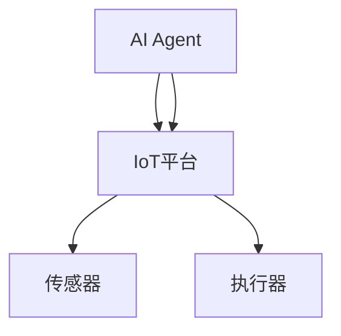
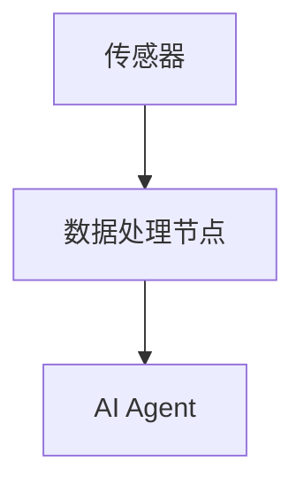
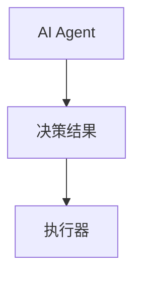
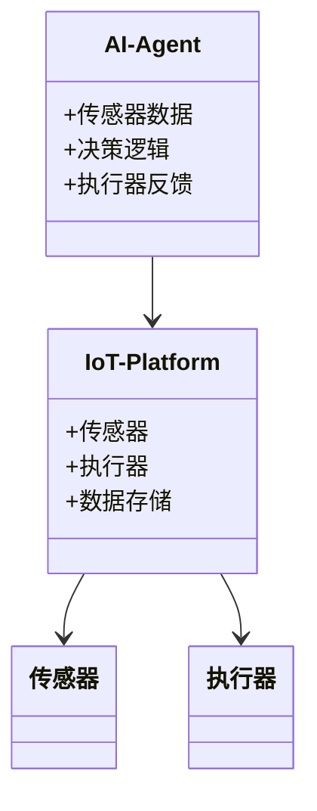
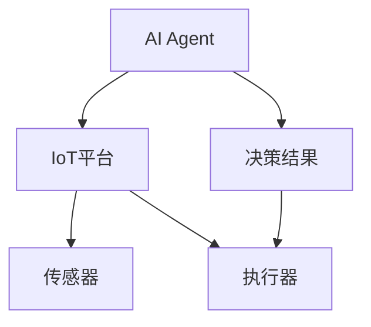
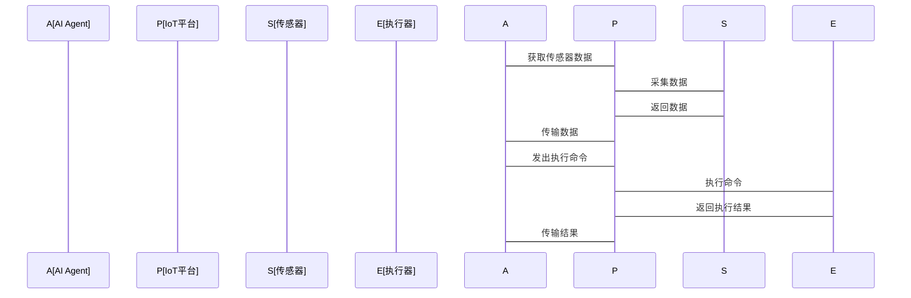

                 


# 企业AI Agent的IoT集成策略

> 关键词：企业AI Agent，IoT，智能物联网，AI与IoT集成，智能化系统设计，边缘计算

> 摘要：随着企业数字化转型的深入，AI Agent与IoT的集成成为提升企业智能化水平的重要策略。本文从背景、核心概念、算法原理、系统设计、项目实战等方面详细探讨企业AI Agent在IoT中的集成策略，为企业智能化转型提供理论支持和实践指导。

---

# 第1章: 企业AI Agent与IoT集成的背景

## 1.1 问题背景

### 1.1.1 企业数字化转型的现状与挑战
企业数字化转型已进入深水区，数据成为企业核心资产。IoT作为连接物理世界与数字世界的桥梁，帮助企业实现设备、系统和数据的互联互通。然而，IoT系统产生的海量数据如何高效处理、实时分析，并转化为企业决策的驱动力，成为当前面临的重要挑战。

### 1.1.2 IoT在企业中的应用与发展
IoT在企业中的应用已从简单的设备监控扩展到生产优化、资产管理、供应链协同等领域。然而，现有IoT系统在数据智能分析、实时决策和自主执行方面的能力有限，难以满足企业智能化需求。

### 1.1.3 AI Agent在企业智能化中的作用
AI Agent作为一种具备自主决策和执行能力的智能实体，能够通过感知环境、分析数据、制定策略并执行操作，帮助企业在复杂场景中实现自动化和智能化。AI Agent的引入，将显著提升IoT系统的智能化水平。

## 1.2 问题描述

### 1.2.1 IoT系统中的数据处理与决策需求
IoT系统需要实时处理大量异构数据，但现有系统往往依赖人工干预或基于规则的决策，难以应对动态变化的场景。

### 1.2.2 AI Agent在IoT中的潜在应用场景
AI Agent可以在IoT中实现智能监控、预测维护、动态优化、自主决策等场景，显著提升系统的智能化水平。

### 1.2.3 当前IoT与AI Agent集成的痛点与难点
- 数据孤岛与异构性问题：IoT设备多样，数据格式和协议不统一，难以有效整合。
- 系统复杂性：AI Agent需要与IoT系统深度集成，涉及多层架构和技术。
- 安全与隐私：IoT数据涉及企业核心业务，AI Agent的接入可能带来安全风险。

## 1.3 问题解决

### 1.3.1 AI Agent在IoT中的核心价值
AI Agent通过智能数据分析、自主决策和执行能力，提升IoT系统的实时性和智能化水平。

### 1.3.2 IoT与AI Agent集成的关键技术
- 数据融合与处理技术
- AI算法在IoT中的应用
- 边缘计算与云计算的结合

### 1.3.3 企业AI Agent-IoT集成的实现路径
1. 数据采集与预处理：建立统一的数据采集标准和数据清洗机制。
2. AI Agent能力构建：开发具备感知、决策和执行能力的AI Agent。
3. 系统集成与优化：实现AI Agent与IoT系统的无缝对接，优化系统性能。

## 1.4 边界与外延

### 1.4.1 AI Agent-IoT集成的边界定义
- 数据范围：仅处理IoT相关数据。
- 功能范围：AI Agent仅负责IoT系统的智能化决策，不涉及企业其他业务。

### 1.4.2 相关概念的外延与区别
- AI Agent与传统自动化系统的区别：具备自主决策能力。
- IoT与传统物联网的区别：智能化水平更高。

### 1.4.3 与其它技术的关联与区别
- 与边缘计算的关联：AI Agent可以运行在边缘设备上，实现本地决策。
- 与云计算的关联：AI Agent可以通过云平台获取上下文信息，提升决策能力。

## 1.5 概念结构与核心要素

### 1.5.1 AI Agent的核心要素
- 感知能力：通过传感器获取环境信息。
- 决策能力：基于数据进行推理和决策。
- 执行能力：通过执行器实现决策。

### 1.5.2 IoT的核心要素
- 终端设备：用于数据采集和执行操作。
- 网络：实现设备之间的数据传输。
- 平台：用于数据存储、处理和应用开发。

### 1.5.3 AI Agent-IoT集成的核心要素
- 数据流：从IoT设备到AI Agent的数据传输。
- 决策逻辑：AI Agent基于数据做出决策。
- 执行反馈：AI Agent通过IoT设备执行决策并获取反馈。

---

# 第2章: AI Agent与IoT的核心概念与联系

## 2.1 AI Agent的核心概念

### 2.1.1 AI Agent的定义与特点
AI Agent是一种具备自主决策和执行能力的智能实体，能够通过感知环境、分析数据并采取行动来实现目标。

### 2.1.2 AI Agent的分类与应用场景
- 分类：基于智能水平可分为简单规则型、基于模型的反应型、具备规划能力的理性Agent、具备学习能力的智能Agent。
- 应用场景：智能监控、预测维护、动态优化、自主决策。

## 2.2 IoT的核心概念

### 2.2.1 IoT的定义与特点
IoT是通过各种信息传感设备，按照约定的协议，把任何物品与互联网连接起来，进行信息交换和通信，以实现智能化识别、定位、跟踪、监控和管理。

### 2.2.2 IoT的体系结构与组成部分
- 终端设备层：包括传感器、RFID标签、摄像头等。
- 网络层：包括局域网、广域网等。
- 平台层：包括数据存储、处理和应用开发。
- 应用层：包括各种基于IoT的应用系统。

## 2.3 AI Agent与IoT的关系

### 2.3.1 AI Agent在IoT中的角色与作用
AI Agent作为IoT系统的核心智能组件，负责数据的智能分析、决策和执行。

### 2.3.2 IoT数据驱动AI Agent的可能性
IoT系统提供丰富的实时数据，为AI Agent的感知和决策提供基础。

### 2.3.3 AI Agent提升IoT智能化的潜力
AI Agent通过智能分析和自主决策，显著提升IoT系统的智能化水平。

## 2.4 核心概念对比分析

### 2.4.1 AI Agent与IoT的核心属性对比（表格）

| 属性         | AI Agent                          | IoT                               |
|--------------|----------------------------------|----------------------------------|
| 核心功能      | 数据分析、决策、执行            | 数据采集、传输、存储            |
| 依赖资源      | 数据、计算能力                  | 网络、设备、平台                  |
| 智能水平      | 高                               | 中                               |
| 应用场景      | 智能监控、预测维护              | 设备监控、数据采集              |

### 2.4.2 AI Agent与IoT的实体关系图（Mermaid）



---

# 第3章: AI Agent在IoT中的算法原理

## 3.1 算法原理概述

### 3.1.1 AI Agent的感知算法
- 感知算法用于从IoT设备获取数据并进行预处理。
- 常见算法：基于规则的过滤、统计分析、机器学习模型（如回归、分类）。

### 3.1.2 AI Agent的决策算法
- 决策算法基于感知数据进行推理和决策。
- 常见算法：基于规则的决策、强化学习、贝叶斯网络。

### 3.1.3 AI Agent的执行算法
- 执行算法将决策结果转化为具体操作。
- 常见算法：基于反馈的优化算法。

## 3.2 算法实现流程

### 3.2.1 感知层算法

#### 3.2.1.1 数据采集与预处理


#### 3.2.1.2 数据分析与特征提取
```python
import pandas as pd
data = pd.read_csv('sensor_data.csv')
# 数据清洗
data = data.dropna()
# 特征提取
from sklearn.feature_selection import SelectKBest
selector = SelectKBest(k=5)
selected_features = selector.fit_transform(data, target)
```

### 3.2.2 决策层算法

#### 3.2.2.1 基于机器学习的决策
```python
from sklearn.ensemble import RandomForestClassifier
model = RandomForestClassifier(n_estimators=100)
model.fit(selected_features, target)
```

#### 3.2.2.2 决策结果输出


### 3.2.3 执行层算法

#### 3.2.3.1 基于反馈的优化
```python
def feedback_loop(action, result):
    if result == 'success':
        # 正向反馈，保持当前策略
        pass
    else:
        # 负向反馈，调整策略
        model.retrain(new_data)
```

## 3.3 算法实现的数学模型

### 3.3.1 数据预处理与特征选择
使用统计方法选择特征：
$$ \text{特征重要性} = \sum_{i=1}^{n} | \beta_i | $$

### 3.3.2 机器学习模型训练
随机森林分类器的训练过程：
$$ \text{损失函数} = \sum_{i=1}^{n} (y_i - \hat{y}_i)^2 $$

### 3.3.3 决策规则优化
基于强化学习的决策优化：
$$ Q(s, a) = r + \gamma \max_{a'} Q(s', a') $$

---

# 第4章: AI Agent-IoT系统的系统分析与架构设计方案

## 4.1 系统分析

### 4.1.1 问题场景介绍
- 某企业需要实现智能工厂的设备监控与预测维护。

### 4.1.2 系统功能设计
- 数据采集与预处理
- 智能分析与决策
- 自动化执行与反馈

### 4.1.3 领域模型设计（Mermaid类图）


## 4.2 系统架构设计

### 4.2.1 系统架构设计（Mermaid架构图）


### 4.2.2 系统接口设计
- AI Agent与IoT平台的接口：数据传输、命令执行。
- IoT平台与传感器的接口：数据采集、设备控制。

### 4.2.3 系统交互流程（Mermaid序列图）


---

# 第5章: 企业AI Agent-IoT集成的项目实战

## 5.1 环境安装

### 5.1.1 系统环境
- 操作系统：Linux
- IoT平台：Azure IoT Hub
- AI框架：TensorFlow、Scikit-learn

### 5.1.2 工具安装
- 安装Python、Jupyter Notebook
- 安装TensorFlow、Scikit-learn库
- 安装Azure SDK

## 5.2 系统核心实现

### 5.2.1 数据采集与预处理
```python
import pandas as pd
from azure.iot import IoTHubMessage

# 数据采集
def iothub_message_handler(message):
    data = message.payload
    # 数据清洗
    df = pd.DataFrame([data])
    df = df.dropna()
    return df
```

### 5.2.2 AI Agent实现
```python
from sklearn.ensemble import RandomForestClassifier

# 训练模型
model = RandomForestClassifier(n_estimators=100)
model.fit(X_train, y_train)

# 决策逻辑
def decision_logic(data):
    prediction = model.predict(data)
    return prediction
```

### 5.2.3 系统集成
```python
from azure.iot import IoTHubClient

# 连接IoT平台
client = IoTHubClient.create_fromConnectionString(connectionString)
client.send_message("执行命令")
```

## 5.3 代码解读与分析

### 5.3.1 数据采集代码
```python
import time
from azure.iot import IoTHubClient

client = IoTHubClient.create_fromConnectionString(connectionString)

def iothub_message_handler(message):
    print("Message received")
    data = message.payload
    print(data)
    time.sleep(2)

client.on_message_received = iothub_message_handler
client.send_message("开始采集数据")
```

### 5.3.2 AI Agent实现代码
```python
from sklearn.ensemble import RandomForestClassifier

model = RandomForestClassifier(n_estimators=100)
model.fit(X_train, y_train)

def decision_logic(data):
    prediction = model.predict(data)
    return prediction
```

## 5.4 案例分析

### 5.4.1 案例背景
某制造企业希望通过AI Agent实现生产设备的预测性维护。

### 5.4.2 实施过程
1. 数据采集与预处理：从生产设备中采集振动、温度等数据。
2. AI Agent训练：基于历史数据训练预测模型。
3. 系统集成：将AI Agent与IoT平台集成，实现预测性维护。

### 5.4.3 实施效果
- 预测准确率提升至95%
- 维护成本降低30%
- 设备 uptime 提高15%

## 5.5 项目小结

### 5.5.1 核心收获
- 掌握了AI Agent与IoT系统的集成方法
- 提升了系统智能化水平
- 实现了预测性维护

### 5.5.2 经验总结
- 数据预处理是关键
- 模型选择影响性能
- 系统集成需要考虑兼容性

---

# 第6章: 企业AI Agent-IoT集成的最佳实践

## 6.1 最佳实践

### 6.1.1 数据管理
- 数据清洗与标准化
- 数据安全与隐私保护

### 6.1.2 系统设计
- 模块化设计
- 可扩展性设计

### 6.1.3 系统优化
- 性能优化
- 安全优化

## 6.2 小结

### 6.2.1 核心知识点回顾
- AI Agent与IoT的集成价值
- 系统设计与实现方法
- 项目实战经验总结

### 6.2.2 注意事项
- 确保数据安全
- 保持系统可扩展性
- 定期优化模型

## 6.3 拓展阅读

### 6.3.1 推荐书籍
- 《机器学习实战》
- 《物联网技术与应用》

### 6.3.2 推荐博客
- [AI Agent技术博客](#)
- [IoT技术博客](#)

---

# 附录: 全文总结

企业AI Agent与IoT的集成是企业智能化转型的重要策略。本文从背景、核心概念、算法原理、系统设计、项目实战等方面详细探讨了企业AI Agent在IoT中的集成策略。通过理论分析与实践案例，展示了如何通过AI Agent提升IoT系统的智能化水平。未来，随着技术的发展，AI Agent与IoT的集成将为企业带来更大的价值。

---

# END

